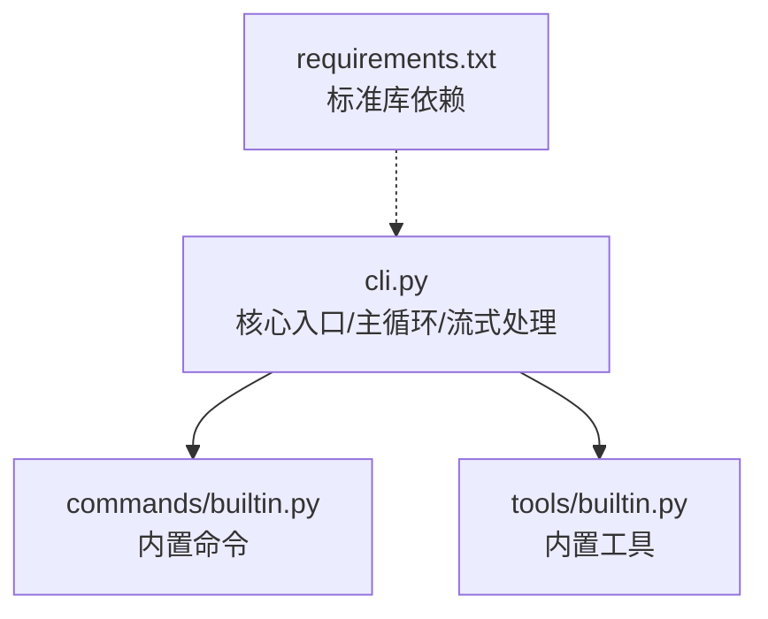
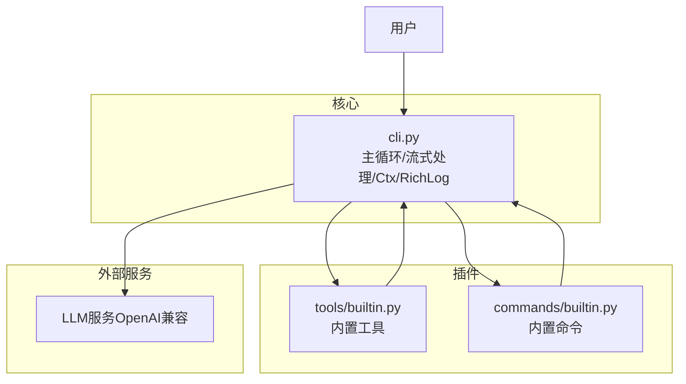
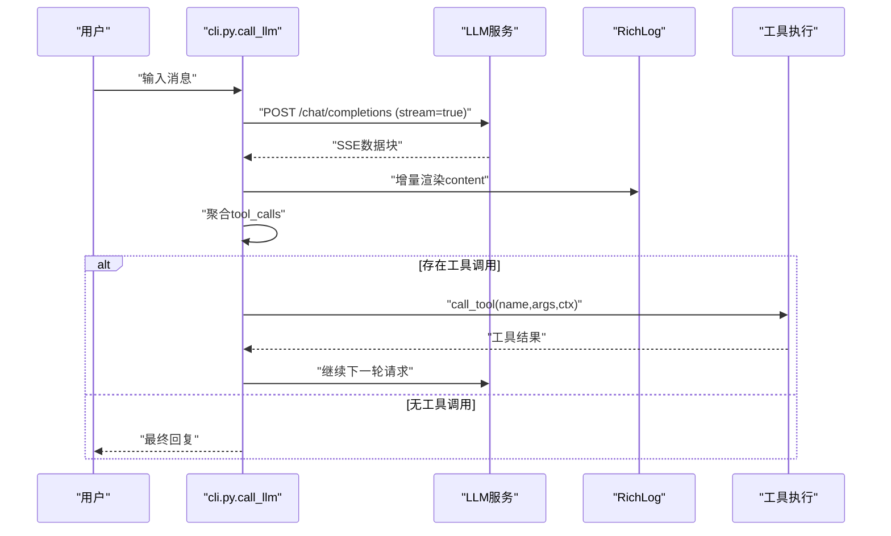
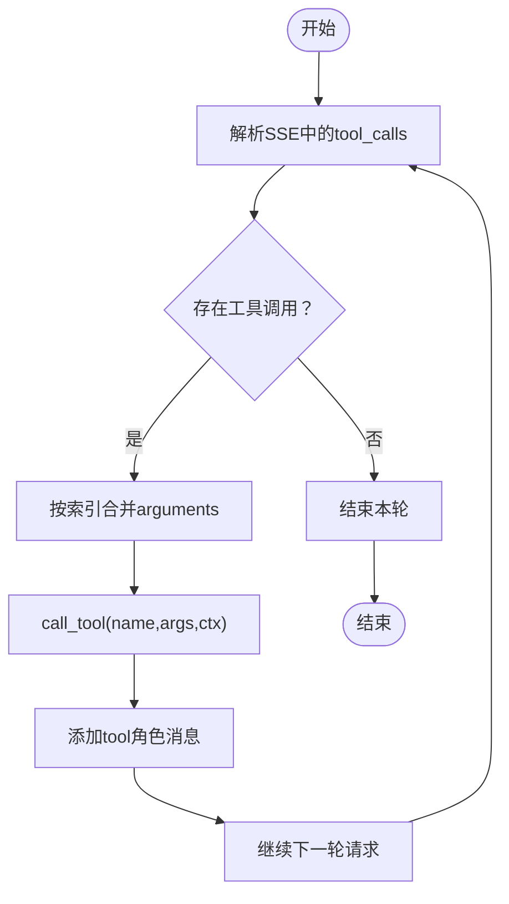
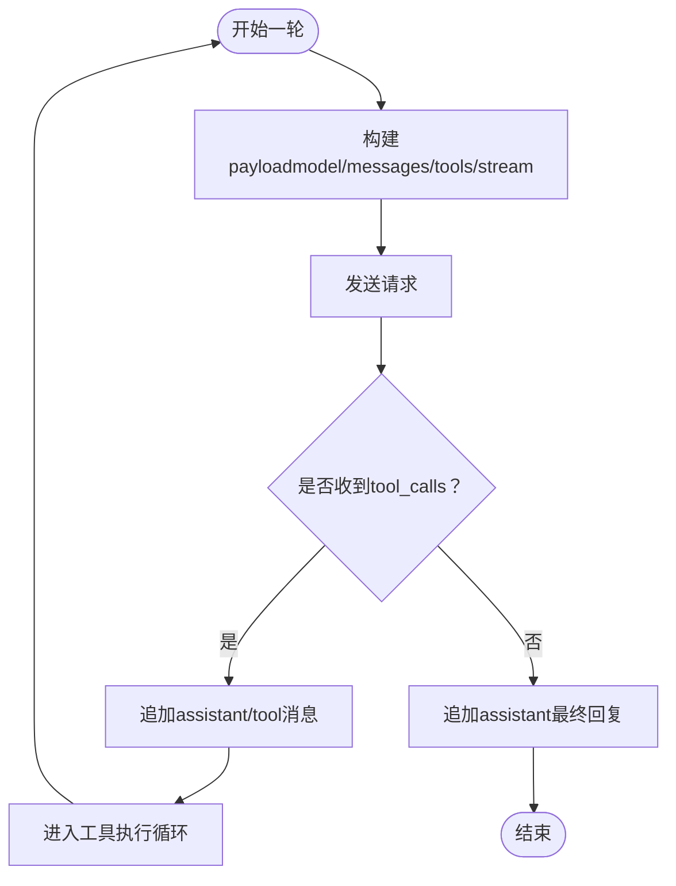
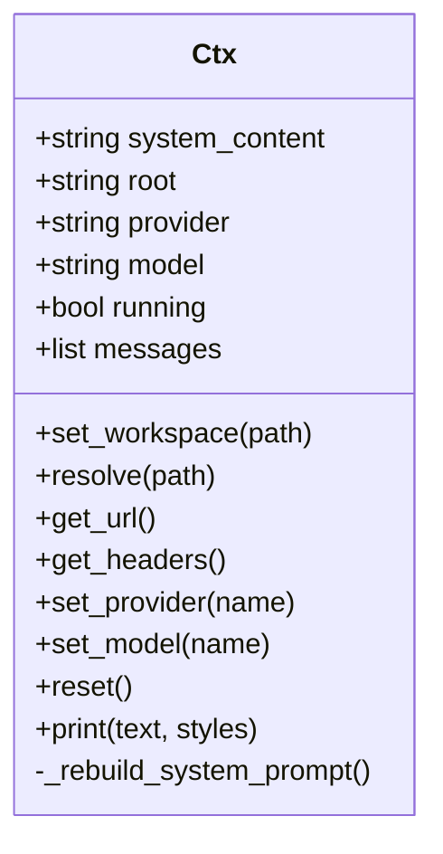
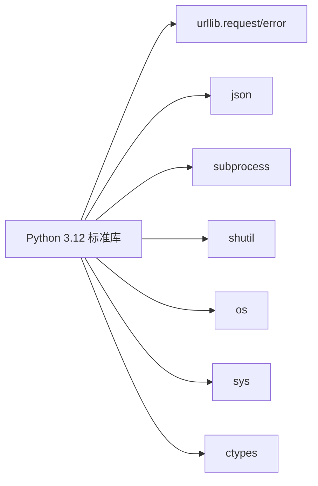

# LLM集成与流式处理

<cite>
**本文引用的文件**
- [cli.py](file://cli.py)
- [commands/builtin.py](file://commands/builtin.py)
- [tools/builtin.py](file://tools/builtin.py)
- [requirements.txt](file://requirements.txt)
</cite>

## 目录
1. [简介](#简介)
2. [项目结构](#项目结构)
3. [核心组件](#核心组件)
4. [架构总览](#架构总览)
5. [详细组件分析](#详细组件分析)
6. [依赖分析](#依赖分析)
7. [性能考虑](#性能考虑)
8. [故障排查指南](#故障排查指南)
9. [结论](#结论)
10. [附录](#附录)

## 简介
本项目是一个基于Python标准库的终端交互式智能体，支持：
- OpenAI兼容的流式API（Server-Sent Events）处理
- 工具调用协调（函数调用格式、参数传递、结果回传）
- 多轮对话管理（消息历史维护、上下文注入、轮次限制）
- 多供应商集成（DeepSeek、Tongyi等）
- 流式响应的终端渲染与性能优化
- 调试技巧与常见问题解决

## 项目结构
- 核心入口与主循环：cli.py
- 内置命令插件：commands/builtin.py
- 内置工具插件：tools/builtin.py
- 依赖声明：requirements.txt

图表来源
- [cli.py:1-532](file://cli.py#L1-L532)
- [commands/builtin.py:1-91](file://commands/builtin.py#L1-L91)
- [tools/builtin.py:1-90](file://tools/builtin.py#L1-L90)
- [requirements.txt:1-7](file://requirements.txt#L1-L7)

章节来源
- [cli.py:1-532](file://cli.py#L1-L532)
- [commands/builtin.py:1-91](file://commands/builtin.py#L1-L91)
- [tools/builtin.py:1-90](file://tools/builtin.py#L1-L90)
- [requirements.txt:1-7](file://requirements.txt#L1-L7)

## 核心组件
- 上下文对象Ctx：封装系统提示、工作区、供应商/模型、消息历史、工具/命令注册表、HTTP头生成等
- 终端渲染RichLog：基于ANSI光标控制的流式增量渲染
- 插件注册装饰器：@tool、@command，用于动态注册工具与命令
- Agent主循环：用户输入收集、命令分发、LLM调用与工具循环
- 流式LLM调用：SSE解析、工具调用聚合、消息历史维护

章节来源
- [cli.py:255-321](file://cli.py#L255-L321)
- [cli.py:173-203](file://cli.py#L173-L203)
- [cli.py:211-246](file://cli.py#L211-L246)
- [cli.py:491-532](file://cli.py#L491-L532)
- [cli.py:389-487](file://cli.py#L389-L487)

## 架构总览
整体采用“插件化核心”设计：核心仅负责循环/调度/渲染，工具与命令均以插件形式动态加载。

图表来源
- [cli.py:1-532](file://cli.py#L1-L532)
- [commands/builtin.py:1-91](file://commands/builtin.py#L1-L91)
- [tools/builtin.py:1-90](file://tools/builtin.py#L1-L90)

## 详细组件分析

### 组件A：流式LLM调用与SSE处理
- 支持OpenAI兼容的流式接口，发送JSON负载，接收SSE数据块
- 解析data行，过滤[DONE]结束标记
- 提取choices[0].delta.content进行增量渲染
- 聚合choices[0].delta.tool_calls，按索引合并arguments
- 将工具调用结果回填至messages，进入工具执行循环

图表来源
- [cli.py:389-487](file://cli.py#L389-L487)
- [cli.py:173-203](file://cli.py#L173-L203)

章节来源
- [cli.py:389-487](file://cli.py#L389-L487)

### 组件B：工具调用协调机制
- 工具注册：@tool装饰器将工具函数注册为JSON Schema，并保存可调用函数
- 参数传递：从SSE解析出的arguments为JSON字符串，尝试反序列化为字典
- 结果回传：将工具结果以tool角色消息回填至messages，供后续请求使用
- 容错处理：工具异常捕获并回传错误信息

图表来源
- [cli.py:436-481](file://cli.py#L436-L481)
- [cli.py:211-246](file://cli.py#L211-L246)

章节来源
- [cli.py:211-246](file://cli.py#L211-L246)
- [cli.py:436-481](file://cli.py#L436-L481)

### 组件C：多轮对话管理策略
- 消息历史维护：每轮请求携带完整messages，确保上下文连续
- 上下文注入：系统提示包含项目结构与可用工具，随工作区变化而重建
- 轮次限制：最多20轮工具调用，防止无限循环
- 最终回复：当无工具调用时，将assistant内容加入历史并结束

图表来源
- [cli.py:396-484](file://cli.py#L396-L484)

章节来源
- [cli.py:396-484](file://cli.py#L396-L484)

### 组件D：上下文对象Ctx与工作区感知
- 系统提示重建：扫描工作区关键文件与目录树，注入项目上下文
- 供应商/模型切换：动态更新URL与headers，支持预设模型列表
- 路径解析：相对路径解析到当前root，保障工具操作安全

图表来源
- [cli.py:255-321](file://cli.py#L255-L321)

章节来源
- [cli.py:255-321](file://cli.py#L255-L321)

### 组件E：内置命令与工具
- 内置命令：/help、/exit、/clear、/write、/cd、/pwd、/provider、/model
- 内置工具：write_file、read_file、run_command（文件读写与命令执行）

章节来源
- [commands/builtin.py:1-91](file://commands/builtin.py#L1-L91)
- [tools/builtin.py:1-90](file://tools/builtin.py#L1-L90)

## 依赖分析
- 仅使用Python 3.12标准库，无第三方依赖
- 关键模块：urllib（HTTP/SSE）、json（解析）、subprocess（命令执行）、shutil/re/os/sys/ctypes（终端与系统）

图表来源
- [requirements.txt:1-7](file://requirements.txt#L1-L7)

章节来源
- [requirements.txt:1-7](file://requirements.txt#L1-L7)

## 性能考虑
- 流式渲染：使用ANSI光标控制实现增量覆盖，减少全屏重绘开销
- SSE解析：按行读取，仅处理以"data: "开头的数据行，跳过空行与[DONE]
- 工具调用聚合：按索引合并arguments，避免重复请求
- 内存管理：每轮重新构造payload，避免历史累积导致内存膨胀
- 终端编码：强制UTF-8输出，避免字符解码错误导致的异常中断

章节来源
- [cli.py:173-203](file://cli.py#L173-L203)
- [cli.py:420-458](file://cli.py#L420-L458)
- [cli.py:396-401](file://cli.py#L396-L401)
- [cli.py:74-78](file://cli.py#L74-L78)

## 故障排查指南
- HTTP错误：捕获HTTPError，打印状态码与响应体前200字符
- 连接错误：捕获URLError，打印原因
- JSON解析异常：SSE数据行JSON解析失败时跳过，避免中断
- 工具执行异常：捕获异常并回传错误信息，不影响后续轮次
- 终端显示问题：Windows启用VT模式，强制UTF-8编码输出

章节来源
- [cli.py:406-412](file://cli.py#L406-L412)
- [cli.py:451-452](file://cli.py#L451-L452)
- [cli.py:477-478](file://cli.py#L477-L478)
- [cli.py:60-71](file://cli.py#L60-L71)
- [cli.py:74-78](file://cli.py#L74-L78)

## 结论
本项目以最小依赖实现了完整的OpenAI兼容流式LLM集成，具备良好的扩展性与可维护性。通过插件化设计，工具与命令均可动态加载；通过SSE解析与工具调用聚合，实现了高效的多轮对话与工具协作；通过终端渲染与内存管理策略，提供了流畅的用户体验。

## 附录

### A. 多供应商集成方案与配置
- 供应商配置项：base_url、api_key、auth_scheme（bearer/raw）、models
- 切换方式：/provider列出或切换；/model列出或切换
- 示例配置：DeepSeek（Bearer认证）、Tongyi（Raw认证）

章节来源
- [cli.py:19-34](file://cli.py#L19-L34)
- [cli.py:292-298](file://cli.py#L292-L298)
- [cli.py:67-90](file://cli.py#L67-L90)

### B. API调用流程与最佳实践
- 发送payload：包含model、messages、tools、stream
- SSE解析：逐行读取，过滤非data行与[DONE]
- 增量渲染：content增量拼接并渲染
- 工具调用：按索引聚合arguments，反序列化后调用工具
- 回填消息：tool_call_id与tool角色消息
- 最佳实践：保持messages完整，避免重复请求；设置合理轮次上限；异常捕获与容错

章节来源
- [cli.py:396-484](file://cli.py#L396-L484)
- [cli.py:420-458](file://cli.py#L420-L458)
- [cli.py:469-481](file://cli.py#L469-L481)

### C. 调试技巧
- 观察SSE数据行：确认data:前缀与[DONE]结束
- 检查工具Schema：确保工具定义的JSON Schema正确
- 分析消息历史：核对messages中system、user、assistant、tool顺序
- 终端编码：确保UTF-8输出，避免乱码
- 日志输出：利用RichLog的增量渲染定位问题

章节来源
- [cli.py:420-427](file://cli.py#L420-L427)
- [cli.py:173-203](file://cli.py#L173-L203)