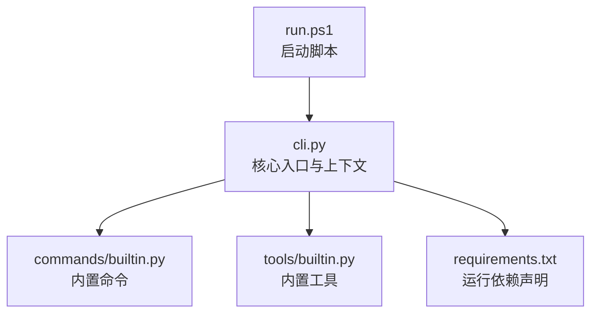
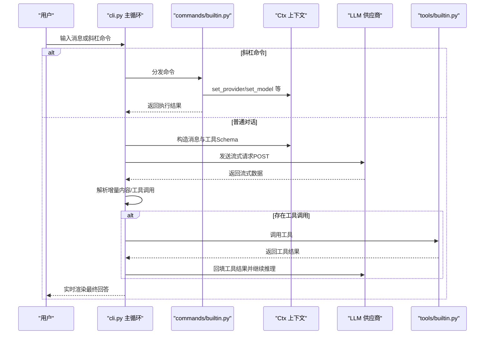
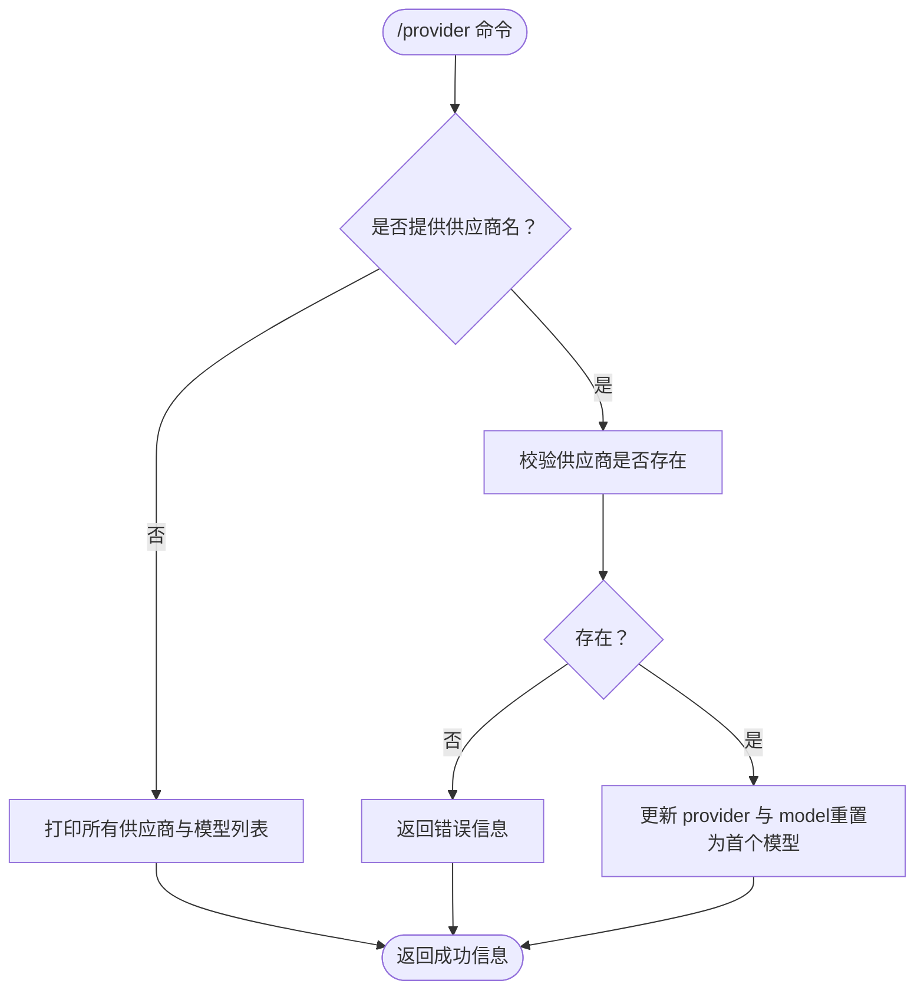
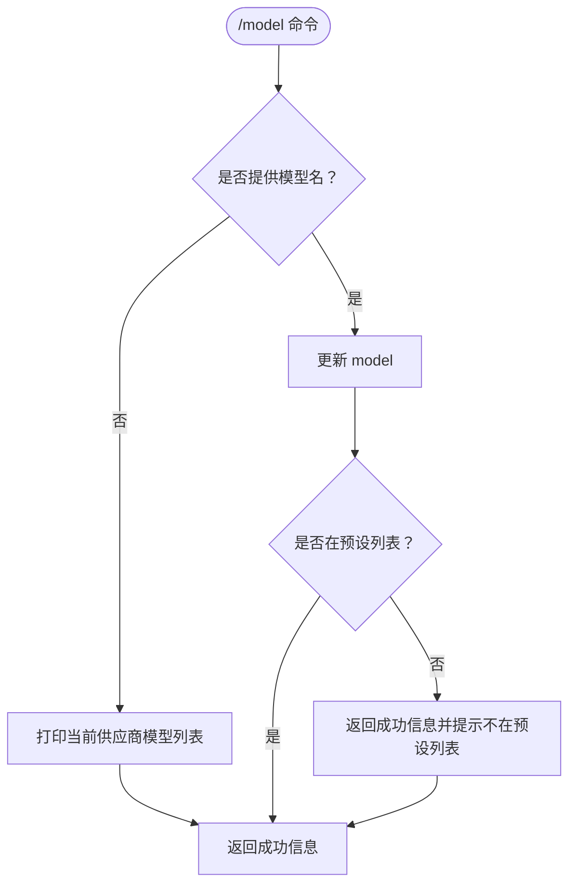
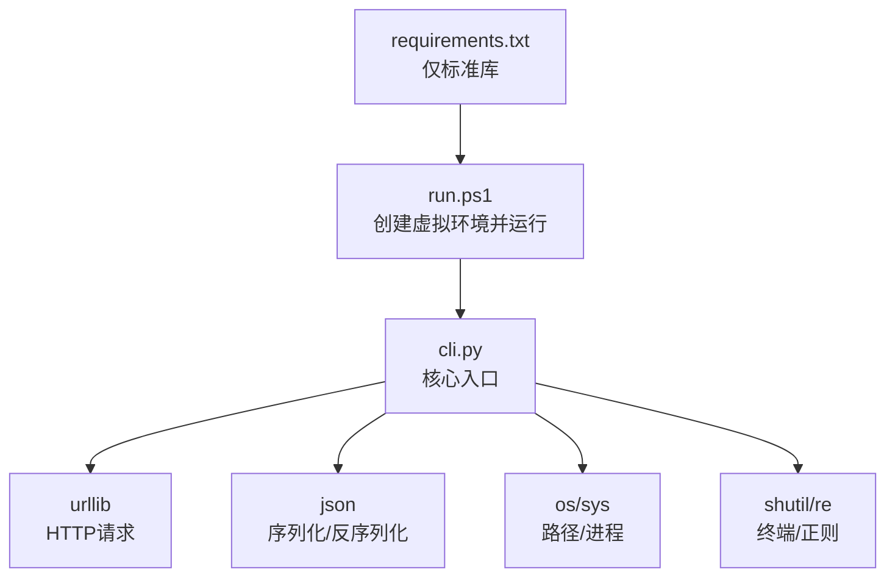

# 供应商与模型管理

<cite>
**本文引用的文件**
- [cli.py](file://cli.py)
- [commands/builtin.py](file://commands/builtin.py)
- [tools/builtin.py](file://tools/builtin.py)
- [requirements.txt](file://requirements.txt)
- [run.ps1](file://run.ps1)
</cite>

## 目录
1. [简介](#简介)
2. [项目结构](#项目结构)
3. [核心组件](#核心组件)
4. [架构总览](#架构总览)
5. [详细组件分析](#详细组件分析)
6. [依赖分析](#依赖分析)
7. [性能考虑](#性能考虑)
8. [故障排查指南](#故障排查指南)
9. [结论](#结论)
10. [附录](#附录)

## 简介
本文件面向“供应商与模型管理”的技术文档，围绕多供应商集成架构、PROVIDERS配置结构、供应商切换机制、API密钥管理、模型管理策略、供应商配置选项以及扩展指南进行系统化说明。文档同时提供配置示例与最佳实践，帮助正确配置与使用不同AI供应商服务。

## 项目结构
该项目采用“核心+插件”架构：
- 核心入口与上下文：cli.py
- 内置命令插件：commands/builtin.py（提供 /provider、/model 等命令）
- 内置工具插件：tools/builtin.py（提供文件读写、命令执行等工具）
- 运行环境与依赖声明：requirements.txt
- 启动脚本：run.ps1

图表来源
- [cli.py:1-532](file://cli.py#L1-L532)
- [commands/builtin.py:1-91](file://commands/builtin.py#L1-L91)
- [tools/builtin.py:1-90](file://tools/builtin.py#L1-L90)
- [requirements.txt:1-7](file://requirements.txt#L1-L7)
- [run.ps1:1-24](file://run.ps1#L1-L24)

章节来源
- [cli.py:1-532](file://cli.py#L1-L532)
- [commands/builtin.py:1-91](file://commands/builtin.py#L1-L91)
- [tools/builtin.py:1-90](file://tools/builtin.py#L1-L90)
- [requirements.txt:1-7](file://requirements.txt#L1-L7)
- [run.ps1:1-24](file://run.ps1#L1-L24)

## 核心组件
- PROVIDERS 配置中心：集中定义各供应商的 base_url、api_key、auth_scheme、models，并提供默认供应商与默认模型。
- Ctx 上下文：封装当前供应商、模型、消息历史、工作区等状态，提供 get_url、get_headers、set_provider、set_model 等能力。
- 内置命令：/provider 列出/切换供应商；/model 列出/切换模型。
- 内置工具：文件读写、命令执行等，供AI在流式响应中按需调用。
- 插件加载：自动扫描 tools/ 与 commands/ 目录，导入非下划线开头的模块，触发装饰器注册。

章节来源
- [cli.py:16-35](file://cli.py#L16-L35)
- [cli.py:255-321](file://cli.py#L255-L321)
- [commands/builtin.py:67-90](file://commands/builtin.py#L67-L90)
- [tools/builtin.py:17-89](file://tools/builtin.py#L17-L89)
- [cli.py:358-371](file://cli.py#L358-L371)

## 架构总览
整体交互流程如下：
- 用户通过命令行输入，核心解析为普通对话或斜杠命令。
- 斜杠命令由内置命令插件处理，如切换供应商/模型。
- 普通对话进入 call_llm 流程，构造OpenAI兼容的payload，通过HTTP向选定供应商发起流式请求。
- 供应商返回流式增量数据，核心实时渲染并解析工具调用片段。
- 若存在工具调用，核心调用对应工具插件并将结果回填至消息历史，继续下一轮推理直至结束。

图表来源
- [cli.py:489-532](file://cli.py#L489-L532)
- [cli.py:389-487](file://cli.py#L389-L487)
- [commands/builtin.py:67-90](file://commands/builtin.py#L67-L90)
- [tools/builtin.py:17-89](file://tools/builtin.py#L17-L89)

## 详细组件分析

### PROVIDERS 配置结构与API密钥管理
- 结构字段
  - base_url：供应商的聊天补全接口地址（OpenAI兼容格式）。
  - api_key：供应商API密钥。
  - auth_scheme：认证方案，支持 "bearer" 与 "raw" 两种模式。
  - models：该供应商可用模型列表。
- 默认值
  - DEFAULT_PROVIDER：默认供应商名称。
  - DEFAULT_MODEL：默认模型名称。
- API密钥读取建议
  - 支持从环境变量读取，便于安全存储与动态切换。

章节来源
- [cli.py:16-35](file://cli.py#L16-L35)

### 供应商切换机制
- 命令入口：/provider
  - 无参：列出所有供应商及其模型列表，并标记当前供应商。
  - 有参：切换到指定供应商，同时将模型重置为该供应商的第一个模型。
- 上下文变更：set_provider 更新 provider 与 model，并返回操作结果。

图表来源
- [commands/builtin.py:67-77](file://commands/builtin.py#L67-L77)
- [cli.py:300-306](file://cli.py#L300-L306)

章节来源
- [commands/builtin.py:67-77](file://commands/builtin.py#L67-L77)
- [cli.py:300-306](file://cli.py#L300-L306)

### 模型管理策略
- 命令入口：/model
  - 无参：列出当前供应商的所有模型，并标记当前模型。
  - 有参：切换到指定模型；若不在预设列表，仍允许切换并给出提示。
- 上下文变更：set_model 更新 model，并返回操作结果。

图表来源
- [commands/builtin.py:80-90](file://commands/builtin.py#L80-L90)
- [cli.py:308-312](file://cli.py#L308-L312)

章节来源
- [commands/builtin.py:80-90](file://commands/builtin.py#L80-L90)
- [cli.py:308-312](file://cli.py#L308-L312)

### 认证与请求头生成
- 认证方案
  - bearer：Authorization: Bearer <api_key>
  - raw：Authorization: <api_key>
- 请求头
  - 统一添加 Content-Type: application/json。
- URL来源
  - 从当前供应商配置中读取 base_url。

章节来源
- [cli.py:292-298](file://cli.py#L292-L298)

### 流式调用与工具循环
- 请求构造
  - payload 包含 model、messages、tools、stream=True。
  - 使用 urllib 发送POST请求。
- 响应处理
  - 逐行读取以"data: "开头的数据行，解析JSON增量片段。
  - 实时渲染内容增量，收集工具调用片段。
- 工具调用
  - 将工具调用结果回填到消息历史，继续下一轮推理。
  - 最多进行固定轮次，防止无限循环。

章节来源
- [cli.py:389-487](file://cli.py#L389-L487)

### 插件加载与扩展点
- 插件发现
  - 自动扫描 tools/ 与 commands/ 目录，导入非下划线开头的模块。
- 装饰器注册
  - @tool 与 @command 装饰器用于注册工具与命令。
- 扩展方式
  - 在相应目录新增模块，使用装饰器注册新命令或工具，无需修改核心。

章节来源
- [cli.py:358-371](file://cli.py#L358-L371)
- [cli.py:211-234](file://cli.py#L211-L234)

## 依赖分析
- 运行时依赖
  - 仅使用 Python 3.12 标准库，无需第三方包。
  - 关键模块：urllib（网络请求）、json（序列化/反序列化）、os/sys（进程与路径）、shutil/re（终端与正则）等。
- 启动流程
  - run.ps1 自动创建并使用 .venv 虚拟环境，再调用 python -m cli 启动。

图表来源
- [requirements.txt:1-7](file://requirements.txt#L1-L7)
- [run.ps1:1-24](file://run.ps1#L1-L24)
- [cli.py:1-11](file://cli.py#L1-L11)

章节来源
- [requirements.txt:1-7](file://requirements.txt#L1-L7)
- [run.ps1:1-24](file://run.ps1#L1-L24)
- [cli.py:1-11](file://cli.py#L1-L11)

## 性能考虑
- 流式渲染
  - 通过逐行读取与增量拼接，降低内存占用并提升交互体验。
- 工具调用轮次限制
  - 设置最大轮次上限，避免长时间推理导致资源耗尽。
- 日志与输出控制
  - 工具结果过长时截断展示，但完整内容仍会传给AI，平衡可读性与准确性。

章节来源
- [cli.py:389-487](file://cli.py#L389-L487)

## 故障排查指南
- HTTP错误
  - 当供应商返回HTTP错误时，核心会打印错误码与部分响应体，便于定位问题。
- 连接错误
  - 网络连接失败时，核心会打印连接错误原因。
- 供应商/模型不存在
  - 切换供应商或模型时，若名称无效，会返回明确的错误信息与可用列表。
- 工具执行异常
  - 工具抛出异常时，核心会捕获并返回错误信息，避免中断对话流程。

章节来源
- [cli.py:406-412](file://cli.py#L406-L412)
- [cli.py:302-303](file://cli.py#L302-L303)
- [cli.py:477-478](file://cli.py#L477-L478)

## 结论
本项目通过简洁的PROVIDERS配置与上下文抽象，实现了多供应商与多模型的灵活切换；结合流式调用与工具循环，构建了可扩展的AI代理工作流。内置命令与工具插件提供了良好的扩展点，便于按需新增供应商或自定义行为。建议在生产环境中配合环境变量管理API密钥，并为不同供应商补充更完善的错误处理与超时控制。

## 附录

### 供应商配置选项与最佳实践
- base_url
  - 必须指向OpenAI兼容的聊天补全接口地址。
  - 建议使用HTTPS以保障传输安全。
- auth_scheme
  - bearer：适用于大多数云厂商的标准Bare Token认证。
  - raw：适用于某些私有部署或自定义鉴权方案。
- api_key
  - 建议使用环境变量读取，避免硬编码在配置文件中。
  - 示例：将 api_key 替换为从环境变量读取的方式。
- models
  - 列表应与供应商实际可用模型一致，便于命令行快速切换。
  - 若需要临时使用未预设模型，可在命令行直接切换，但会收到提示。

章节来源
- [cli.py:16-35](file://cli.py#L16-L35)
- [cli.py:292-298](file://cli.py#L292-L298)

### 新增供应商支持步骤
- 在 PROVIDERS 中新增供应商项，填写 base_url、api_key、auth_scheme、models。
- 如需自定义认证方式，可在上下文中扩展 get_headers 的逻辑。
- 如需特殊API适配，可在核心请求流程中增加条件分支或中间层封装。

章节来源
- [cli.py:16-35](file://cli.py#L16-L35)
- [cli.py:292-298](file://cli.py#L292-L298)

### 自定义认证方式与请求头定制
- 认证方案
  - bearer：Authorization: Bearer <api_key>
  - raw：Authorization: <api_key>
- 请求头定制
  - 可在 get_headers 中增加额外头部字段，满足特定供应商要求。
- 注意事项
  - 保持 Content-Type: application/json 以确保OpenAI兼容。

章节来源
- [cli.py:292-298](file://cli.py#L292-L298)

### 完整配置示例与使用建议
- 示例
  - 在 PROVIDERS 中添加新的供应商条目，设置 base_url、api_key、auth_scheme、models。
  - 使用 /provider 与 /model 列出并切换供应商与模型。
- 建议
  - 将敏感信息放入环境变量，避免提交到版本控制。
  - 为常用供应商与模型设置合理的默认值，减少手动切换成本。
  - 为不同供应商准备独立的配置文件或环境变量，便于多环境管理。

章节来源
- [cli.py:16-35](file://cli.py#L16-L35)
- [commands/builtin.py:67-90](file://commands/builtin.py#L67-L90)