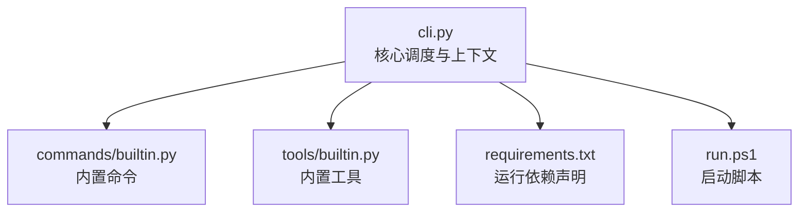
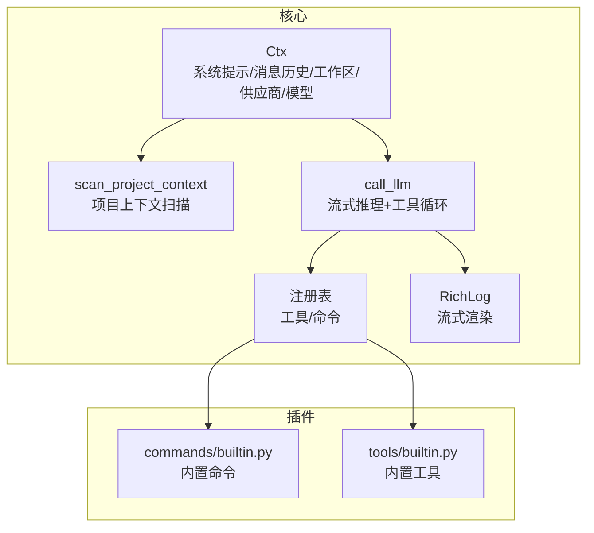
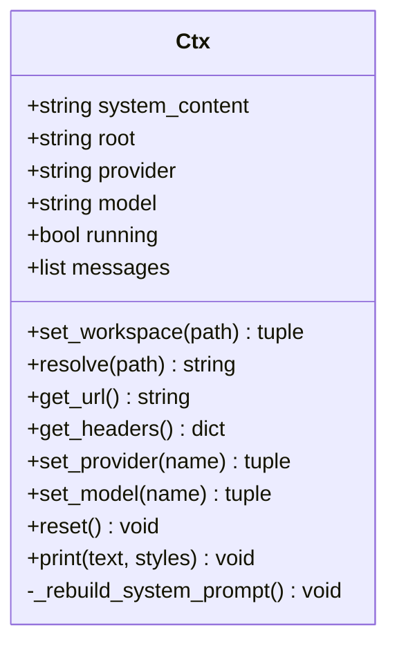
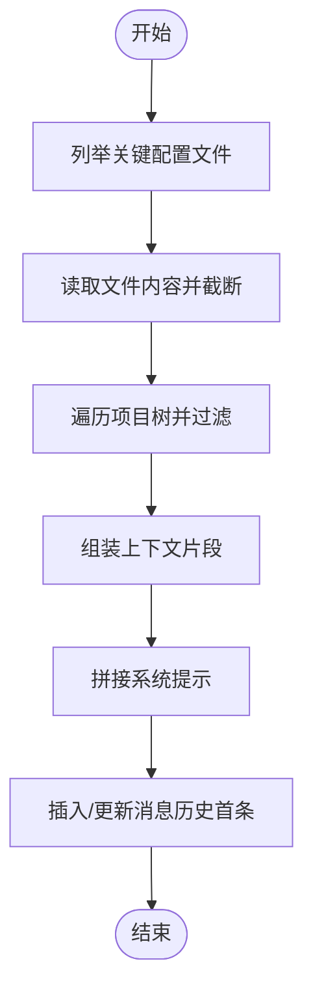
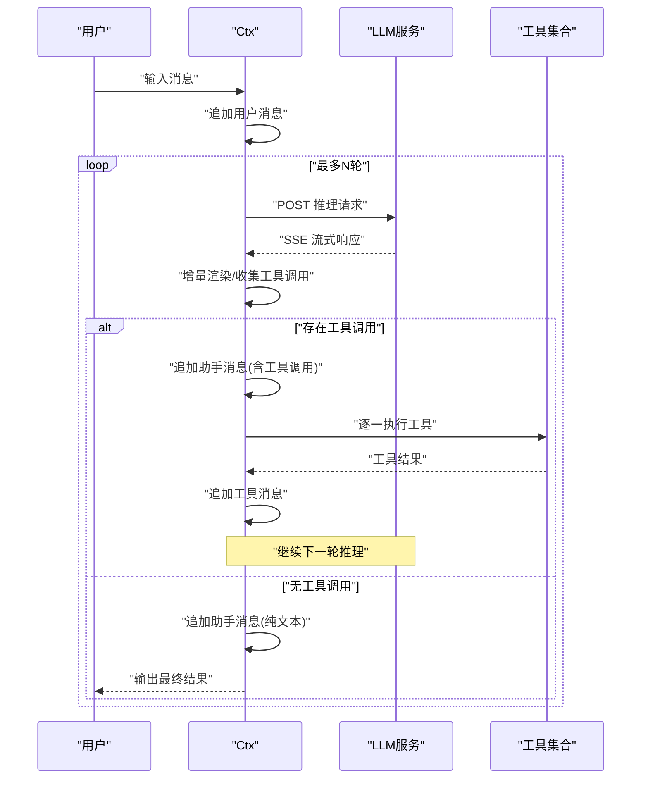
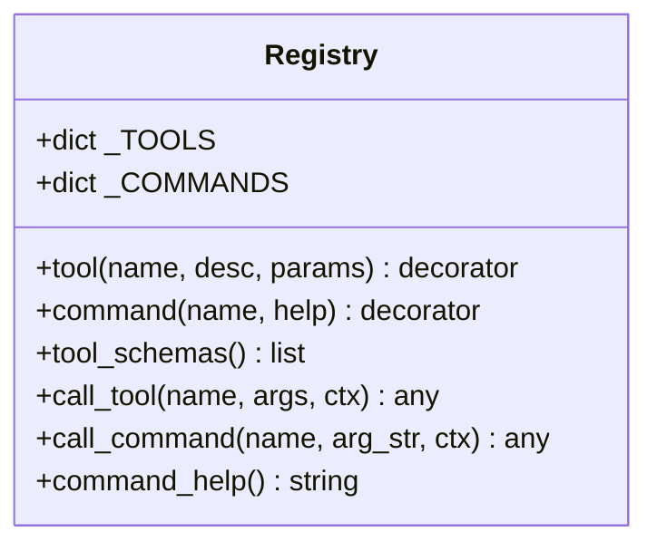
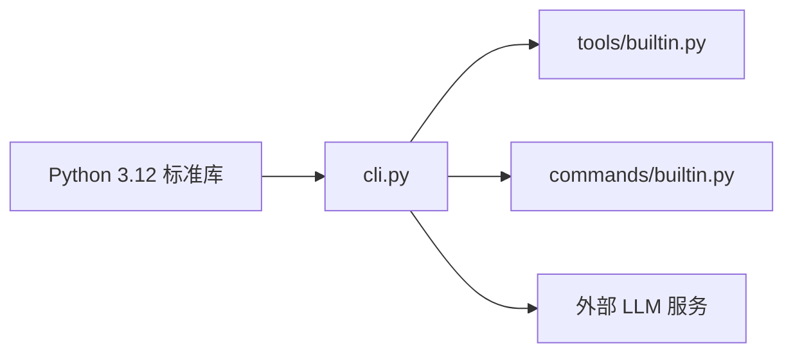

# 多轮对话管理

<cite>
**本文引用的文件**
- [cli.py](file://cli.py)
- [commands/builtin.py](file://commands/builtin.py)
- [tools/builtin.py](file://tools/builtin.py)
- [requirements.txt](file://requirements.txt)
- [run.ps1](file://run.ps1)
</cite>

## 目录
1. [简介](#简介)
2. [项目结构](#项目结构)
3. [核心组件](#核心组件)
4. [架构总览](#架构总览)
5. [详细组件分析](#详细组件分析)
6. [依赖分析](#依赖分析)
7. [性能考量](#性能考量)
8. [故障排查指南](#故障排查指南)
9. [结论](#结论)
10. [附录](#附录)

## 简介
本项目是一个基于 Python 标准库的多轮对话管理与工具调用框架，采用“插件化核心”的设计思想，通过上下文对象统一承载对话状态、系统提示与项目上下文，并以流式方式与 LLM 推理服务交互。对话管理的关键点包括：
- 消息历史维护：以消息数组维护用户、助手与工具结果的历史记录。
- 上下文注入：扫描项目结构与关键配置文件，动态构建系统提示并注入工具能力描述。
- 轮次控制：限制最大轮次，防止无限工具调用循环，同时支持工具执行后的继续推理。
- 安全与资源控制：HTTP 错误处理、连接异常捕获、轮次上限与工具调用缓冲。
- 最佳实践：会话可重置、工作区切换、供应商与模型切换、终端渲染优化。

## 项目结构
项目采用“核心 + 插件”分离的组织方式：
- 核心入口与调度：cli.py
- 内置命令插件：commands/builtin.py（如切换工作区、切换供应商/模型、清屏等）
- 内置工具插件：tools/builtin.py（如读写文件、执行命令）

图表来源
- [cli.py:1-532](file://cli.py#L1-L532)
- [commands/builtin.py:1-91](file://commands/builtin.py#L1-L91)
- [tools/builtin.py:1-90](file://tools/builtin.py#L1-L90)
- [requirements.txt:1-7](file://requirements.txt#L1-L7)
- [run.ps1:1-24](file://run.ps1#L1-L24)

章节来源
- [cli.py:1-532](file://cli.py#L1-L532)
- [commands/builtin.py:1-91](file://commands/builtin.py#L1-L91)
- [tools/builtin.py:1-90](file://tools/builtin.py#L1-L90)
- [requirements.txt:1-7](file://requirements.txt#L1-L7)
- [run.ps1:1-24](file://run.ps1#L1-L24)

## 核心组件
- 上下文对象 Ctx：封装系统提示、消息历史、工作区、供应商与模型选择、路径解析与 HTTP 头部生成等。
- 项目上下文扫描：遍历关键配置与项目树，构建系统提示的“项目上下文”部分。
- Agent 循环：负责将用户输入加入消息历史，调用 LLM，处理流式响应与工具调用，控制轮次上限。
- 插件注册：装饰器工具与命令注册，支持动态加载 tools 与 commands 目录下的插件。
- 终端渲染：RichLog 实现流式增量渲染，提升用户体验。

章节来源
- [cli.py:255-321](file://cli.py#L255-L321)
- [cli.py:325-353](file://cli.py#L325-L353)
- [cli.py:389-487](file://cli.py#L389-L487)
- [cli.py:211-247](file://cli.py#L211-L247)
- [cli.py:173-203](file://cli.py#L173-L203)

## 架构总览
整体架构围绕“上下文驱动的消息历史 + 流式 LLM 推理 + 工具循环”的主循环展开，命令与工具均通过注册表接入，核心不感知具体实现细节。

图表来源
- [cli.py:255-321](file://cli.py#L255-L321)
- [cli.py:325-353](file://cli.py#L325-L353)
- [cli.py:389-487](file://cli.py#L389-L487)
- [cli.py:211-247](file://cli.py#L211-L247)
- [cli.py:173-203](file://cli.py#L173-L203)
- [commands/builtin.py:1-91](file://commands/builtin.py#L1-L91)
- [tools/builtin.py:1-90](file://tools/builtin.py#L1-L90)

## 详细组件分析

### 上下文对象 Ctx 与消息历史
- 角色职责
  - 维护系统提示与消息历史数组，确保首条消息为系统提示。
  - 提供工作区切换、路径解析、供应商/模型切换、HTTP 头部生成等能力。
- 消息历史维护
  - 用户输入：每次用户输入后追加一条用户消息。
  - 助手回复：流式接收内容，最终追加一条助手消息。
  - 工具调用：当存在工具调用时，先追加包含工具调用的助手消息，再依次追加工具执行结果消息。
- 上下文注入
  - 通过扫描项目结构与关键配置文件，动态构建系统提示，并同步到消息历史首条。

图表来源
- [cli.py:255-321](file://cli.py#L255-L321)

章节来源
- [cli.py:255-321](file://cli.py#L255-L321)

### 项目上下文扫描与系统提示构建
- 扫描范围
  - 关键配置文件：.gitignore、pyproject.toml、setup.cfg、README.md、requirements.txt、package.json 等。
  - 项目树：遍历目录，忽略隐藏目录与常见缓存/依赖目录，限制输出行数以控制上下文大小。
- 系统提示组成
  - 基础系统内容 + 项目上下文 + 可用工具列表。
  - 将系统提示同步到消息历史首条，确保后续推理始终携带最新上下文。

图表来源
- [cli.py:325-353](file://cli.py#L325-L353)
- [cli.py:266-278](file://cli.py#L266-L278)

章节来源
- [cli.py:325-353](file://cli.py#L325-L353)
- [cli.py:266-278](file://cli.py#L266-L278)

### Agent 循环与工具调用流程
- 轮次控制
  - 设置最大轮次上限，每轮重新构造 payload，携带上一轮工具调用结果，避免旧数据重复请求。
- 流式响应处理
  - 解析 SSE 数据块，增量拼接内容，实时渲染。
  - 收集工具调用片段，合并为完整工具调用列表。
- 工具执行与继续推理
  - 若存在工具调用，追加包含工具调用的助手消息，逐一执行工具并将结果作为工具消息追加。
  - 继续下一轮推理，直至无工具调用或达到轮次上限。

图表来源
- [cli.py:389-487](file://cli.py#L389-L487)
- [cli.py:211-247](file://cli.py#L211-L247)

章节来源
- [cli.py:389-487](file://cli.py#L389-L487)

### 插件注册与命令/工具扩展
- 装饰器注册
  - @tool：注册工具，提供名称、描述与 JSON Schema 参数定义。
  - @command：注册命令，提供名称与帮助文本。
- 动态加载
  - 自动扫描 tools 与 commands 目录，导入非下划线开头的模块，触发注册。
- 内置命令示例
  - /cd 切换工作区并刷新上下文。
  - /provider 与 /model 切换供应商与模型。
  - /clear 清除对话历史。
  - /help 展示可用命令。
- 内置工具示例
  - read_file：按行号分页读取文件。
  - write_file：写入文件。
  - run_command：执行 shell 命令并返回输出。

图表来源
- [cli.py:211-247](file://cli.py#L211-L247)

章节来源
- [cli.py:211-247](file://cli.py#L211-L247)
- [commands/builtin.py:1-91](file://commands/builtin.py#L1-L91)
- [tools/builtin.py:1-90](file://tools/builtin.py#L1-L90)

### 终端渲染与用户体验
- RichLog：基于 ANSI 光标控制实现增量渲染，避免重复输出，提升流式体验。
- Markdown 渲染：支持标题、列表、引用与代码块高亮。
- 面板与样式：提供带边框面板与多种颜色样式，增强可读性。

章节来源
- [cli.py:173-203](file://cli.py#L173-L203)
- [cli.py:126-152](file://cli.py#L126-L152)
- [cli.py:155-171](file://cli.py#L155-L171)

## 依赖分析
- 运行时依赖：仅使用 Python 3.12 标准库，包括 urllib、json、subprocess、shutil、re、os、sys、ctypes。
- 插件加载：通过 pkgutil 遍历目录并动态导入模块，实现零配置扩展。
- 外部集成：通过 HTTP 请求对接 LLM 服务，兼容 OpenAI 风格的流式响应与工具字段。

图表来源
- [requirements.txt:1-7](file://requirements.txt#L1-L7)
- [cli.py:1-532](file://cli.py#L1-L532)

章节来源
- [requirements.txt:1-7](file://requirements.txt#L1-L7)
- [cli.py:1-532](file://cli.py#L1-L532)

## 性能考量
- 流式渲染：使用 RichLog 增量刷新，减少终端重绘开销。
- 工具调用缓冲：按索引聚合工具调用参数，避免重复解析。
- 上下文截断：关键配置文件与项目树输出均进行截断与省略，控制系统提示大小。
- 轮次上限：固定最大轮次，防止长时间推理与资源占用。
- I/O 分页：文件读取支持分页，避免大文件一次性读取导致内存压力。

章节来源
- [cli.py:173-203](file://cli.py#L173-L203)
- [cli.py:414-450](file://cli.py#L414-L450)
- [cli.py:334-336](file://cli.py#L334-L336)
- [cli.py:348-350](file://cli.py#L348-L350)
- [cli.py:391-392](file://cli.py#L391-L392)
- [tools/builtin.py:57-70](file://tools/builtin.py#L57-L70)

## 故障排查指南
- HTTP 错误：捕获 HTTPError 并打印错误码与响应体前缀，便于定位服务端问题。
- 连接错误：捕获 URLError 并提示连接失败原因。
- 工具执行异常：捕获工具执行异常并返回错误信息，不影响后续轮次。
- 轮次超限：达到最大轮次上限时停止继续推理，避免资源耗尽。
- 工作区切换失败：检查路径是否存在且为目录，失败时返回错误信息。

章节来源
- [cli.py:406-412](file://cli.py#L406-L412)
- [cli.py:477-478](file://cli.py#L477-L478)
- [cli.py:485-486](file://cli.py#L485-L486)
- [commands/builtin.py:54-59](file://commands/builtin.py#L54-L59)

## 结论
本项目通过“上下文 + 消息历史 + 流式推理 + 工具循环”的模式，实现了简洁而强大的多轮对话管理。其关键优势在于：
- 插件化扩展：工具与命令通过装饰器注册，易于扩展。
- 动态上下文注入：项目上下文随工作区变化自动刷新。
- 轮次与资源控制：最大轮次、异常捕获与输出截断共同保障稳定性。
- 终端体验：流式渲染与样式化输出提升交互质量。

## 附录
- 启动方式
  - 使用 PowerShell 脚本自动创建并激活虚拟环境后运行入口模块。
- 示例路径
  - 新增命令：在 commands 目录新增模块并使用 @command 装饰器注册。
  - 新增工具：在 tools 目录新增模块并使用 @tool 装饰器注册。
- 最佳实践
  - 在工具中对路径使用 ctx.resolve 进行解析，确保与当前工作区一致。
  - 在命令中通过 ctx.print 输出统一风格信息。
  - 对于大文件读取建议使用分页参数，避免一次性加载过多内容。

章节来源
- [run.ps1:1-24](file://run.ps1#L1-L24)
- [commands/builtin.py:1-10](file://commands/builtin.py#L1-L10)
- [tools/builtin.py:1-10](file://tools/builtin.py#L1-L10)
- [cli.py:288-290](file://cli.py#L288-L290)
- [cli.py:318-320](file://cli.py#L318-L320)
- [tools/builtin.py:57-70](file://tools/builtin.py#L57-L70)