# 工具调用协调机制

<cite>
**本文档引用的文件**
- [cli.py](file://cli.py)
- [commands/builtin.py](file://commands/builtin.py)
- [tools/builtin.py](file://tools/builtin.py)
- [run.ps1](file://run.ps1)
- [requirements.txt](file://requirements.txt)
</cite>

## 目录
1. [引言](#引言)
2. [项目结构](#项目结构)
3. [核心组件](#核心组件)
4. [架构概览](#架构概览)
5. [详细组件分析](#详细组件分析)
6. [依赖分析](#依赖分析)
7. [性能考虑](#性能考虑)
8. [故障排除指南](#故障排除指南)
9. [结论](#结论)
10. [附录](#附录)

## 引言

本文件详细阐述了代码代理系统中的工具调用协调机制。该系统采用插件化架构，通过装饰器注册工具和命令，实现了AI与本地工具的无缝集成。本文档重点关注工具调用的格式规范、缓冲区管理、并发处理、参数累积机制、调用ID分配等核心实现细节，并提供完整的调试技巧和故障排除方法。

## 项目结构

该项目采用简洁的三层架构设计：

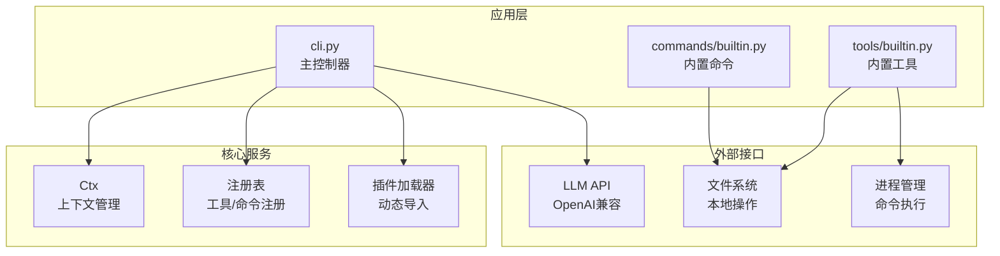

**图表来源**
- [cli.py:358-372](file://cli.py#L358-L372)
- [cli.py:255-321](file://cli.py#L255-L321)
- [tools/builtin.py:11-14](file://tools/builtin.py#L11-L14)

**章节来源**
- [cli.py:1-50](file://cli.py#L1-L50)
- [requirements.txt:1-7](file://requirements.txt#L1-L7)

## 核心组件

### 工具注册与装饰器系统

系统通过装饰器模式实现工具和命令的注册：

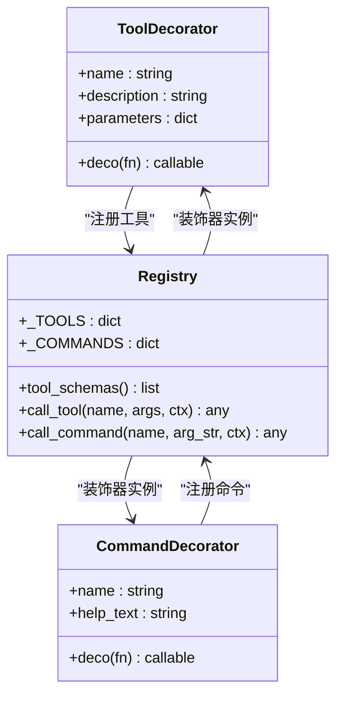

**图表来源**
- [cli.py:211-246](file://cli.py#L211-L246)

### 上下文管理系统

Ctx类提供统一的状态管理和环境访问：

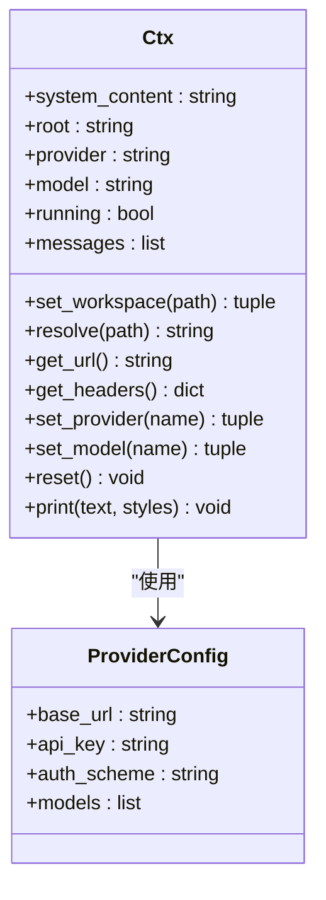

**图表来源**
- [cli.py:255-321](file://cli.py#L255-L321)

**章节来源**
- [cli.py:207-246](file://cli.py#L207-L246)
- [cli.py:255-321](file://cli.py#L255-L321)

## 架构概览

系统采用事件驱动的工具调用协调机制：

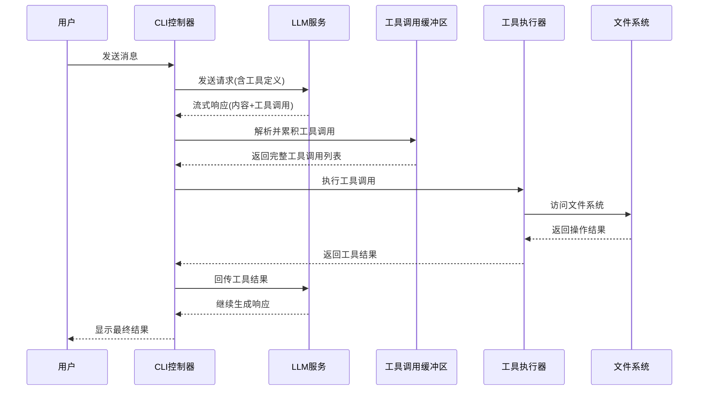

**图表来源**
- [cli.py:389-487](file://cli.py#L389-L487)

## 详细组件分析

### 工具调用格式规范

#### tool_calls字段结构

系统严格遵循OpenAI兼容的工具调用格式：

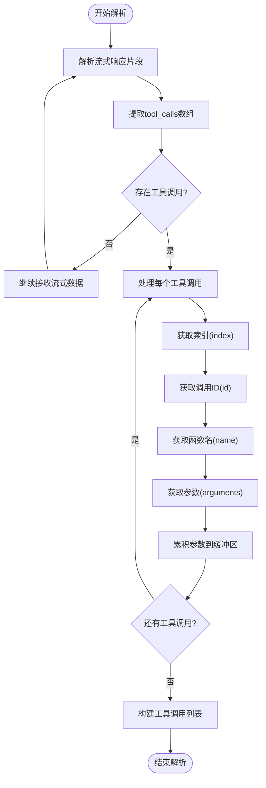

**图表来源**
- [cli.py:436-450](file://cli.py#L436-L450)

#### 函数名称匹配机制

系统通过注册表进行精确的函数名称匹配：

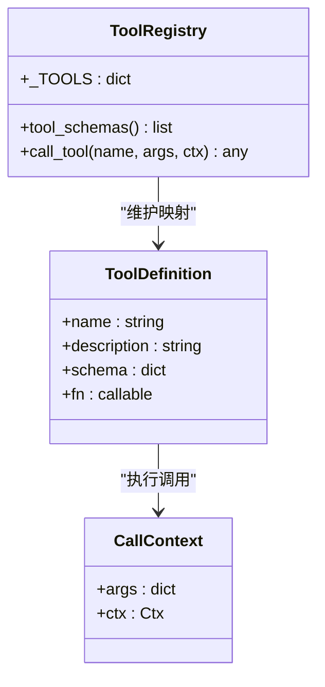

**图表来源**
- [cli.py:211-246](file://cli.py#L211-L246)

**章节来源**
- [cli.py:436-450](file://cli.py#L436-L450)
- [cli.py:211-246](file://cli.py#L211-L246)

### 工具调用缓冲区管理

#### 多工具并发处理

系统支持多工具并发处理，通过索引键管理不同工具调用：

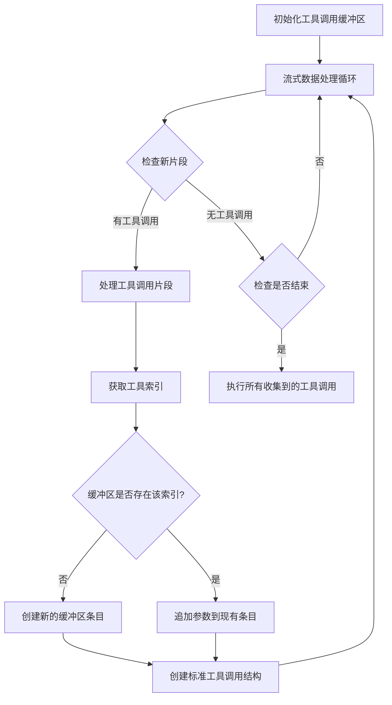

**图表来源**
- [cli.py:415-460](file://cli.py#L415-L460)

#### 参数累积机制

系统实现了智能的参数累积机制，确保工具调用参数的完整性：

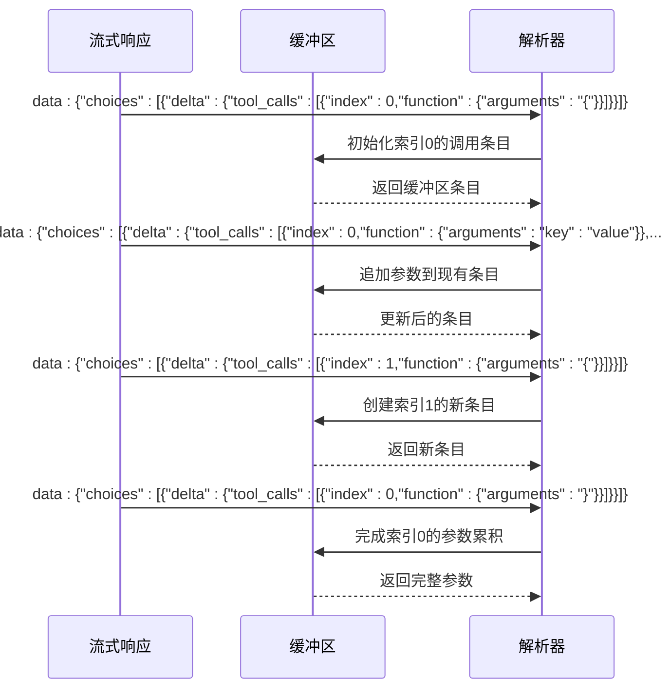

**图表来源**
- [cli.py:438-450](file://cli.py#L438-L450)

**章节来源**
- [cli.py:415-460](file://cli.py#L415-L460)

### 调用ID分配策略

系统采用智能的调用ID分配策略：

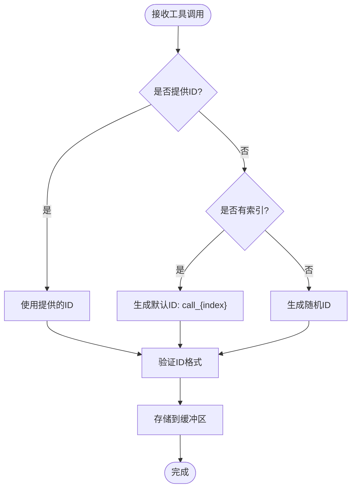

**图表来源**
- [cli.py:440-449](file://cli.py#L440-L449)

### 工具执行流程

#### 参数解析与验证

系统实现了严格的参数解析和验证机制：

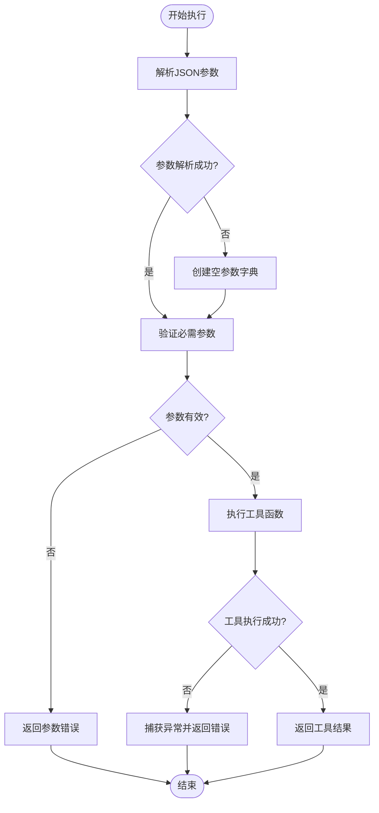

**图表来源**
- [cli.py:472-479](file://cli.py#L472-L479)

#### 异常处理机制

系统提供了完善的异常处理和恢复机制：

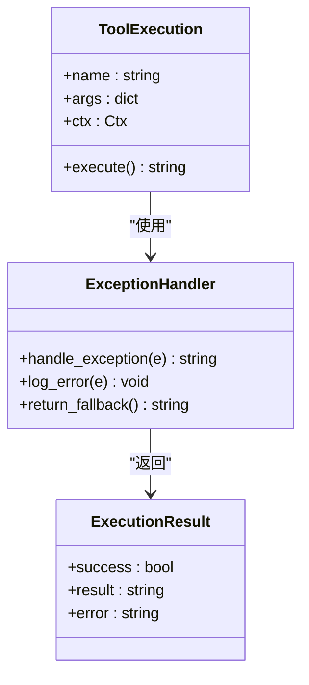

**图表来源**
- [cli.py:476-479](file://cli.py#L476-L479)

**章节来源**
- [cli.py:472-479](file://cli.py#L472-L479)

### 内置工具实现

#### 文件操作工具

系统提供了三个核心的内置工具：

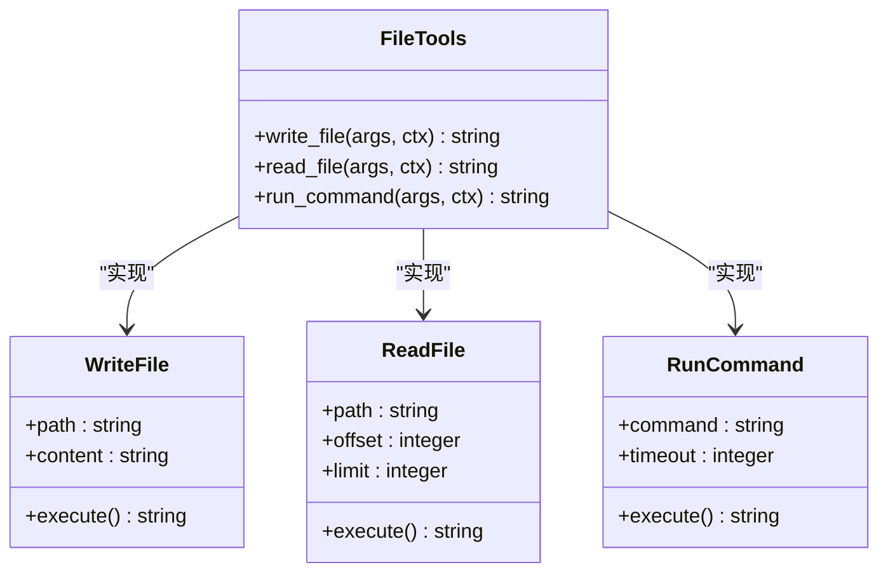

**图表来源**
- [tools/builtin.py:17-89](file://tools/builtin.py#L17-L89)

**章节来源**
- [tools/builtin.py:17-89](file://tools/builtin.py#L17-L89)

## 依赖分析

### 核心依赖关系

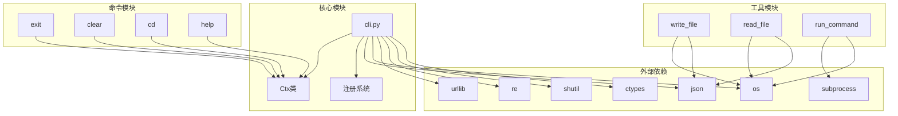

**图表来源**
- [cli.py:1-15](file://cli.py#L1-L15)
- [tools/builtin.py:11-14](file://tools/builtin.py#L11-L14)
- [commands/builtin.py:11-13](file://commands/builtin.py#L11-L13)

**章节来源**
- [cli.py:1-15](file://cli.py#L1-L15)
- [requirements.txt:1-7](file://requirements.txt#L1-L7)

## 性能考虑

### 流式处理优化

系统采用流式处理方式，避免内存峰值：

- **实时渲染**: 使用RichLog实现实时内容渲染
- **增量累积**: 工具调用参数按片段增量累积
- **内存控制**: 限制最大轮次防止无限循环

### 并发执行策略

- **串行执行**: 工具调用按顺序执行，确保状态一致性
- **缓冲区管理**: 通过索引键管理多个并发工具调用
- **超时控制**: 命令执行设置30秒超时

## 故障排除指南

### 常见问题诊断

#### 工具调用失败

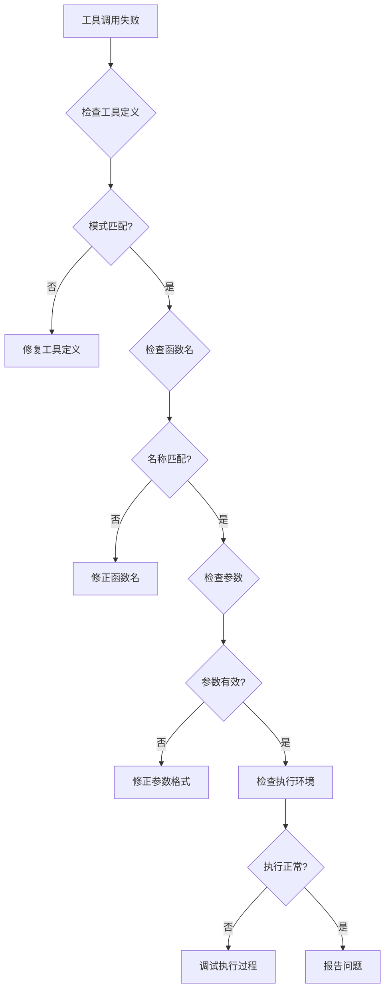

#### 网络连接问题

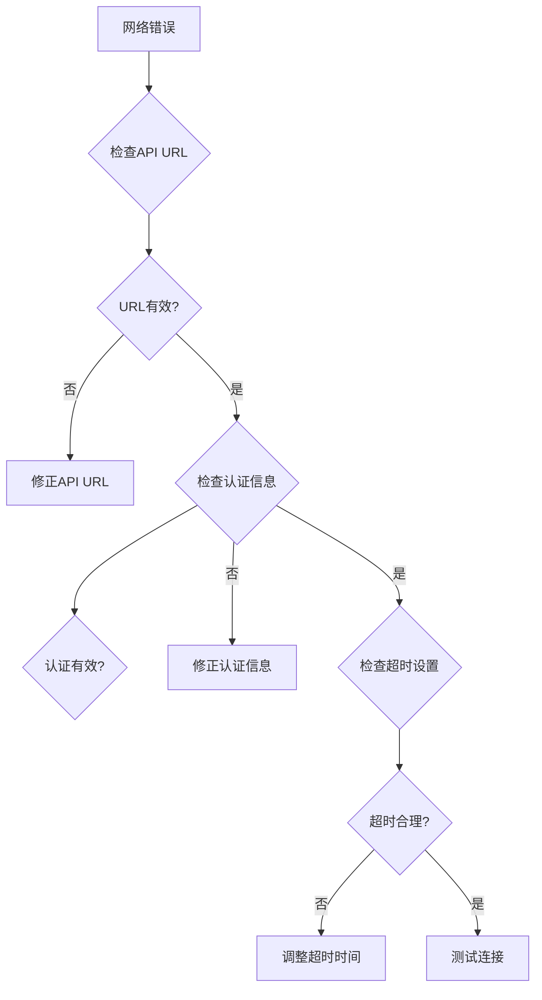

**章节来源**
- [cli.py:405-412](file://cli.py#L405-L412)
- [cli.py:476-479](file://cli.py#L476-L479)

### 调试技巧

#### 日志记录策略

- **流式日志**: 实时显示LLM响应内容
- **工具调用日志**: 记录每个工具的执行时间和结果
- **错误追踪**: 详细的异常堆栈信息

#### 参数验证方法

- **JSON解析**: 使用try-catch处理JSON解析异常
- **类型检查**: 验证参数类型和必需字段
- **边界条件**: 检查空值和超长参数

## 结论

该工具调用协调机制展现了优秀的工程实践：

1. **模块化设计**: 通过装饰器实现松耦合的插件系统
2. **流式处理**: 支持实时响应和工具调用的增量累积
3. **健壮性**: 完善的异常处理和错误恢复机制
4. **可扩展性**: 易于添加新的工具和命令
5. **性能优化**: 内存友好的流式处理和合理的并发控制

该系统为AI代理与本地工具的集成提供了可靠的基础设施，支持复杂的多步工具执行场景。

## 附录

### 快速开始指南

1. **环境准备**: 确保Python 3.12环境
2. **启动系统**: 运行`python -m cli`或使用PowerShell脚本
3. **基本命令**: 
   - `/help`: 查看可用命令
   - `/cd <dir>`: 切换工作区
   - `/provider`: 查看和切换供应商
   - `/model`: 查看和切换模型

### 扩展开发指南

#### 添加自定义工具

1. 在`tools/`目录创建新文件
2. 使用`@tool`装饰器注册工具
3. 实现工具函数并返回字符串结果
4. 重启系统使新工具生效

#### 添加自定义命令

1. 在`commands/`目录创建新文件
2. 使用`@command`装饰器注册命令
3. 实现命令处理函数
4. 重启系统使新命令生效

**章节来源**
- [run.ps1:1-24](file://run.ps1#L1-L24)
- [cli.py:491-532](file://cli.py#L491-L532)