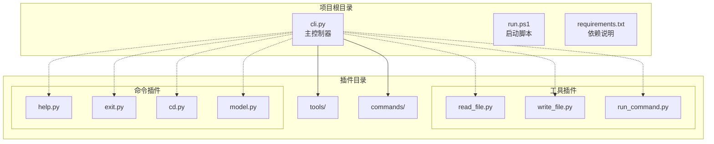
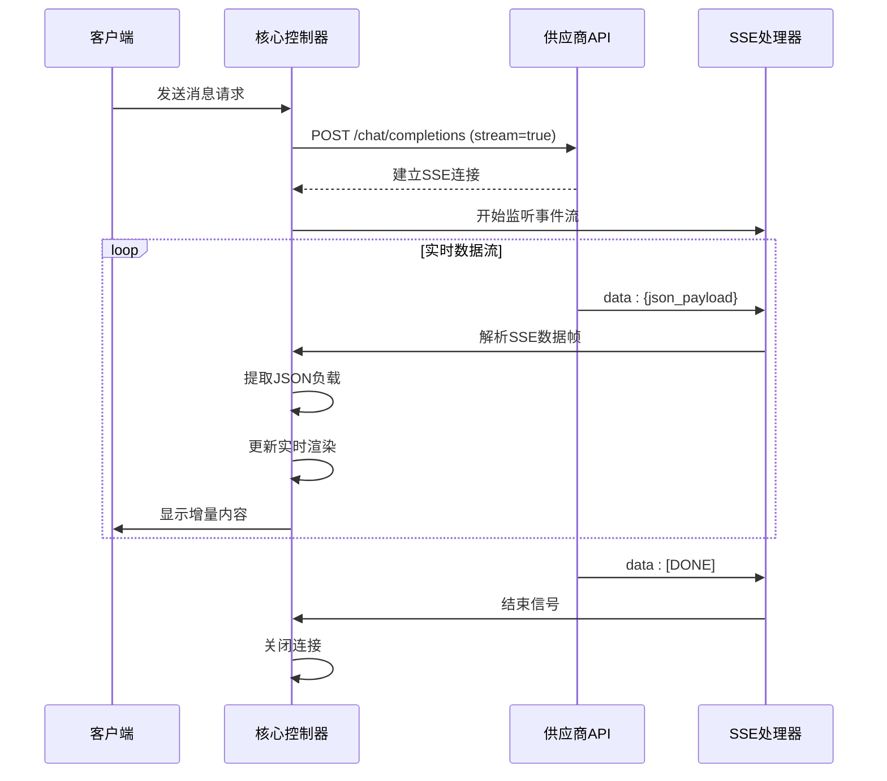
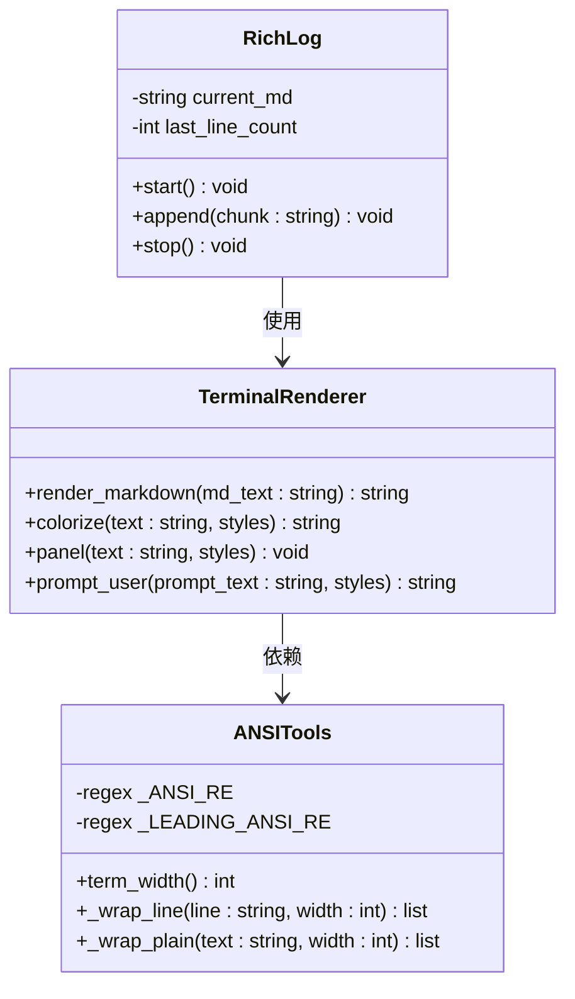
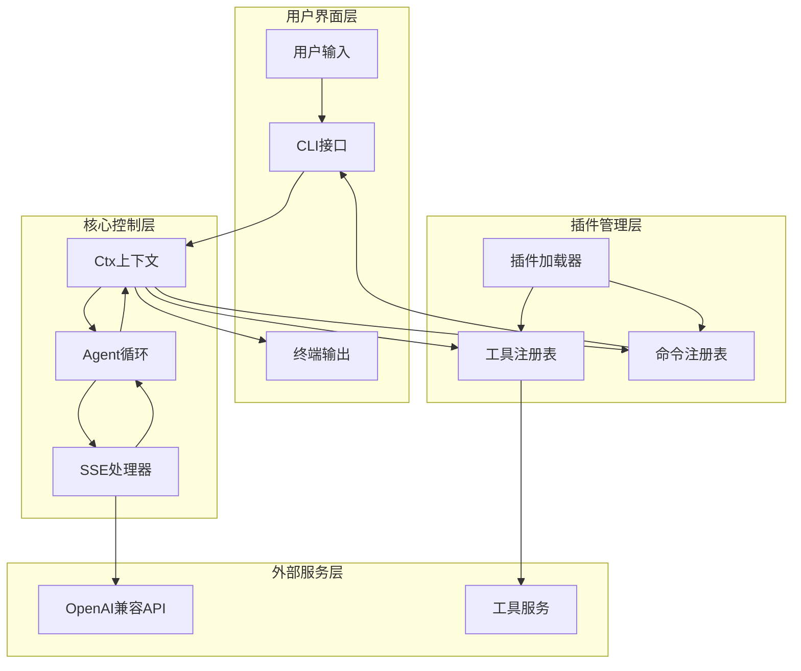
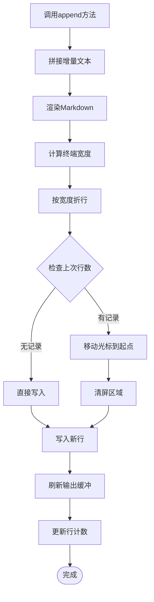
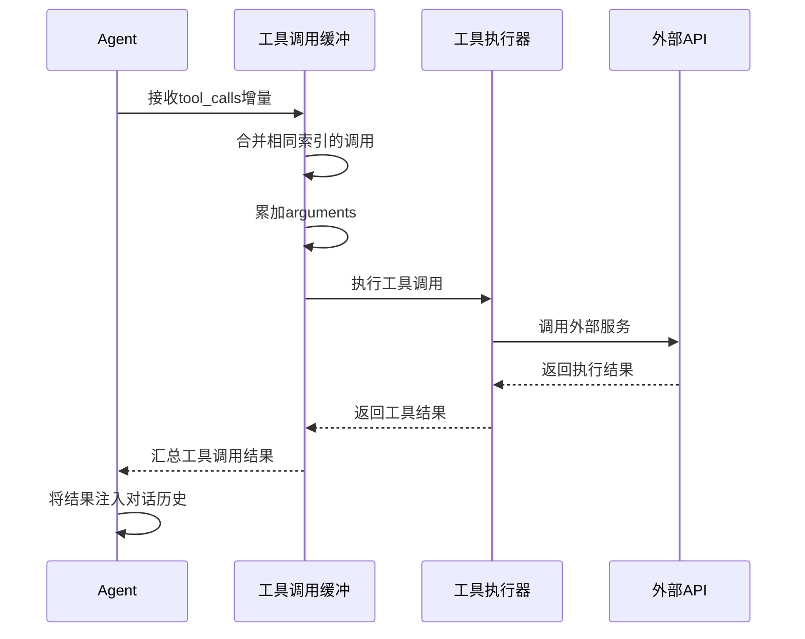
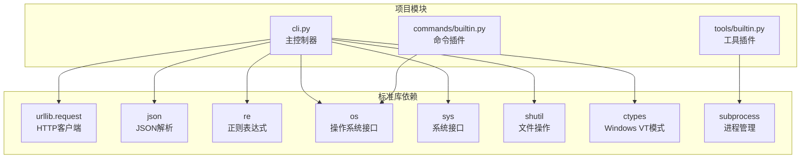
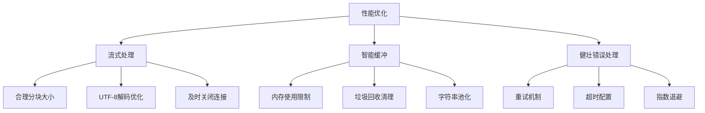

# 流式API处理机制

<cite>
**本文档引用的文件**
- [cli.py](file://cli.py)
- [run.ps1](file://run.ps1)
- [requirements.txt](file://requirements.txt)
- [commands/builtin.py](file://commands/builtin.py)
- [tools/builtin.py](file://tools/builtin.py)
</cite>

## 目录
1. [简介](#简介)
2. [项目结构](#项目结构)
3. [核心组件](#核心组件)
4. [架构概览](#架构概览)
5. [详细组件分析](#详细组件分析)
6. [依赖关系分析](#依赖关系分析)
7. [性能考虑](#性能考虑)
8. [故障排除指南](#故障排除指南)
9. [结论](#结论)

## 简介

本文档深入分析了CodeAgent-TUI项目中的流式API处理机制，重点解释了OpenAI兼容的SSE（Server-Sent Events）连接实现。该项目是一个基于Python 3.12标准库构建的终端交互式AI助手，完全不依赖任何第三方包。

系统的核心功能包括：
- **流式SSE连接**：实现OpenAI兼容的流式响应处理
- **实时渲染**：使用ANSI转义码和终端光标控制实现实时文本渲染
- **插件架构**：支持动态加载工具和命令插件
- **工作区感知**：自动扫描项目结构并注入上下文信息

## 项目结构

项目采用简洁的模块化设计，主要包含以下核心文件：



**图表来源**
- [cli.py:1-532](file://cli.py#L1-L532)
- [run.ps1:1-24](file://run.ps1#L1-L24)
- [requirements.txt:1-7](file://requirements.txt#L1-L7)

**章节来源**
- [cli.py:1-532](file://cli.py#L1-L532)
- [run.ps1:1-24](file://run.ps1#L1-L24)
- [requirements.txt:1-7](file://requirements.txt#L1-L7)

## 核心组件

### SSE流式连接实现

系统实现了完整的OpenAI兼容SSE连接处理机制：



**图表来源**
- [cli.py:389-487](file://cli.py#L389-L487)

### RichLog实时渲染引擎

RichLog类实现了基于ANSI转义码的实时文本渲染：



**图表来源**
- [cli.py:173-203](file://cli.py#L173-L203)
- [cli.py:126-153](file://cli.py#L126-L153)
- [cli.py:85-124](file://cli.py#L85-L124)

**章节来源**
- [cli.py:389-487](file://cli.py#L389-L487)
- [cli.py:173-203](file://cli.py#L173-L203)
- [cli.py:126-153](file://cli.py#L126-L153)
- [cli.py:85-124](file://cli.py#L85-L124)

## 架构概览

系统采用插件化架构，核心控制器负责协调各个组件：



**图表来源**
- [cli.py:255-321](file://cli.py#L255-L321)
- [cli.py:389-487](file://cli.py#L389-L487)
- [cli.py:358-371](file://cli.py#L358-L371)

**章节来源**
- [cli.py:255-321](file://cli.py#L255-L321)
- [cli.py:389-487](file://cli.py#L389-L487)
- [cli.py:358-371](file://cli.py#L358-L371)

## 详细组件分析

### HTTP请求建立与SSE连接

系统使用Python标准库实现SSE连接：

#### 连接建立流程

```mermaid
flowchart TD
START([开始]) --> BUILD_PAYLOAD[构建请求负载]
BUILD_PAYLOAD --> SET_HEADERS[设置认证头]
SET_HEADERS --> CREATE_REQUEST[创建HTTP请求]
CREATE_REQUEST --> SEND_REQUEST[发送POST请求]
SEND_REQUEST --> HANDLE_RESPONSE{处理响应}
HANDLE_RESPONSE --> |成功| OPEN_SSE[打开SSE流]
HANDLE_RESPONSE --> |HTTP错误| HANDLE_HTTP_ERROR[处理HTTP错误]
HANDLE_RESPONSE --> |连接错误| HANDLE_CONN_ERROR[处理连接错误]
OPEN_SSE --> READ_STREAM[读取流数据]
READ_STREAM --> PARSE_FRAME[解析SSE帧]
PARSE_FRAME --> EXTRACT_JSON[提取JSON负载]
EXTRACT_JSON --> UPDATE_RENDER[更新渲染]
UPDATE_RENDER --> CHECK_DONE{检查[DONE]}
CHECK_DONE --> |否| READ_STREAM
CHECK_DONE --> |是| CLOSE_CONN[关闭连接]
HANDLE_HTTP_ERROR --> END([结束])
HANDLE_CONN_ERROR --> END
CLOSE_CONN --> END
```

**图表来源**
- [cli.py:389-487](file://cli.py#L389-L487)

#### SSE数据帧解析

系统实现了完整的SSE数据帧解析逻辑：

| 数据帧类型 | 格式 | 处理方式 |
|------------|------|----------|
| 数据帧 | `data: {json}` | 解析JSON负载，提取增量内容 |
| 结束帧 | `data: [DONE]` | 标记流结束，准备关闭连接 |
| 空帧 | 空行或无效行 | 跳过处理，继续监听 |

**章节来源**
- [cli.py:403-459](file://cli.py#L403-L459)

### JSON数据解析过程

系统实现了robust的JSON解析机制：

#### 解析流程

```mermaid
flowchart TD
DATA_IN[收到原始数据] --> CHECK_PREFIX{检查"data:"前缀}
CHECK_PREFIX --> |否| SKIP_LINE[跳过此行]
CHECK_PREFIX --> |是| EXTRACT_DATA[提取JSON数据]
EXTRACT_DATA --> CHECK_DONE{检查[DONE]标记}
CHECK_DONE --> |是| STOP_STREAM[停止流处理]
CHECK_DONE --> |否| PARSE_JSON[解析JSON]
PARSE_JSON --> VALIDATE_JSON{验证JSON结构}
VALIDATE_JSON --> |无效| SKIP_ERROR[跳过错误数据]
VALIDATE_JSON --> |有效| EXTRACT_DELTA[提取delta字段]
EXTRACT_DELTA --> GET_CONTENT[获取content增量]
GET_CONTENT --> GET_TOOL_CALLS[获取tool_calls]
GET_TOOL_CALLS --> BUFFER_TOOL_CALLS[缓冲工具调用]
BUFFER_TOOL_CALLS --> UPDATE_LOG[更新RichLog]
UPDATE_LOG --> CONTINUE_LOOP[继续处理下一帧]
SKIP_ERROR --> CONTINUE_LOOP
SKIP_LINE --> CONTINUE_LOOP
STOP_STREAM --> END([结束])
CONTINUE_LOOP --> DATA_IN
```

**图表来源**
- [cli.py:420-453](file://cli.py#L420-L453)

#### 错误处理机制

系统实现了多层次的错误处理：

| 错误类型 | 处理策略 | 影响范围 |
|----------|----------|----------|
| HTTP错误 | 记录错误码和响应体 | 终止当前请求 |
| 连接错误 | 记录连接失败原因 | 终止当前请求 |
| JSON解析错误 | 跳过单个错误帧，继续处理 | 局部影响 |
| 工具调用异常 | 返回错误信息，继续对话流程 | 局部影响 |

**章节来源**
- [cli.py:406-412](file://cli.py#L406-L412)
- [cli.py:451-452](file://cli.py#L451-L452)

### 实时渲染机制

RichLog类实现了高效的实时文本渲染：

#### 渲染算法



**图表来源**
- [cli.py:179-195](file://cli.py#L179-L195)

#### ANSI转义码处理

系统提供了完整的ANSI转义码支持：

| 功能 | ANSI代码 | 用途 |
|------|----------|------|
| 文本重置 | `\033[0m` | 恢复默认样式 |
| 粗体 | `\033[1m` | 强调文本 |
| 淡色 | `\033[2m` | 淡化效果 |
| 颜色编码 | `\033[31m-\033[37m` | 红绿蓝黄品红青灰 |
| 终端宽度 | `\033[?25h` | 显示光标 |
| 光标控制 | `\033[nA` | 光标上移n行 |

**章节来源**
- [cli.py:43-54](file://cli.py#L43-L54)
- [cli.py:179-195](file://cli.py#L179-L195)

### 工具调用处理

系统实现了智能的工具调用处理机制：

#### 工具调用缓冲



**图表来源**
- [cli.py:460-484](file://cli.py#L460-L484)

**章节来源**
- [cli.py:460-484](file://cli.py#L460-L484)

## 依赖关系分析

系统采用最小化依赖策略，仅使用Python 3.12标准库：



**图表来源**
- [requirements.txt:1-7](file://requirements.txt#L1-L7)
- [cli.py:1-15](file://cli.py#L1-L15)

**章节来源**
- [requirements.txt:1-7](file://requirements.txt#L1-L7)
- [cli.py:1-15](file://cli.py#L1-L15)

## 性能考虑

### 内存管理策略

系统采用了多项内存优化措施：

1. **增量处理**：只在需要时才将增量内容添加到渲染缓冲区
2. **流式读取**：使用迭代器逐行读取SSE流，避免一次性加载整个响应
3. **缓冲区管理**：合理管理工具调用缓冲区，及时清理已完成的调用
4. **字符串优化**：使用高效的数据结构存储和处理文本内容

### 连接优化



### 最佳实践建议

1. **异常捕获**：确保所有网络操作都有适当的异常处理
2. **连接重试**：实现指数退避的重试机制
3. **超时处理**：设置合理的连接和读取超时
4. **资源清理**：确保所有连接和文件句柄都能正确关闭

## 故障排除指南

### 常见问题诊断

#### 连接问题

| 问题症状 | 可能原因 | 解决方案 |
|----------|----------|----------|
| 连接超时 | 网络不稳定或API限流 | 检查网络连接，增加重试次数 |
| 认证失败 | API密钥错误或过期 | 验证API密钥配置 |
| SSL证书错误 | 证书验证失败 | 检查代理设置或证书配置 |
| 端口被占用 | 本地端口冲突 | 更改端口或释放占用端口 |

#### 渲染问题

| 问题症状 | 可能原因 | 解决方案 |
|----------|----------|----------|
| 文本乱码 | 编码设置错误 | 设置终端编码为UTF-8 |
| 光标位置错误 | ANSI转义码冲突 | 检查其他程序的输出 |
| 折行异常 | 终端宽度检测失败 | 手动设置终端宽度 |
| 颜色显示异常 | 终端不支持ANSI | 降级到无颜色模式 |

#### 数据处理问题

| 问题症状 | 可能原因 | 解决方案 |
|----------|----------|----------|
| 数据丢失 | JSON解析错误 | 检查数据完整性，增加校验 |
| 工具调用失败 | 参数格式错误 | 验证工具参数schema |
| 流中断 | 服务器连接异常 | 实现连接恢复机制 |
| 内存泄漏 | 缓冲区未清理 | 检查缓冲区生命周期管理 |

**章节来源**
- [cli.py:406-412](file://cli.py#L406-L412)
- [cli.py:451-452](file://cli.py#L451-L452)

## 结论

CodeAgent-TUI项目展示了如何使用纯Python标准库实现高性能的流式API处理机制。系统的主要优势包括：

1. **零依赖设计**：完全基于Python 3.12标准库，部署简单
2. **实时渲染**：使用ANSI转义码实现流畅的终端体验
3. **插件架构**：支持动态扩展工具和命令
4. **健壮性**：完善的错误处理和异常恢复机制
5. **性能优化**：流式处理和内存管理优化

该实现为开发类似的应用程序提供了优秀的参考模板，特别是在需要实时数据处理和终端交互的场景中。