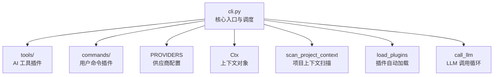
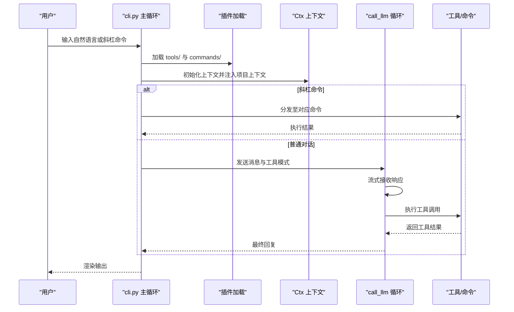
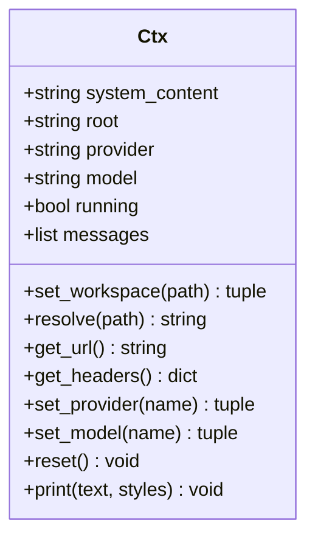
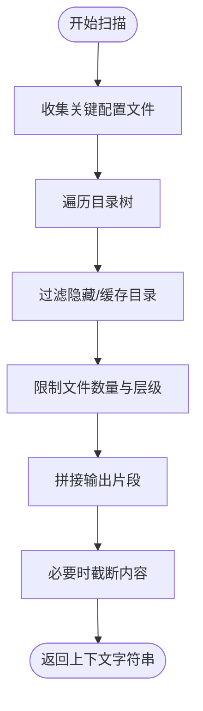
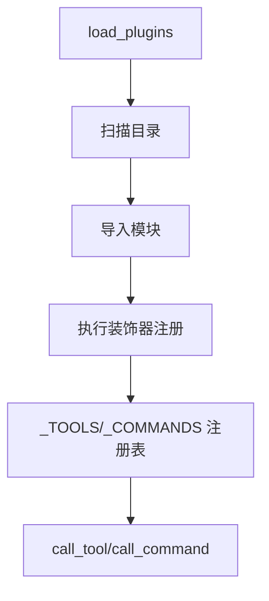
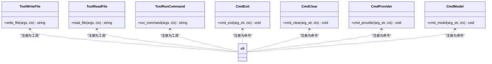
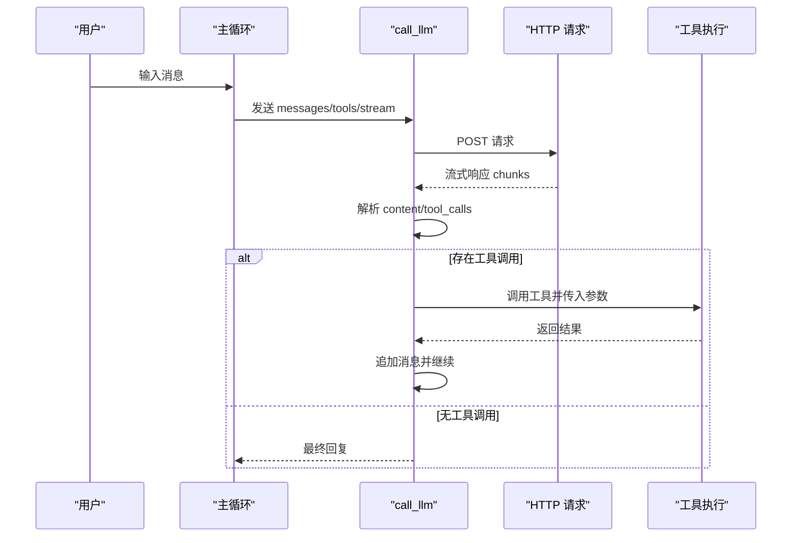
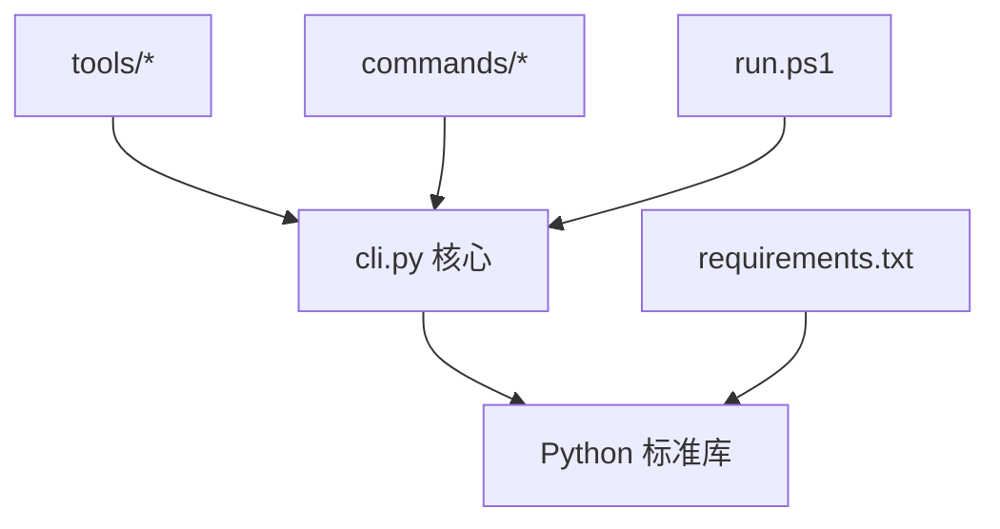

# 使用示例与最佳实践

<cite>
**本文档引用的文件**
- [cli.py](file://cli.py)
- [commands/builtin.py](file://commands/builtin.py)
- [tools/builtin.py](file://tools/builtin.py)
- [requirements.txt](file://requirements.txt)
- [run.ps1](file://run.ps1)
</cite>

## 目录
1. [简介](#简介)
2. [项目结构](#项目结构)
3. [核心组件](#核心组件)
4. [架构概览](#架构概览)
5. [详细组件分析](#详细组件分析)
6. [依赖分析](#依赖分析)
7. [性能考虑](#性能考虑)
8. [故障排除指南](#故障排除指南)
9. [结论](#结论)
10. [附录](#附录)

## 简介
本项目是一个基于 Python 标准库构建的可插拔 AI 助手 CLI 应用，支持：
- 多供应商/多模型切换
- 工作区感知的项目上下文注入
- 流式响应渲染与工具调用循环
- 内置文件读写与命令执行工具
- 用户斜杠命令管理（退出、清屏、切换工作区、切换供应商/模型等）

## 项目结构
项目采用“核心 + 插件”的架构设计，核心位于 cli.py，工具与命令分别位于 tools/ 与 commands/ 目录，通过装饰器注册与自动加载机制实现松耦合扩展。

图表来源
- [cli.py:19-35](file://cli.py#L19-L35)
- [cli.py:255-321](file://cli.py#L255-L321)
- [cli.py:325-353](file://cli.py#L325-L353)
- [cli.py:358-371](file://cli.py#L358-L371)
- [cli.py:389-487](file://cli.py#L389-L487)

章节来源
- [cli.py:19-35](file://cli.py#L19-L35)
- [cli.py:358-371](file://cli.py#L358-L371)

## 核心组件
- 供应商与模型配置：支持多供应商与模型切换，认证方案可配置为 bearer 或 raw。
- 终端渲染：自实现 ANSI 颜色与流式输出，替代第三方库。
- 插件注册表：通过装饰器注册工具与命令，核心不感知具体实现。
- 上下文对象：封装系统提示、消息历史、工作区路径、供应商/模型状态。
- 项目上下文扫描：自动收集项目结构与关键配置文件内容注入系统提示。
- 插件加载：自动扫描 tools/ 与 commands/ 目录，导入非下划线开头的模块。

章节来源
- [cli.py:19-35](file://cli.py#L19-L35)
- [cli.py:43-203](file://cli.py#L43-L203)
- [cli.py:207-251](file://cli.py#L207-L251)
- [cli.py:255-321](file://cli.py#L255-L321)
- [cli.py:325-353](file://cli.py#L325-L353)
- [cli.py:358-371](file://cli.py#L358-L371)

## 架构概览
整体架构围绕“核心调度 + 插件扩展”展开，核心负责：
- 插件加载与注册
- 供应商/模型切换
- 项目上下文注入
- LLM 流式调用与工具调用循环
- 终端渲染与用户交互

图表来源
- [cli.py:491-532](file://cli.py#L491-L532)
- [cli.py:358-371](file://cli.py#L358-L371)
- [cli.py:389-487](file://cli.py#L389-L487)
- [cli.py:241-246](file://cli.py#L241-L246)

## 详细组件分析

### 组件一：上下文对象 Ctx
- 职责：统一管理系统提示、消息历史、工作区路径、供应商/模型状态，并提供路径解析与 HTTP 头生成。
- 关键能力：
  - 项目上下文重建：根据当前工作区扫描关键文件与目录树，注入系统提示。
  - 工作区切换：支持相对与绝对路径，自动刷新上下文。
  - 供应商/模型切换：自动重置模型为供应商首个预设值。
  - 统一输出：通过 ctx.print 提供带样式的输出接口。

图表来源
- [cli.py:255-321](file://cli.py#L255-L321)

章节来源
- [cli.py:255-321](file://cli.py#L255-L321)

### 组件二：项目上下文扫描 scan_project_context
- 职责：递归扫描工作区，收集关键配置文件与目录树，限制输出大小与文件数量，注入系统提示。
- 特性：过滤隐藏目录与缓存目录，限制最大层级与文件数，避免过量输出。

图表来源
- [cli.py:325-353](file://cli.py#L325-L353)

章节来源
- [cli.py:325-353](file://cli.py#L325-L353)

### 组件三：插件加载与注册
- 装饰器注册：
  - @tool：注册 AI 工具，提供名称、描述与 JSON Schema 参数定义。
  - @command：注册用户斜杠命令，提供帮助文本。
- 自动加载：扫描 tools/ 与 commands/ 目录，导入非下划线开头的模块，触发注册。
- 注册表：维护工具与命令的函数与元数据，支持动态查询与调用。

图表来源
- [cli.py:211-251](file://cli.py#L211-L251)
- [cli.py:358-371](file://cli.py#L358-L371)

章节来源
- [cli.py:211-251](file://cli.py#L211-L251)
- [cli.py:358-371](file://cli.py#L358-L371)

### 组件四：内置工具与命令
- 工具（tools/builtin.py）：
  - write_file：将内容写入指定路径，自动创建目录。
  - read_file：读取文件内容，支持分页（偏移与限制），返回带行号内容。
  - run_command：执行 shell 命令，捕获 stdout/stderr，设置超时与工作目录。
- 命令（commands/builtin.py）：
  - /exit、/quit：退出程序。
  - /clear：清除对话历史。
  - /write：用编辑器打开文件（VSCode 优先，降级为 nano/vi）。
  - /help：显示可用命令。
  - /cd：切换工作区。
  - /pwd：显示当前工作区。
  - /provider：切换供应商（无参列出可用）。
  - /model：切换模型（无参列出当前供应商模型）。

图表来源
- [tools/builtin.py:17-35](file://tools/builtin.py#L17-L35)
- [tools/builtin.py:38-70](file://tools/builtin.py#L38-L70)
- [tools/builtin.py:73-89](file://tools/builtin.py#L73-L89)
- [commands/builtin.py:16-18](file://commands/builtin.py#L16-L18)
- [commands/builtin.py:26-29](file://commands/builtin.py#L26-L29)
- [commands/builtin.py:67-77](file://commands/builtin.py#L67-L77)
- [commands/builtin.py:79-90](file://commands/builtin.py#L79-L90)

章节来源
- [tools/builtin.py:17-89](file://tools/builtin.py#L17-L89)
- [commands/builtin.py:16-90](file://commands/builtin.py#L16-L90)

### 组件五：主循环与 LLM 调用流程
- 主循环：加载插件、初始化上下文、循环读取用户输入，分发命令或进入对话。
- LLM 调用：构造 OpenAI 兼容的 payload，启用流式响应与工具字段，解析增量内容与工具调用，执行工具并将结果回传给模型，直到无工具调用或达到轮次上限。

图表来源
- [cli.py:491-532](file://cli.py#L491-L532)
- [cli.py:389-487](file://cli.py#L389-L487)

章节来源
- [cli.py:491-532](file://cli.py#L491-L532)
- [cli.py:389-487](file://cli.py#L389-L487)

## 依赖分析
- 运行时依赖：仅使用 Python 3.12 标准库，包括 urllib、json、subprocess、shutil、re、os、sys、ctypes。
- 插件扩展：通过装饰器注册，无需修改核心代码即可新增工具与命令。
- 启动方式：支持直接运行模块或使用 PowerShell 脚本自动创建虚拟环境并运行。

图表来源
- [requirements.txt:1-7](file://requirements.txt#L1-L7)
- [run.ps1:1-24](file://run.ps1#L1-L24)
- [cli.py:358-371](file://cli.py#L358-L371)

章节来源
- [requirements.txt:1-7](file://requirements.txt#L1-L7)
- [run.ps1:1-24](file://run.ps1#L1-L24)

## 性能考虑
- 终端渲染优化
  - 使用 ANSI 光标重绘实现流式增量渲染，减少全屏刷新开销。
  - 按可见宽度折行，避免长行导致的额外计算。
- LLM 调用优化
  - 每轮重新序列化 payload，避免重复请求旧数据。
  - 工具调用循环限制最大轮次，防止无限循环。
- 项目上下文扫描
  - 限制最大层级与文件数量，必要时截断内容，避免过量 IO。
- 工具执行
  - 命令执行设置超时，避免长时间阻塞。
  - 文件读取支持分页，避免一次性读取大文件造成内存压力。

章节来源
- [cli.py:173-203](file://cli.py#L173-L203)
- [cli.py:391-392](file://cli.py#L391-L392)
- [cli.py:338-350](file://cli.py#L338-L350)
- [cli.py:87-88](file://cli.py#L87-L88)
- [cli.py:56-60](file://cli.py#L56-L60)

## 故障排除指南
- 启动问题
  - 确认已安装 Python 3.12，使用 run.ps1 自动创建虚拟环境。
  - 若 PowerShell 执行策略限制，调整执行策略或直接运行 .venv\Scripts\python.exe -m cli。
- 网络连接
  - HTTP 错误会打印状态码与响应体前 200 字符，检查供应商 base_url 与 api_key。
  - URLError 通常表示连接失败，检查网络与代理设置。
- 工具执行异常
  - 工具抛出异常会被捕获并返回错误信息，查看工具返回的错误内容。
- 终端显示
  - Windows 启用 VT 模式以正确显示颜色；若失败，终端可能无法正确渲染颜色。
- 权限与路径
  - 切换工作区时确保路径存在且可访问；相对路径解析基于当前 root。

章节来源
- [run.ps1:8-16](file://run.ps1#L8-L16)
- [cli.py:406-412](file://cli.py#L406-L412)
- [cli.py:477-478](file://cli.py#L477-L478)
- [cli.py:60-71](file://cli.py#L60-L71)
- [cli.py:279-286](file://cli.py#L279-L286)

## 结论
本项目通过“核心 + 插件”的架构实现了高度可扩展的 AI 助手 CLI 应用，具备以下优势：
- 无第三方依赖，易于部署与维护
- 支持多供应商/多模型切换与工作区感知
- 流式响应与工具调用循环提升交互体验
- 内置常用工具与命令，满足日常开发需求
- 提供清晰的扩展点，便于团队协作与持续演进

## 附录

### 常见使用场景与最佳实践

- 代码编写辅助
  - 在工作区内进行代码审查与重构建议，利用 read_file 分页读取大文件，write_file 快速落地修改。
  - 使用 run_command 执行构建脚本或测试命令，结合工具调用循环获得即时反馈。
  - 切换供应商与模型以对比不同输出质量，选择最优组合。

- 项目探索
  - 使用 /cd 切换到目标子目录，自动刷新项目上下文，快速了解新项目结构。
  - 使用 /provider 与 /model 列表查看可用选项，按需切换以匹配项目特性。

- 供应商切换
  - 通过 /provider 无参查看可用供应商与模型列表，再使用 /model 切换到目标模型。
  - 注意：切换供应商会重置模型为该供应商首个预设值，可在需要时再次切换。

- 高级功能使用
  - 复杂工具调用：在工具中实现多步骤操作，例如先读取配置，再执行命令，最后写回结果。
  - 多轮对话管理：利用 /clear 清除历史，避免上下文污染；或在命令中实现自定义清理逻辑。
  - 自定义插件集成：在 tools/ 与 commands/ 新增 .py 文件，使用 @tool 与 @command 装饰器注册，重启后自动生效。

- 安全使用指南
  - API 密钥管理：将 api_key 存储在环境变量中，避免硬编码在源码中。
  - 敏感信息保护：避免在项目上下文中暴露敏感文件内容，必要时手动过滤。
  - 权限控制：限制工具执行范围，避免在生产环境执行高风险命令。

- 团队协作与 CI/CD
  - 团队协作：统一供应商与模型配置，共享常用工具与命令，减少重复劳动。
  - CI/CD 集成：在流水线中使用 run.ps1 或直接运行模块，确保一致的运行环境。

- 性能优化建议
  - 内存管理：大文件读取使用分页参数，避免一次性加载。
  - 网络优化：合理设置超时与重试策略，避免长时间等待。
  - 缓存策略：对于频繁读取的静态文件，可在工具层实现本地缓存（需自行扩展）。