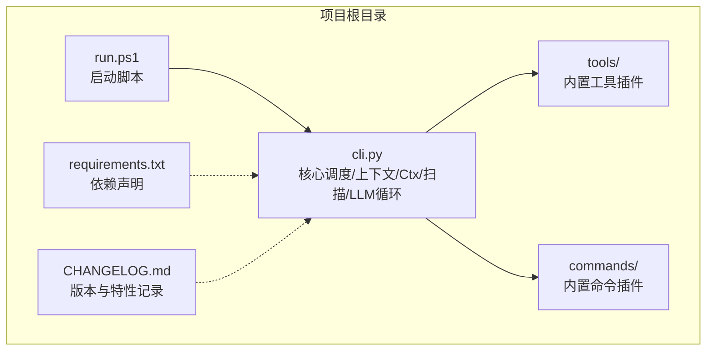
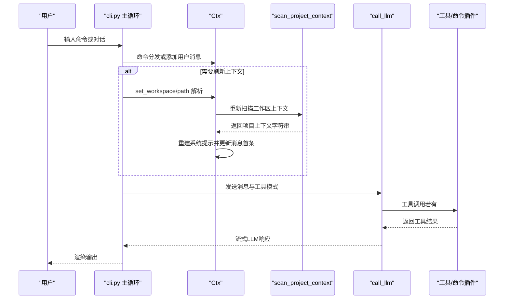
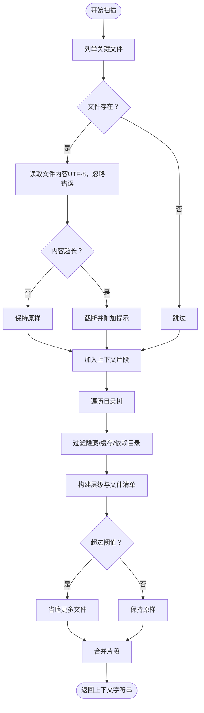
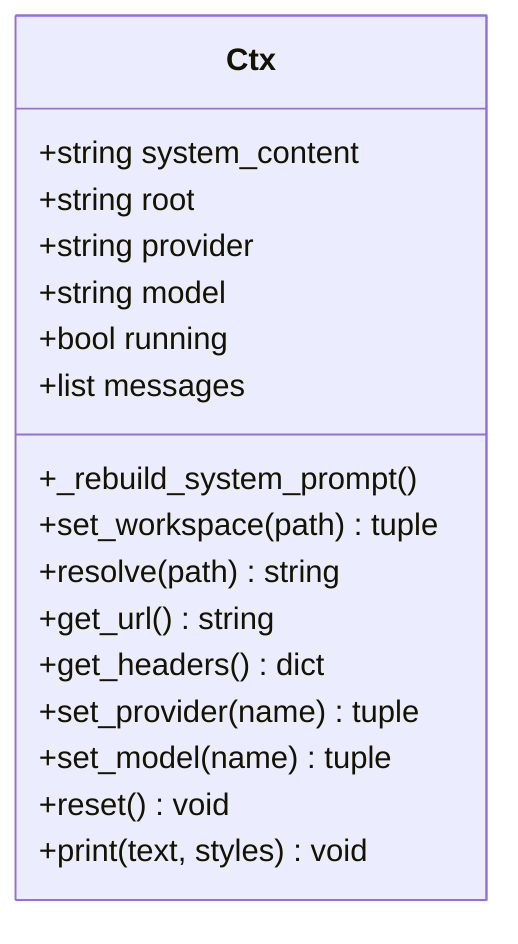
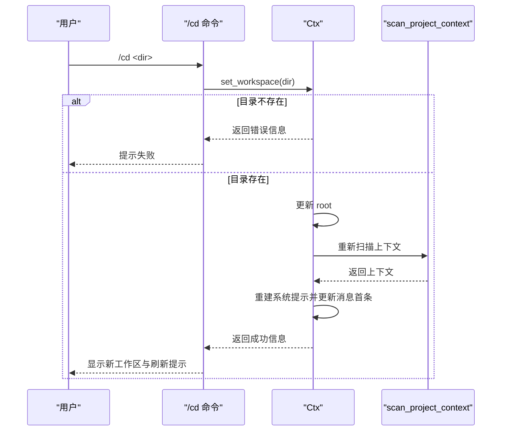
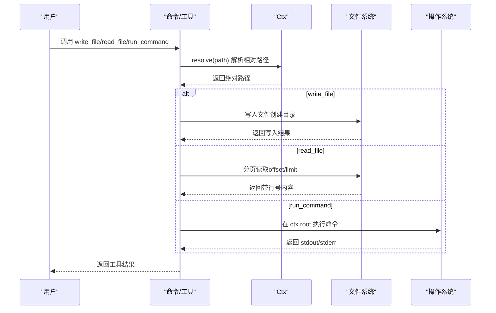
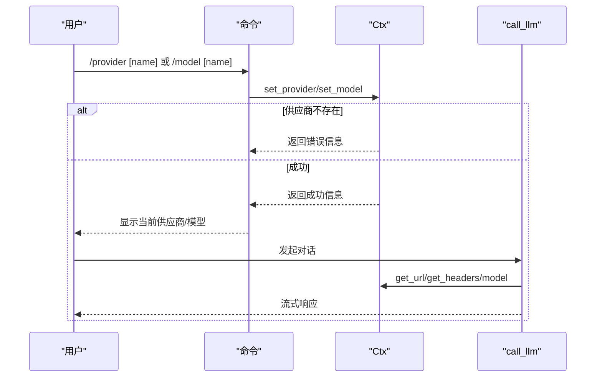
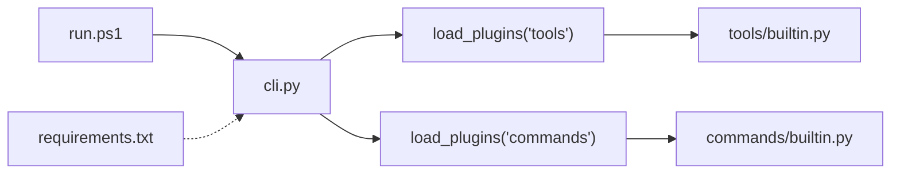

# 工作区与项目上下文

<cite>
**本文引用的文件**
- [cli.py](file://cli.py)
- [commands/builtin.py](file://commands/builtin.py)
- [tools/builtin.py](file://tools/builtin.py)
- [run.ps1](file://run.ps1)
- [requirements.txt](file://requirements.txt)
- [CHANGELOG.md](file://CHANGELOG.md)
</cite>

## 目录
1. [简介](#简介)
2. [项目结构](#项目结构)
3. [核心组件](#核心组件)
4. [架构总览](#架构总览)
5. [详细组件分析](#详细组件分析)
6. [依赖关系分析](#依赖关系分析)
7. [性能考量](#性能考量)
8. [故障排查指南](#故障排查指南)
9. [结论](#结论)
10. [附录](#附录)

## 简介
本文件围绕“工作区感知与项目上下文管理”展开，系统性阐述以下主题：
- 工作区扫描机制：项目结构遍历、关键文件识别、内容提取与截断策略
- 项目上下文注入：系统提示构建、上下文信息组织、动态更新机制
- 路径解析与工作区切换：相对路径处理、绝对路径支持、权限与边界检查
- 最佳实践与安全考虑：配置管理、敏感信息处理、资源控制
- 上下文对AI响应质量的影响与优化策略：提示工程、分页与增量策略
- 复杂项目结构的处理示例与性能优化建议

## 项目结构
该项目采用“单核心 + 插件化”的轻量架构：
- 核心入口与调度：cli.py
- 插件目录：tools/、commands/
- 启动脚本：run.ps1
- 依赖声明：requirements.txt
- 变更记录：CHANGELOG.md

图表来源
- [cli.py:491-532](file://cli.py#L491-L532)
- [run.ps1:1-24](file://run.ps1#L1-L24)
- [requirements.txt:1-7](file://requirements.txt#L1-L7)
- [CHANGELOG.md:1-29](file://CHANGELOG.md#L1-L29)

章节来源
- [cli.py:491-532](file://cli.py#L491-L532)
- [run.ps1:1-24](file://run.ps1#L1-L24)
- [requirements.txt:1-7](file://requirements.txt#L1-L7)
- [CHANGELOG.md:1-29](file://CHANGELOG.md#L1-L29)

## 核心组件
- Ctx：贯穿工具与命令的上下文对象，负责系统提示构建、消息队列、工作区根目录、供应商/模型选择、路径解析与HTTP头生成、以及系统提示的动态重建。
- scan_project_context：扫描工作区，收集关键配置文件与目录树，拼装为项目上下文字符串。
- call_llm：流式调用LLM，支持工具调用循环与防失控保护。
- 内置命令与工具：提供工作区切换、供应商/模型切换、文件读写、命令执行等能力。

章节来源
- [cli.py:255-321](file://cli.py#L255-L321)
- [cli.py:325-353](file://cli.py#L325-L353)
- [cli.py:389-487](file://cli.py#L389-L487)
- [commands/builtin.py:16-91](file://commands/builtin.py#L16-L91)
- [tools/builtin.py:17-90](file://tools/builtin.py#L17-L90)

## 架构总览
整体流程：启动时加载插件，创建Ctx并扫描当前工作区，注入系统提示；用户交互通过命令或普通对话驱动；当工作区切换或模型/供应商变化时，动态重建系统提示；工具调用在LLM循环中按需执行。

图表来源
- [cli.py:491-532](file://cli.py#L491-L532)
- [cli.py:279-286](file://cli.py#L279-L286)
- [cli.py:325-353](file://cli.py#L325-L353)
- [cli.py:389-487](file://cli.py#L389-L487)
- [commands/builtin.py:48-60](file://commands/builtin.py#L48-L60)
- [tools/builtin.py:29-35](file://tools/builtin.py#L29-L35)

## 详细组件分析

### 工作区扫描与项目上下文注入
- 关键文件识别：.gitignore、pyproject.toml、setup.cfg、README.md、requirements.txt、package.json
- 目录树遍历：使用os.walk递归遍历，过滤隐藏目录与常见缓存/依赖目录，限制输出行数以避免过长
- 截断策略：关键文件内容超过阈值进行截断并标注；目录树超过阈值进行省略
- 上下文拼装：将“项目结构”、“关键文件”合并为单一字符串，作为系统提示的一部分注入

图表来源
- [cli.py:325-353](file://cli.py#L325-L353)

章节来源
- [cli.py:325-353](file://cli.py#L325-L353)

### Ctx：系统提示构建与动态更新
- 初始化：保存基础系统提示、设置工作区根目录、默认供应商/模型、消息队列
- 动态重建：set_workspace调用后，调用scan_project_context生成新的上下文，拼接到基础提示中，并更新消息队列首条系统消息
- 路径解析：resolve将相对路径解析到当前root，绝对路径原样返回
- 供应商/模型：set_provider/set_model分别切换供应商与模型，自动重置模型或校验合法性

图表来源
- [cli.py:255-321](file://cli.py#L255-L321)

章节来源
- [cli.py:255-321](file://cli.py#L255-L321)

### 路径解析与工作区切换
- set_workspace：支持相对路径与绝对路径；校验目录存在性；更新root并重建系统提示
- resolve：相对路径拼接到root，绝对路径原样返回
- 内置命令/cmd：/cd用于切换工作区，/pwd显示当前工作区，切换后自动刷新上下文

图表来源
- [cli.py:279-286](file://cli.py#L279-L286)
- [cli.py:325-353](file://cli.py#L325-L353)
- [commands/builtin.py:48-60](file://commands/builtin.py#L48-L60)

章节来源
- [cli.py:279-286](file://cli.py#L279-L286)
- [cli.py:288-290](file://cli.py#L288-L290)
- [commands/builtin.py:48-60](file://commands/builtin.py#L48-L60)

### 工具与命令：文件读写与命令执行
- write_file：接收相对路径与内容，解析到工作区后写入；自动创建父目录
- read_file：支持分页读取（offset/limit），返回带行号内容与翻页提示，避免一次性截断
- run_command：在工作区根目录执行命令，捕获输出并返回

图表来源
- [tools/builtin.py:29-35](file://tools/builtin.py#L29-L35)
- [tools/builtin.py:51-70](file://tools/builtin.py#L51-L70)
- [tools/builtin.py:84-89](file://tools/builtin.py#L84-L89)
- [cli.py:288-290](file://cli.py#L288-L290)

章节来源
- [tools/builtin.py:17-90](file://tools/builtin.py#L17-L90)
- [cli.py:288-290](file://cli.py#L288-L290)

### 供应商与模型切换
- 支持运行中切换供应商与模型，自动重置模型为供应商首个预设
- 供应商配置包含base_url、api_key、auth_scheme、models
- call_llm使用ctx.get_url()/get_headers()/ctx.model构造请求

图表来源
- [cli.py:292-313](file://cli.py#L292-L313)
- [cli.py:389-401](file://cli.py#L389-L401)
- [commands/builtin.py:67-91](file://commands/builtin.py#L67-L91)

章节来源
- [cli.py:19-35](file://cli.py#L19-L35)
- [cli.py:292-313](file://cli.py#L292-L313)
- [cli.py:389-401](file://cli.py#L389-L401)
- [commands/builtin.py:67-91](file://commands/builtin.py#L67-L91)

## 依赖关系分析
- 插件加载：主循环加载tools/与commands/下的插件模块，通过装饰器注册工具与命令
- 依赖最小化：项目仅依赖Python 3.12标准库，无需第三方包
- 启动方式：run.ps1自动创建并使用虚拟环境，然后运行cli.py

图表来源
- [cli.py:493-494](file://cli.py#L493-L494)
- [cli.py:358-371](file://cli.py#L358-L371)
- [run.ps1:18-23](file://run.ps1#L18-L23)
- [requirements.txt:1-7](file://requirements.txt#L1-L7)

章节来源
- [cli.py:358-371](file://cli.py#L358-L371)
- [cli.py:493-494](file://cli.py#L493-L494)
- [run.ps1:1-24](file://run.ps1#L1-L24)
- [requirements.txt:1-7](file://requirements.txt#L1-L7)

## 性能考量
- 扫描范围控制
  - 目录树遍历过滤隐藏与缓存目录，避免无关文件干扰
  - 目录树输出超过阈值时进行省略，防止上下文过长
- 关键文件截断
  - 对关键文件内容进行截断并标注，避免超长上下文影响模型性能
- 工具结果展示
  - 终端展示对长结果进行截断并标注总长度，但传给AI的是完整结果
- 读取策略
  - read_file采用分页读取（offset/limit），避免一次性截断导致信息缺失
- LLM调用
  - call_llm使用流式SSE解析，结合防失控的最大轮次限制

章节来源
- [cli.py:338-353](file://cli.py#L338-L353)
- [cli.py:334-336](file://cli.py#L334-L336)
- [cli.py:375-387](file://cli.py#L375-L387)
- [tools/builtin.py:55-70](file://tools/builtin.py#L55-L70)
- [cli.py:391-392](file://cli.py#L391-L392)

## 故障排查指南
- 工作区切换失败
  - 现象：/cd提示目录不存在
  - 排查：确认路径是否为有效目录；相对路径基于当前root解析
  - 参考：[cli.py:279-286](file://cli.py#L279-L286)
- 供应商/模型切换失败
  - 现象：/provider或/model返回未知名称或不在预设列表
  - 排查：核对PROVIDERS配置与名称大小写
  - 参考：[cli.py:300-313](file://cli.py#L300-L313)
- 工具执行异常
  - 现象：工具返回异常信息
  - 排查：检查工具参数与工作区路径解析；确认文件存在与权限
  - 参考：[tools/builtin.py:476-479](file://tools/builtin.py#L476-L479)
- LLM连接错误
  - 现象：HTTP错误或连接错误
  - 排查：检查网络、代理、API密钥与鉴权方案
  - 参考：[cli.py:406-412](file://cli.py#L406-L412)
- 启动问题
  - 现象：run.ps1无法找到虚拟环境或Python
  - 排查：确认Python 3.12安装与路径；手动创建.vnev并重试
  - 参考：[run.ps1:8-16](file://run.ps1#L8-L16)

章节来源
- [cli.py:279-286](file://cli.py#L279-L286)
- [cli.py:300-313](file://cli.py#L300-L313)
- [tools/builtin.py:476-479](file://tools/builtin.py#L476-L479)
- [cli.py:406-412](file://cli.py#L406-L412)
- [run.ps1:8-16](file://run.ps1#L8-L16)

## 结论
本项目通过“工作区扫描 + 上下文注入 + 动态更新”的机制，实现了对复杂项目的感知与高效交互。结合路径解析、供应商/模型切换与工具链，形成可扩展、可维护、低耦合的Agent框架。通过合理的截断与分页策略，兼顾了上下文质量与性能表现。

## 附录

### 最佳实践与安全考虑
- 配置管理
  - 将敏感信息（如API密钥）从代码中分离，优先使用环境变量或外部配置文件
  - 供应商配置集中管理，避免硬编码
- 资源控制
  - 限制扫描深度与输出长度，避免内存与带宽压力
  - 对工具调用设置超时与权限限制
- 安全边界
  - 严格校验工作区路径，避免越权访问
  - 对命令执行进行白名单与沙箱化处理
- 版本与回滚
  - 使用变更记录跟踪功能演进，必要时回退到稳定版本

章节来源
- [cli.py:19-35](file://cli.py#L19-L35)
- [cli.py:334-336](file://cli.py#L334-L336)
- [tools/builtin.py:84-89](file://tools/builtin.py#L84-L89)

### 上下文对AI响应质量的影响与优化策略
- 提示工程
  - 将项目结构与关键配置纳入系统提示，提升AI对项目背景的理解
  - 使用清晰的分隔与标题，便于模型区分不同上下文片段
- 分页与增量
  - 对大文件采用分页读取，避免一次性截断导致信息缺失
  - 在对话中逐步补充上下文，减少一次性注入过多信息带来的噪声
- 动态更新
  - 工作区切换后立即重建系统提示，确保上下文与当前项目一致

章节来源
- [cli.py:266-278](file://cli.py#L266-L278)
- [cli.py:325-353](file://cli.py#L325-L353)
- [tools/builtin.py:55-70](file://tools/builtin.py#L55-L70)

### 复杂项目结构的处理示例
- 多语言混合项目
  - 关键文件识别：同时包含requirements.txt、package.json、pyproject.toml等
  - 目录树过滤：排除node_modules、.venv、__pycache__等
- 大型仓库
  - 使用分页读取与省略策略，避免上下文过长
  - 通过/切换工作区聚焦子目录，减少无关上下文

章节来源
- [cli.py:327-353](file://cli.py#L327-L353)
- [cli.py:338-353](file://cli.py#L338-L353)