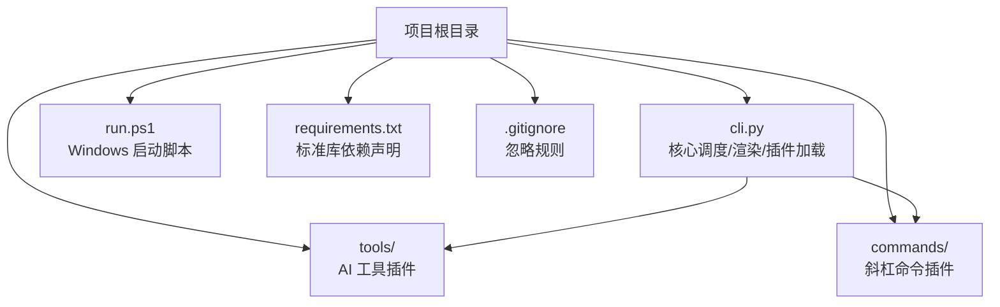
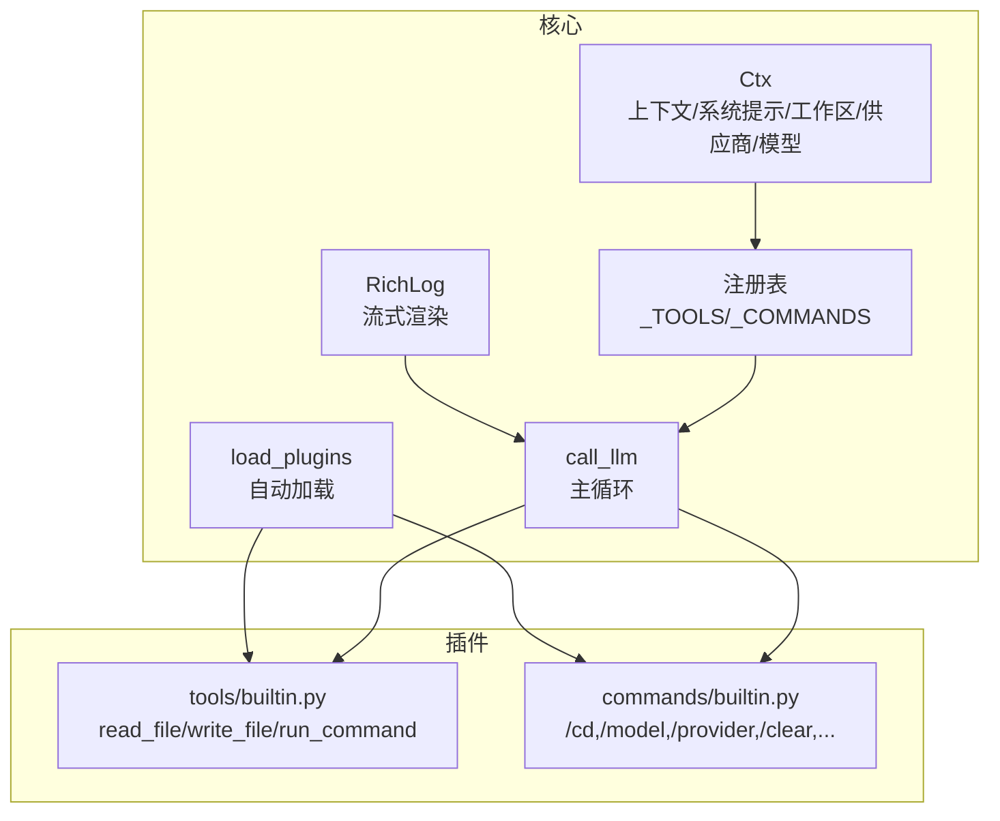
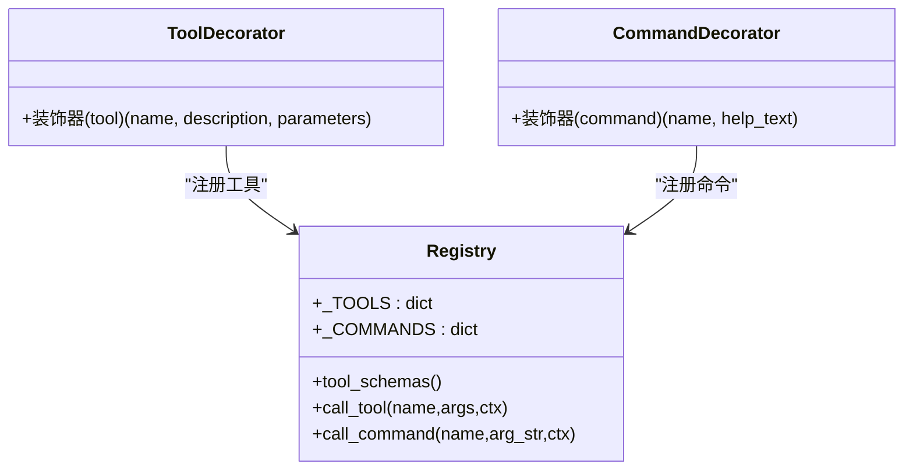
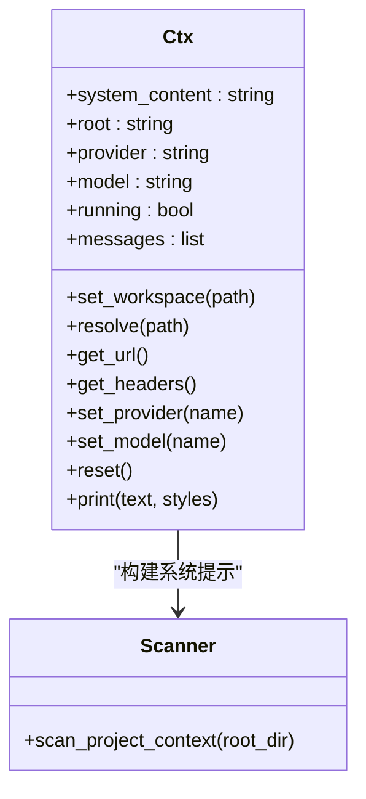
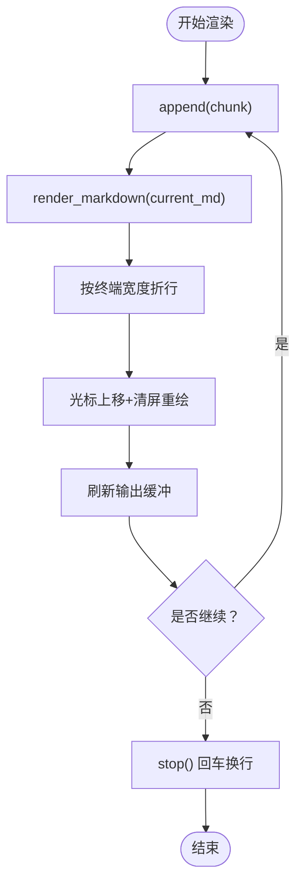
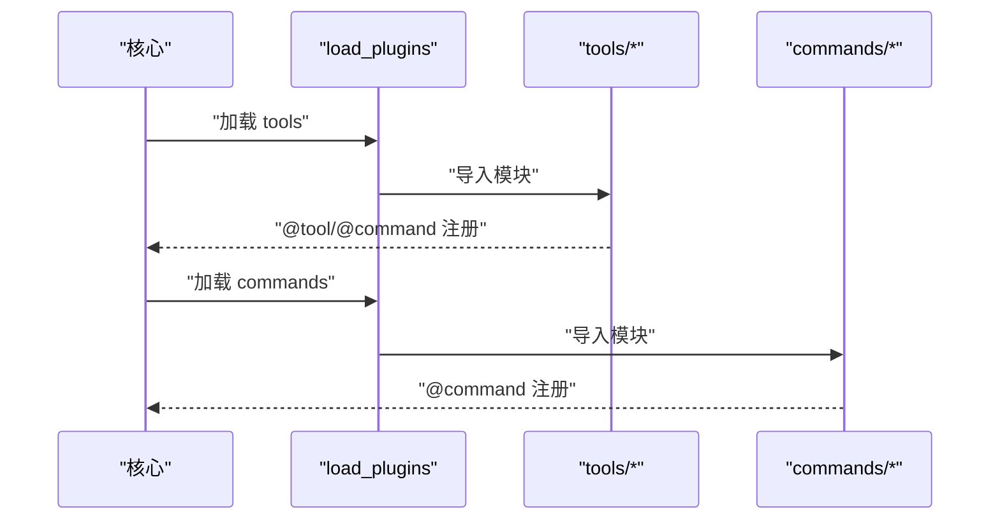
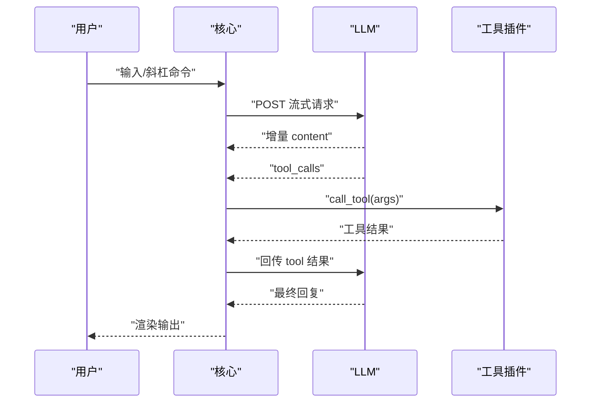
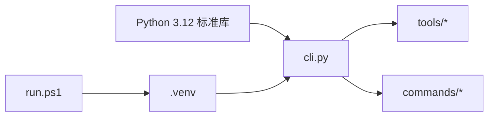

# 开发指南

<cite>
**本文引用的文件**
- [cli.py](file://cli.py)
- [requirements.txt](file://requirements.txt)
- [run.ps1](file://run.ps1)
- [.gitignore](file://.gitignore)
- [commands/builtin.py](file://commands/builtin.py)
- [tools/builtin.py](file://tools/builtin.py)
- [commands/__init__.py](file://commands/__init__.py)
- [tools/__init__.py](file://tools/__init__.py)
</cite>

## 目录
1. [简介](#简介)
2. [项目结构](#项目结构)
3. [核心组件](#核心组件)
4. [架构总览](#架构总览)
5. [详细组件分析](#详细组件分析)
6. [依赖分析](#依赖分析)
7. [性能考虑](#性能考虑)
8. [故障排查指南](#故障排查指南)
9. [结论](#结论)
10. [附录](#附录)

## 简介
本开发指南面向希望参与 CodeAgent-TUI 项目的开发者，覆盖从开发环境搭建、代码贡献流程、插件开发、测试与质量保障、性能与基准测试、持续集成与部署、版本与发布管理，到常见问题与最佳实践的全流程说明。项目采用纯 Python 3.12 标准库实现，无第三方依赖，具备极简的运行与扩展特性。

## 项目结构
- 根目录入口与核心逻辑：cli.py
- 插件目录：
  - tools：AI 工具插件（如文件读写、命令执行）
  - commands：斜杠命令插件（如切换工作区、切换供应商/模型、清屏、退出等）
- 运行与环境：
  - requirements.txt：声明仅使用 Python 标准库
  - run.ps1：PowerShell 启动脚本，自动创建并使用 .venv 虚拟环境
  - .gitignore：忽略缓存、虚拟环境与测试相关文件

图表来源
- [cli.py:1-532](file://cli.py#L1-L532)
- [run.ps1:1-24](file://run.ps1#L1-L24)
- [requirements.txt:1-7](file://requirements.txt#L1-L7)
- [.gitignore:1-15](file://.gitignore#L1-L15)

章节来源
- [cli.py:1-532](file://cli.py#L1-L532)
- [run.ps1:1-24](file://run.ps1#L1-L24)
- [requirements.txt:1-7](file://requirements.txt#L1-L7)
- [.gitignore:1-15](file://.gitignore#L1-L15)

## 核心组件
- 插件注册与调度
  - 工具注册：@tool 装饰器将函数注册为可被 AI 调用的工具，并生成 JSON Schema
  - 命令注册：@command 装饰器将函数注册为斜杠命令，供用户交互
  - 注册表：全局字典维护工具与命令的元信息与回调
- 上下文对象 Ctx
  - 提供工作区解析、系统提示构建、供应商/模型切换、消息历史管理、统一输出接口
- 终端渲染与流式输出
  - RichLog 实现流式增量渲染，支持 Markdown 高亮与 ANSI 折行
  - 终端宽度自适应、颜色与样式封装
- 插件加载机制
  - 自动扫描 tools 与 commands 目录，导入非下划线开头的模块，触发装饰器注册
- LLM 调用循环
  - 构造 OpenAI 兼容格式请求，支持流式响应与工具调用回传

章节来源
- [cli.py:205-251](file://cli.py#L205-L251)
- [cli.py:255-321](file://cli.py#L255-L321)
- [cli.py:173-203](file://cli.py#L173-L203)
- [cli.py:358-371](file://cli.py#L358-L371)
- [cli.py:389-487](file://cli.py#L389-L487)

## 架构总览
整体采用“核心极简 + 插件化”的架构：核心仅负责循环调度、渲染与插件加载，所有业务能力通过插件注入。工具与命令均以装饰器注册，自动纳入注册表，实现零耦合扩展。

图表来源
- [cli.py:255-321](file://cli.py#L255-L321)
- [cli.py:207-251](file://cli.py#L207-L251)
- [cli.py:173-203](file://cli.py#L173-L203)
- [cli.py:358-371](file://cli.py#L358-L371)
- [cli.py:389-487](file://cli.py#L389-L487)
- [tools/builtin.py:1-90](file://tools/builtin.py#L1-L90)
- [commands/builtin.py:1-91](file://commands/builtin.py#L1-L91)

## 详细组件分析

### 组件一：插件注册与调度
- @tool 装饰器
  - 将函数包装为工具，生成 JSON Schema 并注册到 _TOOLS
  - 返回值必须为字符串，作为工具执行结果传回给 AI
- @command 装饰器
  - 将函数包装为斜杠命令，注册到 _COMMANDS
  - 接收字符串参数与 Ctx，用于执行命令逻辑
- 注册表
  - _TOOLS/_COMMANDS 保存函数与元信息，供核心查询与调用
- 工具/命令调用
  - call_tool/call_command 通过名称路由到对应函数
  - command_help 生成帮助文本

图表来源
- [cli.py:211-246](file://cli.py#L211-L246)
- [cli.py:207-251](file://cli.py#L207-L251)

章节来源
- [cli.py:211-246](file://cli.py#L211-L246)
- [cli.py:207-251](file://cli.py#L207-L251)

### 组件二：上下文对象 Ctx
- 职责
  - 管理系统提示（含项目上下文）、消息历史、工作区路径、供应商与模型
  - 提供 set_workspace、set_provider、set_model、resolve、reset、print 等方法
- 项目上下文注入
  - scan_project_context 扫描关键文件与目录树，注入到 system prompt
- 安全与一致性
  - 所有路径解析通过 resolve，确保在当前工作区内
  - 供应商/模型切换时更新 system prompt

图表来源
- [cli.py:255-321](file://cli.py#L255-L321)
- [cli.py:325-353](file://cli.py#L325-L353)

章节来源
- [cli.py:255-321](file://cli.py#L255-L321)
- [cli.py:325-353](file://cli.py#L325-L353)

### 组件三：终端渲染与流式输出
- RichLog
  - 基于 ANSI 控制码实现增量渲染，支持 Markdown 高亮与折行
  - start/append/stop 生命周期管理
- 终端适配
  - Windows VT 模式启用、UTF-8 重配置、颜色与样式常量
- 用户交互
  - prompt_user 支持带样式的输入提示

图表来源
- [cli.py:173-203](file://cli.py#L173-L203)
- [cli.py:126-152](file://cli.py#L126-L152)
- [cli.py:81-91](file://cli.py#L81-L91)

章节来源
- [cli.py:173-203](file://cli.py#L173-L203)
- [cli.py:126-152](file://cli.py#L126-L152)
- [cli.py:81-91](file://cli.py#L81-L91)

### 组件四：插件加载机制
- 自动发现
  - load_plugins 扫描 tools/commands 目录，导入非下划线开头的模块
- 异常处理
  - 导入失败会打印警告，不影响其他插件加载
- 插件生命周期
  - 模块导入即触发装饰器注册，无需额外初始化

图表来源
- [cli.py:358-371](file://cli.py#L358-L371)

章节来源
- [cli.py:358-371](file://cli.py#L358-L371)

### 组件五：LLM 调用循环
- 请求构造
  - 构建 OpenAI 兼容的 JSON 载荷，包含 messages、tools、stream 等
- 流式处理
  - 解析 SSE 数据行，增量拼接 content，收集 tool_calls
- 工具调用回传
  - 将工具调用结果以 tool 角色消息回传，继续对话直至无工具调用
- 错误处理
  - HTTP/URL 错误捕获与提示

图表来源
- [cli.py:389-487](file://cli.py#L389-L487)

章节来源
- [cli.py:389-487](file://cli.py#L389-L487)

### 组件六：内置工具与命令
- 内置工具（tools/builtin.py）
  - read_file：按行号分页读取文件，支持偏移与限制
  - write_file：写入文件，自动创建目录
  - run_command：执行 shell 命令，返回 stdout/stderr
- 内置命令（commands/builtin.py）
  - /cd：切换工作区并刷新项目上下文
  - /pwd：显示当前工作区
  - /provider：切换供应商并重置模型
  - /model：切换模型（支持列出当前供应商模型）
  - /clear：清空对话历史
  - /write：用编辑器打开文件
  - /help：显示可用命令
  - /exit、/quit：退出程序

章节来源
- [tools/builtin.py:1-90](file://tools/builtin.py#L1-L90)
- [commands/builtin.py:1-91](file://commands/builtin.py#L1-L91)

## 依赖分析
- 运行时依赖
  - Python 3.12 标准库：urllib、json、os、sys、shutil、re、ctypes、subprocess
- 插件目录约定
  - tools 与 commands 目录下的模块通过装饰器自动注册，无需显式导入
- 版本与平台
  - Windows：run.ps1 自动创建 .venv 并运行
  - 跨平台：核心逻辑基于标准库，理论上可在其他平台运行

图表来源
- [requirements.txt:1-7](file://requirements.txt#L1-L7)
- [run.ps1:1-24](file://run.ps1#L1-L24)
- [cli.py:1-532](file://cli.py#L1-L532)

章节来源
- [requirements.txt:1-7](file://requirements.txt#L1-L7)
- [run.ps1:1-24](file://run.ps1#L1-L24)
- [cli.py:1-532](file://cli.py#L1-L532)

## 性能考虑
- 终端渲染
  - RichLog 使用 ANSI 控制码进行增量重绘，减少全屏刷新开销
  - 文本折行按可见宽度计算，避免超宽导致的渲染抖动
- 流式输出
  - 逐块增量 append，降低内存峰值
- 插件加载
  - 按需导入，失败模块不影响其他插件
- I/O 与网络
  - 工具层尽量避免大文件一次性读取，read_file 支持分页
  - LLM 请求为流式，减少等待时间
- 建议
  - 在工具中对大文件操作使用分页或分块策略
  - 对外部命令执行设置合理超时与安全白名单
  - 在 CI 环境中使用更严格的超时与资源限制

[本节为通用指导，不直接分析特定文件]

## 故障排查指南
- 启动失败
  - 确认已安装 Python 3.12，使用 run.ps1 自动创建 .venv
  - 检查 .venv 是否存在且可执行
- 插件未生效
  - 确保插件文件位于 tools 或 commands 目录，且文件名不以下划线开头
  - 检查装饰器使用是否正确，函数签名是否符合要求
- LLM 调用错误
  - 检查供应商 base_url 与 api_key 配置
  - 关注 HTTP/URL 错误提示，确认网络连通性
- 终端显示异常
  - Windows 需启用 VT 模式，确保 UTF-8 编码
  - 若颜色或折行异常，尝试更换终端或调整编码

章节来源
- [run.ps1:1-24](file://run.ps1#L1-L24)
- [cli.py:358-371](file://cli.py#L358-L371)
- [cli.py:389-487](file://cli.py#L389-L487)
- [cli.py:60-78](file://cli.py#L60-L78)

## 结论
本项目以“核心极简 + 插件化”为核心设计思想，通过装饰器注册与自动加载机制，实现了高度可扩展的 AI 助手框架。开发者只需关注插件实现与业务逻辑，即可快速扩展工具与命令。建议在贡献代码时遵循本文档的规范与流程，确保一致性和可维护性。

[本节为总结，不直接分析特定文件]

## 附录

### A. 开发环境搭建与调试
- 环境准备
  - 使用 run.ps1 自动创建并激活 .venv，然后运行 cli.py
  - requirements.txt 明确仅使用 Python 标准库
- 调试建议
  - 在插件中使用 ctx.print 输出调试信息
  - 利用 /cd 切换工作区，便于定位文件路径问题
  - 使用 /clear 清空历史，隔离问题范围

章节来源
- [run.ps1:1-24](file://run.ps1#L1-L24)
- [requirements.txt:1-7](file://requirements.txt#L1-L7)
- [commands/builtin.py:26-29](file://commands/builtin.py#L26-L29)

### B. 代码贡献流程
- 分支策略
  - 建议采用功能分支开发，合并前进行本地自测
- 提交规范
  - 提交信息清晰描述变更目的与影响范围
- 代码规范
  - 遵循 Python 标准库风格，保持简洁与可读性
  - 插件函数命名语义明确，参数与返回值文档化
- 代码审查
  - 关注插件注册方式、上下文使用、错误处理与安全性
  - 确保新功能与现有命令/工具无冲突

[本节为通用流程说明，不直接分析特定文件]

### C. 插件开发完整流程
- 需求分析
  - 明确工具/命令职责与输入输出
- 设计
  - 工具：定义 JSON Schema 参数，返回字符串结果
  - 命令：接收字符串参数，使用 Ctx 执行业务逻辑
- 实现
  - 在 tools 或 commands 目录新增模块，使用 @tool/@command 装饰器
  - 通过 ctx.resolve 解析路径，避免越权访问
- 测试
  - 单元测试：针对工具函数的输入输出与边界条件
  - 集成测试：在主循环中验证工具调用与命令执行
- 部署
  - 将插件文件放入对应目录，重启应用后生效

章节来源
- [tools/builtin.py:1-90](file://tools/builtin.py#L1-L90)
- [commands/builtin.py:1-91](file://commands/builtin.py#L1-L91)
- [cli.py:211-246](file://cli.py#L211-L246)
- [cli.py:358-371](file://cli.py#L358-L371)

### D. 单元测试与集成测试指南
- 单元测试
  - 针对工具函数：构造参数、调用函数、断言返回值
  - 针对命令函数：构造 Ctx、调用命令、断言副作用
- 集成测试
  - 在主循环中模拟一次完整对话，验证工具调用链路
  - 使用 /help、/cd、/clear 等命令验证命令分发
- 测试文件命名
  - 参考 .gitignore 中的 _test*.py 与 _verify*.py 命名模式

章节来源
- [.gitignore:9-14](file://.gitignore#L9-L14)
- [cli.py:491-532](file://cli.py#L491-L532)

### E. 性能测试与基准测试
- 方法
  - 对工具函数进行多次调用，统计平均耗时与内存占用
  - 对大文件读取与命令执行设置不同规模的输入，观察响应时间
- 基准
  - 记录不同供应商/模型下的响应延迟与吞吐
- 工具
  - 使用标准库 time、memory_profiler 等进行测量

[本节为通用指导，不直接分析特定文件]

### F. 持续集成与部署
- CI 建议
  - 使用 Python 3.12 环境，自动创建虚拟环境并运行
  - 包含单元测试与集成测试步骤
- 部署
  - 以 run.ps1 为入口，确保 .venv 存在并可执行
  - 通过 /provider 与 /model 切换供应商与模型

章节来源
- [run.ps1:1-24](file://run.ps1#L1-L24)
- [commands/builtin.py:67-90](file://commands/builtin.py#L67-L90)

### G. 版本管理与发布流程
- 版本策略
  - 采用语义化版本，小版本用于向后兼容的功能，大版本用于破坏性变更
- 发布流程
  - 在本地完成测试与文档更新，推送分支并通过审查
  - 合并后打标签并发布

[本节为通用流程说明，不直接分析特定文件]

### H. 常见问题与最佳实践
- 最佳实践
  - 工具与命令均通过装饰器注册，避免硬编码耦合
  - 使用 Ctx.resolve 统一路径解析，避免路径穿越
  - 工具返回值为字符串，便于与 AI 对话
- 常见问题
  - 插件未加载：检查文件名与目录位置
  - 路径越权：使用 ctx.resolve 限定在工作区内
  - 终端乱码：确保 UTF-8 编码与 VT 模式启用

章节来源
- [cli.py:288-290](file://cli.py#L288-L290)
- [cli.py:60-78](file://cli.py#L60-L78)
- [cli.py:358-371](file://cli.py#L358-L371)