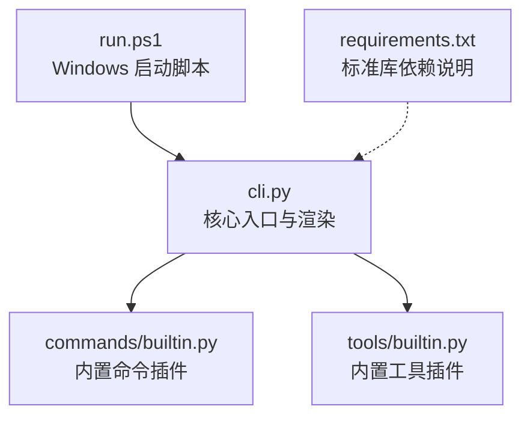
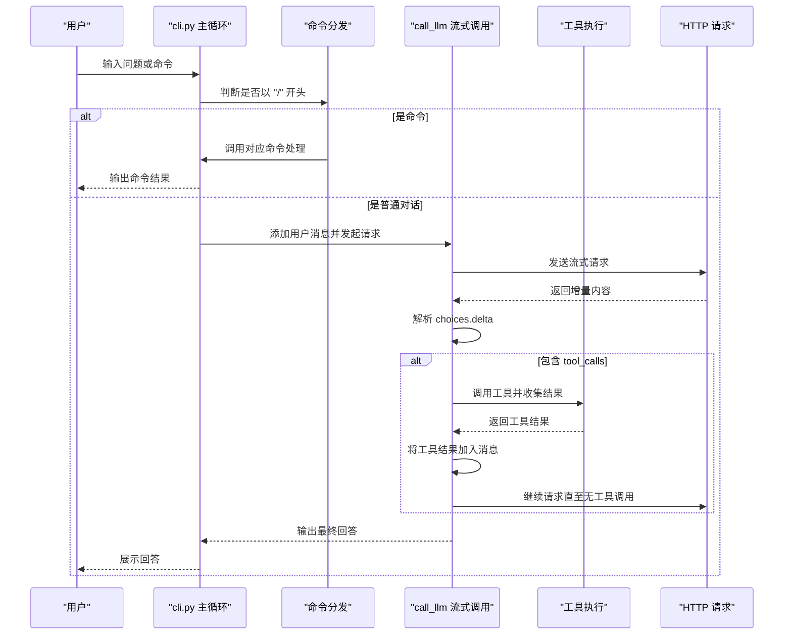

# 快速开始

<cite>
**本文引用的文件**
- [cli.py](file://cli.py)
- [requirements.txt](file://requirements.txt)
- [run.ps1](file://run.ps1)
- [commands/builtin.py](file://commands/builtin.py)
- [tools/builtin.py](file://tools/builtin.py)
</cite>

## 目录
1. [简介](#简介)
2. [项目结构](#项目结构)
3. [核心组件](#核心组件)
4. [架构总览](#架构总览)
5. [详细组件分析](#详细组件分析)
6. [依赖分析](#依赖分析)
7. [性能考虑](#性能考虑)
8. [故障排除指南](#故障排除指南)
9. [结论](#结论)
10. [附录](#附录)

## 简介
本指南面向首次接触 CodeAgent-TUI 的用户，帮助你在 5 分钟内完成环境准备、安装与运行，并掌握基本使用方法。项目采用纯 Python 3.12 标准库实现，无需安装第三方依赖，支持在 Windows 和类 Unix 系统上运行。你将学会：
- 安装与运行（从源码直接运行、使用 PowerShell 启动脚本）
- 配置 API 密钥与供应商
- 基本操作：启动程序、输入问题、查看 AI 回答
- 常用命令：查看帮助、切换供应商与模型、切换工作区、清空历史、打开文件、退出

## 项目结构
项目采用“核心 + 插件”的可扩展架构：
- 核心入口与渲染：cli.py
- 内置命令插件：commands/builtin.py
- 内置工具插件：tools/builtin.py
- 运行脚本：run.ps1（Windows）
- 依赖声明：requirements.txt（说明仅使用标准库）

图表来源
- [cli.py:1-532](file://cli.py#L1-L532)
- [commands/builtin.py:1-91](file://commands/builtin.py#L1-L91)
- [tools/builtin.py:1-90](file://tools/builtin.py#L1-L90)
- [run.ps1:1-24](file://run.ps1#L1-L24)
- [requirements.txt:1-7](file://requirements.txt#L1-L7)

章节来源
- [cli.py:1-532](file://cli.py#L1-L532)
- [run.ps1:1-24](file://run.ps1#L1-L24)
- [requirements.txt:1-7](file://requirements.txt#L1-L7)

## 核心组件
- 供应商与模型配置：在核心配置区集中维护，支持切换供应商与模型，自动更新请求头与默认模型。
- 终端渲染：自实现的 ANSI 控制台渲染，支持 Markdown 风格高亮与流式输出。
- 插件注册：通过装饰器注册工具与命令，核心不感知具体实现，便于扩展。
- Agent 循环：支持流式响应与工具调用循环，自动拼接消息与工具结果。

章节来源
- [cli.py:16-35](file://cli.py#L16-L35)
- [cli.py:41-203](file://cli.py#L41-L203)
- [cli.py:205-251](file://cli.py#L205-L251)
- [cli.py:373-487](file://cli.py#L373-L487)

## 架构总览
下面的时序图展示了从启动到一次问答的核心流程，包括命令分发、流式 LLM 调用与工具执行循环。

图表来源
- [cli.py:489-532](file://cli.py#L489-L532)
- [cli.py:389-487](file://cli.py#L389-L487)
- [commands/builtin.py:43-90](file://commands/builtin.py#L43-L90)
- [tools/builtin.py:17-90](file://tools/builtin.py#L17-L90)

## 详细组件分析

### 环境要求与安装
- Python 版本：3.12+
- 依赖：仅使用 Python 标准库，无需安装第三方包
- 推荐方式：使用提供的 Windows 启动脚本自动创建并激活虚拟环境，再运行主程序

安装步骤（任选其一）：
1) 直接运行（Windows）
- 在项目根目录双击运行启动脚本，脚本会自动检测并创建 Python 3.12 虚拟环境，然后运行主程序。
- 路径参考：[run.ps1:1-24](file://run.ps1#L1-L24)

2) 直接运行（跨平台）
- 确保已安装 Python 3.12，然后在项目根目录执行：python -m cli
- 依赖说明参考：[requirements.txt:1-7](file://requirements.txt#L1-L7)

3) 手动创建虚拟环境（推荐）
- 创建虚拟环境：python -m venv .venv
- 激活虚拟环境后运行：python -m cli

章节来源
- [requirements.txt:1-7](file://requirements.txt#L1-L7)
- [run.ps1:1-24](file://run.ps1#L1-L24)

### 配置 API 密钥与供应商
- 供应商配置位于核心配置区，包含 base_url、api_key、认证方案（bearer/raw）与模型列表
- 认证头生成逻辑：根据供应商的认证方案自动拼接 Authorization 头
- 默认供应商与模型：可在配置区修改

配置要点：
- 修改 api_key：将配置区中的密钥替换为你自己的密钥
- 切换供应商：使用命令 /provider 列出可用供应商并切换
- 切换模型：使用命令 /model 列出当前供应商可用模型并切换

章节来源
- [cli.py:16-35](file://cli.py#L16-L35)
- [cli.py:292-298](file://cli.py#L292-L298)
- [commands/builtin.py:67-90](file://commands/builtin.py#L67-L90)

### 基本使用方法
- 启动程序：运行启动脚本或直接执行主模块
- 输入问题：在提示符后直接输入自然语言问题
- 查看回答：AI 以流式方式输出回答，支持 Markdown 风格高亮
- 退出：输入 /exit 或 /quit

章节来源
- [cli.py:489-532](file://cli.py#L489-L532)

### 常用命令示例
- 查看帮助：/help
- 切换供应商：/provider（无参列出，有参切换）
- 切换模型：/model（无参列出，有参切换）
- 切换工作区：/cd <目录>
- 显示当前工作区：/pwd
- 清除对话历史：/clear
- 用编辑器打开文件：/write <路径>
- 退出：/exit 或 /quit

章节来源
- [commands/builtin.py:16-90](file://commands/builtin.py#L16-L90)

### 内置工具与能力
- 文件读取：read_file（支持分页读取，避免大文件被截断）
- 文件写入：write_file（自动创建目录并写入内容）
- 命令执行：run_command（在工作区目录执行 shell 命令，超时 30 秒）

章节来源
- [tools/builtin.py:17-90](file://tools/builtin.py#L17-L90)

## 依赖分析
- 仅依赖 Python 3.12 标准库模块：urllib、json、os、sys、ctypes、shutil、re、subprocess、pkgutil、importlib
- 运行时通过 urllib 实现 HTTP 请求，支持流式响应
- Windows 终端 VT 模式启用与 UTF-8 输出配置由标准库实现

章节来源
- [requirements.txt:1-7](file://requirements.txt#L1-L7)
- [cli.py:1-11](file://cli.py#L1-L11)
- [cli.py:60-78](file://cli.py#L60-L78)

## 性能考虑
- 流式输出：使用流式响应逐步渲染，降低等待时间
- 工具调用循环：最多 20 轮，避免无限循环
- 终端渲染：基于 ANSI 控制码重绘，减少闪烁
- 文件读取：分页读取，避免一次性加载大文件

章节来源
- [cli.py:391-392](file://cli.py#L391-L392)
- [cli.py:173-203](file://cli.py#L173-L203)
- [tools/builtin.py:51-70](file://tools/builtin.py#L51-L70)

## 故障排除指南
- 启动失败（找不到 Python 3.12）
  - 现象：启动脚本提示无法创建虚拟环境
  - 处理：确认已安装 Python 3.12，使用命令验证版本；手动创建虚拟环境后运行
  - 参考：[run.ps1:8-16](file://run.ps1#L8-L16)

- HTTP 错误（网络连接失败）
  - 现象：出现 HTTP 错误或连接错误提示
  - 处理：检查网络连通性、代理设置；确认供应商 base_url 正确
  - 参考：[cli.py:406-412](file://cli.py#L406-L412)

- 供应商或模型不可用
  - 现象：切换供应商或模型时报错
  - 处理：使用 /provider 与 /model 查看可用项；确认名称正确
  - 参考：[commands/builtin.py:67-90](file://commands/builtin.py#L67-L90)

- 工具执行异常
  - 现象：工具执行报错或无输出
  - 处理：检查工具参数与工作区路径；查看工具返回的错误信息
  - 参考：[cli.py:476-478](file://cli.py#L476-L478)，[tools/builtin.py:84-90](file://tools/builtin.py#L84-L90)

- 终端乱码或颜色异常
  - 现象：输出乱码或颜色不正确
  - 处理：确保终端编码为 UTF-8；Windows 启用 VT 模式
  - 参考：[cli.py:74-78](file://cli.py#L74-L78)，[cli.py:60-71](file://cli.py#L60-L71)

章节来源
- [run.ps1:8-16](file://run.ps1#L8-L16)
- [cli.py:406-412](file://cli.py#L406-L412)
- [commands/builtin.py:67-90](file://commands/builtin.py#L67-L90)
- [cli.py:476-478](file://cli.py#L476-L478)
- [tools/builtin.py:84-90](file://tools/builtin.py#L84-L90)
- [cli.py:74-78](file://cli.py#L74-L78)
- [cli.py:60-71](file://cli.py#L60-L71)

## 结论
通过本指南，你可以在 5 分钟内完成环境准备、安装与运行，并掌握基本的使用方法与常用命令。项目以纯标准库实现，易于部署与扩展，适合快速原型开发与日常辅助编程场景。遇到问题时，可依据故障排除指南快速定位并解决。

## 附录
- 快速命令清单
  - /help：查看帮助
  - /provider：切换供应商
  - /model：切换模型
  - /cd：切换工作区
  - /pwd：显示当前工作区
  - /clear：清除对话历史
  - /write：用编辑器打开文件
  - /exit 或 /quit：退出

章节来源
- [commands/builtin.py:43-90](file://commands/builtin.py#L43-L90)