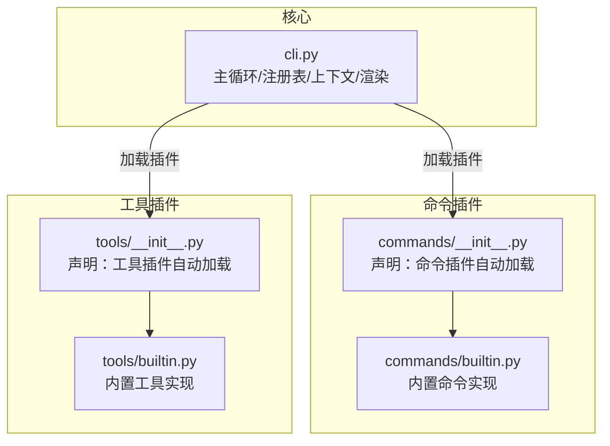
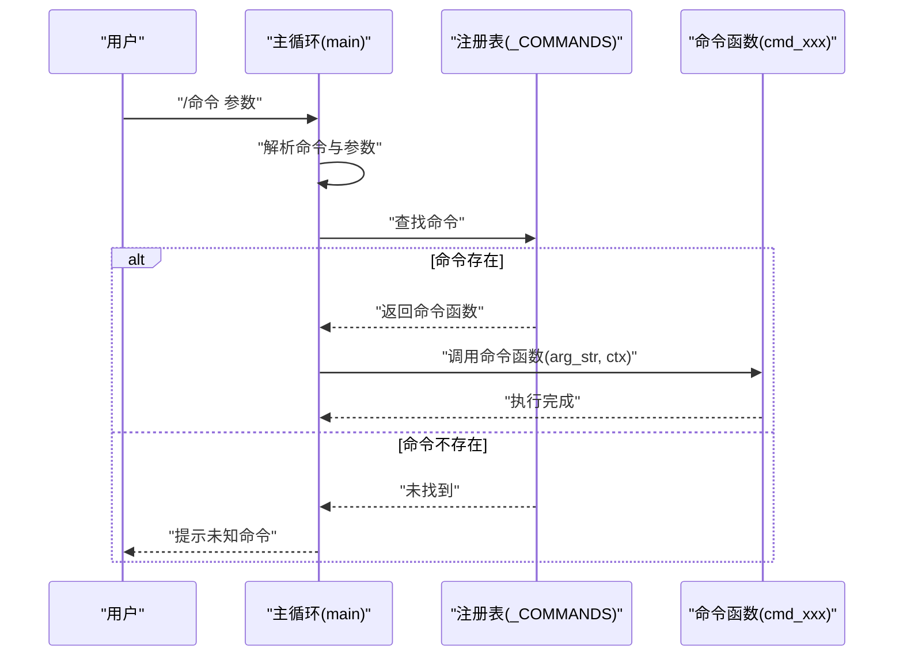
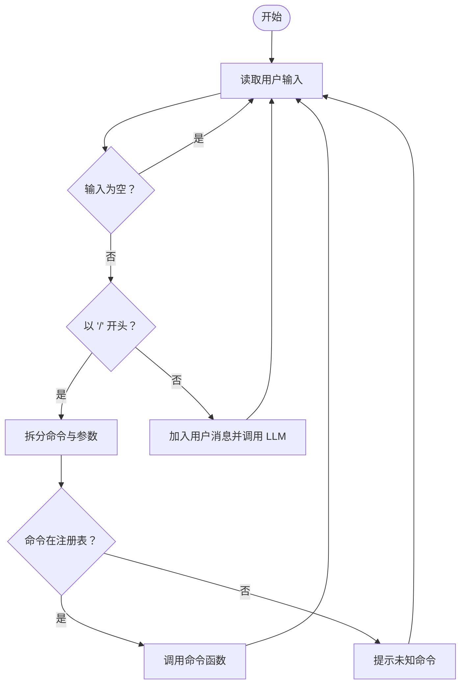
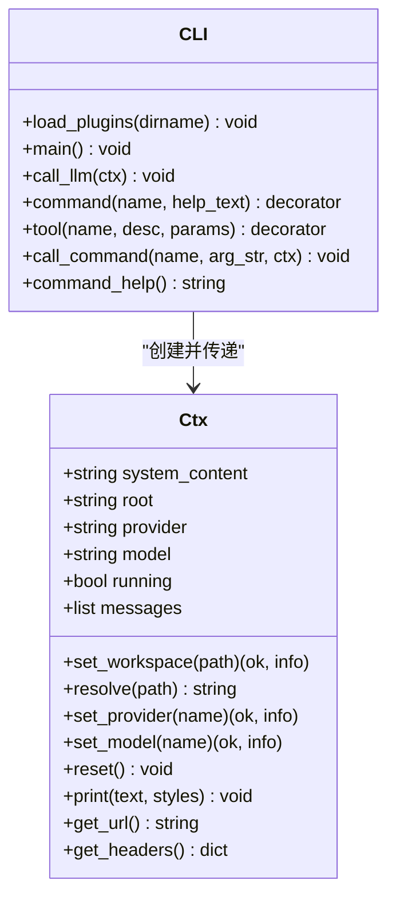

# 命令插件

<cite>
**本文引用的文件**
- [cli.py](file://cli.py)
- [commands/__init__.py](file://commands/__init__.py)
- [commands/builtin.py](file://commands/builtin.py)
- [tools/__init__.py](file://tools/__init__.py)
- [tools/builtin.py](file://tools/builtin.py)
</cite>

## 目录
1. [简介](#简介)
2. [项目结构](#项目结构)
3. [核心组件](#核心组件)
4. [架构总览](#架构总览)
5. [详细组件分析](#详细组件分析)
6. [依赖分析](#依赖分析)
7. [性能考量](#性能考量)
8. [故障排查指南](#故障排查指南)
9. [结论](#结论)
10. [附录](#附录)

## 简介
本文件系统性阐述命令插件体系的设计与实现，重点覆盖：
- @command 装饰器的工作原理与使用方法
- 命令插件的注册机制与参数处理规范
- 内置命令插件的实现细节（系统控制、工作区管理、供应商与模型切换等）
- 命令插件的开发指南（参数解析、上下文访问、用户交互）
- 如何创建自定义命令插件（注册、帮助信息、错误处理）
- 命令插件与主循环的集成方式与命令分发流程

## 项目结构
命令插件系统采用“插件化核心”的设计：核心仅负责加载插件、维护上下文、驱动主循环；命令与工具均以插件形式放置于 tools/ 与 commands/ 目录，通过装饰器自动注册。

图表来源
- [cli.py:358-370](file://cli.py#L358-L370)
- [cli.py:491-527](file://cli.py#L491-L527)
- [commands/__init__.py:1-2](file://commands/__init__.py#L1-L2)
- [tools/__init__.py:1-1](file://tools/__init__.py#L1-L1)

章节来源
- [cli.py:358-370](file://cli.py#L358-L370)
- [cli.py:491-527](file://cli.py#L491-L527)
- [commands/__init__.py:1-2](file://commands/__init__.py#L1-L2)
- [tools/__init__.py:1-1](file://tools/__init__.py#L1-L1)

## 核心组件
- 装饰器与注册表
  - @command(name, help_text): 将命令函数注册到全局注册表，供主循环分发调用
  - @tool(name, description, parameters): 将工具函数注册到全局注册表，供 LLM 调用
  - 注册表：_COMMANDS 与 _TOOLS，分别保存命令/工具的元信息与可调用函数
- 上下文对象 Ctx
  - 提供工作区切换、供应商/模型切换、消息管理、打印渲染等能力
  - 插件通过 ctx 访问/影响核心状态，避免直接操作核心内部
- 插件加载机制
  - load_plugins(dirname): 扫描目录下非下划线开头的模块并导入，触发装饰器注册
- 主循环
  - 解析用户输入，区分命令与普通对话
  - 命令：按 / 前缀匹配注册表并调用
  - 对话：构造消息并调用 LLM 流式推理

章节来源
- [cli.py:207-251](file://cli.py#L207-L251)
- [cli.py:255-320](file://cli.py#L255-L320)
- [cli.py:358-370](file://cli.py#L358-L370)
- [cli.py:491-527](file://cli.py#L491-L527)

## 架构总览
命令插件系统的核心职责是“解耦命令实现与核心调度”。命令插件通过装饰器注册到注册表，主循环在运行期进行命令分发，从而实现“新增命令无需修改核心”。

图表来源
- [cli.py:491-527](file://cli.py#L491-L527)
- [cli.py:245-246](file://cli.py#L245-L246)

## 详细组件分析

### @command 装饰器与命令注册机制
- 装饰器行为
  - @command(name, help_text) 返回装饰器函数，装饰器将目标函数登记到 _COMMANDS[name]，并保存帮助文本
  - 命令函数签名：(arg_str, ctx) -> None
- 注册时机
  - 导入 commands/* 模块时即触发装饰器注册
  - load_plugins("commands") 扫描并导入目录下所有模块
- 命令分发
  - 主循环检测输入是否以 "/" 开头，拆分为命令名与参数字符串
  - 若命令存在于 _COMMANDS，则调用 call_command(name, arg_str, ctx)

章节来源
- [cli.py:229-234](file://cli.py#L229-L234)
- [cli.py:245-246](file://cli.py#L245-L246)
- [cli.py:358-370](file://cli.py#L358-L370)
- [cli.py:491-527](file://cli.py#L491-L527)

### 内置命令插件实现
内置命令位于 commands/builtin.py，覆盖系统控制、工作区管理、供应商与模型切换等常用场景。以下为各命令的职责与参数处理要点：

- 退出类
  - /exit：设置 ctx.running = False，结束主循环
  - /quit：同 /exit
- 对话历史
  - /clear：清空消息历史并刷新系统提示，给出确认反馈
- 文件编辑
  - /write <path>：校验参数，使用系统默认编辑器打开文件
- 帮助
  - /help：输出所有命令的帮助文本
- 工作区
  - /cd <dir>：校验参数，切换工作区并刷新项目上下文，给出成功/失败反馈
  - /pwd：输出当前工作区根路径
- 供应商与模型
  - /provider [name]：无参列出可用供应商及其模型；有参切换供应商并重置模型
  - /model [name]：无参列出当前供应商模型；有参切换模型（允许不在预设列表）

参数处理规范
- 命令函数接收 arg_str（字符串），需自行解析参数
- 常见做法：strip 后 split(maxsplit=1)，区分命令与参数
- 对于必填参数，先校验再执行；错误时通过 ctx.print 输出提示

章节来源
- [commands/builtin.py:15-91](file://commands/builtin.py#L15-L91)
- [cli.py:255-320](file://cli.py#L255-L320)

### 上下文对象 Ctx 的职责与接口
- 状态管理
  - system_content、root、provider、model、messages、running
- 工作区与路径
  - set_workspace(path)：切换工作区并重建系统提示
  - resolve(path)：将相对路径解析到当前工作区
- 供应商与模型
  - set_provider(name)：切换供应商并重置模型
  - set_model(name)：切换模型（允许不在预设列表）
- 渲染与交互
  - print(text, *styles)：统一输出带样式的文本
  - get_url()/get_headers()：构造请求所需 URL 与头部
- 系统提示重建
  - _rebuild_system_prompt()：扫描项目上下文并更新首条 system 消息

章节来源
- [cli.py:255-320](file://cli.py#L255-L320)
- [cli.py:325-353](file://cli.py#L325-L353)

### 插件加载与自动发现
- 目录约定
  - tools/：工具插件目录（@tool 装饰器注册）
  - commands/：命令插件目录（@command 装饰器注册）
- 加载流程
  - load_plugins(dirname)：遍历目录下模块名（排除以下划线开头的模块），导入模块触发装饰器注册
  - 主循环入口：main() 先加载 tools，再加载 commands

章节来源
- [cli.py:358-370](file://cli.py#L358-L370)
- [cli.py:491-494](file://cli.py#L491-L494)

### 主循环与命令分发流程
- 输入处理
  - 读取用户输入，忽略空白
  - 若以 "/" 开头，进入命令分支
- 命令分发
  - 拆分命令与参数
  - 在 _COMMANDS 中查找，存在则调用，否则提示未知命令
- 对话分支
  - 普通输入作为用户消息加入历史，随后调用 LLM 推理

图表来源
- [cli.py:491-527](file://cli.py#L491-L527)

章节来源
- [cli.py:491-527](file://cli.py#L491-L527)

### 类关系图（命令插件与核心）

图表来源
- [cli.py:255-320](file://cli.py#L255-L320)
- [cli.py:358-370](file://cli.py#L358-L370)
- [cli.py:491-527](file://cli.py#L491-L527)

## 依赖分析
- 模块间依赖
  - commands/builtin.py 与 tools/builtin.py 通过 cli.py 的装饰器与注册表进行耦合
  - 主循环依赖注册表与上下文对象
- 外部依赖
  - 标准库：json、urllib、subprocess、os、shutil、re、importlib、pkgutil
- 潜在风险
  - 插件导入失败会被捕获并提示，不影响其他插件加载
  - 命令函数异常由调用方捕获，避免中断主循环

章节来源
- [cli.py:1-11](file://cli.py#L1-L11)
- [cli.py:358-370](file://cli.py#L358-L370)

## 性能考量
- 命令执行开销
  - 命令函数为同步执行，建议避免阻塞操作；如需外部进程，考虑异步或超时控制
- LLM 推理
  - 流式输出与工具调用循环在 call_llm 中实现，避免一次性缓存大量响应
- 插件加载
  - 仅在启动阶段扫描并导入，正常运行期无额外开销

[本节为通用指导，不涉及具体文件分析]

## 故障排查指南
- 命令未生效
  - 检查命令是否位于 commands/ 目录且文件名不以下划线开头
  - 确认装饰器使用正确，命令名唯一
- 参数解析问题
  - 命令函数接收的是 arg_str，需自行解析；确保先 strip 再 split(maxsplit=1)
- 工作区切换失败
  - 使用 /pwd 确认当前工作区；检查路径是否存在
- 供应商/模型切换失败
  - 使用 /provider 与 /model 无参查看可用项；确认名称拼写
- 插件导入失败
  - 查看启动日志中的加载失败提示，修复模块语法或依赖

章节来源
- [cli.py:358-370](file://cli.py#L358-L370)
- [cli.py:491-527](file://cli.py#L491-L527)

## 结论
命令插件系统通过装饰器与注册表实现了清晰的扩展点，使命令与核心解耦。内置命令覆盖了系统控制、工作区管理与供应商/模型切换等高频场景。开发者可通过简单地添加新模块与 @command 装饰器快速扩展命令能力，并利用 Ctx 完成上下文访问与用户交互。

[本节为总结性内容，不涉及具体文件分析]

## 附录

### 开发指南：创建自定义命令插件
- 新建文件
  - 在 commands/ 目录下新建 my_cmd.py
- 编写命令
  - 引入装饰器与上下文：from cli import command, Ctx, Style
  - 使用 @command("/cmd", "帮助文本") 装饰函数
  - 函数签名：(arg_str, ctx) -> None
- 参数解析
  - 从 arg_str 中解析参数；先校验必填参数，再执行业务逻辑
- 用户交互
  - 使用 ctx.print 输出提示；可选样式：Style.GREEN、Style.RED、Style.CYAN 等
- 错误处理
  - 对无效参数、异常情况输出明确提示；避免抛出未捕获异常
- 帮助信息
  - 在 @command 的 help_text 中提供简明用法说明
- 生效验证
  - 重启应用后，/help 应显示新命令；/cmd 参数测试

章节来源
- [commands/__init__.py:1-2](file://commands/__init__.py#L1-L2)
- [cli.py:229-234](file://cli.py#L229-L234)
- [cli.py:318-320](file://cli.py#L318-L320)

### 内置命令一览与用法要点
- /exit、/quit：退出程序
- /clear：清除对话历史并刷新系统提示
- /write <path>：打开文件（优先 VSCode，降级 nano/vi）
- /help：显示所有命令
- /cd <dir>：切换工作区（相对或绝对路径）
- /pwd：显示当前工作区
- /provider [name]：无参列出供应商；有参切换供应商并重置模型
- /model [name]：无参列出当前供应商模型；有参切换模型（允许不在预设列表）

章节来源
- [commands/builtin.py:15-91](file://commands/builtin.py#L15-L91)