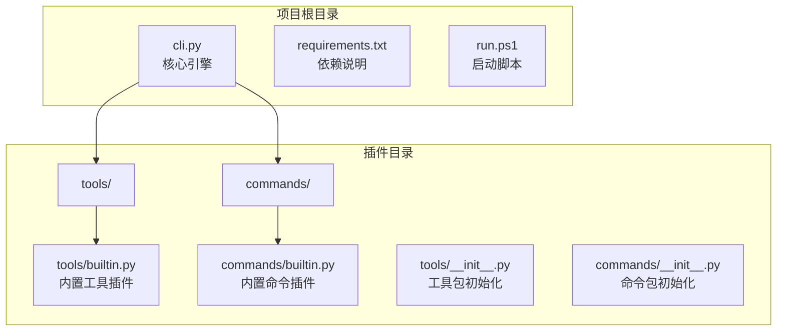
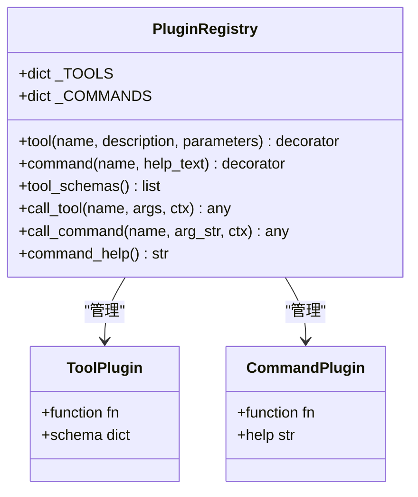
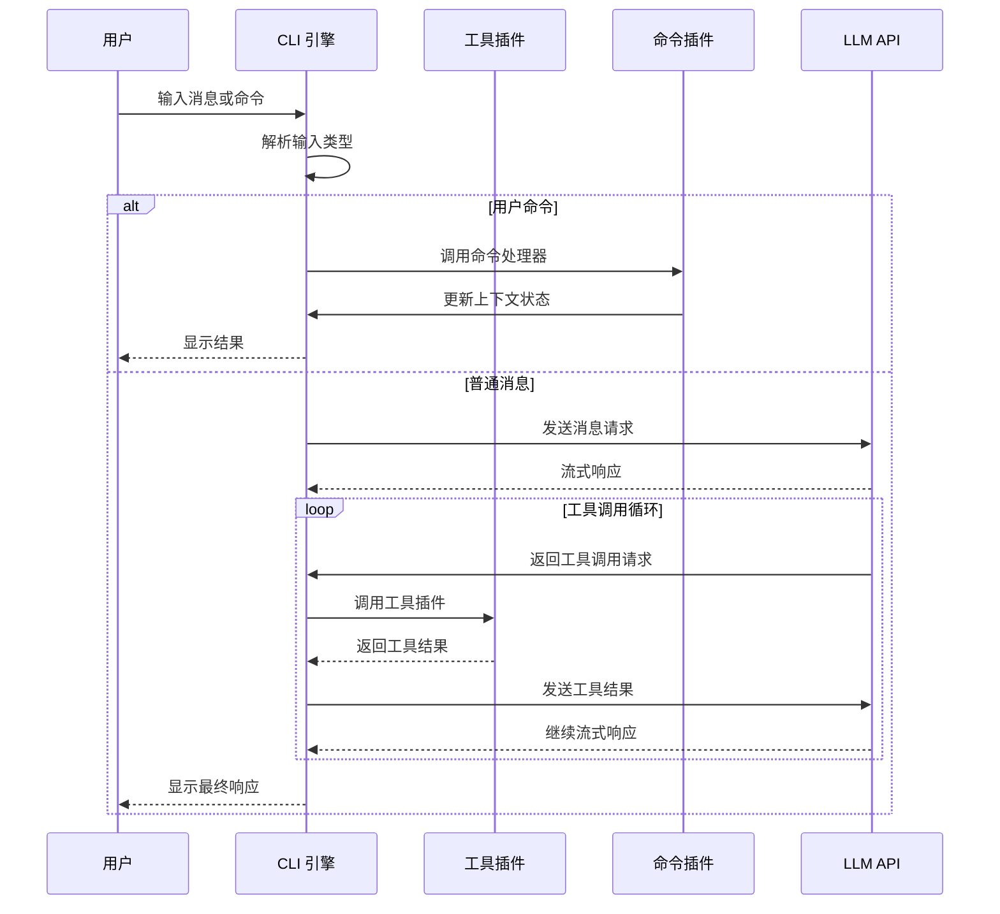
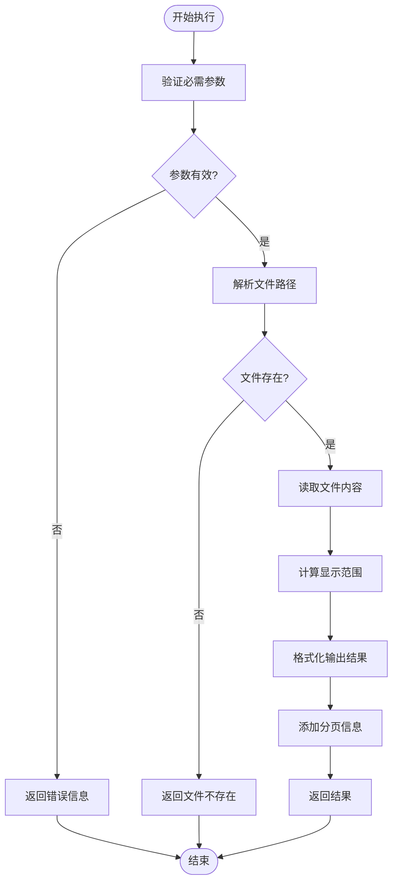
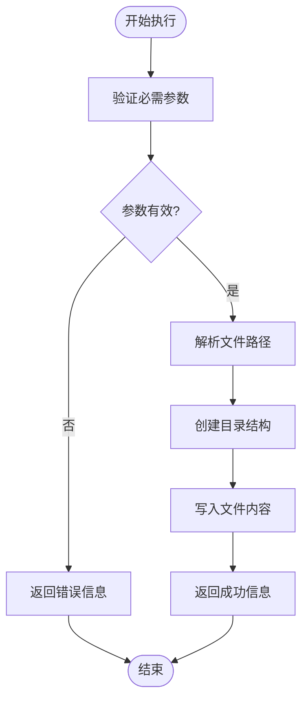
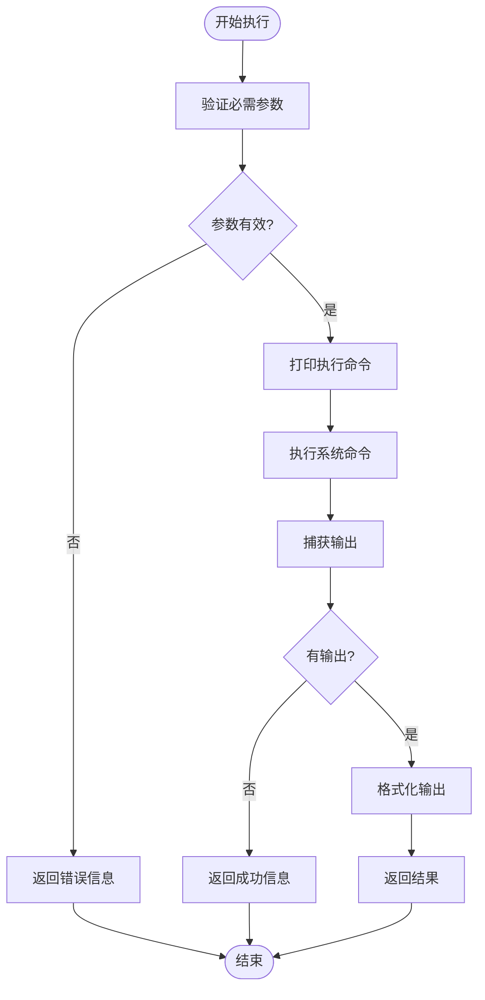
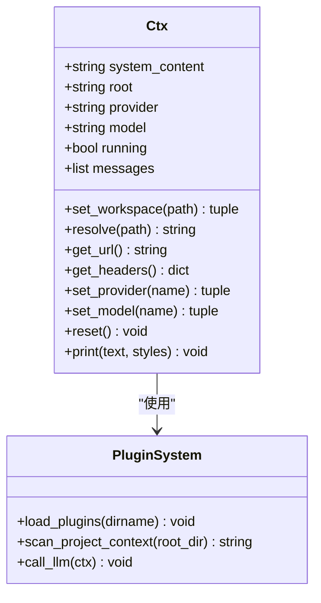
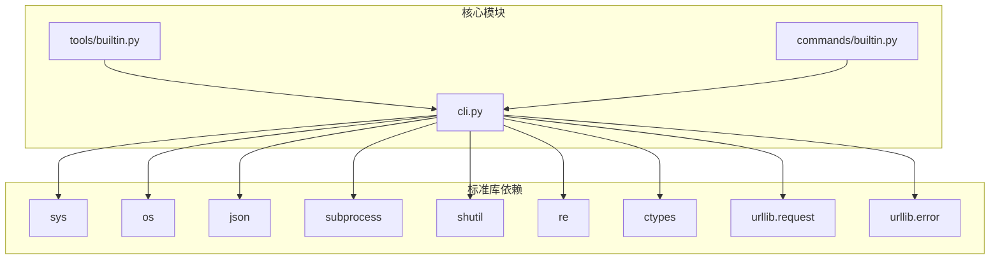

# 工具插件

<cite>
**本文档引用的文件**
- [cli.py](file://cli.py)
- [tools/builtin.py](file://tools/builtin.py)
- [commands/builtin.py](file://commands/builtin.py)
- [requirements.txt](file://requirements.txt)
- [run.ps1](file://run.ps1)
</cite>

## 目录
1. [简介](#简介)
2. [项目结构](#项目结构)
3. [核心组件](#核心组件)
4. [架构概览](#架构概览)
5. [详细组件分析](#详细组件分析)
6. [依赖关系分析](#依赖关系分析)
7. [性能考虑](#性能考虑)
8. [故障排除指南](#故障排除指南)
9. [结论](#结论)

## 简介

CodeAgent-TUI 是一个基于插件系统的智能代理工具，采用纯 Python 3.12 标准库实现，无需任何第三方依赖。该系统的核心特性是完全的插件化架构，其中工具插件和命令插件都通过装饰器机制进行注册和管理。

系统的主要功能包括：
- **工具插件系统**：提供文件读写、命令执行等实用工具
- **命令插件系统**：提供用户交互命令，如退出、清屏、切换工作区等
- **LLM 集成**：支持 OpenAI 兼容的流式 API 调用
- **工作区感知**：自动扫描项目上下文并注入系统提示

## 项目结构

该项目采用清晰的模块化组织结构，主要包含以下核心目录：

**图表来源**
- [cli.py:1-532](file://cli.py#L1-L532)
- [tools/builtin.py:1-90](file://tools/builtin.py#L1-L90)
- [commands/builtin.py:1-91](file://commands/builtin.py#L1-L91)

**章节来源**
- [cli.py:1-532](file://cli.py#L1-L532)
- [requirements.txt:1-7](file://requirements.txt#L1-L7)

## 核心组件

### 装饰器系统

系统提供了两个核心装饰器来注册不同类型的插件：

#### @tool 装饰器
用于注册 AI 工具插件，装饰器接受三个参数：
- `name`: 工具名称（唯一标识符）
- `description`: 工具描述（用于 LLM 理解工具用途）
- `parameters`: JSON Schema 参数定义

#### @command 装饰器
用于注册用户命令插件，装饰器接受两个参数：
- `name`: 命令名称（以 "/" 开头）
- `help_text`: 帮助文本

### 注册表机制

系统维护两个全局注册表来管理插件：

**图表来源**
- [cli.py:207-251](file://cli.py#L207-L251)

**章节来源**
- [cli.py:207-251](file://cli.py#L207-L251)

## 架构概览

系统采用事件驱动的插件化架构，核心流程如下：

**图表来源**
- [cli.py:373-487](file://cli.py#L373-L487)

**章节来源**
- [cli.py:373-487](file://cli.py#L373-L487)

## 详细组件分析

### 内置工具插件

系统提供了三个核心工具插件，演示了完整的工具开发模式：

#### 文件读取工具 (read_file)

该工具展示了复杂参数处理和分页读取的实现：

**图表来源**
- [tools/builtin.py:38-71](file://tools/builtin.py#L38-L71)

#### 文件写入工具 (write_file)

该工具演示了安全的文件操作和错误处理：

**图表来源**
- [tools/builtin.py:17-36](file://tools/builtin.py#L17-L36)

#### 命令执行工具 (run_command)

该工具展示了安全的子进程管理和超时控制：

**图表来源**
- [tools/builtin.py:73-90](file://tools/builtin.py#L73-L90)

**章节来源**
- [tools/builtin.py:1-90](file://tools/builtin.py#L1-L90)

### 内置命令插件

系统提供了丰富的用户交互命令：

#### 系统命令
- `/exit` 和 `/quit`：优雅退出程序
- `/clear`：清除对话历史记录
- `/help`：显示所有可用命令

#### 工作区管理命令
- `/cd`：切换工作区目录
- `/pwd`：显示当前工作区路径

#### LLM 配置命令
- `/provider`：切换 LLM 供应商
- `/model`：切换 LLM 模型

**章节来源**
- [commands/builtin.py:1-91](file://commands/builtin.py#L1-L91)

### 上下文管理系统

Ctx 类是插件系统的核心，提供了统一的状态管理和工具接口：

**图表来源**
- [cli.py:255-321](file://cli.py#L255-L321)

**章节来源**
- [cli.py:255-321](file://cli.py#L255-L321)

## 依赖关系分析

系统采用最小化依赖策略，仅使用 Python 3.12 标准库：

**图表来源**
- [requirements.txt:1-7](file://requirements.txt#L1-L7)
- [cli.py:1-15](file://cli.py#L1-L15)

**章节来源**
- [requirements.txt:1-7](file://requirements.txt#L1-L7)

## 性能考虑

### 流式处理优化
- LLM 响应采用流式处理，实时渲染内容
- 工具结果支持预览限制，避免大文本影响性能
- 最大工具调用轮数限制，防止无限循环

### 内存管理
- 分页读取大文件，避免内存溢出
- 及时清理临时状态和缓冲区
- 优雅处理异常情况，释放资源

### I/O 优化
- 批量导入插件，减少磁盘访问
- 缓冲区管理，提高输出效率
- 超时控制，避免阻塞操作

## 故障排除指南

### 常见问题及解决方案

#### 插件加载失败
- **症状**：插件无法正常加载
- **原因**：模块导入异常或语法错误
- **解决**：检查插件文件语法，确保正确导入依赖

#### 工具执行异常
- **症状**：工具调用抛出异常
- **原因**：参数验证失败或权限不足
- **解决**：检查参数格式，确保有足够的文件系统权限

#### LLM 连接问题
- **症状**：无法连接到 LLM 服务
- **原因**：网络问题或认证失败
- **解决**：检查网络连接，验证 API 密钥配置

**章节来源**
- [cli.py:358-371](file://cli.py#L358-L371)
- [cli.py:406-412](file://cli.py#L406-L412)

## 结论

CodeAgent-TUI 展示了一个设计精良的插件化系统架构。通过装饰器机制和注册表模式，系统实现了高度的模块化和可扩展性。核心特点包括：

1. **纯标准库实现**：无需第三方依赖，部署简单
2. **完全插件化**：核心逻辑保持简洁，所有功能通过插件扩展
3. **强类型参数验证**：通过 JSON Schema 确保工具调用的安全性
4. **流式处理**：提供流畅的用户体验
5. **工作区感知**：智能项目上下文注入

该系统为开发者提供了一个优秀的参考模型，展示了如何构建可扩展、可维护的工具插件系统。