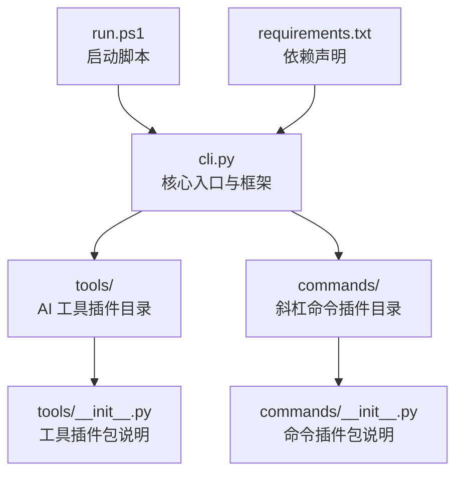
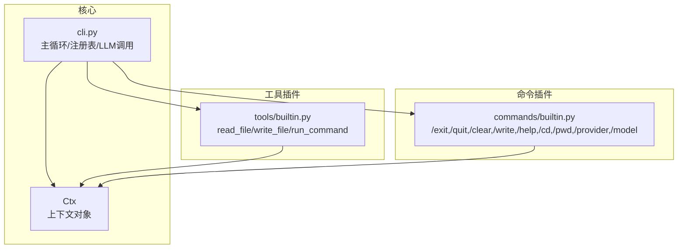
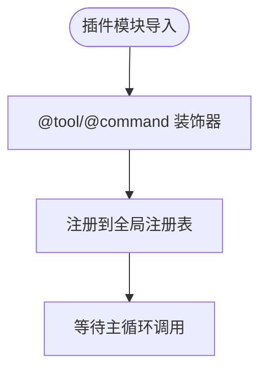
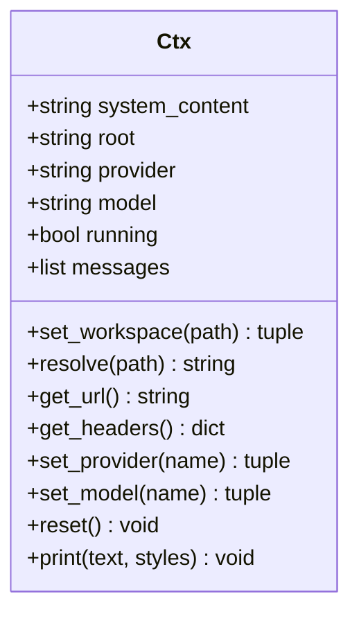
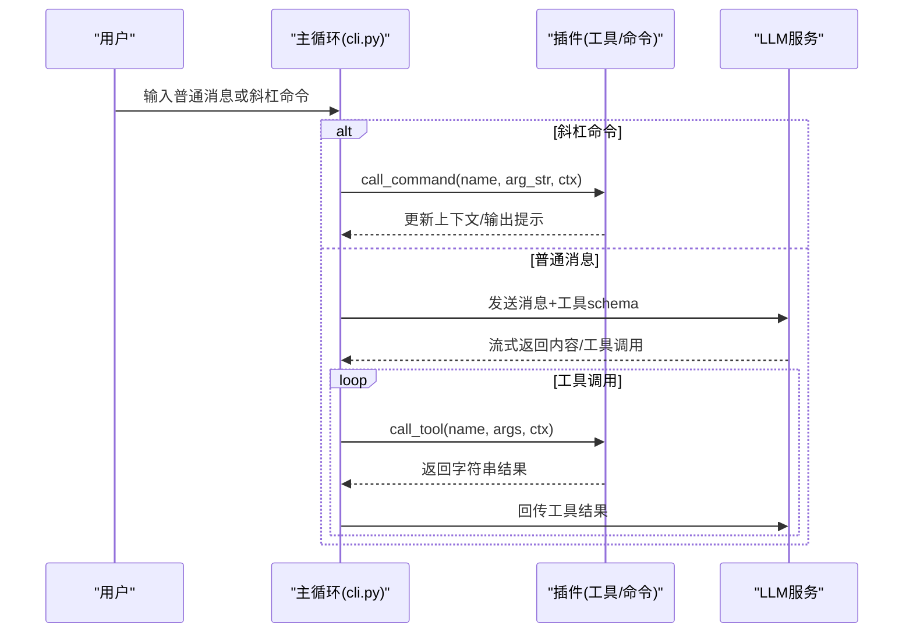
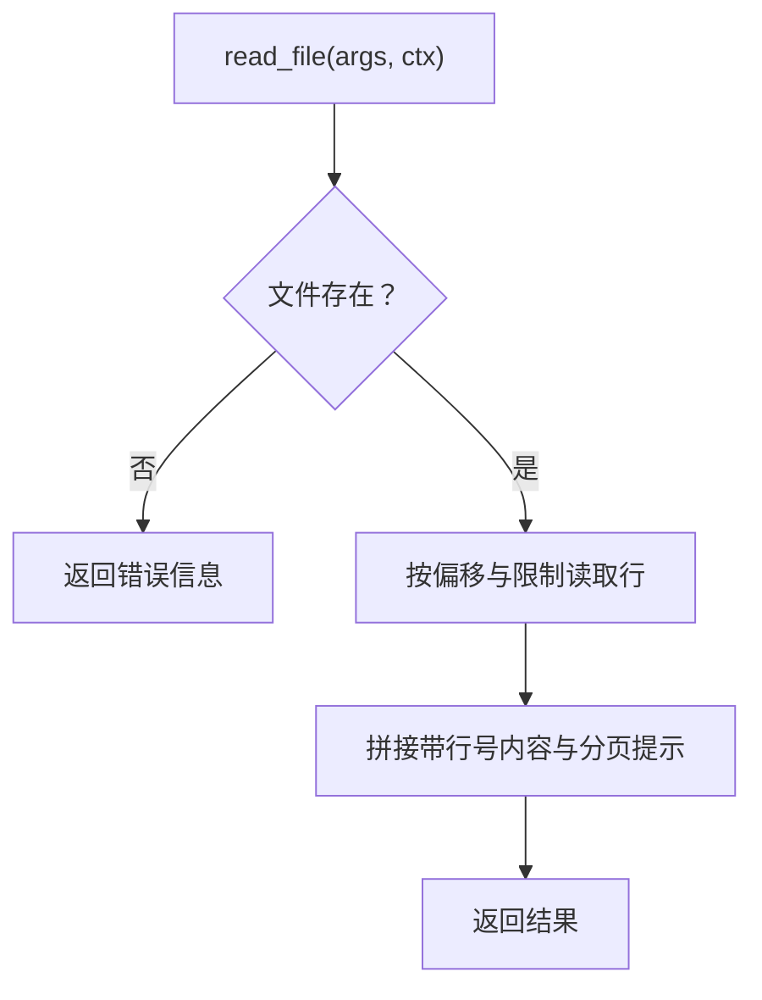
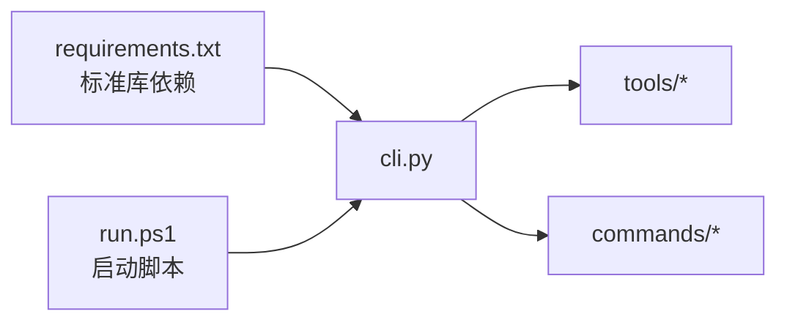

# 插件开发指南

<cite>
**本文引用的文件**
- [cli.py](file://cli.py)
- [commands/builtin.py](file://commands/builtin.py)
- [tools/builtin.py](file://tools/builtin.py)
- [requirements.txt](file://requirements.txt)
- [run.ps1](file://run.ps1)
- [commands/__init__.py](file://commands/__init__.py)
- [tools/__init__.py](file://tools/__init__.py)
</cite>

## 目录
1. [简介](#简介)
2. [项目结构](#项目结构)
3. [核心组件](#核心组件)
4. [架构总览](#架构总览)
5. [详细组件分析](#详细组件分析)
6. [依赖分析](#依赖分析)
7. [性能考虑](#性能考虑)
8. [故障排查指南](#故障排查指南)
9. [结论](#结论)
10. [附录](#附录)

## 简介
本指南面向希望为 CodeAgent-TUI 开发自定义插件的开发者，提供从零开始的完整流程：开发环境搭建、项目结构组织、代码规范、装饰器高级用法与最佳实践、测试与调试、性能优化以及发布与分享。项目采用纯 Python 标准库实现，核心通过“插件化”机制加载 tools 与 commands 两类插件，无需第三方依赖，便于快速扩展与维护。

## 项目结构
项目采用“插件化核心 + 包装式加载”的设计：
- 核心入口与框架：cli.py
- 工具插件目录：tools/
- 命令插件目录：commands/
- 启动脚本：run.ps1
- 依赖声明：requirements.txt

图表来源
- [cli.py:358-371](file://cli.py#L358-L371)
- [run.ps1:1-24](file://run.ps1#L1-L24)
- [requirements.txt:1-7](file://requirements.txt#L1-L7)
- [tools/__init__.py:1-1](file://tools/__init__.py#L1-L1)
- [commands/__init__.py:1-1](file://commands/__init__.py#L1-L1)

章节来源
- [cli.py:358-371](file://cli.py#L358-L371)
- [run.ps1:1-24](file://run.ps1#L1-L24)
- [requirements.txt:1-7](file://requirements.txt#L1-L7)

## 核心组件
- 装饰器注册体系
  - @tool：注册 AI 工具，接收 (args, ctx) -> str，返回字符串结果供 AI 使用
  - @command：注册用户斜杠命令，接收 (arg_str, ctx) -> None，用于扩展交互能力
- 上下文对象 Ctx：贯穿工具与命令，提供工作区解析、供应商/模型切换、消息管理、统一输出等能力
- 插件加载：自动扫描 tools 与 commands 目录，导入非下划线开头的模块，触发其装饰器注册
- LLM 调用循环：流式拉取响应，聚合工具调用，支持多轮工具执行

章节来源
- [cli.py:211-234](file://cli.py#L211-L234)
- [cli.py:255-321](file://cli.py#L255-L321)
- [cli.py:358-371](file://cli.py#L358-L371)
- [cli.py:389-487](file://cli.py#L389-L487)

## 架构总览
插件化核心通过装饰器将工具与命令注册到全局注册表，主循环按需调用。工具插件负责与文件系统、外部命令等交互；命令插件负责扩展 CLI 交互体验。

图表来源
- [cli.py:211-234](file://cli.py#L211-L234)
- [cli.py:255-321](file://cli.py#L255-L321)
- [cli.py:389-487](file://cli.py#L389-L487)
- [tools/builtin.py:17-89](file://tools/builtin.py#L17-L89)
- [commands/builtin.py:16-90](file://commands/builtin.py#L16-L90)

## 详细组件分析

### 装饰器与注册机制
- @tool(name, description, parameters)
  - 作用：将函数注册为 AI 工具，生成 OpenAI 兼容的 function schema
  - 参数校验：parameters 必须符合 JSON Schema 规范，用于约束工具参数
  - 返回值：必须为字符串，作为工具执行结果返回给 AI
  - 最佳实践：参数 schema 明确必填字段与默认值；工具内部进行输入校验与异常捕获
- @command(name, help_text="")
  - 作用：将函数注册为用户可输入的斜杠命令
  - 参数：arg_str 为命令行参数字符串；ctx 提供上下文能力
  - 最佳实践：对空参数进行显式检查；使用 ctx.print 输出统一风格的提示信息

图表来源
- [cli.py:211-234](file://cli.py#L211-L234)
- [cli.py:358-371](file://cli.py#L358-L371)

章节来源
- [cli.py:211-234](file://cli.py#L211-L234)
- [cli.py:358-371](file://cli.py#L358-L371)

### 上下文对象 Ctx
- 职责：封装工作区、供应商/模型、消息历史、统一输出等
- 关键方法：
  - set_workspace(path)：切换工作区并刷新系统提示
  - resolve(path)：将相对路径解析到当前工作区
  - set_provider(name)/set_model(name)：切换供应商与模型
  - get_url()/get_headers()：构造 LLM 请求所需的 URL 与头部
  - reset()/print(...)：重置会话与统一输出
- 设计要点：通过 rebuild system prompt 将项目上下文注入 AI，提升工具调用准确性

图表来源
- [cli.py:255-321](file://cli.py#L255-L321)

章节来源
- [cli.py:255-321](file://cli.py#L255-L321)

### 插件加载与主循环
- 插件加载：load_plugins(dirname) 扫描目录，导入非下划线开头的模块，触发装饰器注册
- 主循环：解析用户输入，分发命令或进入 LLM 流式对话；当 AI 请求工具调用时，按 schema 解析参数并执行工具，再回传结果继续对话

图表来源
- [cli.py:491-527](file://cli.py#L491-L527)
- [cli.py:389-487](file://cli.py#L389-L487)

章节来源
- [cli.py:491-527](file://cli.py#L491-L527)
- [cli.py:389-487](file://cli.py#L389-L487)

### 内置工具插件（tools/builtin.py）
- read_file：读取文件内容，支持分页显示，避免大文件被截断
- write_file：将内容写入指定路径，自动创建目录
- run_command：执行 shell 命令并返回输出，设置超时与工作区目录

图表来源
- [tools/builtin.py:38-71](file://tools/builtin.py#L38-L71)

章节来源
- [tools/builtin.py:17-89](file://tools/builtin.py#L17-L89)

### 内置命令插件（commands/builtin.py）
- /exit 与 /quit：退出程序
- /clear：清除对话历史
- /write：用编辑器打开文件
- /help：显示可用命令
- /cd：切换工作区
- /pwd：显示当前工作区
- /provider：切换供应商
- /model：切换模型

章节来源
- [commands/builtin.py:16-90](file://commands/builtin.py#L16-L90)

## 依赖分析
- 运行时依赖：Python 3.12 标准库（urllib、json、subprocess、shutil、re、os、sys、ctypes）
- 插件加载依赖：pkgutil、importlib
- 启动脚本依赖：PowerShell 与 Python 3.12

图表来源
- [requirements.txt:1-7](file://requirements.txt#L1-L7)
- [run.ps1:1-24](file://run.ps1#L1-L24)
- [cli.py:358-371](file://cli.py#L358-L371)

章节来源
- [requirements.txt:1-7](file://requirements.txt#L1-L7)
- [run.ps1:1-24](file://run.ps1#L1-L24)

## 性能考虑
- 工具结果展示：对长结果进行截断预览，避免终端卡顿，同时确保完整结果传给 AI
- LLM 调用：每轮重新序列化 payload，避免旧数据重复请求；限制最大轮次防止无限循环
- 文件读取：分页读取，避免一次性读取大文件造成内存压力
- 命令执行：设置超时，避免长时间阻塞；在工作区目录执行，减少路径问题
- 插件加载：仅导入非下划线开头模块，避免加载测试或临时文件

章节来源
- [cli.py:375-386](file://cli.py#L375-L386)
- [cli.py:389-487](file://cli.py#L389-L487)
- [tools/builtin.py:50-71](file://tools/builtin.py#L50-L71)
- [tools/builtin.py:84-90](file://tools/builtin.py#L84-L90)
- [cli.py:358-371](file://cli.py#L358-L371)

## 故障排查指南
- 插件加载失败：检查模块名是否以下划线开头；查看控制台警告信息
- HTTP/连接错误：检查网络连通性与供应商配置；核对 API Key 与认证方案
- 工具执行异常：在工具内部捕获异常并返回可读错误信息；避免抛出未处理异常
- 命令无效：确认命令名称是否正确；使用 /help 查看可用命令
- 工作区路径：使用 /cd 切换；使用 /pwd 确认当前路径；确保路径存在且可访问

章节来源
- [cli.py:368-371](file://cli.py#L368-L371)
- [cli.py:404-412](file://cli.py#L404-L412)
- [cli.py:518-522](file://cli.py#L518-L522)
- [commands/builtin.py:48-60](file://commands/builtin.py#L48-L60)

## 结论
本项目以极简标准库实现插件化核心，通过装饰器与注册表机制将工具与命令解耦，既保证了扩展性又降低了学习成本。开发者只需遵循参数 schema、上下文约定与错误处理规范，即可快速构建高质量插件。建议在开发过程中重视参数校验、异常处理与性能优化，确保插件在真实场景中的稳定性与可用性。

## 附录

### 开发环境搭建
- Python 版本：3.12
- 运行方式：
  - 使用 PowerShell 启动脚本：powershell -ExecutionPolicy Bypass -File run.ps1
  - 或手动创建虚拟环境并运行：py -3.12 -m venv .venv；.venv\Scripts\python.exe -m cli

章节来源
- [requirements.txt:1-7](file://requirements.txt#L1-L7)
- [run.ps1:1-24](file://run.ps1#L1-L24)

### 项目结构组织
- tools/：放置 AI 工具插件，每个 .py 用 @tool 注册即自动加载
- commands/：放置斜杠命令插件，每个 .py 用 @command 注册即自动加载
- cli.py：核心入口，负责注册表、上下文、插件加载与主循环

章节来源
- [tools/__init__.py:1-1](file://tools/__init__.py#L1-L1)
- [commands/__init__.py:1-1](file://commands/__init__.py#L1-L1)
- [cli.py:358-371](file://cli.py#L358-L371)

### 代码规范与最佳实践
- 装饰器使用
  - @tool：明确参数 schema，严格区分必填与可选字段；返回字符串结果
  - @command：对空参数进行显式检查；使用 ctx.print 输出一致风格
- 参数验证
  - 在工具内部对参数进行类型与范围校验；对异常进行捕获并返回可读错误
- 异步与并发
  - 工具执行为同步阻塞；如需异步，建议在工具内部自行处理并发与超时
- 错误处理
  - 工具与命令均需捕获异常并返回错误信息；避免向用户暴露内部异常细节
- 性能优化
  - 大文件读取分页；命令执行设置超时；工具结果截断预览；限制最大轮次

章节来源
- [cli.py:211-234](file://cli.py#L211-L234)
- [cli.py:375-386](file://cli.py#L375-L386)
- [cli.py:389-487](file://cli.py#L389-L487)
- [tools/builtin.py:50-71](file://tools/builtin.py#L50-L71)
- [tools/builtin.py:84-90](file://tools/builtin.py#L84-L90)

### 插件开发示例教程

#### 示例一：简单工具插件（文件读取）
- 步骤
  - 在 tools/ 下新建 my_read.py
  - 使用 @tool 装饰器注册函数，定义参数 schema（如 path）
  - 在函数内部解析路径、读取内容并返回字符串
  - 重启后即可在 AI 对话中调用该工具

章节来源
- [tools/builtin.py:38-71](file://tools/builtin.py#L38-L71)

#### 示例二：复杂命令插件（工作区切换）
- 步骤
  - 在 commands/ 下新建 my_cd.py
  - 使用 @command 装饰器注册 /mycd 命令
  - 解析参数并调用 ctx.set_workspace；根据返回元组输出成功/失败信息
  - 重启后即可使用 /mycd 切换工作区

章节来源
- [commands/builtin.py:48-60](file://commands/builtin.py#L48-L60)

#### 示例三：高级工具插件（命令执行与结果解析）
- 步骤
  - 在 tools/ 下新建 my_exec.py
  - 使用 @tool 装饰器注册函数，定义 command 参数
  - 在函数内部执行命令、捕获 stdout/stderr、拼接结果并返回
  - 设置合理超时，避免长时间阻塞

章节来源
- [tools/builtin.py:73-90](file://tools/builtin.py#L73-L90)

### 测试与调试
- 单元测试
  - 为工具函数编写参数校验与边界条件测试
  - 为命令函数编写参数为空、路径不存在等异常分支测试
- 调试技巧
  - 使用 ctx.print 输出中间状态与关键变量
  - 在工具内部捕获异常并记录堆栈信息
  - 使用 /help 与 /pwd 确认命令与工作区状态
- 性能测试
  - 大文件读取分页测试
  - 命令执行超时测试
  - 多轮工具调用上限测试

章节来源
- [cli.py:375-386](file://cli.py#L375-L386)
- [cli.py:389-487](file://cli.py#L389-L487)
- [commands/builtin.py:48-60](file://commands/builtin.py#L48-L60)

### 发布与分享
- 发布前检查
  - 确保插件命名不以下划线开头，避免被加载器忽略
  - 确保参数 schema 完整且清晰，必要时添加注释说明
  - 确保错误处理完善，返回信息对用户友好
- 分享建议
  - 提供最小可复现示例与使用说明
  - 在仓库 README 中说明插件功能、参数与注意事项
  - 如需依赖外部工具，提供安装与配置指引

章节来源
- [cli.py:358-371](file://cli.py#L358-L371)
- [tools/builtin.py:17-10](file://tools/builtin.py#L17-L10)
- [commands/builtin.py:1-10](file://commands/builtin.py#L1-L10)