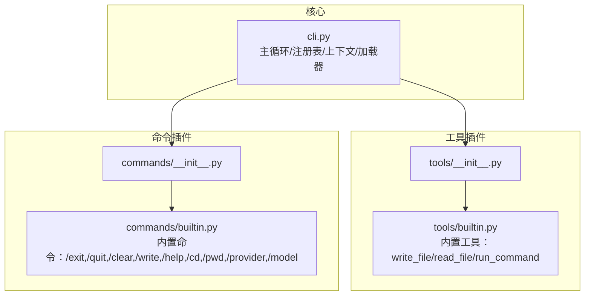
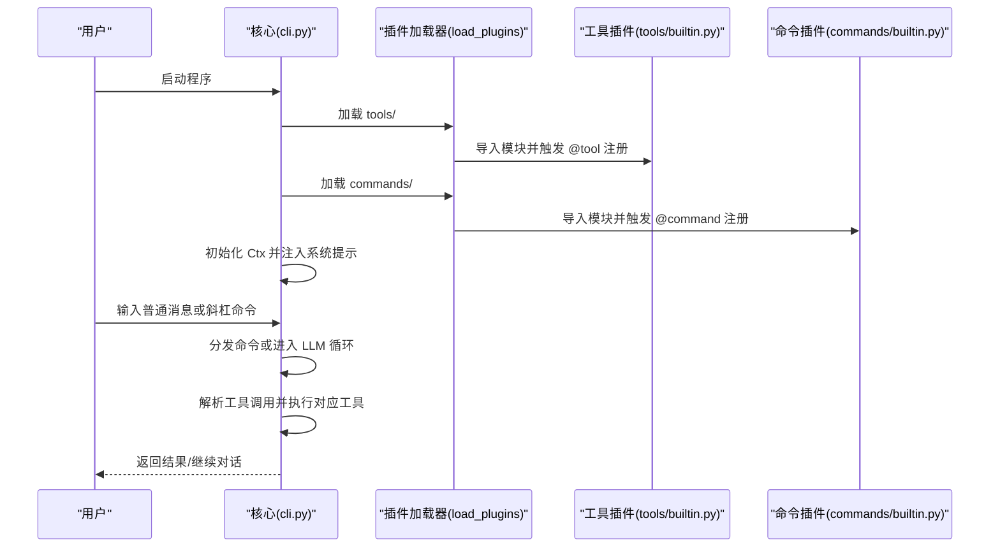
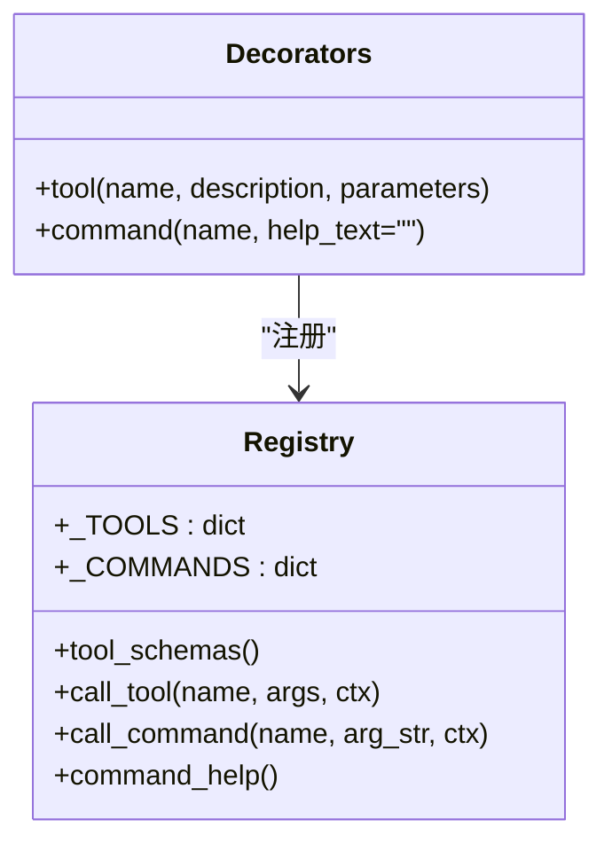
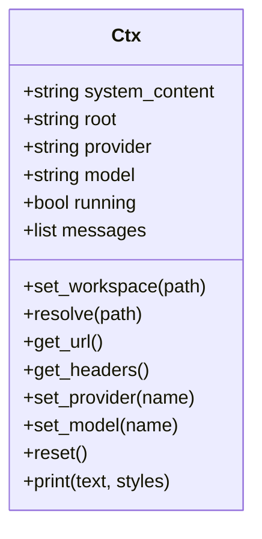
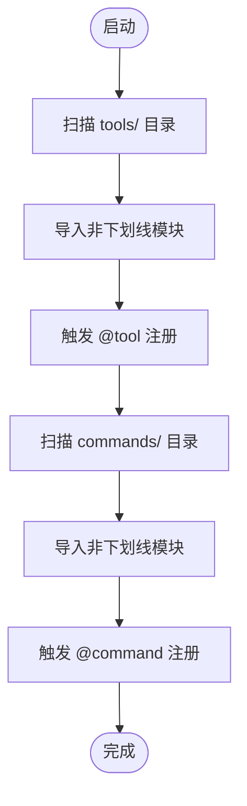
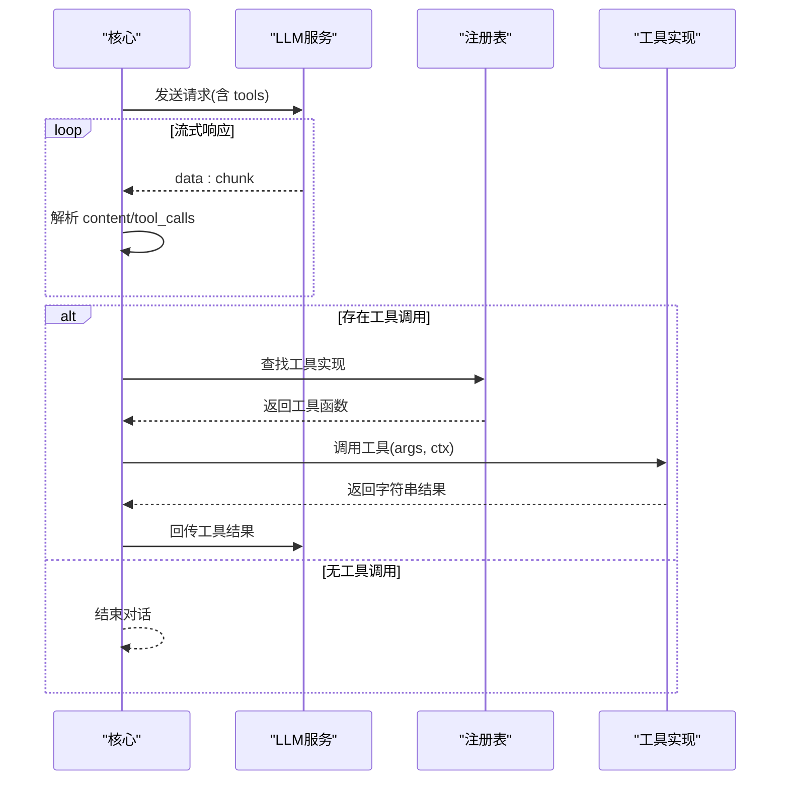
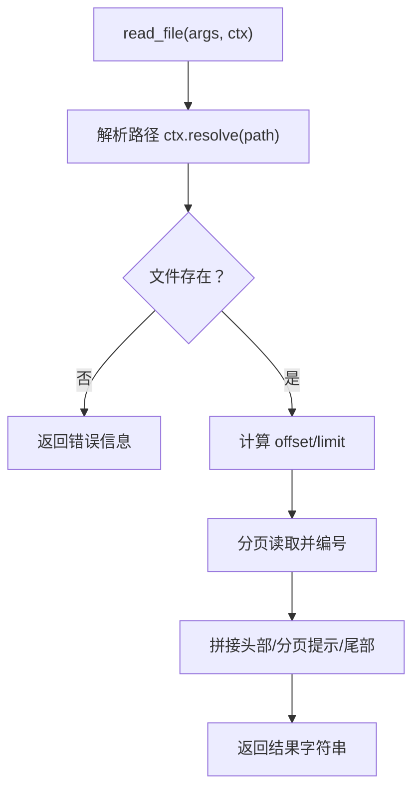
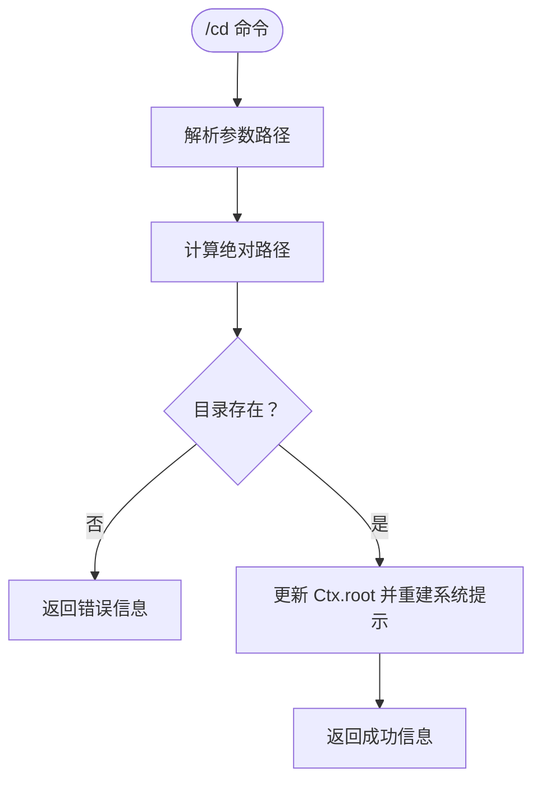
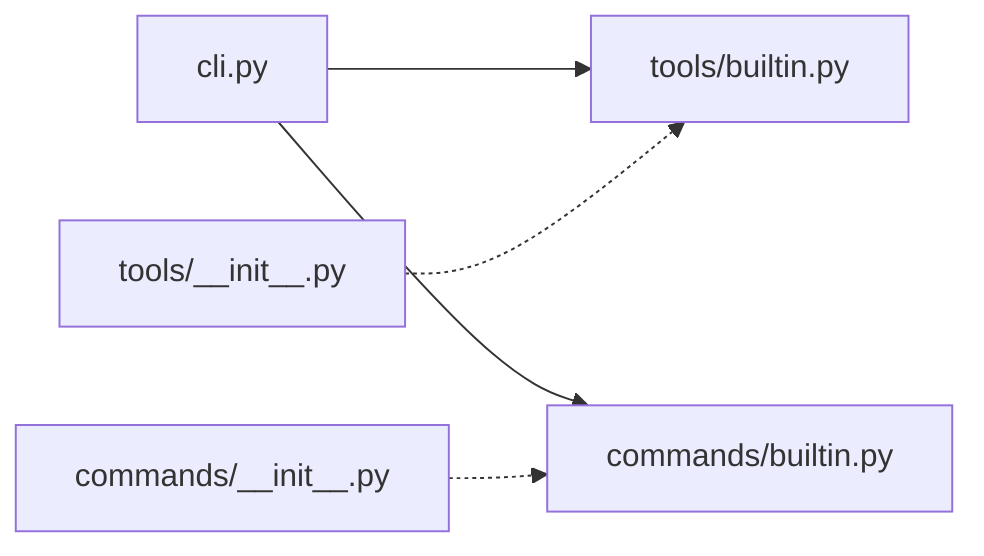

# 插件系统

<cite>
**本文引用的文件**
- [cli.py](file://cli.py)
- [commands/builtin.py](file://commands/builtin.py)
- [tools/builtin.py](file://tools/builtin.py)
- [commands/__init__.py](file://commands/__init__.py)
- [tools/__init__.py](file://tools/__init__.py)
</cite>

## 目录
1. [简介](#简介)
2. [项目结构](#项目结构)
3. [核心组件](#核心组件)
4. [架构总览](#架构总览)
5. [详细组件分析](#详细组件分析)
6. [依赖分析](#依赖分析)
7. [性能考虑](#性能考虑)
8. [故障排查指南](#故障排查指南)
9. [结论](#结论)
10. [附录](#附录)

## 简介
本文件面向 CodeAgent-TUI 的插件系统，系统采用“插件化核心 + 自动发现加载”的架构设计，将工具插件与命令插件解耦，分别置于 tools/ 与 commands/ 目录，由核心模块在启动时自动扫描并导入。插件通过装饰器向核心注册自身能力，核心仅维护注册表与上下文，不感知具体插件实现细节。本文档将系统阐述：
- 工具插件与命令插件的差异与用途
- 装饰器与注册机制
- 参数定义规范与 Schema 结构
- 内置插件实现示例（文件读写、命令执行、系统控制、工作区管理）
- 插件自动发现与加载流程
- 开发最佳实践与注意事项
- 自定义插件开发完整示例教程

## 项目结构
项目采用“功能域 + 包装器”的组织方式：
- 核心入口与框架：cli.py
- 工具插件包：tools/（内置工具插件位于 tools/builtin.py）
- 命令插件包：commands/（内置命令插件位于 commands/builtin.py）
- 包注释：tools/__init__.py、commands/__init__.py

图表来源
- [cli.py:356-371](file://cli.py#L356-L371)
- [tools/__init__.py:1-2](file://tools/__init__.py#L1-L2)
- [tools/builtin.py:1-90](file://tools/builtin.py#L1-L90)
- [commands/__init__.py:1-2](file://commands/__init__.py#L1-L2)
- [commands/builtin.py:1-91](file://commands/builtin.py#L1-L91)

章节来源
- [cli.py:356-371](file://cli.py#L356-L371)
- [tools/__init__.py:1-2](file://tools/__init__.py#L1-L2)
- [commands/__init__.py:1-2](file://commands/__init__.py#L1-L2)

## 核心组件
- 装饰器与注册表
  - 工具装饰器：用于注册 AI 工具，生成工具 Schema 并登记至注册表
  - 命令装饰器：用于注册用户斜杠命令，登记至命令注册表
  - 注册表：全局字典保存工具与命令的元信息与回调
- 上下文对象 Ctx
  - 提供工作区解析、消息队列、系统提示重建、供应商/模型切换、打印接口等
- 插件加载器
  - 自动扫描 tools/ 与 commands/ 目录，导入非下划线开头的模块，触发其装饰器注册
- LLM 调用与工具循环
  - 流式调用 LLM，解析工具调用请求，执行对应工具并回传结果

章节来源
- [cli.py:211-246](file://cli.py#L211-L246)
- [cli.py:255-321](file://cli.py#L255-L321)
- [cli.py:358-371](file://cli.py#L358-L371)
- [cli.py:389-487](file://cli.py#L389-L487)

## 架构总览
插件系统的核心思想是“零耦合扩展”。核心仅负责：
- 维护注册表（工具 Schema、命令回调）
- 维护上下文（工作区、消息、系统提示）
- 自动加载插件
- 与 LLM 的交互与工具调用循环

插件通过装饰器向核心注册，核心在启动阶段完成初始化，后续运行时完全由注册表驱动。

图表来源
- [cli.py:491-532](file://cli.py#L491-L532)
- [cli.py:358-371](file://cli.py#L358-L371)
- [cli.py:211-246](file://cli.py#L211-L246)
- [cli.py:389-487](file://cli.py#L389-L487)

## 详细组件分析

### 装饰器与注册机制
- 工具装饰器
  - 接收名称、描述与参数 Schema，包装函数并登记到工具注册表
  - 工具 Schema 以 OpenAI 函数调用格式组织，便于 LLM 调用
- 命令装饰器
  - 接收命令名与帮助文本，包装函数并登记到命令注册表
  - 命令回调签名接收参数字符串与上下文对象
- 注册表查询与调用
  - 工具：通过名称查找并执行，返回字符串结果
  - 命令：通过名称查找并执行，无返回值

图表来源
- [cli.py:211-250](file://cli.py#L211-L250)

章节来源
- [cli.py:211-250](file://cli.py#L211-L250)

### 上下文对象 Ctx
- 职责
  - 管理工作区路径与解析相对路径
  - 维护消息队列与系统提示重建
  - 提供供应商/模型切换与请求头构造
  - 提供统一的打印接口
- 关键方法
  - 切换工作区、解析路径、设置供应商/模型、重置消息、打印

图表来源
- [cli.py:255-321](file://cli.py#L255-L321)

章节来源
- [cli.py:255-321](file://cli.py#L255-L321)

### 插件自动发现与加载
- 加载策略
  - 使用包工具扫描指定目录下的模块，过滤以下划线开头的模块
  - 动态导入模块，触发模块内装饰器注册
- 异常处理
  - 导入失败会记录警告信息，不影响其他插件加载
- 加载时机
  - 在主循环开始前，分别加载 tools/ 与 commands/

图表来源
- [cli.py:358-371](file://cli.py#L358-L371)

章节来源
- [cli.py:358-371](file://cli.py#L358-L371)

### LLM 调用与工具循环
- 流式调用
  - 构造请求体，包含模型、消息、工具 Schema 与流式标志
  - 逐行解析响应，累积内容与工具调用片段
- 工具调用执行
  - 将工具调用解析为函数名与参数
  - 调用对应工具并回传结果
- 终止条件
  - 未产生工具调用则结束对话
  - 达到最大轮次上限时停止

图表来源
- [cli.py:389-487](file://cli.py#L389-L487)

章节来源
- [cli.py:389-487](file://cli.py#L389-L487)

### 工具插件：文件读写与命令执行
- 设计理念
  - 工具插件面向 LLM，返回字符串结果，便于被 AI 读取与进一步推理
  - 通过上下文解析相对路径，确保安全与一致性
- 内置工具
  - 写文件：将内容写入指定路径，自动创建目录
  - 读文件：支持分页读取，避免大文件被截断
  - 执行命令：在工作区目录执行 shell 命令，捕获输出
- 参数 Schema 规范
  - 使用 JSON Schema 定义参数类型、描述与必填项
  - 工具 Schema 以 OpenAI 函数调用格式组织

图表来源
- [tools/builtin.py:38-71](file://tools/builtin.py#L38-L71)

章节来源
- [tools/builtin.py:1-90](file://tools/builtin.py#L1-L90)

### 命令插件：系统控制与工作区管理
- 设计理念
  - 命令插件面向用户，提供交互式控制能力
  - 通过上下文修改核心状态（如工作区、消息、供应商/模型）
- 内置命令
  - 退出：终止程序
  - 清除：重置对话历史
  - 编辑：打开文件于默认编辑器
  - 帮助：列出可用命令
  - 切换工作区：相对或绝对路径
  - 显示工作区：打印当前工作区
  - 切换供应商/模型：支持无参查看可用项
- 命令分发
  - 用户输入以斜杠开头的命令，核心按名称分发到命令注册表

图表来源
- [commands/builtin.py:48-65](file://commands/builtin.py#L48-L65)

章节来源
- [commands/builtin.py:1-91](file://commands/builtin.py#L1-L91)

### 参数定义规范与 Schema 结构
- 工具参数 Schema
  - 必须包含名称、描述与参数对象
  - 参数对象使用 JSON Schema 定义属性、类型、描述与必填字段
- 命令参数
  - 命令装饰器不强制参数 Schema，命令回调接收字符串参数
  - 参数解析由插件自行处理（如 split、strip、校验）

章节来源
- [cli.py:211-226](file://cli.py#L211-L226)
- [tools/builtin.py:17-28](file://tools/builtin.py#L17-L28)
- [tools/builtin.py:38-50](file://tools/builtin.py#L38-L50)
- [tools/builtin.py:73-83](file://tools/builtin.py#L73-L83)

### 插件开发指南
- 工具插件开发步骤
  - 新建文件：在 tools/ 下新建模块（例如 my_tool.py）
  - 导入装饰器：from cli import tool, Ctx, Style
  - 定义参数 Schema：使用 JSON Schema 描述参数
  - 实现函数：接收 args 与 ctx，返回字符串结果
  - 装饰注册：使用 @tool("name", "desc", schema)
  - 示例参考：内置工具的实现位置
- 命令插件开发步骤
  - 新建文件：在 commands/ 下新建模块（例如 my_cmd.py）
  - 导入装饰器：from cli import command, Ctx, Style
  - 实现函数：接收 arg_str 与 ctx，无返回值
  - 装饰注册：使用 @command("/cmd", "help text")
  - 示例参考：内置命令的实现位置
- 最佳实践
  - 工具函数应幂等且可重复调用
  - 工具返回结果需简洁明确，必要时包含统计信息
  - 命令函数应进行参数校验与错误提示
  - 使用上下文解析路径，避免越权访问
  - 工具 Schema 应清晰描述参数与副作用
  - 命令帮助文本应简洁易懂
- 注意事项
  - 避免在工具中执行长时间阻塞操作
  - 命令中避免执行高风险系统操作
  - 工具与命令均不应直接修改核心内部状态，必须通过 Ctx

章节来源
- [tools/builtin.py:1-10](file://tools/builtin.py#L1-L10)
- [commands/builtin.py:1-10](file://commands/builtin.py#L1-L10)
- [cli.py:211-246](file://cli.py#L211-L246)

## 依赖分析
- 模块间关系
  - cli.py 为核心，依赖 tools/ 与 commands/ 的装饰器注册
  - tools/builtin.py 与 commands/builtin.py 作为内置插件，依赖 cli.py 的装饰器与上下文
  - tools/__init__.py 与 commands/__init__.py 仅作包注释
- 耦合度
  - 核心与插件通过装饰器与注册表解耦
  - 插件之间无直接依赖，仅依赖核心提供的接口
- 外部依赖
  - 仅使用 Python 标准库，无第三方依赖

图表来源
- [cli.py:491-532](file://cli.py#L491-L532)
- [tools/builtin.py:1-90](file://tools/builtin.py#L1-L90)
- [commands/builtin.py:1-91](file://commands/builtin.py#L1-L91)

章节来源
- [cli.py:491-532](file://cli.py#L491-L532)

## 性能考虑
- 工具调用
  - 工具返回字符串，避免复杂对象序列化开销
  - 大文件读取建议分页，减少一次性传输量
- 命令执行
  - 命令执行设置超时，避免长时间阻塞
- 插件加载
  - 仅导入非下划线模块，减少无效扫描
  - 导入失败记录警告，不影响整体加载

## 故障排查指南
- 插件未生效
  - 检查模块是否位于 tools/ 或 commands/ 目录
  - 确认模块名不以下划线开头
  - 确认装饰器使用正确，函数签名符合要求
- 工具调用异常
  - 检查工具 Schema 是否与参数匹配
  - 检查路径解析是否正确（使用 ctx.resolve）
  - 检查工具函数是否抛出异常
- 命令执行异常
  - 检查命令参数是否为空或非法
  - 检查工作区是否存在
  - 检查供应商/模型配置是否有效
- 加载失败
  - 查看控制台警告信息
  - 检查模块语法与依赖

章节来源
- [cli.py:358-371](file://cli.py#L358-L371)
- [cli.py:489-487](file://cli.py#L489-L487)

## 结论
CodeAgent-TUI 的插件系统以“零耦合扩展”为核心设计原则，通过装饰器与注册表实现工具与命令的统一管理，借助自动发现加载机制实现即插即用。内置工具与命令展示了清晰的职责边界与参数规范，为开发者提供了良好的扩展基线。遵循本文档的开发指南与最佳实践，可快速构建稳定、可维护的插件生态。

## 附录
- 快速开始
  - 在 tools/ 下新增 my_tool.py，使用 @tool 装饰器注册
  - 在 commands/ 下新增 my_cmd.py，使用 @command 装饰器注册
  - 重启程序后即可使用新插件
- 参考实现
  - 工具插件：[tools/builtin.py:1-90](file://tools/builtin.py#L1-L90)
  - 命令插件：[commands/builtin.py:1-91](file://commands/builtin.py#L1-L91)