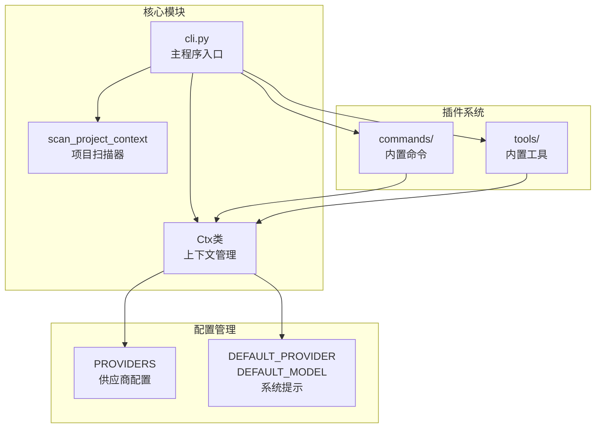
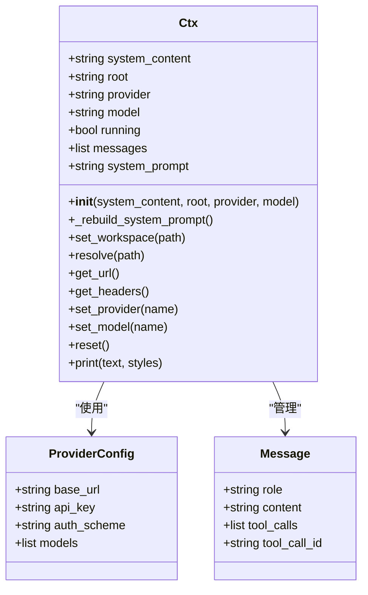
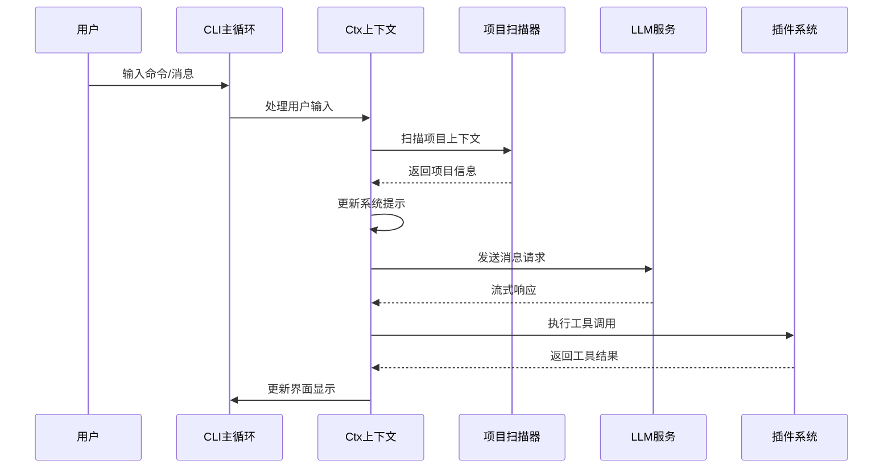
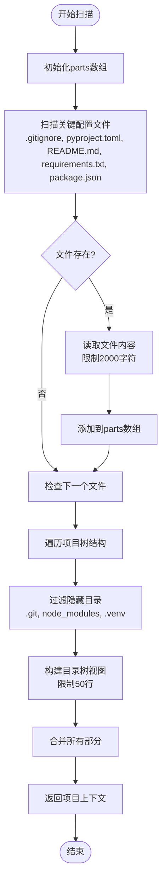
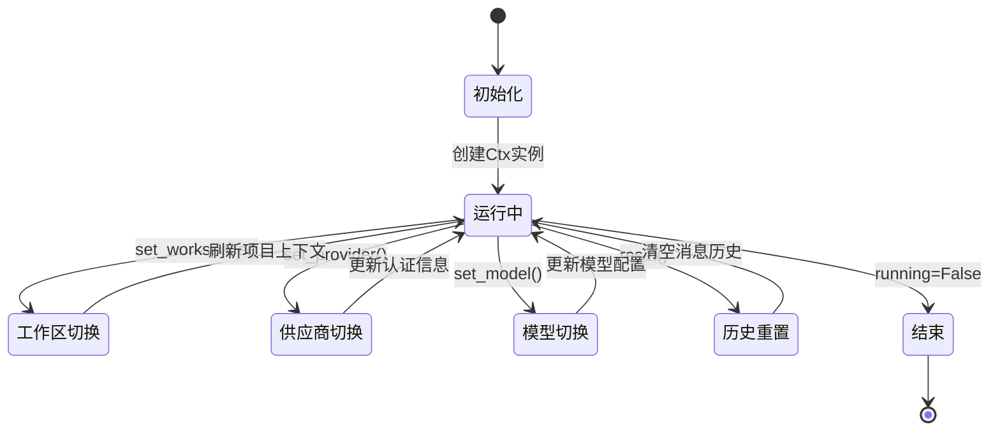
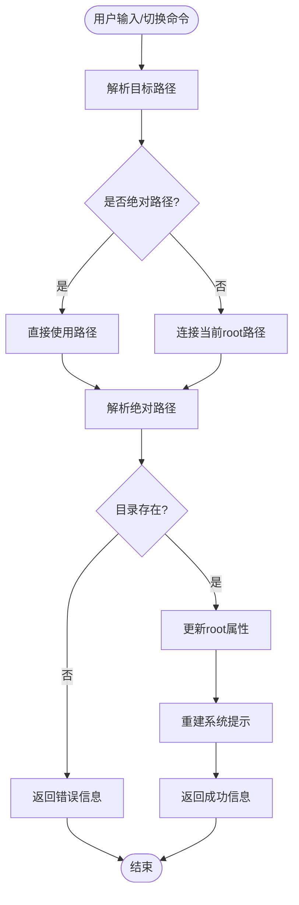
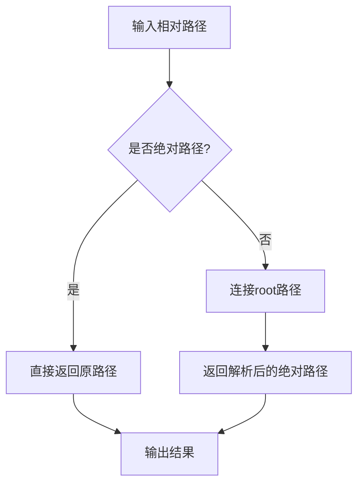
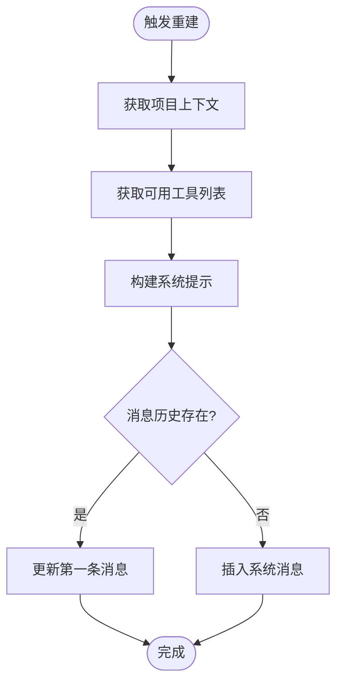
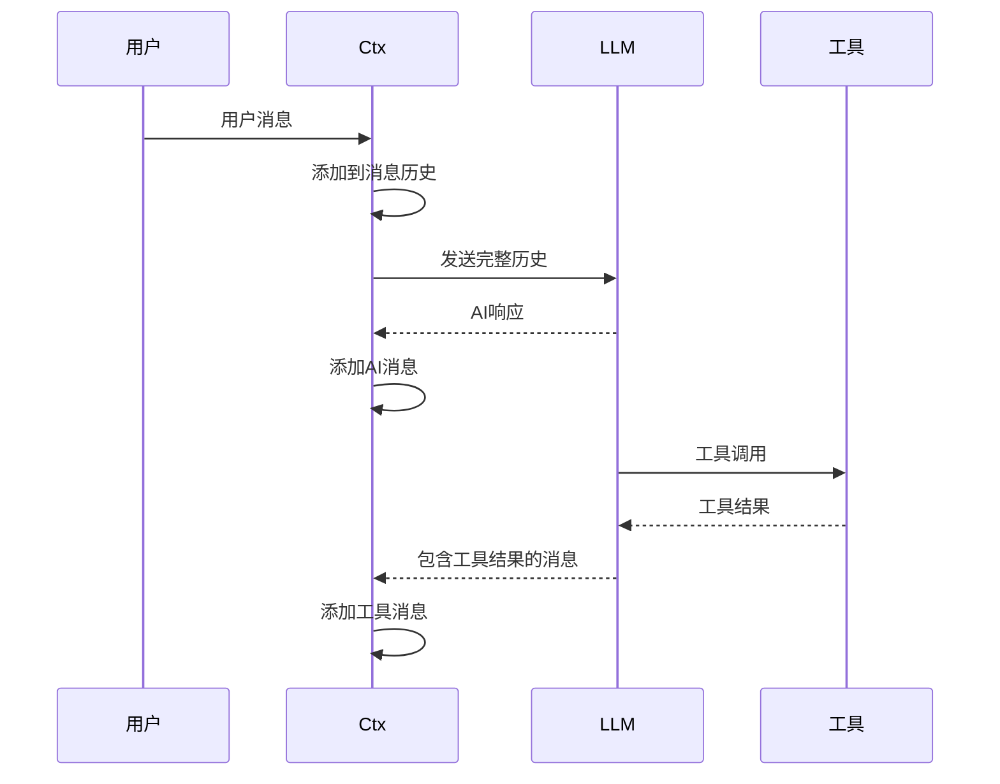
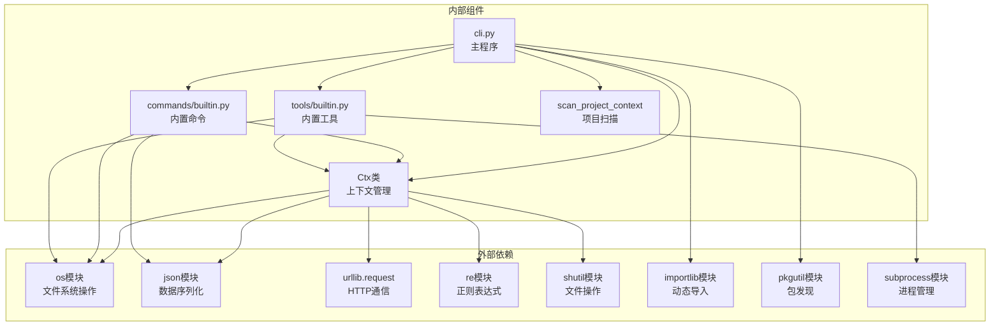

# 上下文管理系统

<cite>
**本文档引用的文件**
- [cli.py](file://cli.py)
- [commands/builtin.py](file://commands/builtin.py)
- [tools/builtin.py](file://tools/builtin.py)
</cite>

## 目录
1. [简介](#简介)
2. [项目结构](#项目结构)
3. [核心组件](#核心组件)
4. [架构概览](#架构概览)
5. [详细组件分析](#详细组件分析)
6. [依赖关系分析](#依赖关系分析)
7. [性能考虑](#性能考虑)
8. [故障排除指南](#故障排除指南)
9. [结论](#结论)

## 简介

CodeAgent-TUI的上下文管理系统是一个核心设计模式，通过Ctx类提供统一的状态管理和工作区感知能力。该系统实现了插件化的架构设计，允许工具和命令通过上下文对象安全地访问和修改核心状态，而无需直接接触核心内部实现。

系统的主要设计理念包括：
- **单一职责原则**：Ctx类集中管理所有上下文状态
- **工作区感知**：自动扫描和注入项目上下文信息
- **供应商抽象**：统一管理不同AI服务提供商的配置
- **消息历史管理**：维护对话历史和系统提示的动态构建
- **路径解析**：提供工作区内的相对路径解析功能

## 项目结构

CodeAgent-TUI采用模块化的项目结构，主要包含以下核心组件：

**图表来源**
- [cli.py:255-321](file://cli.py#L255-L321)
- [cli.py:325-353](file://cli.py#L325-L353)
- [commands/builtin.py:13](file://commands/builtin.py#L13)
- [tools/builtin.py:14](file://tools/builtin.py#L14)

**章节来源**
- [cli.py:16-36](file://cli.py#L16-L36)
- [cli.py:255-321](file://cli.py#L255-L321)

## 核心组件

### Ctx类设计

Ctx类是整个上下文管理系统的核心，提供了统一的状态管理接口：

**图表来源**
- [cli.py:255-321](file://cli.py#L255-L321)

### 供应商管理系统

系统支持多个AI服务提供商，通过统一的配置接口进行管理：

| 供应商 | 基础URL | 认证方案 | 支持模型 |
|--------|---------|----------|----------|
| deepseek | https://api.deepseek.com/chat/completions | bearer | deepseek-v4-flash, deepseek-v4-pro, deepseek-chat, deepseek-reasoner |
| tongyi | http://10.40.187.243:8003/model/three_tongyi_bd/v1/chat/completions | raw | default |

**章节来源**
- [cli.py:19-34](file://cli.py#L19-L34)
- [cli.py:292-298](file://cli.py#L292-L298)

## 架构概览

上下文管理系统采用事件驱动的架构模式，通过消息队列和回调机制实现松耦合的组件交互：

**图表来源**
- [cli.py:491-527](file://cli.py#L491-L527)
- [cli.py:389-486](file://cli.py#L389-L486)

## 详细组件分析

### 工作区感知系统

工作区感知是Ctx类的核心功能之一，通过递归扫描项目结构来构建项目上下文：

**图表来源**
- [cli.py:325-353](file://cli.py#L325-L353)

#### 关键特性

1. **智能文件过滤**：自动忽略版本控制目录和编译产物
2. **内容截断保护**：防止超大文件影响性能
3. **结构化输出**：提供清晰的文件层次结构
4. **配置文件聚合**：统一管理项目配置信息

**章节来源**
- [cli.py:325-353](file://cli.py#L325-L353)

### 上下文状态生命周期管理

Ctx类实现了完整的状态生命周期管理，包括初始化、更新和重置过程：

**图表来源**
- [cli.py:257-316](file://cli.py#L257-L316)

#### 生命周期阶段详解

1. **初始化阶段** (`__init__`)
   - 设置基础系统提示
   - 初始化工作区根目录
   - 配置默认供应商和模型
   - 构建初始系统提示

2. **运行阶段** (`set_workspace`, `set_provider`, `set_model`)
   - 动态更新系统配置
   - 实时刷新项目上下文
   - 维护消息历史一致性

3. **重置阶段** (`reset`)
   - 清空对话历史
   - 重新构建系统提示
   - 恢复到初始状态

**章节来源**
- [cli.py:257-316](file://cli.py#L257-L316)

### 工作区切换机制

工作区切换功能提供了灵活的目录导航能力：

**图表来源**
- [cli.py:279-286](file://cli.py#L279-L286)

#### 实现细节

1. **路径解析策略**：区分绝对和相对路径
2. **目录验证**：确保目标路径有效
3. **上下文刷新**：自动更新项目相关信息
4. **错误处理**：提供详细的错误反馈

**章节来源**
- [cli.py:279-286](file://cli.py#L279-L286)

### 路径解析功能

路径解析功能确保工具和命令能够正确处理相对路径：

**图表来源**
- [cli.py:288-290](file://cli.py#L288-L290)

#### 使用场景

1. **文件操作**：确保文件路径在正确的目录结构中
2. **命令执行**：提供正确的执行环境路径
3. **工具调用**：保证工具操作的路径一致性

**章节来源**
- [cli.py:288-290](file://cli.py#L288-L290)

### 系统提示动态构建

系统提示的动态构建是上下文管理系统的核心功能：

**图表来源**
- [cli.py:266-277](file://cli.py#L266-L277)

#### 构建要素

1. **基础系统提示**：定义AI助手的角色和约束
2. **项目上下文**：包含项目结构和配置文件信息
3. **可用工具**：动态注入当前可用的工具列表
4. **格式规范**：确保工具调用的JSON格式要求

**章节来源**
- [cli.py:266-277](file://cli.py#L266-L277)

### 消息历史管理

消息历史管理确保对话的连贯性和上下文完整性：

**图表来源**
- [cli.py:524-527](file://cli.py#L524-L527)
- [cli.py:462-484](file://cli.py#L462-L484)

#### 管理策略

1. **历史累积**：保持完整的对话历史
2. **工具集成**：支持工具调用结果的无缝集成
3. **流式处理**：实时处理LLM的流式响应
4. **错误恢复**：处理工具调用异常情况

**章节来源**
- [cli.py:524-527](file://cli.py#L524-L527)
- [cli.py:462-484](file://cli.py#L462-L484)

## 依赖关系分析

上下文管理系统展现了良好的模块化设计，各组件之间的依赖关系清晰明确：

**图表来源**
- [cli.py:1-14](file://cli.py#L1-L14)
- [cli.py:255-321](file://cli.py#L255-L321)
- [commands/builtin.py:11-13](file://commands/builtin.py#L11-L13)
- [tools/builtin.py:11-14](file://tools/builtin.py#L11-L14)

### 内部依赖关系

1. **核心依赖**：Ctx类依赖于项目扫描器和供应商配置
2. **命令依赖**：内置命令通过Ctx访问系统功能
3. **工具依赖**：内置工具通过Ctx进行路径解析和系统交互
4. **插件系统**：通过装饰器模式实现动态注册

**章节来源**
- [cli.py:207-247](file://cli.py#L207-L247)
- [commands/builtin.py:13](file://commands/builtin.py#L13)
- [tools/builtin.py:14](file://tools/builtin.py#L14)

## 性能考虑

上下文管理系统在设计时充分考虑了性能优化：

### 内存管理
- **延迟加载**：项目上下文仅在需要时扫描
- **内容截断**：大文件内容限制在2000字符以内
- **历史清理**：提供重置功能避免内存泄漏

### I/O优化
- **目录过滤**：跳过隐藏和编译目录减少扫描时间
- **增量更新**：仅在工作区变更时重建系统提示
- **流式处理**：LLM响应采用流式处理避免内存峰值

### 网络优化
- **连接复用**：HTTP请求使用标准库实现
- **超时控制**：命令执行设置30秒超时
- **错误处理**：网络异常时提供清晰的错误信息

## 故障排除指南

### 常见问题及解决方案

1. **工作区切换失败**
   - 检查目标路径是否存在
   - 确认路径权限设置
   - 验证工作区不是符号链接

2. **供应商配置错误**
   - 检查API密钥有效性
   - 验证基础URL可达性
   - 确认认证方案匹配

3. **工具调用异常**
   - 检查工具参数格式
   - 验证文件路径解析
   - 确认工作区权限

4. **消息历史问题**
   - 使用`/clear`命令重置历史
   - 检查消息格式是否符合要求
   - 验证工具返回的JSON格式

**章节来源**
- [cli.py:282-283](file://cli.py#L282-L283)
- [cli.py:302-303](file://cli.py#L302-L303)
- [commands/builtin.py:27-29](file://commands/builtin.py#L27-L29)

## 结论

CodeAgent-TUI的上下文管理系统通过Ctx类实现了高度模块化的架构设计，具有以下显著特点：

1. **设计理念先进**：采用单一职责原则和依赖注入模式
2. **功能完整**：涵盖工作区感知、供应商管理、消息历史等核心功能
3. **扩展性强**：通过插件系统支持动态功能扩展
4. **用户体验优秀**：提供直观的命令行界面和清晰的反馈机制

该系统为开发者提供了一个可扩展的框架，可以轻松集成新的AI服务提供商、工具和命令，同时保持系统的稳定性和性能。通过合理的错误处理和性能优化，确保了在各种使用场景下的可靠运行。