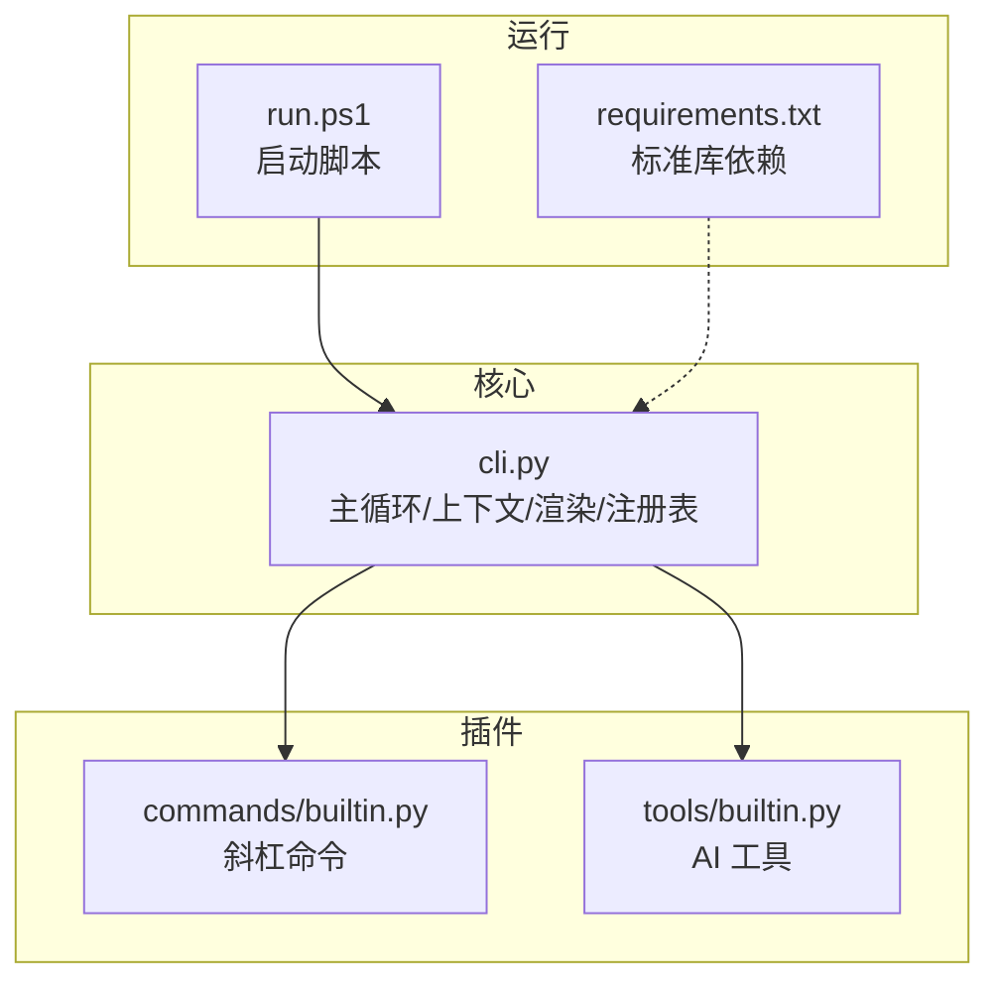
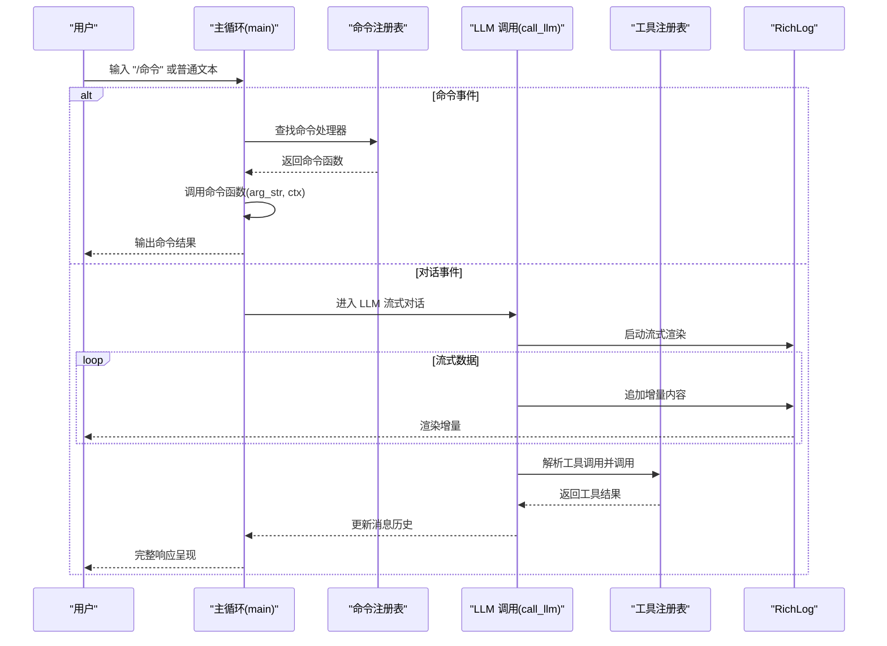
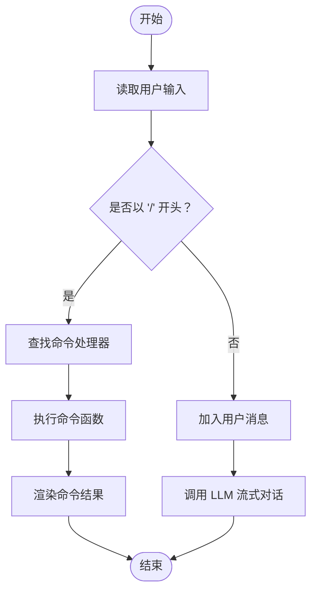
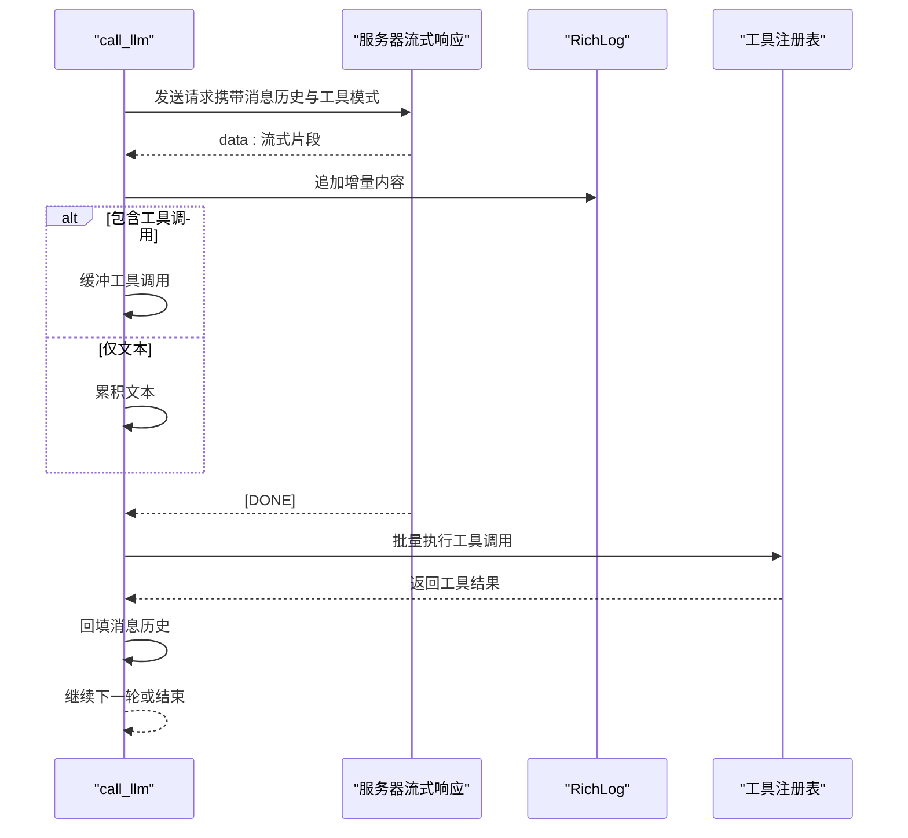
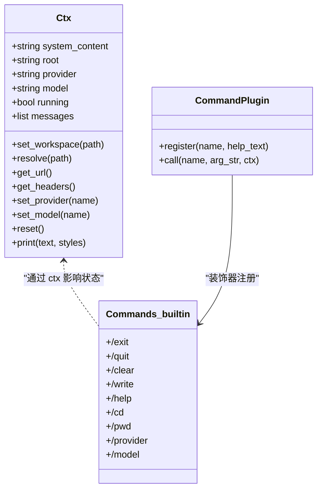
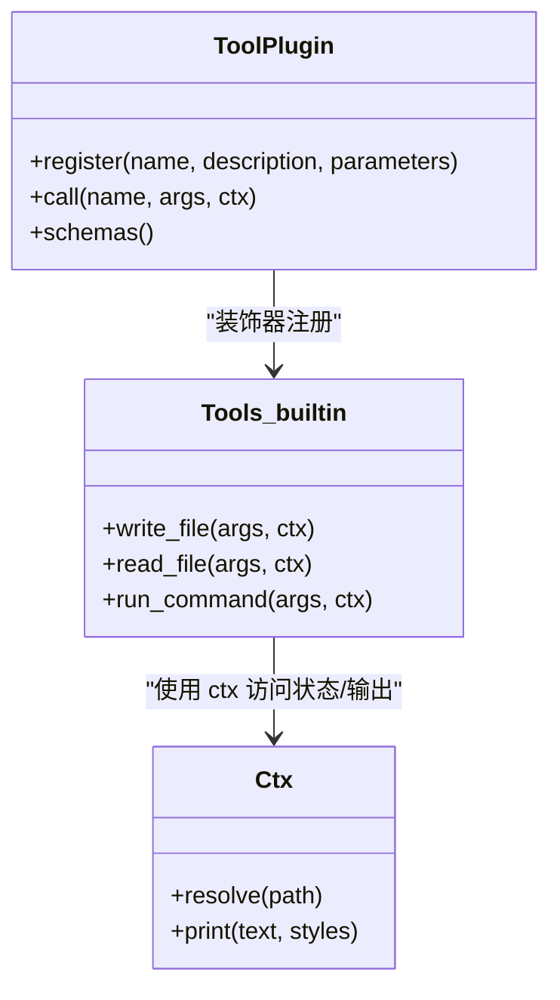
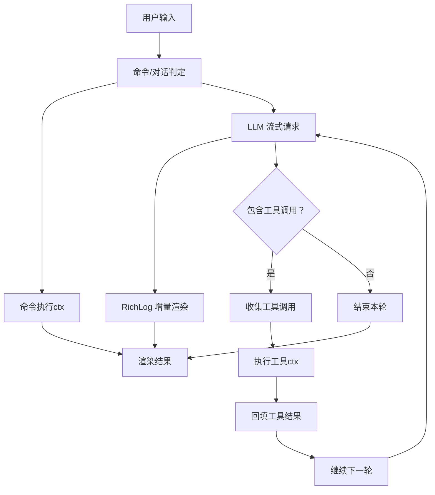
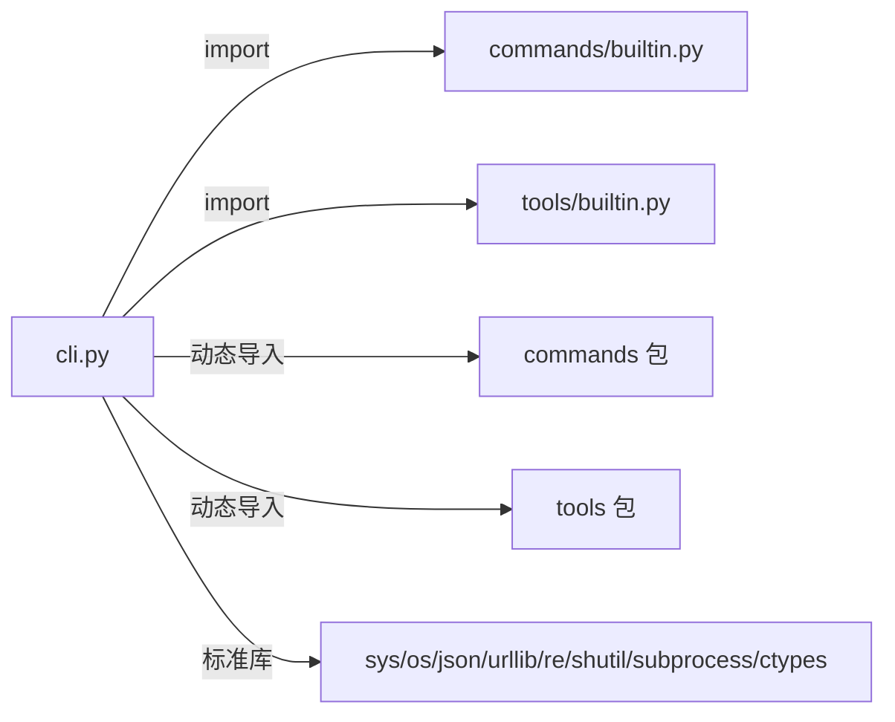

# 事件驱动交互模式

<cite>
**本文引用的文件**
- [cli.py](file://cli.py)
- [builtin.py（命令插件）](file://commands/builtin.py)
- [builtin.py（工具插件）](file://tools/builtin.py)
- [run.ps1](file://run.ps1)
- [requirements.txt](file://requirements.txt)
</cite>

## 目录
1. [引言](#引言)
2. [项目结构](#项目结构)
3. [核心组件](#核心组件)
4. [架构总览](#架构总览)
5. [详细组件分析](#详细组件分析)
6. [依赖关系分析](#依赖关系分析)
7. [性能考量](#性能考量)
8. [故障排查指南](#故障排查指南)
9. [结论](#结论)
10. [附录](#附录)

## 引言
本文件面向 CodeAgent-TUI 的事件驱动交互模式，系统性阐述基于用户输入与 LLM 响应的事件处理机制。重点覆盖：
- 主循环的设计模式与控制流
- 命令分发的路由机制与注册表
- 消息传递的事件流与流式渲染
- 事件驱动架构的优势与实现细节（异步处理、状态管理、错误传播）
- 用户交互事件序列（从输入捕获到响应渲染）
- 系统的可扩展性与模块化设计如何支撑事件驱动架构

## 项目结构
项目采用“核心 + 插件”的模块化设计，核心位于 cli.py，命令与工具以插件形式分别放置于 commands/ 与 tools/ 目录，通过装饰器注册与自动加载实现松耦合扩展。

图表来源
- [cli.py:491-531](file://cli.py#L491-L531)
- [run.ps1:1-24](file://run.ps1#L1-L24)
- [requirements.txt:1-7](file://requirements.txt#L1-L7)

章节来源
- [cli.py:491-531](file://cli.py#L491-L531)
- [run.ps1:1-24](file://run.ps1#L1-L24)
- [requirements.txt:1-7](file://requirements.txt#L1-L7)

## 核心组件
- 上下文对象 Ctx：贯穿工具与命令，统一管理系统提示、工作区、供应商/模型、消息历史与运行状态，并提供打印接口。
- 注册表与装饰器：通过 @tool 与 @command 将插件注册到全局注册表，核心不感知具体实现。
- 渲染与日志：RichLog 实现流式增量渲染，支持 ANSI 颜色与终端尺寸自适应。
- 插件加载：自动扫描 tools/ 与 commands/ 目录，导入非下划线开头的模块，触发注册。
- 主循环：持续接收用户输入，进行命令分发或进入 LLM 流式对话。

章节来源
- [cli.py:255-321](file://cli.py#L255-L321)
- [cli.py:211-247](file://cli.py#L211-L247)
- [cli.py:173-203](file://cli.py#L173-L203)
- [cli.py:358-371](file://cli.py#L358-L371)
- [cli.py:491-528](file://cli.py#L491-L528)

## 架构总览
事件驱动交互的核心在于“事件源（用户输入）—事件分发（命令路由）—事件处理（LLM/工具）—事件渲染（流式输出）”。系统通过主循环持续监听事件源，将命令事件与对话事件分流至不同处理路径，同时在 LLM 流式响应中嵌入工具调用事件，形成闭环。

图表来源
- [cli.py:504-527](file://cli.py#L504-L527)
- [cli.py:389-486](file://cli.py#L389-L486)
- [cli.py:245-246](file://cli.py#L245-L246)
- [cli.py:241-242](file://cli.py#L241-L242)
- [cli.py:179-202](file://cli.py#L179-L202)

## 详细组件分析

### 主循环与事件分发
- 事件源：用户输入 prompt_user，支持 Ctrl+C/EOF 优雅退出。
- 命令事件：以 “/” 开头的输入交由命令注册表分发，未识别命令给出提示。
- 对话事件：普通文本作为用户消息加入历史，随后进入 LLM 流式对话。

图表来源
- [cli.py:504-527](file://cli.py#L504-L527)
- [cli.py:245-246](file://cli.py#L245-L246)

章节来源
- [cli.py:504-527](file://cli.py#L504-L527)

### LLM 流式对话与工具调用事件
- 流式渲染：通过 RichLog 在终端上逐块追加渲染，模拟“Live”效果。
- 工具调用事件：当 LLM 返回工具调用片段时，累积到缓冲区并在本轮结束后统一执行，将结果回填到消息历史，形成“工具调用—执行—回填—继续推理”的事件链。
- 最大轮次保护：防止工具调用循环无限增长。

图表来源
- [cli.py:389-486](file://cli.py#L389-L486)
- [cli.py:179-202](file://cli.py#L179-L202)
- [cli.py:241-242](file://cli.py#L241-L242)

章节来源
- [cli.py:389-486](file://cli.py#L389-L486)

### 命令插件与路由机制
- 内置命令：/exit、/quit、/clear、/write、/help、/cd、/pwd、/provider、/model 等。
- 路由机制：主循环根据输入前缀判断，查表调用对应命令函数，命令函数通过 ctx 修改状态或输出信息。
- 可扩展性：新增命令只需在 tools/commands 下新增模块并使用 @command 装饰器注册，无需修改核心。

图表来源
- [cli.py:255-321](file://cli.py#L255-L321)
- [cli.py:229-234](file://cli.py#L229-L234)
- [commands/builtin.py:16-91](file://commands/builtin.py#L16-L91)

章节来源
- [cli.py:229-234](file://cli.py#L229-L234)
- [commands/builtin.py:16-91](file://commands/builtin.py#L16-L91)

### 工具插件与事件处理
- 内置工具：write_file、read_file、run_command。
- 事件处理：LLM 在流式响应中声明工具调用，核心收集参数并调用对应工具函数，将结果回填消息历史，驱动下一轮推理。
- 可扩展性：新增工具只需在 tools/ 下新增模块并使用 @tool 装饰器注册，无需修改核心。

图表来源
- [cli.py:211-247](file://cli.py#L211-L247)
- [tools/builtin.py:17-90](file://tools/builtin.py#L17-L90)
- [cli.py:255-321](file://cli.py#L255-L321)

章节来源
- [cli.py:211-247](file://cli.py#L211-L247)
- [tools/builtin.py:17-90](file://tools/builtin.py#L17-L90)

### 渲染与事件流
- 终端渲染：Style、colorize、panel、prompt_user 提供统一的样式与输入接口。
- 流式日志：RichLog.start/append/stop 控制增量渲染与光标重绘，确保在终端上实时展示 LLM 输出。
- 事件流：用户输入 → 命令分发/对话 → LLM 流式输出 → 工具调用事件 → 工具执行 → 结果回填 → 继续推理。

图表来源
- [cli.py:173-203](file://cli.py#L173-L203)
- [cli.py:389-486](file://cli.py#L389-L486)
- [cli.py:504-527](file://cli.py#L504-L527)

章节来源
- [cli.py:173-203](file://cli.py#L173-L203)
- [cli.py:389-486](file://cli.py#L389-L486)
- [cli.py:504-527](file://cli.py#L504-L527)

## 依赖关系分析
- 核心依赖：仅使用 Python 3.12 标准库，降低外部耦合，便于跨平台部署。
- 插件加载：通过 importlib 与 pkgutil 动态导入模块，实现零核心改动的扩展。
- 事件耦合：命令与工具均通过注册表解耦，核心仅维护注册表与上下文，事件处理逻辑完全由插件实现。

图表来源
- [cli.py:1-14](file://cli.py#L1-L14)
- [cli.py:358-371](file://cli.py#L358-L371)
- [requirements.txt:1-7](file://requirements.txt#L1-L7)

章节来源
- [cli.py:1-14](file://cli.py#L1-L14)
- [cli.py:358-371](file://cli.py#L358-L371)
- [requirements.txt:1-7](file://requirements.txt#L1-L7)

## 性能考量
- 流式渲染：通过增量追加减少一次性渲染开销，提升用户体验。
- 工具调用批处理：每轮结束后统一执行工具调用，避免频繁网络往返。
- 最大轮次限制：防止工具调用循环导致资源耗尽。
- 终端尺寸适配：根据终端宽度折行，避免渲染抖动。
- 错误快速失败：HTTP/连接错误即时中断，避免无效轮次。

## 故障排查指南
- 命令未知：检查命令是否正确注册，确认输入格式与大小写。
- 工具执行异常：查看工具返回的错误信息，确认参数与工作区路径解析。
- LLM 连接失败：检查供应商配置、网络连通性与认证头设置。
- 终端渲染异常：确认 VT 模式启用与编码设置，必要时调整终端字体与尺寸。
- 插件加载失败：检查插件模块语法与依赖，确认模块名不以下划线开头。

章节来源
- [cli.py:518-522](file://cli.py#L518-L522)
- [cli.py:406-412](file://cli.py#L406-L412)
- [cli.py:295-298](file://cli.py#L295-L298)
- [cli.py:60-78](file://cli.py#L60-L78)

## 结论
CodeAgent-TUI 通过“主循环 + 注册表 + 插件”的事件驱动架构，实现了高内聚、低耦合的交互系统。用户输入作为事件源，经由命令分发与 LLM 流式对话形成清晰的事件流，工具调用事件进一步丰富了事件类型。该设计具备良好的可扩展性与模块化特性，便于持续演进与功能迭代。

## 附录
- 启动方式：通过 run.ps1 自动创建虚拟环境并运行，或手动激活虚拟环境后执行模块入口。
- 依赖说明：仅使用 Python 3.12 标准库，无需第三方依赖，简化部署与维护。

章节来源
- [run.ps1:1-24](file://run.ps1#L1-L24)
- [requirements.txt:1-7](file://requirements.txt#L1-L7)