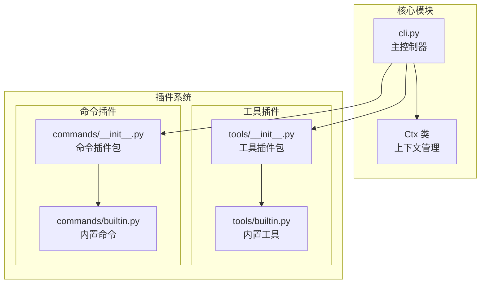
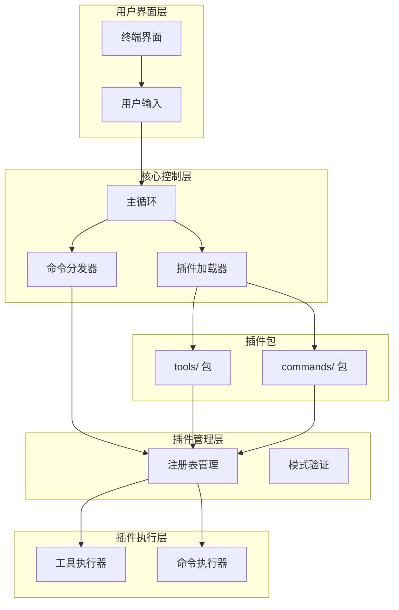
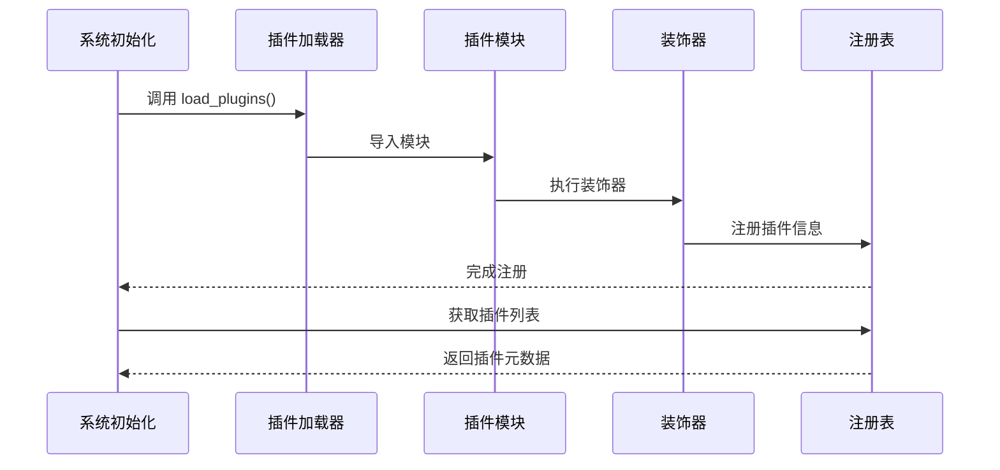
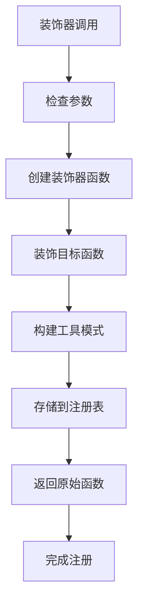
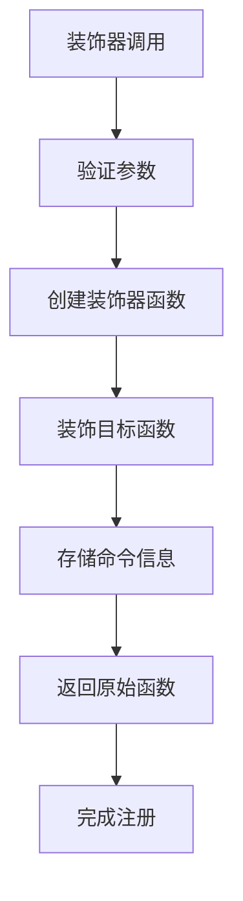
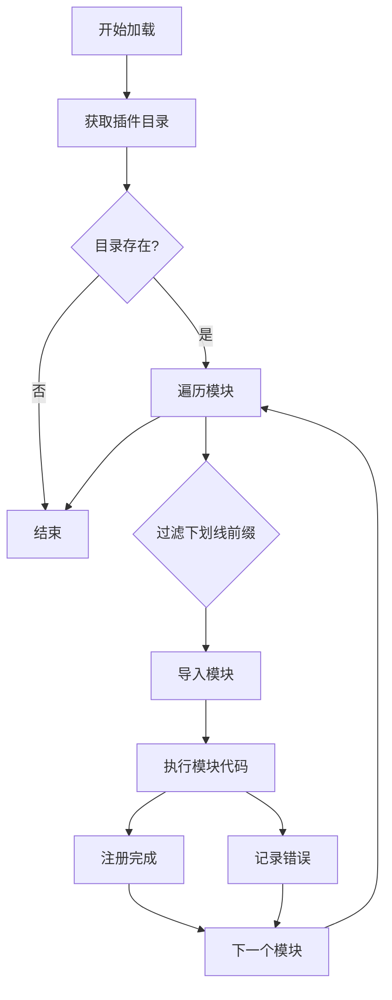
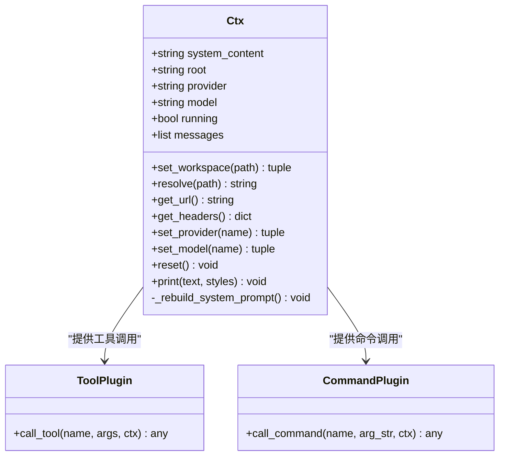
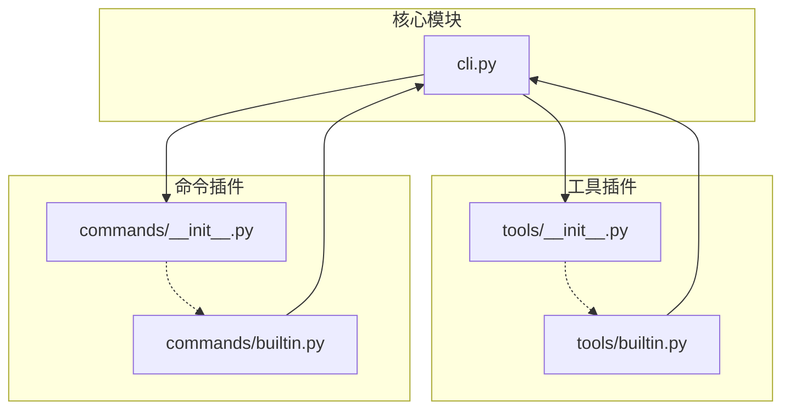

# 插件系统架构

<cite>
**本文档引用的文件**
- [cli.py](file://cli.py)
- [commands/__init__.py](file://commands/__init__.py)
- [commands/builtin.py](file://commands/builtin.py)
- [tools/__init__.py](file://tools/__init__.py)
- [tools/builtin.py](file://tools/builtin.py)
</cite>

## 目录
1. [简介](#简介)
2. [项目结构](#项目结构)
3. [核心组件](#核心组件)
4. [架构概览](#架构概览)
5. [详细组件分析](#详细组件分析)
6. [依赖关系分析](#依赖关系分析)
7. [性能考虑](#性能考虑)
8. [故障排除指南](#故障排除指南)
9. [结论](#结论)
10. [附录](#附录)

## 简介

CodeAgent-TUI 是一个基于 Python 标准库构建的终端智能代理系统，采用完全插件化的架构设计。该系统的核心设计理念是通过装饰器模式实现插件注册机制，将所有功能扩展都作为独立的插件模块进行管理。系统包含两个主要的插件类别：

- **工具插件（Tools）**：为 AI 提供各种能力，如文件操作、命令执行等
- **命令插件（Commands）**：为用户提供交互式命令，如工作区切换、设置管理等

系统通过装饰器模式实现了高度解耦的设计，核心模块不直接依赖具体的插件实现，而是通过注册表机制动态管理插件的生命周期。

## 项目结构

项目的整体结构清晰地分离了核心功能和插件扩展：

**图表来源**
- [cli.py:1-532](file://cli.py#L1-L532)
- [tools/__init__.py:1-2](file://tools/__init__.py#L1-L2)
- [commands/__init__.py:1-2](file://commands/__init__.py#L1-L2)

**章节来源**
- [cli.py:1-532](file://cli.py#L1-L532)
- [tools/__init__.py:1-2](file://tools/__init__.py#L1-L2)
- [commands/__init__.py:1-2](file://commands/__init__.py#L1-L2)

## 核心组件

### 装饰器注册机制

系统采用装饰器模式实现插件注册，这是整个插件系统的核心设计模式。

#### 工具装饰器（@tool）

工具装饰器用于注册 AI 工具插件，具有以下特点：
- 接受工具名称、描述和参数模式作为装饰器参数
- 返回一个装饰函数，用于包装实际的工具实现
- 将工具注册信息存储在全局注册表中

#### 命令装饰器（@command）

命令装饰器用于注册用户交互命令，具有以下特点：
- 接受命令名称和帮助文本作为装饰器参数
- 返回一个装饰函数，用于包装实际的命令实现
- 将命令注册信息存储在全局注册表中

### 注册表设计

系统使用两个全局字典作为插件注册表：

- `_TOOLS`：存储所有工具插件的注册信息
- `_COMMANDS`：存储所有命令插件的注册信息

每个注册项包含：
- `fn`：插件的实际函数实现
- `schema`：工具插件的参数模式定义
- `help`：命令插件的帮助文本

**章节来源**
- [cli.py:207-247](file://cli.py#L207-L247)

## 架构概览

CodeAgent-TUI 的插件系统采用分层架构设计，实现了核心功能与插件扩展的完全解耦：

**图表来源**
- [cli.py:358-372](file://cli.py#L358-L372)
- [cli.py:491-532](file://cli.py#L491-L532)

### 插件生命周期管理

插件的生命周期分为四个阶段：

1. **导入阶段**：系统扫描指定目录下的所有 Python 模块
2. **注册阶段**：模块中的装饰器自动将插件注册到相应的注册表
3. **调用阶段**：核心系统根据需要调用已注册的插件
4. **清理阶段**：程序结束时释放相关资源

**图表来源**
- [cli.py:358-372](file://cli.py#L358-L372)
- [cli.py:211-234](file://cli.py#L211-L234)

**章节来源**
- [cli.py:358-372](file://cli.py#L358-L372)
- [cli.py:211-234](file://cli.py#L211-L234)

## 详细组件分析

### 装饰器实现详解

#### 工具装饰器（@tool）实现

工具装饰器采用闭包模式实现，具有以下工作机制：

**图表来源**
- [cli.py:211-226](file://cli.py#L211-L226)

#### 命令装饰器（@command）实现

命令装饰器的实现相对简单，主要负责基本的参数验证和注册：

**图表来源**
- [cli.py:229-234](file://cli.py#L229-L234)

**章节来源**
- [cli.py:211-234](file://cli.py#L211-L234)

### 注册表管理机制

#### 数据结构设计

注册表采用字典结构存储插件信息，每个插件项包含：

- **工具注册表（_TOOLS）**：
  - `name`: 工具名称
  - `fn`: 函数实现
  - `schema`: OpenAI 格式的工具模式定义

- **命令注册表（_COMMANDS）**：
  - `name`: 命令名称
  - `fn`: 函数实现
  - `help`: 帮助文本

#### 查询和调用接口

系统提供了相应的查询和调用接口：

- `tool_schemas()`: 返回所有工具的模式定义
- `call_tool()`: 调用指定工具
- `call_command()`: 调用指定命令
- `command_help()`: 返回所有命令的帮助信息

**章节来源**
- [cli.py:237-251](file://cli.py#L237-L251)

### 插件加载机制

#### 自动发现算法

插件加载器使用 `pkgutil.iter_modules()` 实现自动发现：

**图表来源**
- [cli.py:358-372](file://cli.py#L358-L372)

#### 错误处理策略

加载过程中采用健壮的错误处理机制：
- 捕获导入异常并记录警告信息
- 继续处理其他模块，不影响整体加载
- 提供详细的错误上下文信息

**章节来源**
- [cli.py:358-372](file://cli.py#L358-L372)

### 上下文管理系统

#### Ctx 类设计

上下文类（Ctx）是插件与核心系统交互的主要接口：

**图表来源**
- [cli.py:255-321](file://cli.py#L255-L321)

#### 工作区感知机制

系统具备智能的工作区感知能力：

- **项目扫描**：自动扫描项目结构和关键配置文件
- **上下文构建**：将项目信息注入到系统提示词中
- **路径解析**：提供相对路径到绝对路径的安全转换

**章节来源**
- [cli.py:255-321](file://cli.py#L255-L321)

## 依赖关系分析

### 模块间依赖图

**图表来源**
- [cli.py:1-532](file://cli.py#L1-L532)
- [tools/builtin.py:1-90](file://tools/builtin.py#L1-L90)
- [commands/builtin.py:1-91](file://commands/builtin.py#L1-L91)

### 耦合度分析

系统采用了极低耦合的设计原则：

- **核心模块不依赖具体插件**：通过装饰器注册实现松散耦合
- **插件不依赖核心模块**：插件只能通过暴露的接口与核心交互
- **双向依赖最小化**：仅在必要的时候进行有限的相互依赖

**章节来源**
- [cli.py:1-532](file://cli.py#L1-L532)

## 性能考虑

### 插件加载性能

- **延迟加载**：插件在需要时才被导入和执行
- **缓存机制**：已加载的模块信息会被缓存，避免重复导入
- **错误隔离**：单个插件的失败不会影响其他插件的加载

### 内存管理

- **注册表优化**：使用轻量级字典存储插件元数据
- **函数引用**：直接存储函数引用而非创建新的包装对象
- **资源清理**：程序结束时自动清理相关资源

### 扩展性考虑

- **模块化设计**：每个插件都是独立的 Python 模块
- **命名空间隔离**：不同插件包使用不同的命名空间
- **接口标准化**：统一的装饰器接口简化了插件开发

## 故障排除指南

### 常见问题诊断

#### 插件无法加载

**症状**：插件模块导入失败，出现警告信息

**可能原因**：
- 模块语法错误
- 缺少必要的依赖包
- 权限问题导致无法导入

**解决方法**：
- 检查模块语法是否正确
- 确认所有依赖都已满足
- 验证文件权限设置

#### 装饰器注册失败

**症状**：装饰器调用后插件未出现在注册表中

**可能原因**：
- 装饰器参数不正确
- 函数签名不符合要求
- 注册表访问权限问题

**解决方法**：
- 验证装饰器参数格式
- 检查函数签名是否符合预期
- 确认全局变量可访问性

#### 插件调用异常

**症状**：插件执行过程中抛出异常

**可能原因**：
- 插件内部逻辑错误
- 上下文参数传递问题
- 资源访问权限不足

**解决方法**：
- 在插件内部添加适当的异常处理
- 验证传入的参数有效性
- 检查所需的系统资源是否可用

**章节来源**
- [cli.py:368-371](file://cli.py#L368-L371)

## 结论

CodeAgent-TUI 的插件系统架构展现了优秀的软件工程实践，通过装饰器模式和注册表机制实现了高度解耦的设计。该系统的主要优势包括：

1. **完全插件化**：核心功能与扩展功能完全分离
2. **易于扩展**：新功能只需创建独立的插件模块
3. **强健性**：完善的错误处理和资源管理机制
4. **可维护性**：清晰的模块边界和标准化接口

这种设计模式为类似的应用程序提供了一个优秀的参考模板，展示了如何在保持核心简洁的同时实现强大的扩展能力。

## 附录

### 插件开发最佳实践

#### 装饰器使用规范

- **工具插件**：确保参数模式定义完整且准确
- **命令插件**：提供清晰的帮助文本和使用示例
- **错误处理**：在插件内部妥善处理异常情况

#### 代码组织建议

- **模块命名**：使用有意义的模块名称
- **函数设计**：保持函数职责单一
- **文档注释**：为插件提供详细的文档说明

#### 性能优化建议

- **资源管理**：及时释放不需要的资源
- **输入验证**：对所有外部输入进行验证
- **错误恢复**：实现优雅的错误恢复机制