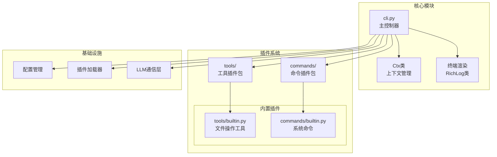
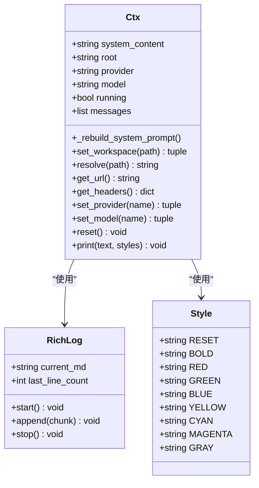
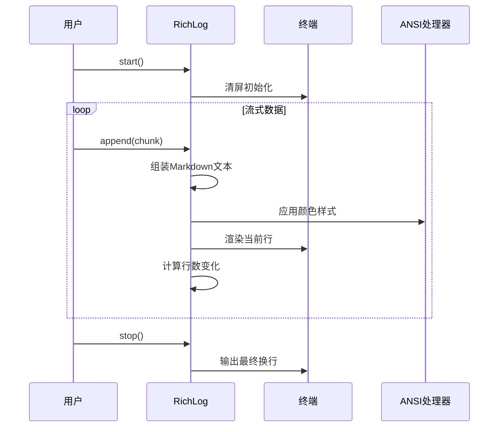
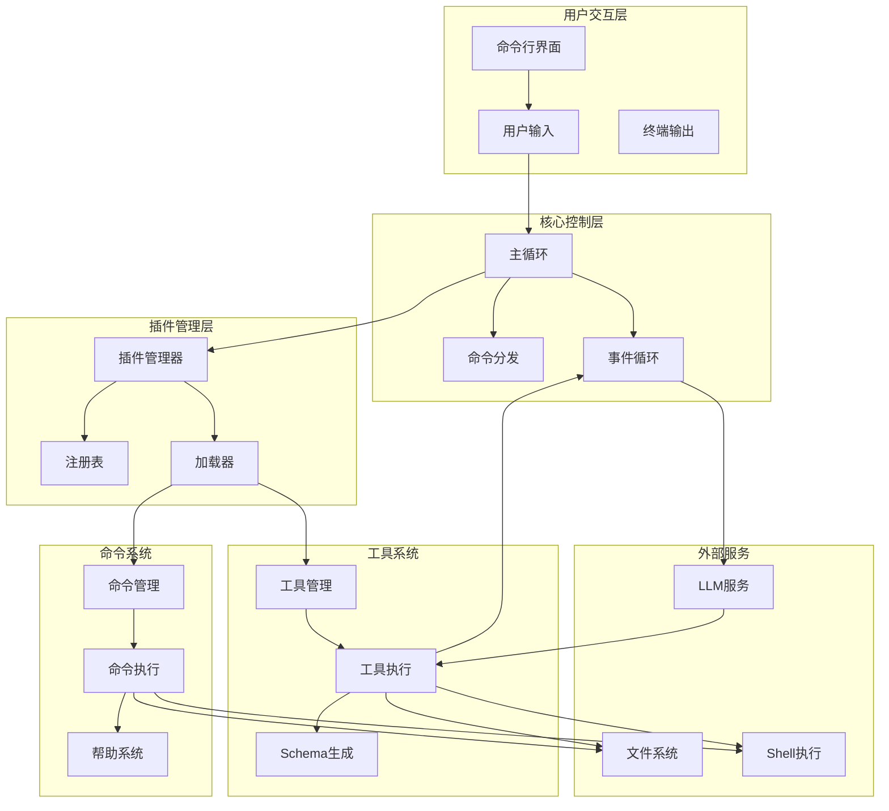
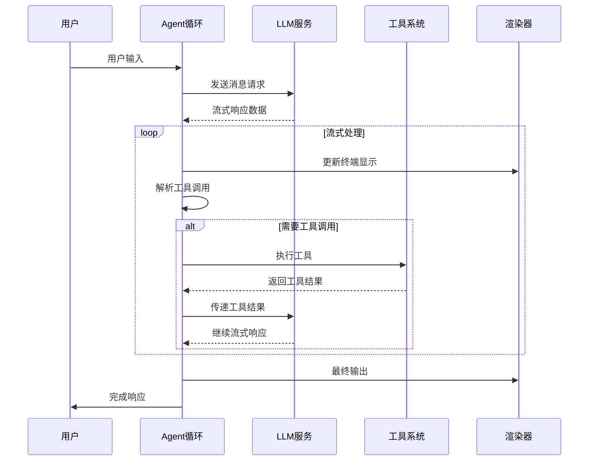
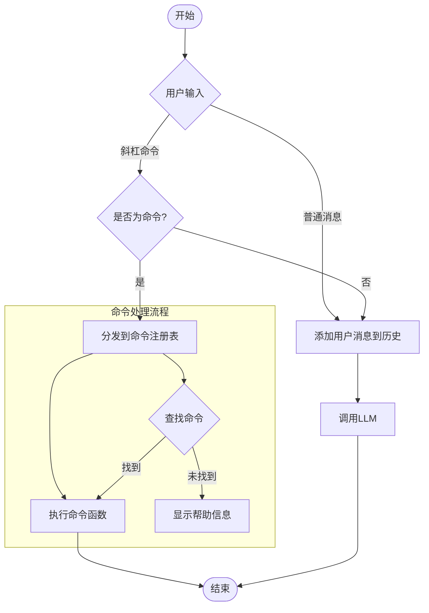
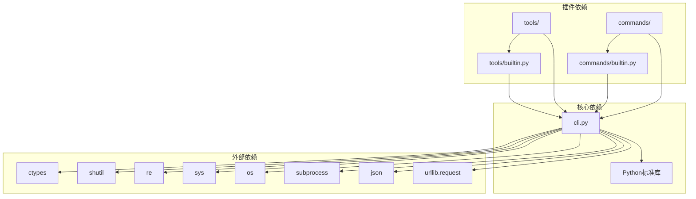

# 核心架构设计

<cite>
**本文档引用的文件**
- [cli.py](file://cli.py)
- [commands/__init__.py](file://commands/__init__.py)
- [commands/builtin.py](file://commands/builtin.py)
- [tools/__init__.py](file://tools/__init__.py)
- [tools/builtin.py](file://tools/builtin.py)
- [requirements.txt](file://requirements.txt)
- [run.ps1](file://run.ps1)
</cite>

## 目录
1. [引言](#引言)
2. [项目结构](#项目结构)
3. [核心组件](#核心组件)
4. [架构概览](#架构概览)
5. [详细组件分析](#详细组件分析)
6. [依赖关系分析](#依赖关系分析)
7. [性能考虑](#性能考虑)
8. [故障排除指南](#故障排除指南)
9. [结论](#结论)

## 引言

CodeAgent-TUI是一个基于Python标准库构建的终端智能代理系统，采用完全插件化的架构设计。该项目的核心设计理念是"核心最小化，插件最大化"——核心系统仅负责循环调度、渲染和状态管理，而所有具体的工具功能和命令逻辑都通过插件形式动态加载。

该系统支持：
- **装饰器模式的插件注册机制**：通过`@tool`和`@command`装饰器实现声明式插件注册
- **流式处理架构**：支持OpenAI格式的流式LLM通信和实时终端渲染
- **事件驱动的交互模式**：基于用户输入和AI响应的事件循环
- **工作区感知能力**：自动扫描项目上下文并注入系统提示

## 项目结构

项目采用清晰的模块化组织结构，遵循"核心+插件"的设计模式：



**图表来源**
- [cli.py:1-532](file://cli.py#L1-L532)
- [tools/builtin.py:1-90](file://tools/builtin.py#L1-L90)
- [commands/builtin.py:1-91](file://commands/builtin.py#L1-L91)

**章节来源**
- [cli.py:16-40](file://cli.py#L16-L40)
- [requirements.txt:1-7](file://requirements.txt#L1-L7)

## 核心组件

### Ctx上下文管理系统

Ctx类是整个系统的核心状态容器，为所有插件提供统一的状态访问接口：



**图表来源**
- [cli.py:255-321](file://cli.py#L255-L321)
- [cli.py:173-203](file://cli.py#L173-L203)
- [cli.py:43-54](file://cli.py#L43-L54)

Ctx类的主要职责包括：
- **状态管理**：维护系统提示、工作区路径、供应商配置、模型选择等核心状态
- **工作区感知**：自动扫描项目结构和关键文件，构建项目上下文
- **配置管理**：提供供应商切换、模型选择、工作区变更等功能
- **消息管理**：维护对话历史，支持多轮对话和工具调用结果的累积

**章节来源**
- [cli.py:255-321](file://cli.py#L255-L321)
- [cli.py:325-353](file://cli.py#L325-L353)

### 插件注册表系统

系统采用全局字典作为插件注册表，实现了松耦合的插件发现和管理机制：

```mermaid
graph LR
subgraph "插件注册表"
TBL[_TOOLS<br/>工具注册表]
CBL[_COMMANDS<br/>命令注册表]
end
subgraph "装饰器机制"
ToolDec[@tool装饰器]
CmdDec[@command装饰器]
end
subgraph "插件实现"
ToolPlugin[工具插件]
CmdPlugin[命令插件]
end
ToolDec --> TBL
CmdDec --> CBL
ToolPlugin --> ToolDec
CmdPlugin --> CmdDec
TBL --> ToolPlugin
CBL --> CmdPlugin
```

**图表来源**
- [cli.py:207-247](file://cli.py#L207-L247)
- [cli.py:211-234](file://cli.py#L211-L234)

装饰器模式的实现特点：
- **声明式注册**：插件只需使用`@tool`或`@command`装饰器即可自动注册
- **Schema生成**：自动生成符合OpenAI规范的工具Schema
- **类型安全**：通过参数验证确保工具调用的正确性
- **动态加载**：支持运行时动态加载和卸载插件

**章节来源**
- [cli.py:207-247](file://cli.py#L207-L247)
- [cli.py:211-234](file://cli.py#L211-L234)

### 终端渲染系统

RichLog类提供了高效的流式终端渲染能力，替代了传统的rich库：



**图表来源**
- [cli.py:173-203](file://cli.py#L173-L203)
- [cli.py:126-152](file://cli.py#L126-L152)

渲染系统的关键特性：
- **ANSI转义码支持**：完整的颜色和样式控制
- **智能换行**：按终端宽度自动换行，保持视觉一致性
- **增量更新**：使用ANSI光标控制实现高效的增量渲染
- **Markdown支持**：原生支持标题、列表、代码块等Markdown语法

**章节来源**
- [cli.py:173-203](file://cli.py#L173-L203)
- [cli.py:126-152](file://cli.py#L126-L152)

## 架构概览

CodeAgent-TUI采用了典型的"核心+插件"架构模式，核心系统保持极简，所有业务逻辑通过插件扩展：



**图表来源**
- [cli.py:373-528](file://cli.py#L373-L528)
- [cli.py:358-371](file://cli.py#L358-L371)

## 详细组件分析

### 流式处理架构

系统实现了完整的流式处理管道，支持LLM通信、工具调用协调和终端渲染：



**图表来源**
- [cli.py:389-487](file://cli.py#L389-L487)
- [cli.py:417-458](file://cli.py#L417-L458)

流式处理的关键实现细节：
- **HTTP流式读取**：使用urllib的流式接口处理LLM的SSE响应
- **增量解析**：逐行解析JSON数据，实时提取content和tool_calls
- **缓冲管理**：维护工具调用缓冲区，确保工具调用的完整性
- **并发协调**：在流式接收的同时进行工具调用，避免阻塞

**章节来源**
- [cli.py:389-487](file://cli.py#L389-L487)
- [cli.py:417-458](file://cli.py#L417-L458)

### 事件驱动交互模式

系统采用事件驱动的交互模式，通过命令分发机制实现松耦合的插件通信：



**图表来源**
- [cli.py:504-528](file://cli.py#L504-L528)
- [cli.py:515-522](file://cli.py#L515-L522)

事件处理机制的特点：
- **统一入口**：所有用户输入都经过主循环处理
- **命令优先**：以"/"开头的输入被视为命令，优先处理
- **插件化扩展**：新命令通过装饰器自动注册，无需修改核心代码
- **错误处理**：提供友好的错误提示和帮助信息

**章节来源**
- [cli.py:504-528](file://cli.py#L504-L528)
- [cli.py:515-522](file://cli.py#L515-L522)

### 状态管理机制

系统通过Ctx类实现了集中式的状态管理，确保插件间的数据共享和一致性：

```mermaid
stateDiagram-v2
[*] --> 初始化
初始化 --> 工作区扫描 : 创建Ctx实例
工作区扫描 --> 系统提示构建 : 扫描项目上下文
系统提示构建 --> 等待输入 : 准备就绪
state 等待输入 {
[*] --> 用户输入
用户输入 --> 命令处理 : 以"/"开头
用户输入 --> 对话模式 : 普通消息
命令处理 --> 等待输入
对话模式 --> LLM调用
}
state LLM调用 {
[*] --> 发送请求
发送请求 --> 接收流式响应
接收流式响应 --> 工具调用检查
工具调用检查 --> 工具调用 : 存在工具调用
工具调用检查 --> 对话完成 : 无工具调用
工具调用 --> 发送工具结果
发送工具结果 --> 接收流式响应
}
等待输入 --> [*] : 退出命令
```

**图表来源**
- [cli.py:255-321](file://cli.py#L255-L321)
- [cli.py:389-487](file://cli.py#L389-L487)

状态管理的关键特性：
- **持久化存储**：所有对话历史保存在messages列表中
- **动态更新**：工作区变更会自动刷新系统提示
- **配置管理**：供应商和模型配置可动态切换
- **插件接口**：提供统一的插件访问接口

**章节来源**
- [cli.py:255-321](file://cli.py#L255-L321)
- [cli.py:389-487](file://cli.py#L389-L487)

## 依赖关系分析

系统采用严格的依赖管理策略，确保核心模块的独立性和插件的可替换性：



**图表来源**
- [cli.py:1-15](file://cli.py#L1-L15)
- [requirements.txt:1-7](file://requirements.txt#L1-L7)

依赖关系分析：
- **零第三方依赖**：完全基于Python 3.12标准库
- **单向依赖**：插件依赖核心，核心不依赖插件
- **接口隔离**：通过明确的接口定义实现松耦合
- **向后兼容**：核心API保持稳定，便于插件升级

**章节来源**
- [requirements.txt:1-7](file://requirements.txt#L1-L7)
- [cli.py:1-15](file://cli.py#L1-L15)

## 性能考虑

系统在设计时充分考虑了性能优化，特别是在流式处理和内存管理方面：

### 内存优化策略
- **增量渲染**：使用ANSI光标控制实现内存友好的增量更新
- **流式处理**：LLM响应采用流式处理，避免一次性加载大量数据
- **缓冲管理**：工具调用缓冲区限制在合理范围内，防止内存泄漏

### I/O优化策略
- **异步网络**：虽然使用urllib，但通过流式接口实现非阻塞I/O
- **批量处理**：工具调用结果批量处理，减少系统调用次数
- **缓存机制**：项目上下文扫描结果在工作区内缓存

### 并发处理
- **单线程模型**：采用单线程事件循环，简化并发复杂度
- **非阻塞I/O**：所有网络操作都是非阻塞的
- **超时控制**：工具执行设置合理的超时时间

## 故障排除指南

### 常见问题诊断

**插件加载失败**
- 检查插件文件命名是否以字母开头（避免以下划线开头）
- 确认插件文件包含有效的装饰器定义
- 验证插件导入路径是否正确

**LLM连接问题**
- 检查供应商配置中的base_url和api_key
- 验证网络连接和防火墙设置
- 确认供应商支持stream=True参数

**终端渲染异常**
- 检查终端是否支持ANSI转义码
- 验证UTF-8编码设置
- 确认终端宽度检测正常工作

### 调试技巧

**启用详细日志**
- 在插件中使用`ctx.print()`输出调试信息
- 利用`/clear`命令清理对话历史
- 使用`/pwd`确认当前工作区路径

**性能监控**
- 观察工具调用耗时
- 监控内存使用情况
- 分析流式响应延迟

**章节来源**
- [cli.py:367-371](file://cli.py#L367-L371)
- [cli.py:406-412](file://cli.py#L406-L412)

## 结论

CodeAgent-TUI展现了优秀的软件架构设计原则：

### 设计优势
- **高度模块化**：核心与插件完全分离，易于维护和扩展
- **强健的插件系统**：装饰器模式实现声明式插件注册
- **优雅的流式处理**：支持实时终端渲染和工具调用协调
- **简洁的依赖管理**：零第三方依赖，降低维护成本

### 技术创新点
- **装饰器模式应用**：将复杂的插件注册机制封装为简单的装饰器
- **流式终端渲染**：在标准库基础上实现高效的增量渲染
- **工作区感知**：自动构建项目上下文，提升AI理解能力
- **事件驱动架构**：通过命令分发实现松耦合的插件通信

### 扩展建议
- **插件热重载**：支持运行时动态加载和卸载插件
- **插件版本管理**：实现插件版本兼容性和依赖管理
- **插件市场**：建立插件发布和分发机制
- **性能监控**：添加详细的性能指标和监控功能

该架构为类似AI代理系统的开发提供了优秀的参考模板，展示了如何在保持核心简洁的同时，通过插件化设计实现强大的功能扩展。