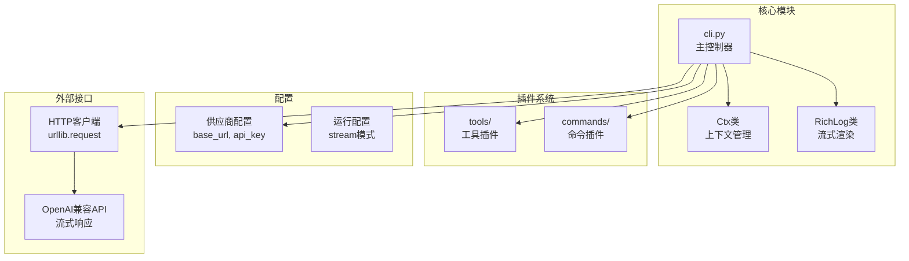
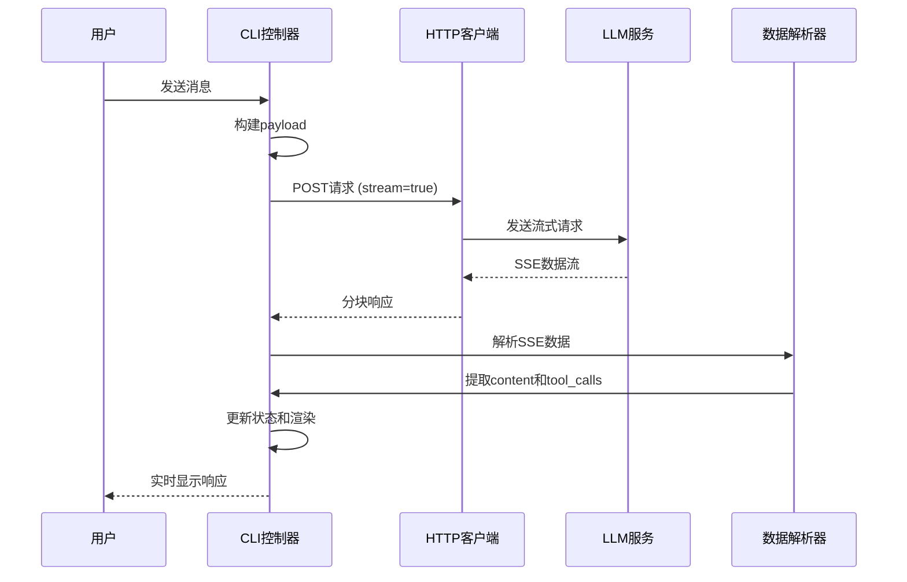
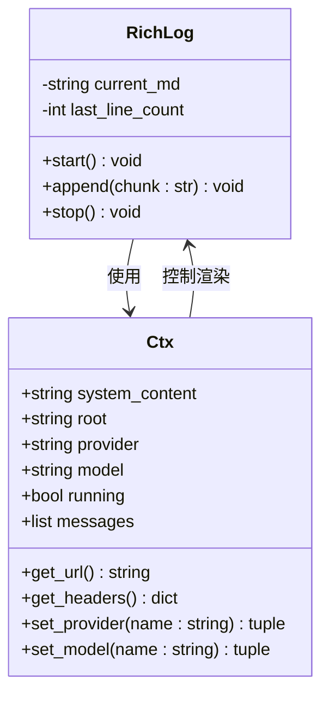
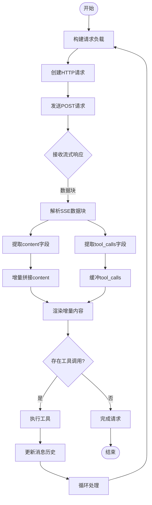
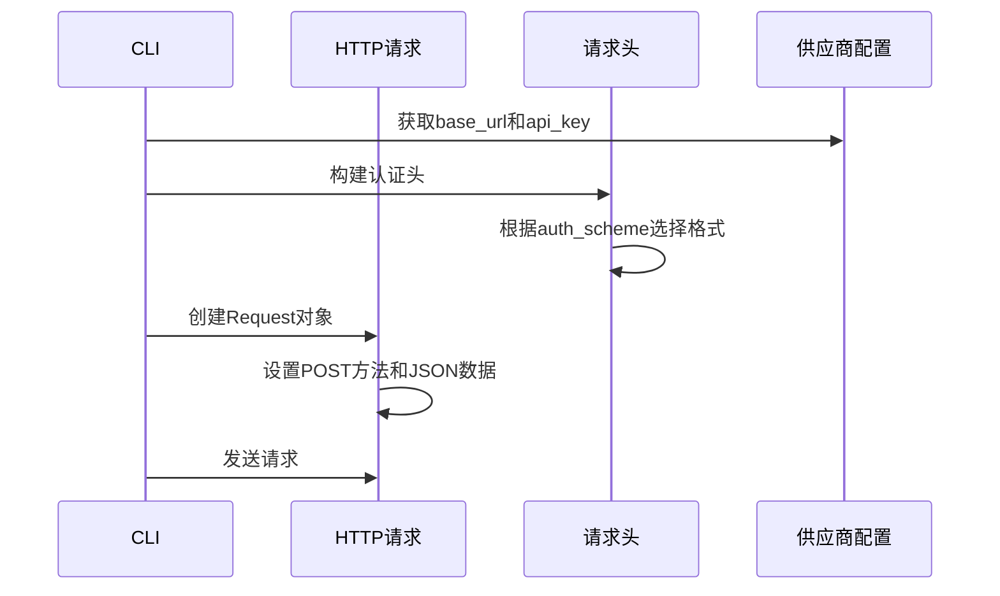
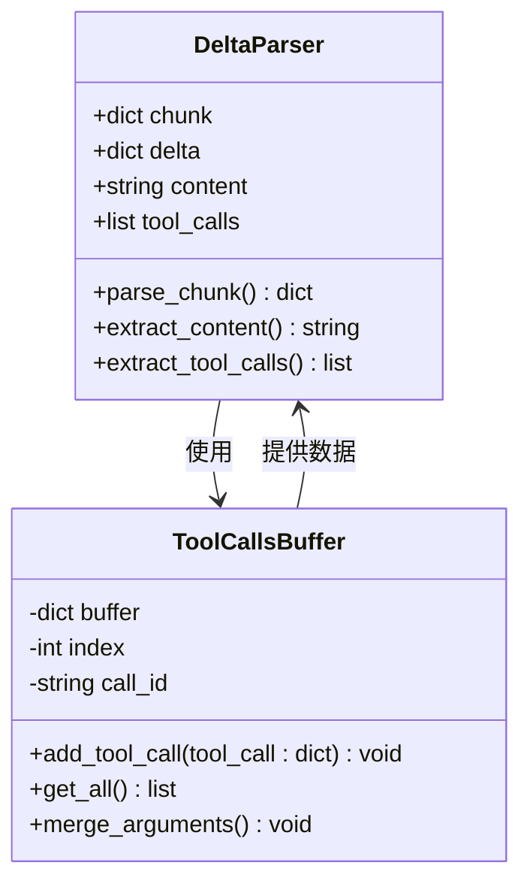
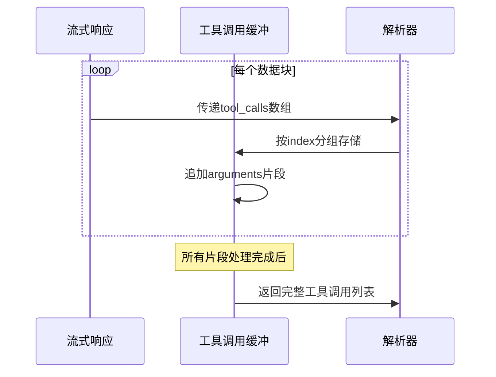
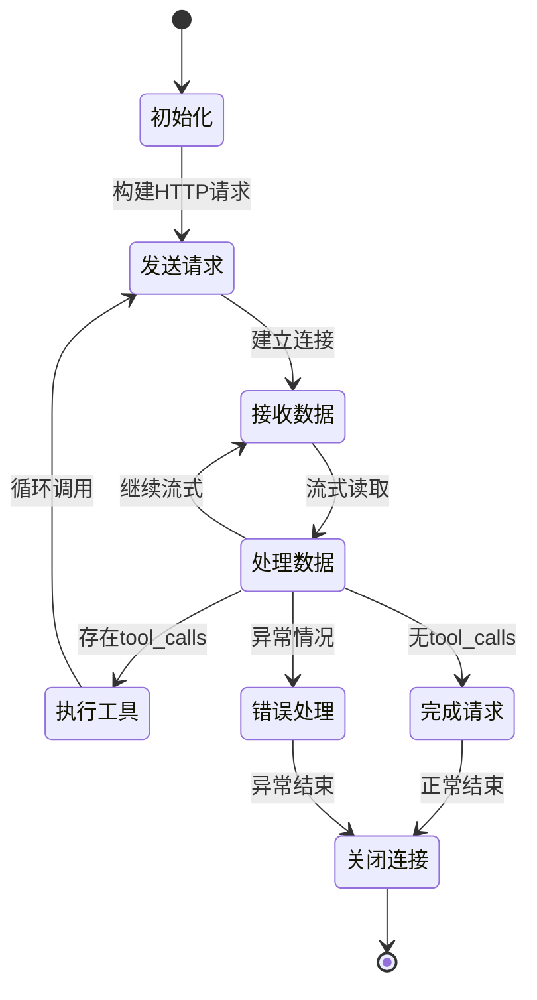
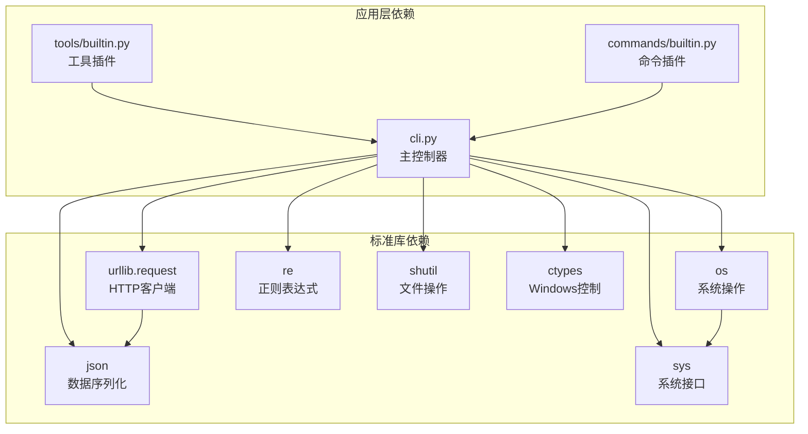
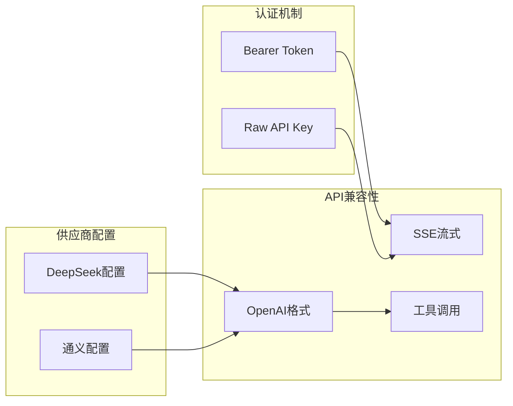

# LLM流式通信

<cite>
**本文档引用的文件**
- [cli.py](file://cli.py)
- [tools/builtin.py](file://tools/builtin.py)
- [commands/builtin.py](file://commands/builtin.py)
- [run.ps1](file://run.ps1)
- [requirements.txt](file://requirements.txt)
</cite>

## 目录
1. [简介](#简介)
2. [项目结构](#项目结构)
3. [核心组件](#核心组件)
4. [架构概览](#架构概览)
5. [详细组件分析](#详细组件分析)
6. [依赖关系分析](#依赖关系分析)
7. [性能考虑](#性能考虑)
8. [故障排除指南](#故障排除指南)
9. [结论](#结论)

## 简介

CodeAgent-TUI是一个基于Python 3.12标准库构建的终端AI助手，专门实现了LLM流式通信功能。该项目的核心特性是通过OpenAI兼容的流式API实现实时响应，支持工具调用和增量内容渲染。系统完全基于标准库，无需额外的第三方依赖，展现了优雅的工程设计。

## 项目结构

项目采用模块化架构，主要包含以下核心组件：



**图表来源**
- [cli.py:389-487](file://cli.py#L389-L487)
- [cli.py:255-321](file://cli.py#L255-L321)
- [cli.py:173-203](file://cli.py#L173-L203)

**章节来源**
- [cli.py:1-532](file://cli.py#L1-L532)
- [requirements.txt:1-7](file://requirements.txt#L1-L7)

## 核心组件

### 流式HTTP请求构建

系统通过`call_llm`函数实现完整的流式请求生命周期管理：



**图表来源**
- [cli.py:389-487](file://cli.py#L389-L487)
- [cli.py:403-405](file://cli.py#L403-L405)

### 内容渲染系统

`RichLog`类实现了高效的增量渲染机制：



**图表来源**
- [cli.py:173-203](file://cli.py#L173-L203)
- [cli.py:255-321](file://cli.py#L255-L321)

**章节来源**
- [cli.py:389-487](file://cli.py#L389-L487)
- [cli.py:173-203](file://cli.py#L173-L203)

## 架构概览

系统采用事件驱动的流式架构，核心流程如下：



**图表来源**
- [cli.py:389-487](file://cli.py#L389-L487)
- [cli.py:414-460](file://cli.py#L414-L460)

## 详细组件分析

### HTTP流式请求处理

#### 请求构建机制

系统通过`urllib.request.Request`构建HTTP请求，支持多种认证方案：



**图表来源**
- [cli.py:292-298](file://cli.py#L292-L298)
- [cli.py:403-405](file://cli.py#L403-L405)

#### 错误处理策略

系统实现了多层次的错误处理机制：

| 错误类型 | 处理策略 | 具体实现 |
|---------|---------|----------|
| HTTP错误 | 捕获HTTPError，读取响应体 | [cli.py:406-412](file://cli.py#L406-L412) |
| 连接错误 | 捕获URLError，显示原因 | [cli.py:410-412](file://cli.py#L410-L412) |
| JSON解析错误 | 忽略无效JSON，继续处理 | [cli.py:451-452](file://cli.py#L451-L452) |
| 流式响应异常 | 安全关闭连接，释放资源 | [cli.py:455-458](file://cli.py#L455-L458) |

**章节来源**
- [cli.py:406-412](file://cli.py#L406-L412)
- [cli.py:451-458](file://cli.py#L451-L458)

### 流式数据解析机制

#### SSE数据流处理

系统严格按照Server-Sent Events协议处理流式响应：

```mermaid
flowchart TD
Line[接收原始行] --> Strip[去除换行符]
Strip --> CheckPrefix{检查"data:"前缀}
CheckPrefix --> |无前缀| Skip[跳过此行]
CheckPrefix --> |有前缀| ExtractData[提取JSON数据]
ExtractData --> CheckDone{检查[DONE]标记}
CheckDone --> |是| Stop[停止处理]
CheckDone --> |否| ParseJSON[解析JSON]
ParseJSON --> ExtractDelta[提取delta对象]
ExtractDelta --> CheckContent{存在content?}
CheckContent --> |是| AppendContent[追加content]
CheckContent --> |否| CheckTools{存在tool_calls?}
CheckTools --> |是| BufferTools[缓冲tool_calls]
CheckTools --> |否| NextChunk[处理下一个数据块]
AppendContent --> Render[实时渲染]
BufferTools --> NextChunk
Render --> NextChunk
NextChunk --> Line
Stop --> End[结束]
```

**图表来源**
- [cli.py:420-452](file://cli.py#L420-L452)

#### JSON片段处理

系统实现了robust的JSON解析和验证机制：



**图表来源**
- [cli.py:428-450](file://cli.py#L428-L450)

**章节来源**
- [cli.py:420-452](file://cli.py#L420-L452)
- [cli.py:431-450](file://cli.py#L431-L450)

### 增量内容处理机制

#### Content字段累积

系统实现了高效的增量内容累积机制：

| 特性 | 实现方式 | 性能影响 |
|------|----------|----------|
| 增量拼接 | 直接字符串连接 | O(n)时间复杂度 |
| 实时渲染 | ANSI控制码重绘 | 最小化屏幕闪烁 |
| 缓冲管理 | 逐块处理，避免内存峰值 | 低内存占用 |
| 错误恢复 | 跳过无效数据块 | 提高鲁棒性 |

#### Tool Calls缓冲机制

系统通过字典索引实现多工具调用的有序缓冲：



**图表来源**
- [cli.py:436-450](file://cli.py#L436-L450)

**章节来源**
- [cli.py:414-460](file://cli.py#L414-L460)

### 连接管理策略

#### 生命周期管理

系统实现了完整的连接生命周期管理：



**图表来源**
- [cli.py:389-487](file://cli.py#L389-L487)
- [cli.py:454-458](file://cli.py#L454-L458)

#### 资源清理

系统确保所有资源得到正确清理：

| 资源类型 | 清理时机 | 实现方式 |
|---------|---------|----------|
| HTTP响应 | finally块 | [cli.py:455-458](file://cli.py#L455-L458) |
| 渲染状态 | stop()方法 | [cli.py:197-202](file://cli.py#L197-L202) |
| 缓冲数据 | 函数结束 | 自动垃圾回收 |
| 文件句柄 | 上下文管理 | 工具插件内部处理 |

**章节来源**
- [cli.py:454-458](file://cli.py#L454-L458)
- [cli.py:197-202](file://cli.py#L197-L202)

## 依赖关系分析

### 核心依赖图



**图表来源**
- [requirements.txt:1-7](file://requirements.txt#L1-L7)
- [cli.py:1-14](file://cli.py#L1-L14)

### 外部接口依赖

系统对外部API的依赖关系：



**图表来源**
- [cli.py:19-34](file://cli.py#L19-L34)
- [cli.py:295-298](file://cli.py#L295-L298)

**章节来源**
- [requirements.txt:1-7](file://requirements.txt#L1-L7)
- [cli.py:19-34](file://cli.py#L19-L34)

## 性能考虑

### 流式处理优化

#### 内存管理

系统采用流式处理策略，避免一次性加载大量数据：

- **零拷贝原则**: 直接处理字节流，减少内存复制
- **增量解析**: 逐块解析JSON，避免大对象创建
- **缓冲控制**: 限制工具调用缓冲大小，防止内存泄漏

#### 渲染优化

`RichLog`类实现了高效的增量渲染：

- **ANSI控制码**: 使用光标移动和清屏指令，最小化屏幕更新
- **行计数缓存**: 记录上次渲染的行数，精确控制重绘范围
- **宽度自适应**: 根据终端宽度动态调整内容布局

### 网络性能

#### 连接复用

系统通过合理的连接管理实现性能优化：

- **单连接流式**: 每次对话使用单一HTTP连接
- **超时控制**: 合理设置请求超时，避免长时间阻塞
- **错误快速恢复**: 网络异常时快速失败，减少资源占用

#### 数据传输优化

- **最小化传输**: 仅传输必要的JSON字段
- **压缩支持**: 利用HTTP压缩减少带宽占用
- **批量处理**: 工具调用结果批量提交

## 故障排除指南

### 常见问题诊断

#### HTTP连接问题

| 问题症状 | 可能原因 | 解决方案 |
|---------|---------|----------|
| HTTP 401错误 | 认证失败 | 检查api_key配置 |
| HTTP 403错误 | 权限不足 | 验证供应商账户状态 |
| HTTP 429错误 | 请求频率过高 | 实现退避重试机制 |
| 连接超时 | 网络不稳定 | 增加超时时间，检查防火墙 |

#### 流式响应问题

| 问题症状 | 可能原因 | 解决方案 |
|---------|---------|----------|
| 数据丢失 | 网络中断 | 实现断线重连 |
| JSON解析失败 | 数据格式异常 | 添加数据验证和回退机制 |
| 渲染卡顿 | 终端性能问题 | 降低渲染频率，优化ANSI处理 |

#### 工具调用问题

| 问题症状 | 可能原因 | 解决方案 |
|---------|---------|----------|
| 工具执行失败 | 参数错误 | 验证工具参数schema |
| 结果过大 | 输出超长 | 实现结果分页显示 |
| 超时异常 | 命令执行时间过长 | 设置合理超时时间 |

### 调试技巧

#### 日志记录

系统提供了多层次的日志记录机制：

```python
# 在关键位置添加调试输出
print(f"DEBUG: 处理第 {rounds} 轮对话")
print(f"DEBUG: 收到 {len(tool_calls)} 个工具调用")
print(f"DEBUG: 渲染内容长度: {len(full_content)}")
```

#### 性能监控

建议添加简单的性能监控：

```python
import time
start_time = time.time()
# 执行耗时操作
elapsed = time.time() - start_time
print(f"操作耗时: {elapsed:.2f}秒")
```

**章节来源**
- [cli.py:406-412](file://cli.py#L406-L412)
- [cli.py:451-452](file://cli.py#L451-L452)

## 结论

CodeAgent-TUI的LLM流式通信系统展现了优秀的工程实践，通过精心设计的架构实现了高效、稳定的实时交互体验。系统的主要优势包括：

### 技术亮点

1. **纯标准库实现**: 完全基于Python 3.12标准库，无需第三方依赖
2. **流式处理架构**: 采用事件驱动的流式处理，实现真正的实时响应
3. **健壮的错误处理**: 多层次的异常处理机制，确保系统稳定性
4. **高效的渲染系统**: 基于ANSI控制码的增量渲染，提供流畅的用户体验

### 设计优势

- **模块化设计**: 清晰的职责分离，便于维护和扩展
- **插件化架构**: 支持动态加载工具和命令，高度可扩展
- **跨平台兼容**: 通过标准库实现，支持Windows、Linux、macOS
- **资源友好**: 合理的内存和网络资源管理

### 应用价值

该系统为开发者提供了一个学习和参考的优秀案例，展示了如何在不依赖外部框架的情况下实现复杂的流式通信功能。其设计理念和实现技巧对于构建高性能的终端应用程序具有重要的借鉴意义。