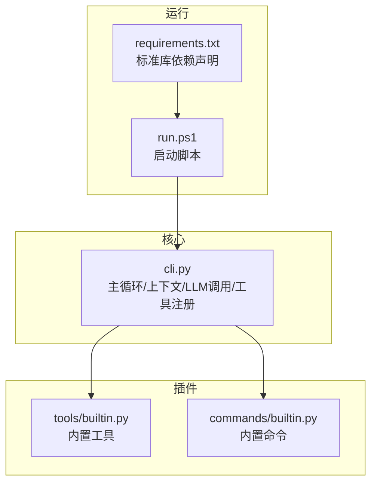
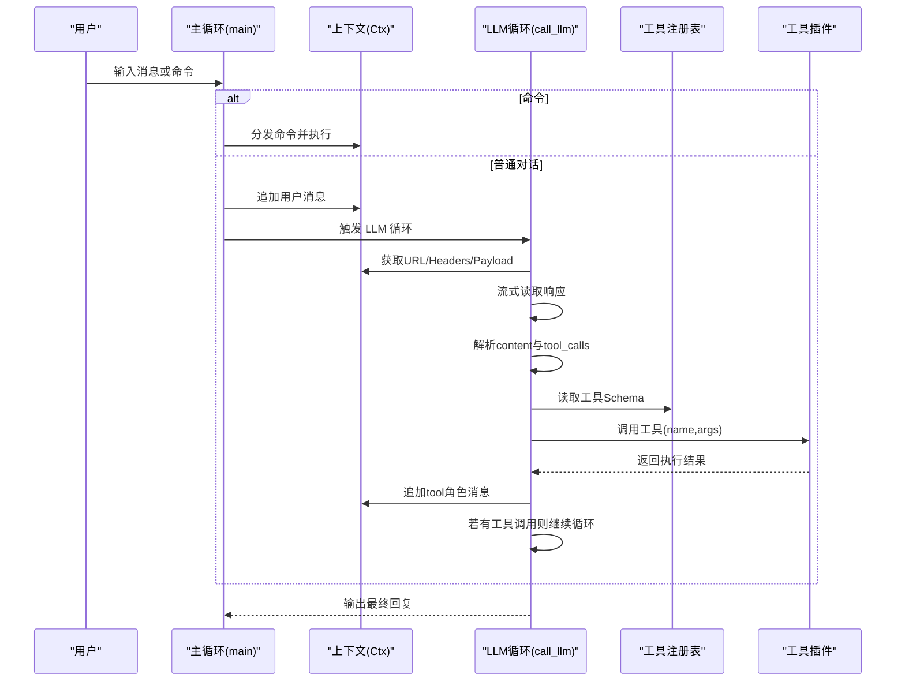
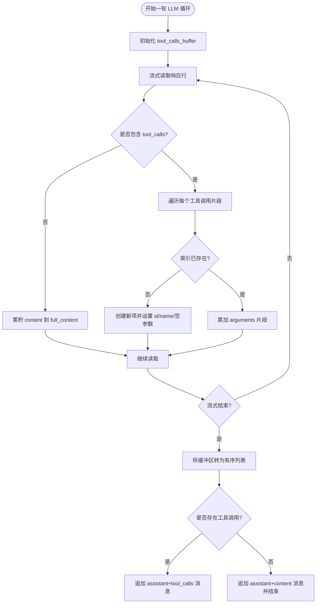
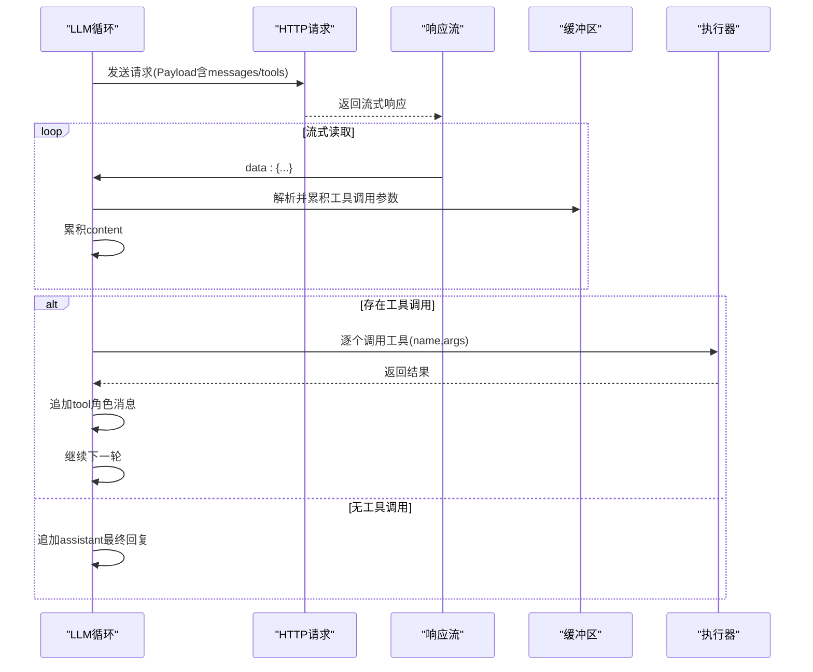
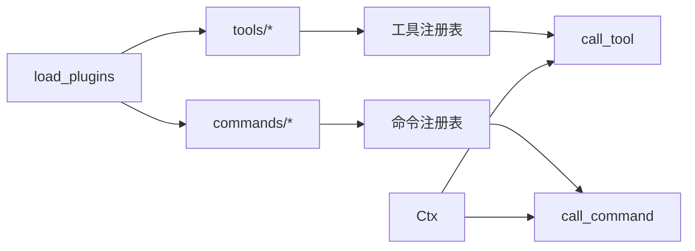

# 工具调用协调

<cite>
**本文引用的文件**
- [cli.py](file://cli.py)
- [tools/builtin.py](file://tools/builtin.py)
- [commands/builtin.py](file://commands/builtin.py)
- [run.ps1](file://run.ps1)
- [requirements.txt](file://requirements.txt)
</cite>

## 目录
1. [简介](#简介)
2. [项目结构](#项目结构)
3. [核心组件](#核心组件)
4. [架构总览](#架构总览)
5. [详细组件分析](#详细组件分析)
6. [依赖分析](#依赖分析)
7. [性能考量](#性能考量)
8. [故障排查指南](#故障排查指南)
9. [结论](#结论)
10. [附录](#附录)

## 简介
本文件面向 CodeAgent-TUI 的“工具调用协调”主题，系统性阐述以下内容：
- 工具调用的解析与执行流程：包括工具调用缓冲区管理、参数 JSON 解析、工具执行循环机制
- 工具调用与 LLM 响应的协调模式：多轮工具调用处理与消息历史维护
- 工具执行结果的收集与回传机制：以及失败处理策略
- 工具调用索引管理与参数累积机制
- 工具调用的限制与安全考虑

## 项目结构
该项目采用“插件化核心 + 内置工具/命令”的组织方式：
- 核心入口与调度逻辑集中在主文件中，负责加载插件、维护上下文、驱动 LLM 循环与工具执行
- 工具插件位于 tools/ 目录，命令插件位于 commands/ 目录，二者均通过装饰器注册到核心注册表
- 启动脚本提供跨平台运行入口，要求 Python 3.12 标准库

图表来源
- [cli.py:356-372](file://cli.py#L356-L372)
- [tools/builtin.py:1-10](file://tools/builtin.py#L1-L10)
- [commands/builtin.py:1-10](file://commands/builtin.py#L1-L10)
- [run.ps1:1-24](file://run.ps1#L1-L24)
- [requirements.txt:1-7](file://requirements.txt#L1-L7)

章节来源
- [cli.py:356-372](file://cli.py#L356-L372)
- [run.ps1:1-24](file://run.ps1#L1-L24)
- [requirements.txt:1-7](file://requirements.txt#L1-L7)

## 核心组件
- 工具注册与调用
  - 工具注册装饰器与注册表：用于将插件中的工具函数注册到核心，并生成工具 Schema
  - 工具调用入口：根据名称与参数调用对应插件实现
- 命令注册与调用
  - 命令注册装饰器与注册表：用于将插件中的命令函数注册到核心
  - 命令调用入口：根据名称与参数字符串调用对应插件实现
- 上下文对象
  - 维护系统提示、消息历史、工作区路径、供应商与模型等状态
  - 提供工作区扫描、路径解析、HTTP 请求头构造等能力
- LLM 循环与工具协调
  - 流式调用 LLM，解析增量响应中的内容与工具调用片段
  - 构建工具调用缓冲区，累积参数 JSON 片段
  - 将工具调用结果回传至消息历史，形成多轮工具调用闭环

章节来源
- [cli.py:207-247](file://cli.py#L207-L247)
- [cli.py:255-321](file://cli.py#L255-L321)
- [cli.py:389-487](file://cli.py#L389-L487)

## 架构总览
整体流程由“用户输入 -> 命令分发/普通对话 -> LLM 流式响应 -> 工具调用解析 -> 工具执行 -> 结果回传 -> 继续对话/结束”构成。

图表来源
- [cli.py:491-528](file://cli.py#L491-L528)
- [cli.py:389-487](file://cli.py#L389-L487)
- [cli.py:207-247](file://cli.py#L207-L247)
- [tools/builtin.py:17-90](file://tools/builtin.py#L17-L90)

## 详细组件分析

### 工具调用缓冲区管理与参数累积
- 缓冲区结构
  - 以工具调用索引为键，维护每个工具调用的元信息与累积参数
  - 初始项包含 id、类型、函数名与空参数字符串
- 参数累积机制
  - 从增量响应中提取每个工具调用的参数片段，按索引拼接到对应项的参数字符串
  - 通过 JSON 解析将累积的参数字符串转换为字典，作为工具调用的实际参数
- 索引管理
  - 使用 index 字段标识同一工具调用的不同片段
  - 若未出现过该索引，则初始化该项；否则累加参数

图表来源
- [cli.py:414-460](file://cli.py#L414-L460)
- [cli.py:436-450](file://cli.py#L436-L450)

章节来源
- [cli.py:414-460](file://cli.py#L414-L460)
- [cli.py:436-450](file://cli.py#L436-L450)

### 工具执行循环机制
- 循环条件
  - 最大轮次限制，防止无限循环
  - 每轮重新构建请求负载，确保携带最新消息历史与工具调用结果
- 执行步骤
  - 发送请求，接收流式响应
  - 解析增量内容与工具调用片段，填充缓冲区
  - 若本轮存在工具调用，则追加 assistant+tool_calls 消息
  - 顺序调用各工具，将结果以 tool 角色消息回传
  - 继续下一轮直至无工具调用或达到上限

图表来源
- [cli.py:389-487](file://cli.py#L389-L487)

章节来源
- [cli.py:389-487](file://cli.py#L389-L487)

### 工具调用与 LLM 响应的协调模式
- 多轮工具调用
  - 每当 LLM 在一轮中发出工具调用，核心会将其追加到消息历史
  - 工具执行完成后，结果以 tool 角色消息回传，LLM 再次生成回复
  - 通过最大轮次限制控制整体交互深度
- 消息历史维护
  - system 消息随工作区变化动态重建
  - user/assistant/tool 消息按顺序累积，确保上下文连贯
  - 每轮重新序列化 payload，避免使用过期的历史数据

章节来源
- [cli.py:266-277](file://cli.py#L266-L277)
- [cli.py:389-487](file://cli.py#L389-L487)

### 工具执行结果的收集与回传机制
- 结果收集
  - 工具执行异常会被捕获并转化为可读的错误字符串
  - 终端展示时对长结果进行截断与标注，但完整结果仍会传给 LLM
- 回传机制
  - 以 tool 角色消息形式追加到消息历史，包含工具调用 id 与内容
  - 便于后续 LLM 基于工具结果进行推理与总结

章节来源
- [cli.py:375-387](file://cli.py#L375-L387)
- [cli.py:475-480](file://cli.py#L475-L480)

### 工具调用失败的处理策略
- JSON 解析失败
  - 当工具参数 JSON 片段无法解析时，使用空参数字典兜底
- 工具执行异常
  - 捕获异常并返回错误信息，不影响后续轮次
- HTTP/连接错误
  - LLM 循环中对 HTTP 错误与连接错误进行打印并提前终止

章节来源
- [cli.py:472-478](file://cli.py#L472-L478)
- [cli.py:406-412](file://cli.py#L406-L412)

### 工具调用索引管理与参数累积机制
- 索引管理
  - 使用 index 字段区分同一工具调用的不同片段
  - 未见过的索引会创建新的调用项，已存在的索引则累加参数
- 参数累积
  - 将每次增量的 arguments 片段拼接到对应索引项的参数字符串
  - 在本轮结束时一次性解析为字典，减少中间态错误

章节来源
- [cli.py:438-450](file://cli.py#L438-L450)

### 工具注册与调用入口
- 工具注册
  - 通过装饰器将工具函数注册到核心注册表，并生成工具 Schema
- 工具调用
  - 根据名称与参数字典调用对应插件实现
- 内置工具示例
  - 文件读写与命令执行等基础能力，演示了如何扩展工具

章节来源
- [cli.py:211-226](file://cli.py#L211-L226)
- [cli.py:241-242](file://cli.py#L241-L242)
- [tools/builtin.py:17-90](file://tools/builtin.py#L17-L90)

## 依赖分析
- 插件加载
  - 核心通过扫描 tools 与 commands 目录，导入非下划线开头的模块，触发其装饰器注册
- 工具与命令注册表
  - 工具与命令分别维护独立的注册表，核心通过名称查找并调用
- 上下文依赖
  - LLM 循环与命令执行均依赖上下文提供的系统提示、消息历史、工作区与网络配置

图表来源
- [cli.py:358-371](file://cli.py#L358-L371)
- [cli.py:207-247](file://cli.py#L207-L247)

章节来源
- [cli.py:358-371](file://cli.py#L358-L371)
- [cli.py:207-247](file://cli.py#L207-L247)

## 性能考量
- 流式处理
  - 通过流式读取响应，尽早输出内容，提升交互体验
- 轮次限制
  - 设置最大轮次上限，避免长时间占用资源
- 结果截断
  - 终端展示对长结果进行截断，降低渲染开销
- 网络与解析
  - 对 HTTP 错误与 JSON 解析异常进行快速失败，减少无效重试

## 故障排查指南
- 工具调用未触发
  - 检查工具 Schema 是否正确注册，确认 LLM 是否具备工具可见性
  - 确认工具名称与参数 JSON 是否匹配
- 工具执行异常
  - 查看工具返回的错误字符串，定位插件实现问题
  - 检查工作区路径解析与权限
- HTTP/连接错误
  - 检查供应商配置、认证方案与网络连通性
- 命令无效
  - 确认命令名称是否在注册表中，参数格式是否正确

章节来源
- [cli.py:406-412](file://cli.py#L406-L412)
- [cli.py:475-478](file://cli.py#L475-L478)
- [cli.py:514-522](file://cli.py#L514-L522)

## 结论
CodeAgent-TUI 通过“插件化核心 + 流式 LLM + 工具调用缓冲区”的设计，实现了稳定且可扩展的工具调用协调机制。其要点包括：
- 使用索引与参数累积机制可靠地解析多片段工具调用
- 通过消息历史与轮次限制维持多轮交互的可控性
- 将工具执行结果以 tool 角色消息回传，形成闭环
- 在错误处理与性能优化方面提供了稳健的保障

## 附录
- 启动与运行
  - 使用 PowerShell 脚本自动创建虚拟环境并运行主程序
  - 项目仅依赖 Python 3.12 标准库，无需额外安装第三方包

章节来源
- [run.ps1:1-24](file://run.ps1#L1-L24)
- [requirements.txt:1-7](file://requirements.txt#L1-L7)