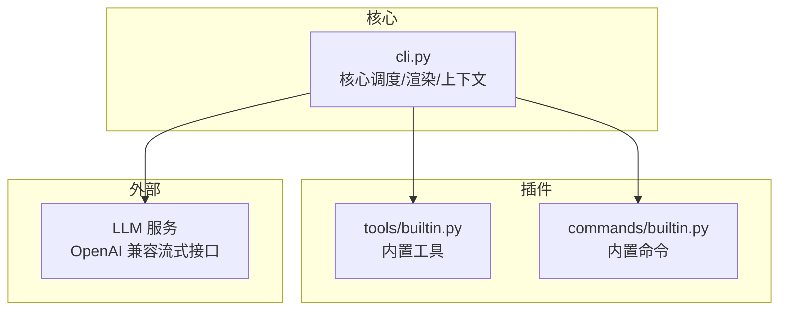
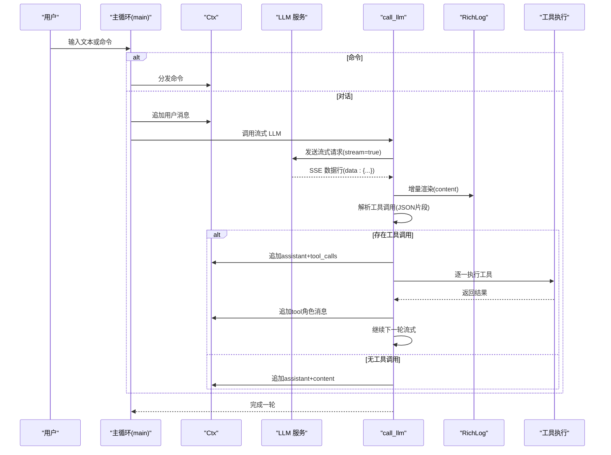
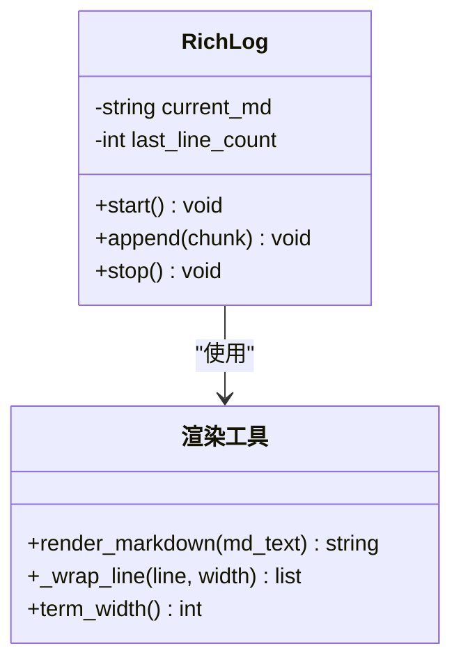
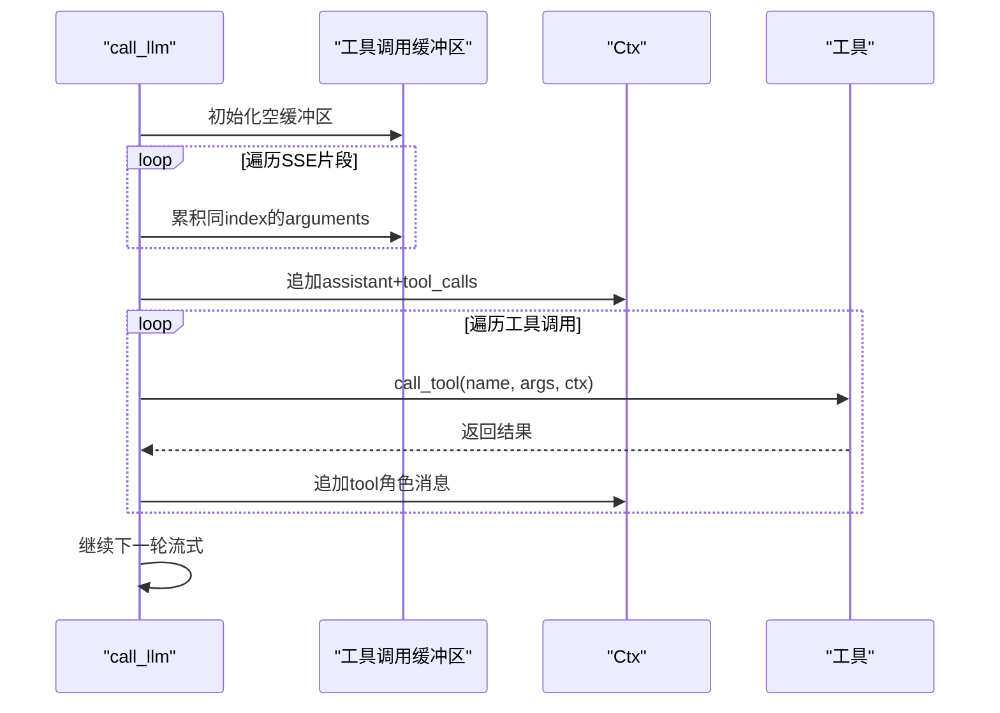
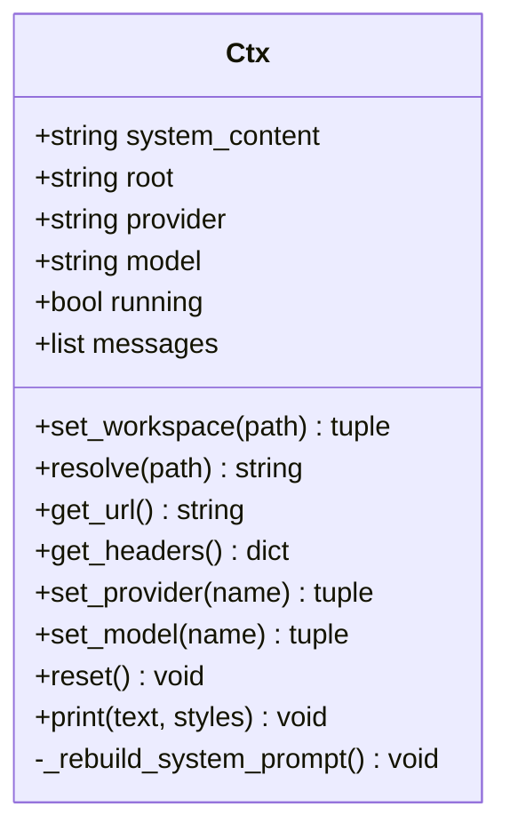
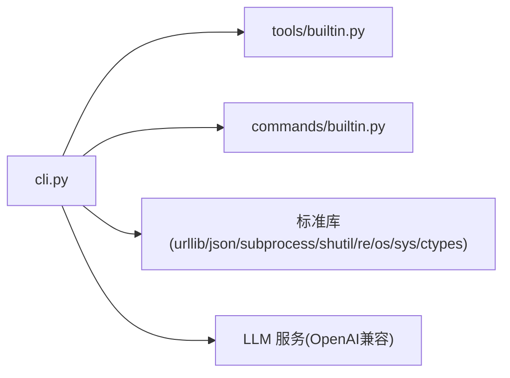

# 流式处理机制

<cite>
**本文引用的文件**
- [cli.py](file://cli.py)
- [commands/builtin.py](file://commands/builtin.py)
- [tools/builtin.py](file://tools/builtin.py)
- [requirements.txt](file://requirements.txt)
- [run.ps1](file://run.ps1)
</cite>

## 目录
1. [简介](#简介)
2. [项目结构](#项目结构)
3. [核心组件](#核心组件)
4. [架构总览](#架构总览)
5. [详细组件分析](#详细组件分析)
6. [依赖分析](#依赖分析)
7. [性能考虑](#性能考虑)
8. [故障排除指南](#故障排除指南)
9. [结论](#结论)

## 简介
本文件面向 CodeAgent-TUI 的流式处理机制，系统性阐述以下主题：
- LLM 流式响应的处理流程：HTTP 流式传输、SSE 数据行解析、JSON 片段解析、增量内容渲染。
- 工具调用的协调机制：工具调用缓冲区、参数解析、执行循环与消息注入。
- RichLog 类的实现原理：ANSI 光标控制、增量渲染、内存管理与终端兼容性。
- 事件驱动的交互模式与状态管理：主循环、命令分发、上下文状态维护。
- 性能优化建议与故障排除方法。

## 项目结构
项目采用“核心+插件”的架构设计，核心位于 cli.py，工具与命令作为插件分别位于 tools/ 与 commands/ 目录，通过装饰器注册进入全局注册表，核心仅负责调度与渲染，不感知具体插件实现。



图表来源
- [cli.py](file://cli.py)
- [tools/builtin.py](file://tools/builtin.py)
- [commands/builtin.py](file://commands/builtin.py)

章节来源
- [cli.py](file://cli.py)
- [requirements.txt](file://requirements.txt)
- [run.ps1](file://run.ps1)

## 核心组件
- RichLog：基于 ANSI 光标控制的增量渲染组件，用于流式输出的“重绘”效果，替代第三方富文本库。
- Ctx：贯穿工具与命令的上下文对象，封装系统提示、消息历史、供应商/模型配置、工作区路径解析与 HTTP 头生成。
- call_llm：核心流式调用入口，负责构建请求、接收 SSE 数据行、解析 JSON 片段、增量渲染与工具调用协调。
- 注册表与装饰器：@tool 与 @command 装饰器将插件注册到全局字典，供核心动态调用。
- 内置插件：tools/builtin.py 提供文件读写与命令执行工具；commands/builtin.py 提供工作区切换、供应商/模型切换等命令。

章节来源
- [cli.py](file://cli.py)
- [tools/builtin.py](file://tools/builtin.py)
- [commands/builtin.py](file://commands/builtin.py)

## 架构总览
下图展示了从用户输入到 LLM 流式响应、再到工具调用与最终渲染的整体流程。



图表来源
- [cli.py](file://cli.py)

## 详细组件分析

### RichLog：ANSI 光标控制与增量渲染
- 设计目标：在终端中以“重绘”方式实现流式输出，避免频繁清屏导致闪烁，同时保持 Markdown 渲染与折行正确。
- 关键点
  - 维护 current_md（累积的 Markdown 文本）与 last_line_count（上次渲染的行数），用于计算 ANSI 光标回退与清屏。
  - append(chunk) 将增量内容拼接到 current_md，渲染为带颜色的多行文本，并按终端宽度折行；若存在上次行数，则通过 ANSI 控制码将光标回退到上一行并清屏，再输出新内容。
  - stop() 在结束时换行并清理状态，确保后续输出不受影响。
  - 终端兼容性：Windows 启用 VT 模式，stdout/stderr 强制 UTF-8 编码，避免表情符号等字符输出异常。
- 复杂度与性能
  - append 操作包含渲染与折行，时间复杂度近似 O(N)，其中 N 为渲染后的行数；内存占用随 current_md 累积增长，但仅用于增量重绘，停用后释放。
  - 通过 last_line_count 控制重绘范围，减少不必要的屏幕更新。



图表来源
- [cli.py](file://cli.py)

章节来源
- [cli.py](file://cli.py)

### LLM 流式响应处理：HTTP 流式传输与 JSON 片段解析
- 流式传输
  - 使用 urllib 发送 POST 请求，设置 stream=True，服务端以 SSE 形式推送 data: 行。
  - 逐行读取响应，过滤非 data: 行，遇到 [DONE] 结束。
- JSON 片段解析
  - 从 choices[0].delta 中提取 content 与 tool_calls。
  - content 为增量文本，直接拼接到 full_content 并通过 RichLog 渲染。
  - tool_calls 为数组，按 index 分组，累积 function.arguments。
- 工具调用协调
  - 将 assistant 的 content 与 tool_calls 追加到消息历史。
  - 对每个工具调用：尝试解析 arguments 为 JSON，执行对应工具，将结果以 tool 角色消息注入，随后继续下一轮流式。
  - 最大轮次限制防止无限循环。
- 错误处理
  - 捕获 HTTPError/URLError 并打印简要信息，避免中断主循环。

```mermaid
flowchart TD
Start(["开始流式调用"]) --> Build["构建请求体<br/>model/messages/tools/stream=true"]
Build --> Send["发送请求并接收响应"]
Send --> Loop{"遍历响应行"}
Loop --> |data: ...| Parse["解析JSON片段<br/>choices[0].delta"]
Parse --> HasContent{"有content?"}
HasContent --> |是| Append["拼接到full_content并渲染"]
HasContent --> |否| Next1["跳过"]
Parse --> HasTools{"有tool_calls?"}
HasTools --> |是| Buffer["按index累积arguments"]
HasTools --> |否| Next2["跳过"]
Append --> Loop
Buffer --> Loop
Next1 --> Loop
Next2 --> Loop
Loop --> |遇到[DONE]| Done["结束本轮"]
Loop --> |异常| Skip["忽略并继续"]
Done --> ToolCalls{"是否存在工具调用?"}
ToolCalls --> |是| Exec["执行工具并注入结果"]
ToolCalls --> |否| Save["保存assistant+content"]
Exec --> Continue{"是否继续?"}
Continue --> |是| Loop
Continue --> |否| End(["结束"])
Save --> End
```

图表来源
- [cli.py](file://cli.py)

章节来源
- [cli.py](file://cli.py)

### 工具调用缓冲区与执行循环
- 缓冲区结构
  - 以 index 为键的字典，每项包含 id、type、function.name、function.arguments。
  - 通过累积 arguments 实现参数的增量拼接，解决分片传输导致的参数不完整问题。
- 参数解析
  - 尝试将 arguments 解析为 JSON；失败时回退为空对象，避免中断执行。
- 执行循环
  - 逐一调用工具，捕获异常并返回错误信息；将结果以 tool_call_id 关联的消息注入上下文。
  - 继续下一轮流式，直到无工具调用或达到最大轮次。



图表来源
- [cli.py](file://cli.py)

章节来源
- [cli.py](file://cli.py)

### Ctx：上下文对象与状态管理
- 职责
  - 维护 system_content、root（工作区）、provider/model、running 标志、messages 列表。
  - 动态重建 system_prompt 并同步到 messages 首条，确保项目上下文与可用工具列表实时更新。
  - 提供 set_workspace、resolve、get_url、get_headers、set_provider、set_model、reset、print 等方法。
- 事件驱动交互
  - 主循环根据用户输入判断命令或普通对话；命令通过注册表分发至相应插件；对话通过 call_llm 触发流式处理。
- 状态一致性
  - 每轮流式调用前重新序列化 payload，携带上一轮工具调用结果，避免旧数据重复请求。



图表来源
- [cli.py](file://cli.py)

章节来源
- [cli.py](file://cli.py)

### 内置工具与命令
- 工具
  - write_file：将内容写入指定路径（自动创建目录）。
  - read_file：读取文件内容，支持分页（避免大文件被截断）。
  - run_command：执行 shell 命令并返回输出。
- 命令
  - /exit、/quit：退出程序。
  - /clear：清除对话历史。
  - /write <path>：用编辑器打开文件。
  - /help：显示可用命令。
  - /cd <dir>：切换工作区。
  - /pwd：显示当前工作区。
  - /provider [name]：切换供应商（无参列出）。
  - /model [name]：切换模型（无参列出当前供应商模型）。

章节来源
- [tools/builtin.py](file://tools/builtin.py)
- [commands/builtin.py](file://commands/builtin.py)

## 依赖分析
- 核心依赖
  - Python 3.12 标准库：urllib（HTTP）、json（解析）、subprocess（命令执行）、shutil/re（终端尺寸/正则）、os/sys/ctypes（平台兼容）。
- 插件加载
  - 通过 pkgutil 遍历 tools/ 与 commands/ 目录，导入非下划线开头的模块，触发装饰器注册。
- 外部接口
  - LLM 服务需兼容 OpenAI 格式，支持 stream=True 与 tools 字段。



图表来源
- [cli.py](file://cli.py)
- [requirements.txt](file://requirements.txt)

章节来源
- [requirements.txt](file://requirements.txt)
- [cli.py](file://cli.py)

## 性能考虑
- 流式渲染
  - RichLog 仅重绘最近一次渲染的行数，避免全屏刷新；建议在高吞吐场景下适当增大终端宽度以减少折行次数。
- JSON 解析
  - 对每个 SSE 行进行 JSON 解析，异常时跳过；可考虑缓存解析失败的行以便调试。
- 工具调用
  - 工具执行可能阻塞，建议在工具内部设置超时与资源限制；对大文件读写与命令执行使用分页/分块策略。
- 网络与并发
  - 当前实现为单线程顺序流式；如需更高吞吐，可在工具执行阶段引入异步或并发队列（需扩展核心）。
- 终端兼容
  - Windows 启用 VT 模式与 UTF-8 重配置，减少渲染异常；在低性能终端上可降低渲染频率或禁用颜色。

[本节为通用指导，不直接分析具体文件]

## 故障排除指南
- HTTP 错误
  - 现象：出现 HTTP 错误码与简要响应体。
  - 排查：检查 provider/base_url/api_key/auth_scheme 是否正确；确认网络连通性与代理设置。
- 连接错误
  - 现象：连接失败或超时。
  - 排查：检查防火墙/代理；确认服务端地址可达；必要时增加超时或重试。
- JSON 解析异常
  - 现象：SSE 行无法解析为 JSON。
  - 排查：确认服务端输出格式符合预期；检查编码与转义；观察是否有非 data: 行干扰。
- 工具调用异常
  - 现象：工具执行抛出异常或返回错误信息。
  - 排查：检查工具参数 JSON 是否有效；确认工作区路径解析正确；查看工具内部日志。
- 终端渲染异常
  - 现象：颜色错乱、折行不正确或光标位置异常。
  - 排查：确认终端支持 VT 模式；检查 UTF-8 编码；尝试调整终端宽度；关闭可能影响 ANSI 的工具。

章节来源
- [cli.py](file://cli.py)

## 结论
CodeAgent-TUI 的流式处理机制以最小依赖为核心，结合 ANSI 光标控制与 SSE 流式传输，实现了高效、可控的增量渲染与工具调用协调。通过插件化设计，核心保持稳定，工具与命令可灵活扩展。建议在生产环境中关注网络稳定性、工具执行超时与终端兼容性，并根据实际需求扩展并发与缓存策略以进一步提升性能与用户体验。