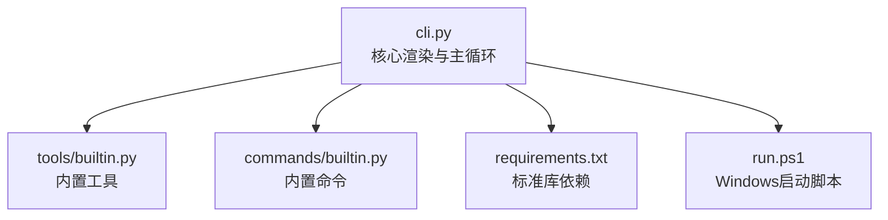
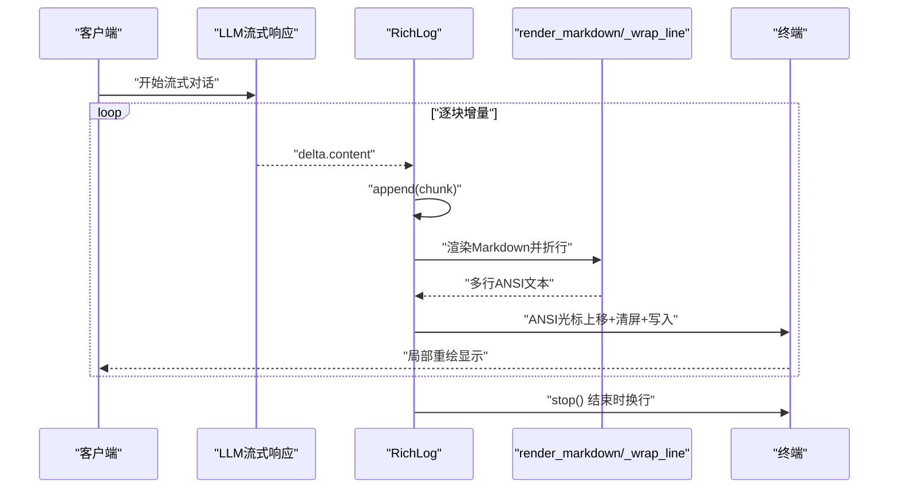
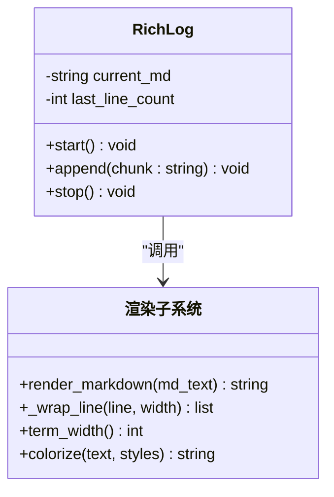
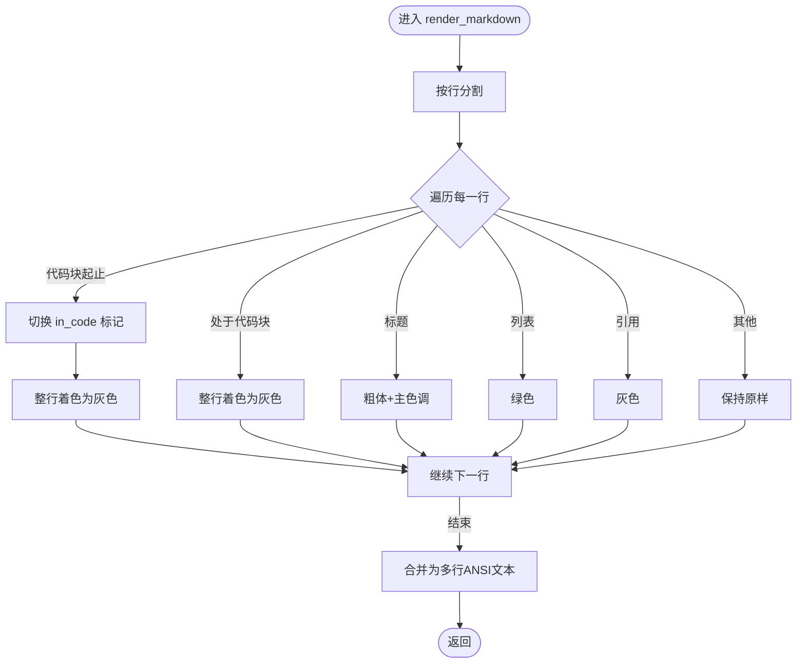
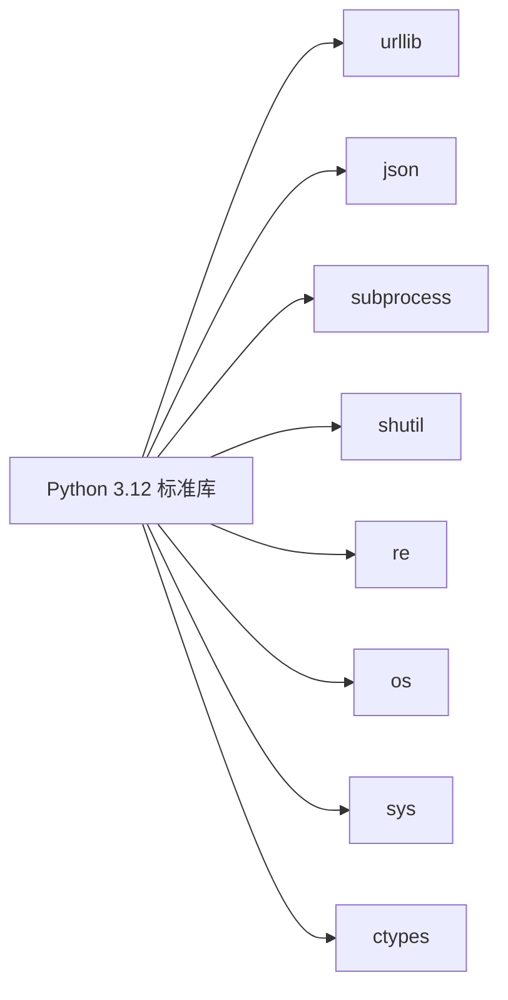

# 终端渲染引擎

<cite>
**本文引用的文件**
- [cli.py](file://cli.py)
- [tools/builtin.py](file://tools/builtin.py)
- [commands/builtin.py](file://commands/builtin.py)
- [requirements.txt](file://requirements.txt)
- [run.ps1](file://run.ps1)
</cite>

## 目录
1. [简介](#简介)
2. [项目结构](#项目结构)
3. [核心组件](#核心组件)
4. [架构总览](#架构总览)
5. [详细组件分析](#详细组件分析)
6. [依赖分析](#依赖分析)
7. [性能考虑](#性能考虑)
8. [故障排查指南](#故障排查指南)
9. [结论](#结论)
10. [附录](#附录)

## 简介
本文件面向CodeAgent-TUI的终端渲染引擎，系统性阐述以下主题：
- RichLog类的实现原理：ANSI光标控制、增量渲染、内存管理与实时更新策略
- Markdown渲染机制：语法高亮、格式转换、颜色应用
- 终端适配与兼容性：Windows VT模式支持、UTF-8编码处理、终端尺寸检测
- 性能优化：缓冲与刷新策略、折行与颜色处理的复杂度分析
- ANSI转义码处理与颜色主题应用
- 扩展与定制方法：如何在不引入第三方依赖的前提下扩展渲染能力

## 项目结构
- 核心入口与渲染：cli.py
- 内置工具与命令：tools/builtin.py、commands/builtin.py
- 运行说明与依赖声明：requirements.txt、run.ps1

图表来源
- [cli.py:1-532](file://cli.py#L1-L532)
- [tools/builtin.py:1-90](file://tools/builtin.py#L1-L90)
- [commands/builtin.py:1-91](file://commands/builtin.py#L1-L91)
- [requirements.txt:1-7](file://requirements.txt#L1-L7)
- [run.ps1:1-24](file://run.ps1#L1-L24)

章节来源
- [cli.py:1-532](file://cli.py#L1-L532)
- [requirements.txt:1-7](file://requirements.txt#L1-L7)
- [run.ps1:1-24](file://run.ps1#L1-L24)

## 核心组件
- Style：ANSI颜色与样式常量集合
- _ANSI_RE/_LEADING_ANSI_RE：用于匹配与剥离ANSI转义码的正则
- _enable_vt：Windows启用VT模式（ANSI转义码）
- term_width：获取终端列宽
- colorize/print_styled：文本着色与打印
- _wrap_plain/_wrap_line：纯文本与含ANSI行的折行
- render_markdown：Markdown到ANSI颜色的渲染
- panel：带边框面板
- prompt_user：带样式的用户输入
- RichLog：流式日志管理器，基于ANSI光标重绘实现增量渲染

章节来源
- [cli.py:43-203](file://cli.py#L43-L203)

## 架构总览
渲染子系统围绕“流式增量渲染”展开：LLM流式响应到达后，由RichLog接收增量文本，先进行Markdown到ANSI的颜色渲染，再按终端宽度折行，最后通过ANSI光标控制进行局部重绘，从而实现“实时更新”的效果。

图表来源
- [cli.py:417-454](file://cli.py#L417-L454)
- [cli.py:173-203](file://cli.py#L173-L203)
- [cli.py:126-152](file://cli.py#L126-L152)
- [cli.py:109-123](file://cli.py#L109-L123)

## 详细组件分析

### RichLog类：ANSI光标控制与增量渲染
- 设计目标：替代rich.Live + Markdown，实现“流式增量渲染”，在终端上逐块追加并重绘最后一段输出
- 关键字段
  - current_md：累积的Markdown文本
  - last_line_count：上次渲染的行数，用于计算光标上移步数
- 核心流程
  - start：初始化状态
  - append：拼接增量文本，渲染为ANSI颜色文本，按终端宽度折行，使用ANSI光标控制进行局部重绘，刷新缓冲
  - stop：收尾输出换行并清理状态
- ANSI光标控制要点
  - 光标上移：使用“光标上移N行”控制码，使后续清屏与重写覆盖在同一区域
  - 清屏：使用“清屏至行尾”控制码，确保覆盖区域干净
  - 刷新：flush确保立即输出
- 内存管理
  - current_md采用字符串拼接，适合小到中等规模增量；对于超长流式输出，可考虑滑动窗口或分段缓存策略以降低内存峰值
- 实时更新策略
  - 每次增量都进行一次完整的渲染与重绘，保证显示连续性
  - 折行与颜色处理在append中完成，避免跨帧闪烁

图表来源
- [cli.py:173-203](file://cli.py#L173-L203)
- [cli.py:126-152](file://cli.py#L126-L152)
- [cli.py:109-123](file://cli.py#L109-L123)
- [cli.py:81-82](file://cli.py#L81-L82)
- [cli.py:85-86](file://cli.py#L85-L86)

章节来源
- [cli.py:173-203](file://cli.py#L173-L203)

### Markdown渲染：语法高亮与颜色应用
- 渲染范围：标题、列表、引用、代码块、普通段落
- 颜色映射
  - 标题：粗体 + 不同主色调
  - 列表项：绿色
  - 引用：灰色
  - 代码块：灰色
  - 普通段落：保持原样
- 折行策略
  - 对含ANSI的行，先剥离ANSI计算可见宽度，再按可见宽度折行，并在每段折行处恢复颜色前缀，保证视觉一致性
- 复杂度分析
  - 每行渲染为O(n)，其中n为行长度；整体为O(L)，L为渲染行数
  - 折行时对每行进行一次ANSI剥离与重建，额外开销与颜色片段数量相关

图表来源
- [cli.py:126-152](file://cli.py#L126-L152)

章节来源
- [cli.py:126-152](file://cli.py#L126-L152)

### 终端适配与兼容性
- Windows VT模式支持
  - 在Windows平台尝试启用VT模式，以便正确解析ANSI转义码
  - 若失败则回退到无VT模式（颜色与光标控制可能受限）
- UTF-8编码处理
  - 将stdout/stderr强制设置为UTF-8编码，避免emoji等字符输出异常
- 终端尺寸检测
  - 通过标准库获取终端列宽，作为折行宽度依据
- 兼容性建议
  - 在非Windows平台，确保终端支持ANSI转义码
  - 对于老旧终端，可考虑降级为纯文本渲染或禁用颜色

章节来源
- [cli.py:60-78](file://cli.py#L60-L78)
- [cli.py:81-82](file://cli.py#L81-L82)

### 实时更新策略与性能优化
- 实时更新策略
  - 每次增量都进行一次渲染与重绘，减少等待时间，提升交互体验
- 性能优化建议
  - 折行与颜色处理：尽量减少不必要的颜色片段重建，复用颜色前缀
  - 缓冲刷新：在高频增量场景下，适当合并多次写入后再flush，减少系统调用次数
  - 内存管理：对极长流式输出，可采用滑动窗口或分段缓存，限制current_md长度
  - 终端宽度：缓存term_width结果，在终端尺寸变化前复用，避免频繁查询

章节来源
- [cli.py:173-203](file://cli.py#L173-L203)
- [cli.py:109-123](file://cli.py#L109-L123)

### ANSI转义码处理与颜色主题
- ANSI转义码处理
  - 正则匹配与剥离：用于计算可见宽度与折行
  - 颜色前缀保留：在折行后恢复颜色，保证视觉连贯
- 颜色主题
  - Style集中定义了常用颜色与样式
  - render_markdown按Markdown语义选择颜色，形成一致的主题风格
- 定制方法
  - 可在Style中新增颜色常量
  - 可在render_markdown中扩展语义映射，如表格、链接等

章节来源
- [cli.py:43-53](file://cli.py#L43-L53)
- [cli.py:56-57](file://cli.py#L56-L57)
- [cli.py:126-152](file://cli.py#L126-L152)

### 扩展与定制方法
- 新增渲染规则
  - 在render_markdown中添加新的Markdown语义分支，映射到对应颜色
- 新增颜色主题
  - 在Style中增加新颜色常量，或在colorize中支持动态组合
- 新增面板样式
  - 在panel中调整边框字符与宽度策略，适配不同终端
- 新增终端特性
  - 在term_width基础上扩展高度检测与滚动区域设置
- 插件集成
  - 工具与命令通过Ctx.print统一使用颜色输出，保持一致性

章节来源
- [cli.py:126-152](file://cli.py#L126-L152)
- [cli.py:155-163](file://cli.py#L155-L163)
- [cli.py:318-321](file://cli.py#L318-L321)

## 依赖分析
- 语言与标准库
  - 仅使用Python 3.12标准库，无第三方依赖
  - 关键模块：urllib、json、subprocess、shutil、re、os、sys、ctypes
- 运行环境
  - Windows：通过run.ps1自动创建并使用虚拟环境，确保Python 3.12
  - 非Windows：直接使用标准库运行

图表来源
- [requirements.txt:1-7](file://requirements.txt#L1-L7)

章节来源
- [requirements.txt:1-7](file://requirements.txt#L1-L7)
- [run.ps1:1-24](file://run.ps1#L1-L24)

## 性能考虑
- 时间复杂度
  - 渲染：O(L)，L为渲染行数
  - 折行：对每行进行一次ANSI剥离与可见宽度计算，整体O(L·W)，W为平均行长
- 空间复杂度
  - current_md随增量增长，最坏O(T)，T为总增量字符数
  - 折行后的wrapped列表最多O(L)
- I/O优化
  - flush频率与增量大小权衡，避免过度flush导致性能下降
  - 在高频增量场景下，可考虑批量写入策略

## 故障排查指南
- Windows终端颜色异常
  - 确认已启用VT模式；若失败，颜色可能不可用
  - 检查终端是否支持ANSI转义码
- 输出乱码或表情异常
  - 确认stdout/stderr已设置为UTF-8编码
- 终端宽度异常
  - 检查终端尺寸是否被外部工具修改；必要时手动设置终端宽度
- 增量渲染闪烁
  - 检查last_line_count是否正确；确保每次重绘前先上移光标并清屏
- 工具与命令输出颜色不一致
  - 使用Ctx.print统一输出，避免绕过颜色处理

章节来源
- [cli.py:60-78](file://cli.py#L60-L78)
- [cli.py:74-78](file://cli.py#L74-L78)
- [cli.py:173-203](file://cli.py#L173-L203)
- [cli.py:318-321](file://cli.py#L318-L321)

## 结论
CodeAgent-TUI的终端渲染引擎以标准库为核心，实现了轻量、可控且高性能的终端输出。RichLog通过ANSI光标控制实现增量重绘，render_markdown提供基础的Markdown颜色渲染，配合Windows VT模式与UTF-8编码处理，满足跨平台的兼容性需求。通过合理的内存管理与I/O策略，可在保证实时性的前提下获得良好的用户体验。未来可进一步扩展渲染规则与颜色主题，同时在极端场景下引入滑动窗口与批量刷新等优化手段。

## 附录
- 快速参考
  - 启动：使用run.ps1或直接运行Python 3.12标准库
  - 依赖：仅标准库，无需安装第三方包
  - 扩展：在render_markdown中添加新语义，在Style中添加新颜色

章节来源
- [requirements.txt:1-7](file://requirements.txt#L1-L7)
- [run.ps1:1-24](file://run.ps1#L1-L24)