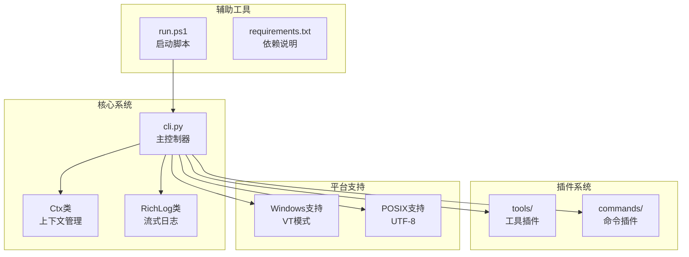
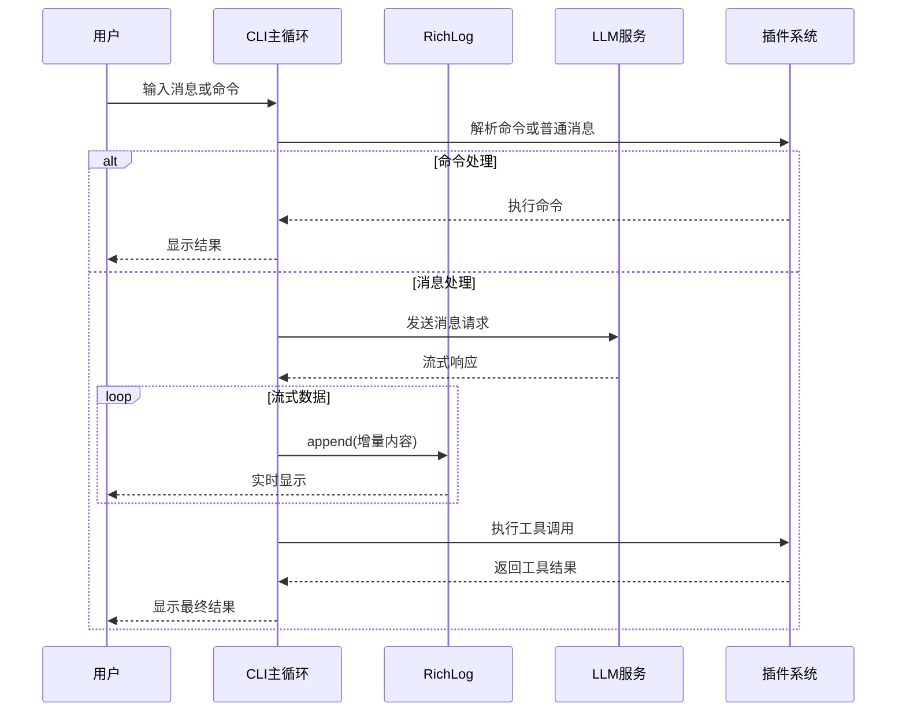
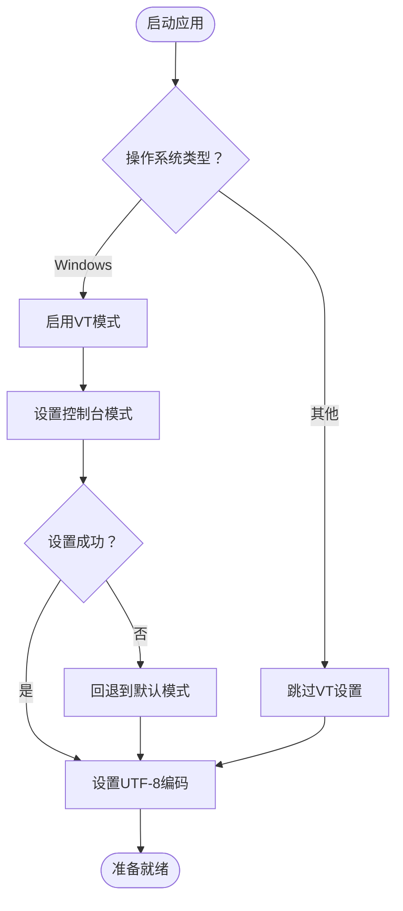
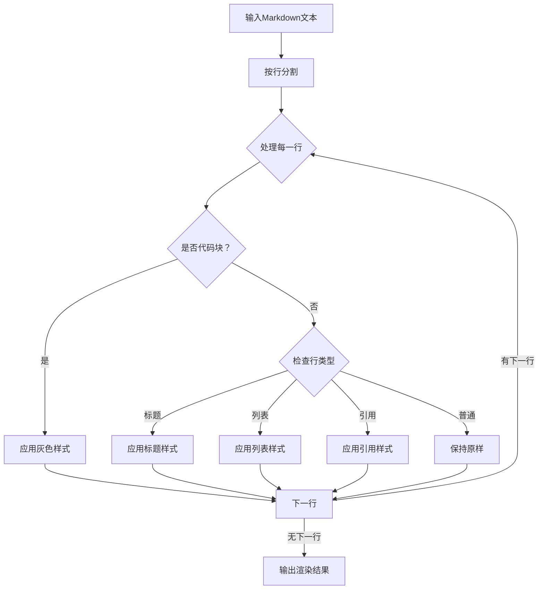
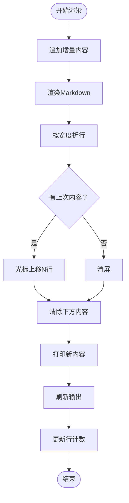
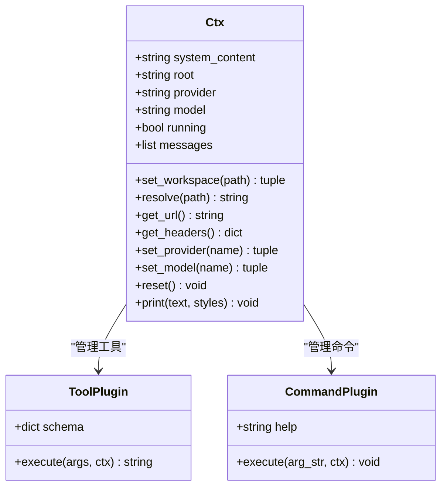
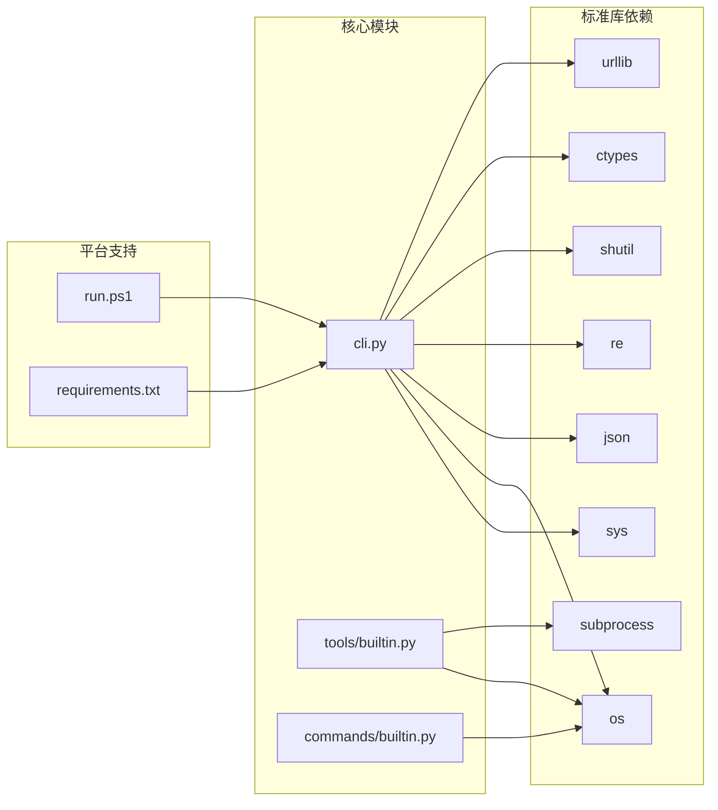

# 终端界面系统

<cite>
**本文档引用的文件**
- [cli.py](file://cli.py)
- [commands/builtin.py](file://commands/builtin.py)
- [tools/builtin.py](file://tools/builtin.py)
- [run.ps1](file://run.ps1)
- [requirements.txt](file://requirements.txt)
</cite>

## 目录
1. [简介](#简介)
2. [项目结构](#项目结构)
3. [核心组件](#核心组件)
4. [架构概览](#架构概览)
5. [详细组件分析](#详细组件分析)
6. [依赖关系分析](#依赖关系分析)
7. [性能考虑](#性能考虑)
8. [故障排除指南](#故障排除指南)
9. [结论](#结论)
10. [附录](#附录)

## 简介

这是一个基于ANSI转义码的纯Python终端界面系统，实现了完整的AI助手交互体验。该系统完全使用Python 3.12标准库开发，无需任何第三方依赖，提供了丰富的终端渲染功能、Markdown语法支持、流式日志管理以及跨平台兼容性处理。

系统的核心特色包括：
- 基于ANSI转义码的终端渲染引擎
- 内置Markdown渲染器，支持代码块高亮和多种格式
- RichLog流式日志管理器，实现实时增量更新
- 完整的Windows VT模式支持
- 插件化架构，支持动态加载工具和命令
- 工作区感知和项目上下文注入

## 项目结构

该项目采用简洁的模块化设计，主要由以下组件构成：



**图表来源**
- [cli.py:1-532](file://cli.py#L1-L532)
- [commands/builtin.py:1-91](file://commands/builtin.py#L1-L91)
- [tools/builtin.py:1-90](file://tools/builtin.py#L1-L90)

**章节来源**
- [cli.py:1-532](file://cli.py#L1-L532)
- [requirements.txt:1-7](file://requirements.txt#L1-L7)

## 核心组件

### 终端渲染引擎

系统实现了完整的ANSI转义码渲染系统，提供以下核心功能：

#### 颜色和样式系统
- 基础颜色常量：红色、绿色、黄色、蓝色、洋红色、青色、灰色
- 文本样式：粗体、弱化显示
- 颜色重置机制，确保样式正确恢复

#### 文本处理算法
- 纯文本折行：针对无ANSI编码的文本进行可见宽度计算
- ANSI感知折行：保持颜色编码在折行边界处的完整性
- 行首颜色保留：确保多行文本的颜色格式正确延续

#### Markdown渲染器
支持的Markdown元素：
- 标题：# 标题、## 子标题、### 三级标题
- 列表：无序列表项 `- ` 和 `* `
- 引用：`> ` 引用块
- 代码块：以 ``` 包围的代码区域
- 普通文本：保持原样输出

**章节来源**
- [cli.py:43-152](file://cli.py#L43-L152)

### RichLog流式日志管理器

这是系统的核心创新组件，实现了高效的终端流式输出：

#### 核心工作机制
- **增量更新**：只渲染新增内容，避免全屏重绘
- **光标控制**：使用ANSI光标移动指令实现精确定位
- **屏幕重绘**：通过光标上移和清屏指令实现高效更新
- **内存管理**：维护最小化的状态信息，降低内存占用

#### 渲染流程
1. 接收新数据块
2. 追加到当前Markdown缓冲区
3. 渲染为ANSI格式文本
4. 按终端宽度折行
5. 计算需要上移的行数
6. 清除屏幕下方内容
7. 输出新内容并刷新

**章节来源**
- [cli.py:173-202](file://cli.py#L173-L202)

### 插件化架构

系统采用装饰器模式实现插件注册：

#### 工具插件（Tools）
- 文件读写：`read_file`、`write_file`
- 命令执行：`run_command`
- 参数验证：基于JSON Schema的参数定义

#### 命令插件（Commands）
- 工作区管理：`/cd`、`/pwd`
- 系统控制：`/exit`、`/quit`、`/clear`
- 配置管理：`/provider`、`/model`
- 帮助系统：`/help`

**章节来源**
- [cli.py:211-246](file://cli.py#L211-L246)
- [tools/builtin.py:17-89](file://tools/builtin.py#L17-L89)
- [commands/builtin.py:16-90](file://commands/builtin.py#L16-L90)

## 架构概览

系统采用事件驱动的主循环架构，结合插件化设计：



**图表来源**
- [cli.py:389-486](file://cli.py#L389-L486)
- [cli.py:417-458](file://cli.py#L417-L458)

**章节来源**
- [cli.py:373-532](file://cli.py#L373-L532)

## 详细组件分析

### 终端适配层

#### Windows VT模式支持
系统在Windows平台上自动启用ANSI转义码支持：



**图表来源**
- [cli.py:60-78](file://cli.py#L60-L78)

#### UTF-8编码处理
- 强制stdout/stderr使用UTF-8编码
- 设置错误处理策略为替换模式
- 支持emoji和其他Unicode字符

**章节来源**
- [cli.py:60-78](file://cli.py#L60-L78)

### Markdown渲染引擎

#### 渲染算法实现



**图表来源**
- [cli.py:126-152](file://cli.py#L126-L152)

#### 样式映射规则
- 标题：粗体 + 青色
- 子标题：粗体 + 蓝色  
- 三级标题：粗体 + 洋红色
- 列表项：绿色
- 引用块：灰色
- 代码块：灰色（整体）

**章节来源**
- [cli.py:126-152](file://cli.py#L126-L152)

### RichLog流式日志管理器

#### 核心算法流程



**图表来源**
- [cli.py:179-195](file://cli.py#L179-L195)

#### 性能优化特性
- **增量渲染**：只处理新增内容，避免全量重绘
- **智能缓存**：维护last_line_count减少光标计算
- **批量输出**：合并多个输出操作为单次写入
- **内存友好**：使用生成器模式处理大型内容

**章节来源**
- [cli.py:173-202](file://cli.py#L173-L202)

### 上下文管理系统

#### Ctx类设计



**图表来源**
- [cli.py:255-321](file://cli.py#L255-L321)

#### 工作区感知机制
- 自动扫描项目结构和关键文件
- 支持.gitignore、pyproject.toml、README.md等
- 动态构建系统提示词，注入项目上下文

**章节来源**
- [cli.py:255-321](file://cli.py#L255-L321)
- [cli.py:325-353](file://cli.py#L325-L353)

## 依赖关系分析

### 模块依赖图



**图表来源**
- [cli.py:1-15](file://cli.py#L1-L15)
- [run.ps1:1-24](file://run.ps1#L1-L24)
- [requirements.txt:1-7](file://requirements.txt#L1-L7)

### 外部依赖分析

系统设计为零外部依赖，仅使用Python 3.12标准库：
- **必需模块**：sys、os、json、re、shutil、urllib、ctypes
- **可选模块**：subprocess（用于命令执行）
- **平台特定**：ctypes（Windows VT支持）

**章节来源**
- [requirements.txt:1-7](file://requirements.txt#L1-L7)

## 性能考虑

### 渲染性能优化

#### 折行算法优化
- 使用正则表达式预编译提高匹配效率
- 分离纯文本和带ANSI编码文本的处理路径
- 缓存终端宽度避免重复查询

#### 内存管理策略
- 流式处理：避免将整个内容加载到内存
- 增量更新：只保存必要的状态信息
- 及时释放：在stop()方法中清理资源

#### I/O性能优化
- 批量输出：合并多个print调用
- 非阻塞写入：使用flush确保实时性
- 错误处理：优雅降级避免性能损失

### 并发和异步处理

系统采用同步I/O模型，适合终端应用的特点：
- 实时性要求高，异步复杂度增加
- 终端输出天然串行，无需并发控制
- 简化了错误处理和状态管理

## 故障排除指南

### 常见问题诊断

#### Windows终端显示问题
**症状**：颜色显示异常或乱码
**原因**：VT模式未启用或编码设置失败
**解决方案**：
1. 检查Windows版本是否支持VT模式
2. 确认控制台窗口属性设置
3. 验证UTF-8编码配置

#### Markdown渲染异常
**症状**：代码块或标题显示不正确
**原因**：ANSI转义码干扰或正则表达式匹配失败
**解决方案**：
1. 检查输入文本中的特殊字符
2. 验证正则表达式模式
3. 确认样式应用顺序

#### 流式输出卡顿
**症状**：实时显示延迟明显
**原因**：输出缓冲或系统I/O限制
**解决方案**：
1. 减少一次性输出的数据量
2. 检查终端性能设置
3. 优化网络连接质量

### 调试技巧

#### 日志记录
- 使用ctx.print输出调试信息
- 在关键节点添加状态检查
- 监控内存使用情况

#### 性能分析
- 测量渲染时间间隔
- 监控内存增长趋势
- 分析I/O吞吐量

#### 环境检查
- 验证Python版本兼容性
- 检查平台特定依赖
- 确认权限设置

**章节来源**
- [cli.py:404-412](file://cli.py#L404-L412)
- [cli.py:375-386](file://cli.py#L375-L386)

## 结论

这个终端界面系统展现了优秀的工程设计和实现质量。通过纯Python标准库实现，系统具备以下优势：

### 技术亮点
- **创新的流式渲染**：RichLog类提供了高效的终端流式输出解决方案
- **完整的ANSI支持**：实现了从基础颜色到复杂样式的完整渲染能力
- **跨平台兼容**：巧妙处理了Windows和POSIX系统的差异
- **插件化架构**：提供了灵活的扩展机制

### 设计哲学
- **最小依赖**：完全基于标准库，降低了部署复杂度
- **性能优先**：针对终端场景优化，注重实时性和流畅性
- **易用性**：提供了直观的API和丰富的功能

### 应用价值
该系统为开发者提供了一个强大的终端交互框架，可以作为各种命令行工具的基础，特别适用于AI助手、开发工具和系统管理工具等场景。

## 附录

### 快速开始指南

#### 环境准备
1. 确保安装Python 3.12
2. 创建虚拟环境：`python -m venv .venv`
3. 激活环境并运行：`.venv\Scripts\python.exe -m cli`

#### 基本使用
- 启动系统：`python -m cli`
- 查看帮助：`/help`
- 切换工作区：`/cd <目录>`
- 切换供应商：`/provider <名称>`
- 切换模型：`/model <名称>`

### 最佳实践

#### 终端样式定制
- 使用`colorize()`函数组合多种样式
- 遵循颜色使用规范：重要信息用高亮色，辅助信息用灰色
- 保持一致性：同一功能使用相同颜色方案

#### 性能优化建议
- 控制单次输出大小，避免超过终端缓冲区
- 合理使用换行符，充分利用终端宽度
- 避免频繁的颜色切换，批量应用样式

#### 兼容性注意事项
- Windows用户建议使用支持VT模式的终端
- 避免在不支持ANSI转义码的环境中使用
- 测试不同终端的显示效果