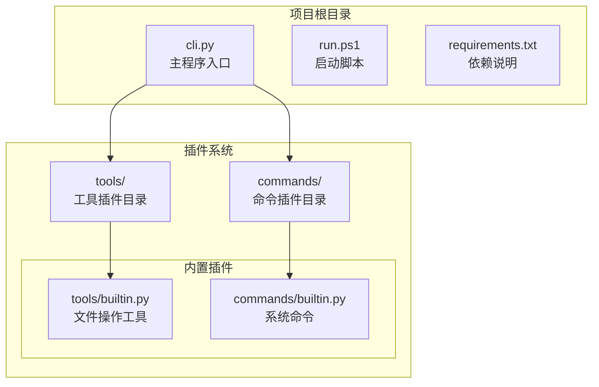
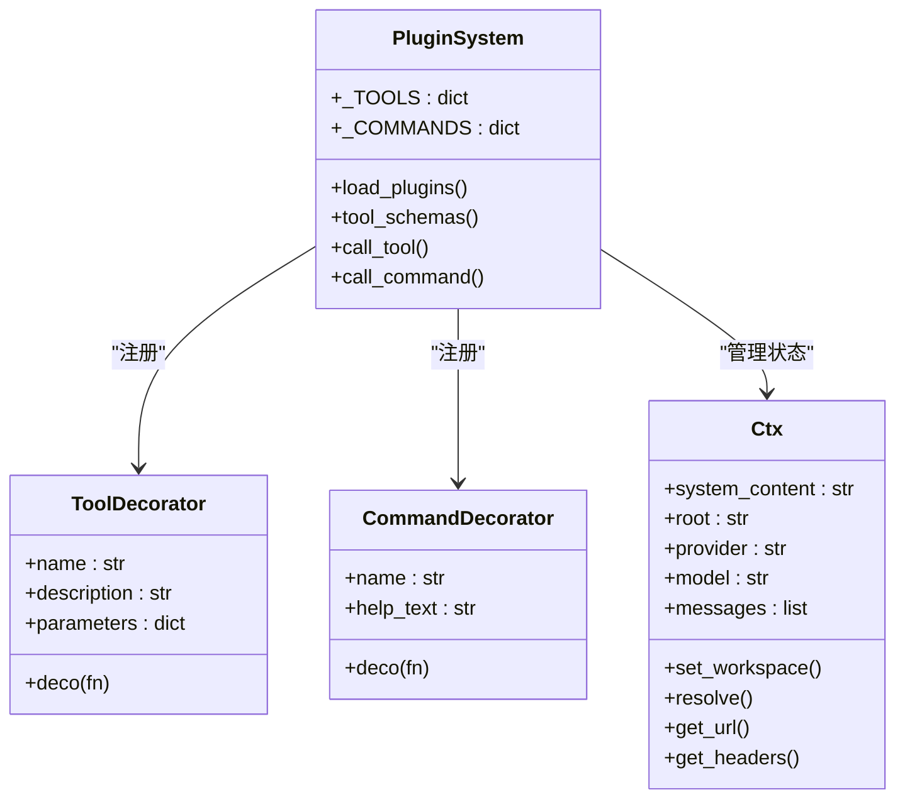
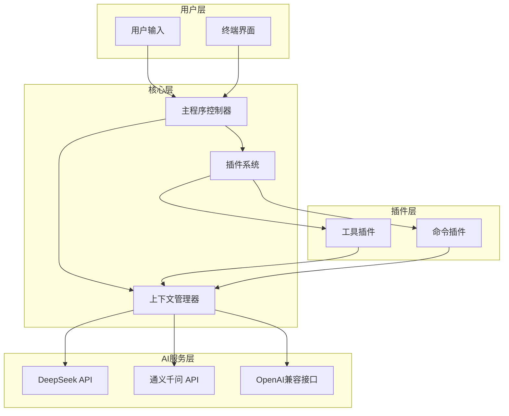
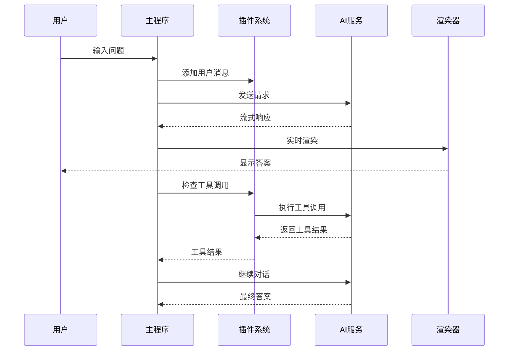
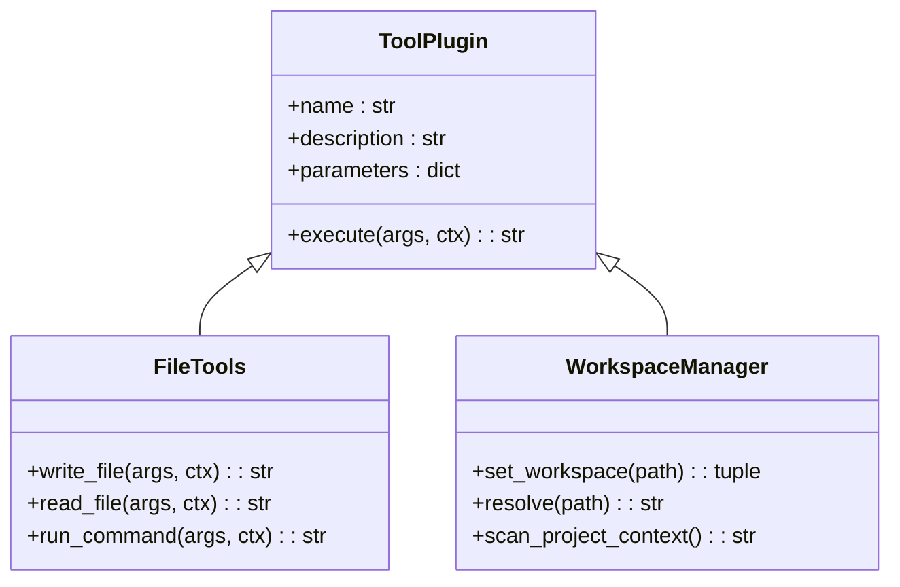
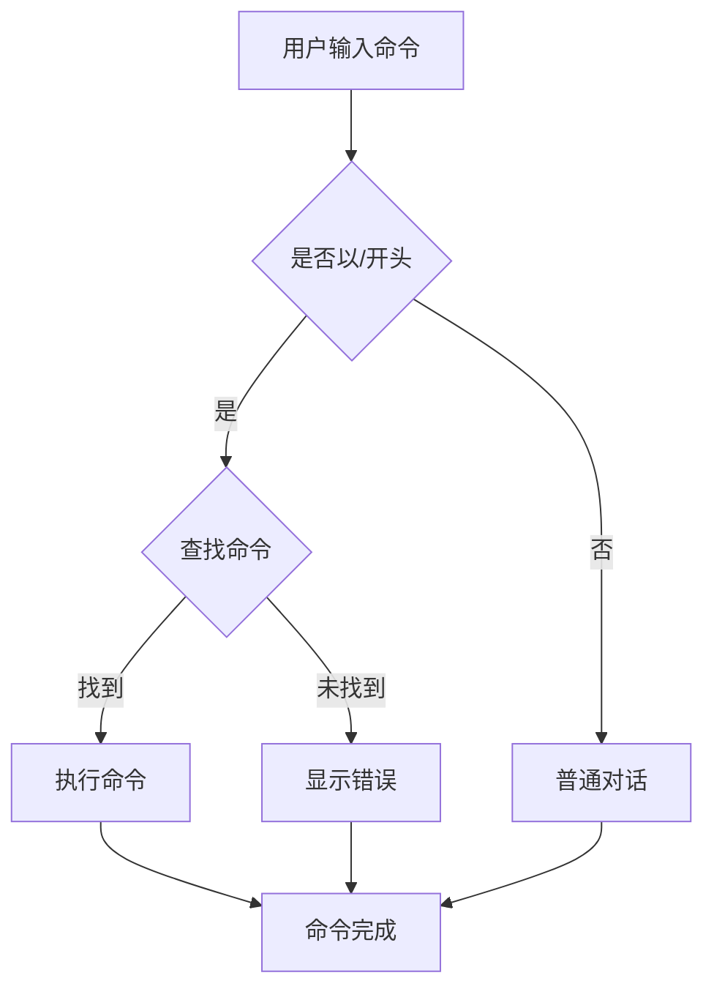
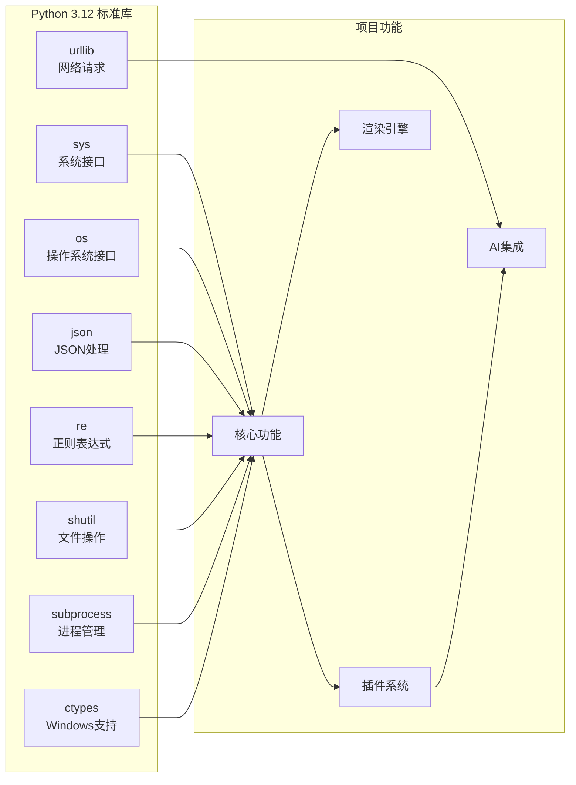

# 项目概述

<cite>
**本文档引用的文件**
- [cli.py](file://cli.py)
- [commands/builtin.py](file://commands/builtin.py)
- [tools/builtin.py](file://tools/builtin.py)
- [run.ps1](file://run.ps1)
- [requirements.txt](file://requirements.txt)
</cite>

## 目录
1. [引言](#引言)
2. [项目结构](#项目结构)
3. [核心组件](#核心组件)
4. [架构概览](#架构概览)
5. [详细组件分析](#详细组件分析)
6. [依赖分析](#依赖分析)
7. [性能考虑](#性能考虑)
8. [故障排除指南](#故障排除指南)
9. [结论](#结论)

## 引言

CodeAgent-TUI是一个基于Python 3.12标准库构建的轻量级智能代码助手CLI工具。该项目的核心价值在于提供了一个完全零第三方依赖的智能代码助手解决方案，通过插件化架构实现了高度可扩展的功能模块。项目专注于为开发者提供多供应商AI集成能力，支持DeepSeek、通义千问等多个AI服务提供商，同时具备流式响应处理、工作区感知和终端渲染等核心功能特性。

该项目的设计理念体现了现代软件工程的最佳实践：通过最小化外部依赖来确保系统的稳定性和可移植性，同时通过插件化架构实现功能的模块化和可扩展性。这种设计使得开发者可以轻松地添加新的AI供应商、工具和命令，而无需修改核心代码。

## 项目结构

项目采用清晰的模块化组织结构，主要包含以下核心目录和文件：

**图表来源**
- [cli.py:1-532](file://cli.py#L1-L532)
- [commands/builtin.py:1-91](file://commands/builtin.py#L1-L91)
- [tools/builtin.py:1-90](file://tools/builtin.py#L1-L90)

项目结构特点：
- **核心入口**：cli.py作为主程序入口，负责整个应用的初始化和控制流程
- **插件化设计**：tools/和commands/目录分别存放工具插件和命令插件
- **内置功能**：提供基础的文件操作、命令执行和系统管理功能
- **跨平台支持**：包含Windows PowerShell启动脚本，确保良好的跨平台体验

**章节来源**
- [cli.py:1-532](file://cli.py#L1-L532)
- [run.ps1:1-24](file://run.ps1#L1-L24)
- [requirements.txt:1-7](file://requirements.txt#L1-L7)

## 核心组件

### 主程序框架

主程序框架是整个应用的核心，负责协调各个组件的工作。其主要职责包括：

- **插件管理系统**：动态加载和管理工具插件和命令插件
- **AI交互协调**：处理与多个AI供应商的通信和数据交换
- **用户界面渲染**：提供丰富的终端输出和交互体验
- **上下文状态管理**：维护工作区信息、AI配置和对话历史

### 插件系统架构

插件系统是项目最具创新性的设计之一，采用了装饰器模式来实现插件的注册和管理：

**图表来源**
- [cli.py:205-321](file://cli.py#L205-L321)

### 终端渲染引擎

为了提供更好的用户体验，项目实现了完整的终端渲染引擎，替代了传统的rich库：

- **ANSI颜色支持**：完全兼容ANSI转义码，提供丰富的颜色效果
- **智能换行**：支持按终端宽度自动换行，保持文本格式的正确性
- **Markdown渲染**：将Markdown格式转换为带颜色的终端输出
- **流式更新**：支持实时更新的面板和日志显示

**章节来源**
- [cli.py:41-203](file://cli.py#L41-L203)

## 架构概览

项目采用了一种独特的插件化架构设计，这种设计的核心思想是"核心最小化，插件最大化"：

**图表来源**
- [cli.py:17-35](file://cli.py#L17-L35)
- [cli.py:205-321](file://cli.py#L205-L321)

### 设计原则

1. **零依赖原则**：仅使用Python 3.12标准库，确保部署的简单性和稳定性
2. **插件化设计**：所有功能都通过插件实现，核心代码保持最小化
3. **多供应商支持**：通过统一接口支持多个AI服务提供商
4. **工作区感知**：智能识别和利用项目上下文信息
5. **流式处理**：支持实时的流式响应处理

## 详细组件分析

### AI交互组件

AI交互组件是项目的核心功能模块，负责与各种AI服务提供商进行通信：

**图表来源**
- [cli.py:389-487](file://cli.py#L389-L487)

#### 流式响应处理

项目实现了高效的流式响应处理机制，能够实时显示AI生成的内容：

- **实时渲染**：使用ANSI光标控制实现实时内容更新
- **增量处理**：逐块处理AI响应，避免等待完整响应
- **错误恢复**：在网络中断或API错误时能够优雅恢复

#### 多供应商集成

项目支持多个AI服务提供商，通过统一的接口实现无缝切换：

- **DeepSeek集成**：支持deepseek-v4-flash等模型
- **通义千问集成**：支持本地部署的通义千问服务
- **OpenAI兼容**：通过配置支持OpenAI标准接口

**章节来源**
- [cli.py:17-35](file://cli.py#L17-L35)
- [cli.py:389-487](file://cli.py#L389-L487)

### 工具系统

工具系统提供了强大的文件操作和系统管理功能：

**图表来源**
- [tools/builtin.py:17-89](file://tools/builtin.py#L17-L89)

#### 文件操作工具

内置的文件操作工具提供了完整的文件管理功能：

- **安全写入**：自动创建目录结构，确保文件安全写入
- **分页读取**：支持大文件的分页读取，避免内存溢出
- **路径解析**：智能解析相对路径到工作区根目录

#### 命令执行工具

命令执行工具提供了安全的shell命令执行能力：

- **工作区隔离**：所有命令都在当前工作区执行
- **超时保护**：防止长时间运行的命令阻塞系统
- **输出捕获**：完整捕获标准输出和错误输出

**章节来源**
- [tools/builtin.py:17-89](file://tools/builtin.py#L17-L89)

### 命令系统

命令系统提供了丰富的系统管理功能：

**图表来源**
- [cli.py:514-522](file://cli.py#L514-L522)

#### 工作区管理

命令系统提供了完善的工作区管理功能：

- **工作区切换**：支持相对路径和绝对路径切换
- **路径解析**：自动解析到工作区根目录
- **上下文刷新**：切换工作区时自动刷新项目上下文

#### 配置管理

项目提供了灵活的配置管理功能：

- **供应商切换**：动态切换AI服务提供商
- **模型选择**：支持不同供应商的多种模型
- **配置持久化**：通过环境变量或配置文件管理

**章节来源**
- [commands/builtin.py:16-91](file://commands/builtin.py#L16-L91)

## 依赖分析

### 技术栈说明

项目采用极简的技术栈设计，仅使用Python 3.12标准库：

**图表来源**
- [requirements.txt:2](file://requirements.txt#L2)

### 依赖优势

1. **部署简单**：无需额外的pip安装步骤
2. **版本稳定**：使用官方标准库，避免版本冲突
3. **安全性高**：减少潜在的安全漏洞面
4. **性能优异**：避免第三方库的额外开销
5. **可移植性强**：在不同环境中表现一致

**章节来源**
- [requirements.txt:1-7](file://requirements.txt#L1-L7)

## 性能考虑

### 内存管理

项目在内存管理方面采用了多项优化策略：

- **流式处理**：AI响应采用流式处理，避免大量内存占用
- **分页读取**：文件读取采用分页策略，支持大文件处理
- **及时释放**：及时清理临时数据和关闭网络连接

### 网络优化

网络通信方面实现了高效的优化：

- **连接复用**：合理管理HTTP连接
- **超时设置**：为网络请求设置合理的超时时间
- **错误重试**：在网络错误时提供适当的重试机制

### 终端渲染优化

终端渲染系统经过专门优化：

- **增量更新**：只更新变化的部分，减少屏幕刷新
- **智能缓存**：缓存渲染结果，提高重复显示效率
- **宽度自适应**：根据终端宽度动态调整布局

## 故障排除指南

### 常见问题

#### 启动问题

**问题**：运行时出现模块导入错误
**解决方案**：确保使用Python 3.12版本，检查PYTHONPATH设置

**问题**：虚拟环境创建失败
**解决方案**：确认已安装Python 3.12，手动创建虚拟环境

#### 网络连接问题

**问题**：无法连接到AI服务
**解决方案**：检查网络连接，验证API密钥配置

**问题**：流式响应中断
**解决方案**：检查网络稳定性，适当增加超时时间

#### 终端显示问题

**问题**：颜色显示异常
**解决方案**：检查终端支持的ANSI转义码能力

**问题**：中文字符显示乱码
**解决方案**：确保终端使用UTF-8编码

### 调试技巧

1. **启用详细日志**：通过修改日志级别获取更多信息
2. **检查插件加载**：确认所有插件正确加载
3. **验证配置**：检查供应商配置和API密钥
4. **测试网络**：使用curl或其他工具测试API连接

**章节来源**
- [cli.py:404-412](file://cli.py#L404-L412)

## 结论

CodeAgent-TUI项目展现了现代软件工程的优秀实践：通过极简的技术栈实现复杂的功能，通过插件化架构实现高度的可扩展性。项目不仅提供了实用的智能代码助手功能，更重要的是展示了如何在保持代码简洁的同时实现强大的功能。

项目的核心优势包括：

1. **零依赖设计**：仅使用Python标准库，确保部署的简单性和稳定性
2. **插件化架构**：通过装饰器模式实现灵活的插件系统
3. **多供应商支持**：统一接口支持多个AI服务提供商
4. **流式处理能力**：提供实时的用户体验
5. **工作区感知**：智能利用项目上下文信息

对于开发者而言，CodeAgent-TUI不仅是一个实用的工具，更是一个优秀的学习案例，展示了如何设计和实现一个既简洁又功能强大的CLI应用程序。